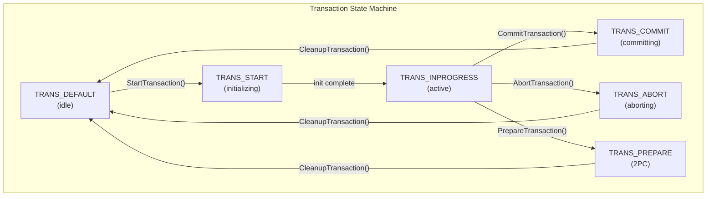
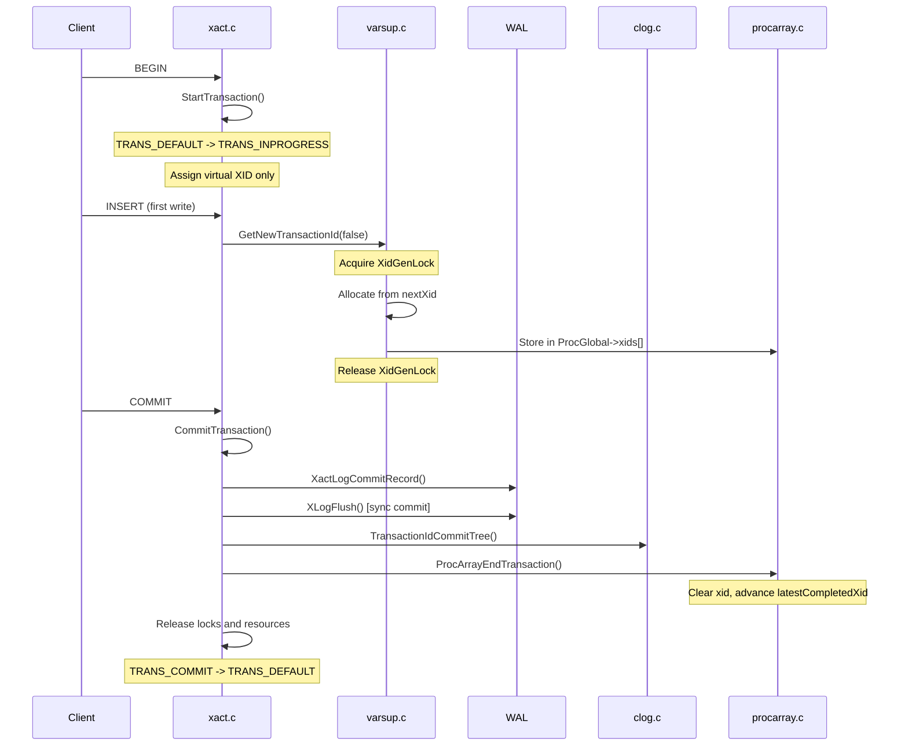

# Transaction Lifecycle

> MVCC Documentation > Transaction Lifecycle

**Prerequisites:** [Architecture Overview](02_architecture_overview.md)

---

## Overview

The transaction lifecycle subsystem is the foundational layer of PostgreSQL's MVCC implementation. It manages the creation, execution, commitment, and abortion of transactions -- each of which produces a unique Transaction ID (XID) that stamps tuples for visibility determination. The core logic resides in `src/backend/access/transam/xact.c`, with XID allocation in `src/backend/access/transam/varsup.c`.

PostgreSQL uses a **lazy XID assignment** strategy: a transaction does not receive a real XID until it performs its first write operation. Read-only transactions operate with only a virtual transaction ID (VXID), avoiding the overhead of XID allocation and the associated impact on the XID wraparound counter.

## Key Concepts

### Transaction Identifiers

PostgreSQL uses several types of transaction identifiers:

- **TransactionId (32-bit)**: The traditional 32-bit XID stored in tuple headers. Subject to wraparound at 2^32 (~4 billion).
- **FullTransactionId (64-bit)**: An epoch-extended XID introduced to avoid wraparound ambiguity internally. Contains a 32-bit epoch and 32-bit XID.
- **VirtualTransactionId**: A combination of `procNumber` + `localTransactionId` assigned immediately at transaction start. Never stored on disk; used only for lightweight locking and identification.

### Special Transaction IDs

Defined in `src/include/access/transam.h`:

| XID | Name | Meaning |
|-----|------|---------|
| 0 | `InvalidTransactionId` | No transaction |
| 1 | `BootstrapTransactionId` | Used during initdb; always considered committed |
| 2 | `FrozenTransactionId` | Represents a frozen tuple; always visible to all |
| 3+ | `FirstNormalTransactionId` | First normal XID; regular transactions start here |

These special XIDs are critical for the [Visibility Rules](05_visibility_rules.md) -- `FrozenTransactionId` in particular signals that a tuple's xmin has been frozen by [VACUUM](09_vacuum_and_freezing.md), making it unconditionally visible.

## Architecture



See also: [diagrams/transaction_lifecycle.mermaid](diagrams/transaction_lifecycle.mermaid) for the full state diagram including TBlockState.

## Core APIs

### StartTransaction

**Purpose:** Initializes a new transaction, setting up all per-transaction state, memory contexts, and advertising the backend's virtual transaction ID in the ProcArray.

```c
/* Source: src/backend/access/transam/xact.c */
static void StartTransaction(void);
```

StartTransaction performs the following steps in order:

1. **State validation**: Asserts the current state is `TRANS_DEFAULT` and the state stack is clean.
2. **State transition**: Sets `s->state = TRANS_START` and clears `fullTransactionId` to `InvalidFullTransactionId`. A real XID is NOT assigned here -- this is the lazy XID assignment principle.
3. **Transaction parameters**: Initializes `nestingLevel`, `gucNestLevel`, clears child XID arrays.
4. **Security context**: Captures current user ID and security context via `GetUserIdAndSecContext()` for later restoration on abort.
5. **Read-only detection**: If `RecoveryInProgress()` returns true (hot standby), marks the transaction as read-only. Otherwise uses the `default_transaction_read_only` GUC.
6. **Isolation level**: Sets `XactIsoLevel` from `DefaultXactIsoLevel` (READ COMMITTED by default). See [Snapshot Management](06_snapshot_management.md) for how isolation levels affect snapshot behavior.
7. **Command ID reset**: Initializes `currentCommandId` to `FirstCommandId` (0).
8. **Memory contexts**: Calls `AtStart_Memory()` to create `TopTransactionContext` and `CurTransactionContext`.
9. **Resource owner**: Calls `AtStart_ResourceOwner()` to create `TopTransactionResourceOwner`.
10. **Virtual XID assignment**: Allocates a new `LocalTransactionId` and combines it with `MyProcNumber` to form a `VirtualTransactionId`. Inserts a lock table entry and advertises it in `MyProc->vxid.lxid`. See [Concurrency Infrastructure](07_concurrency_infrastructure.md) for the [PGPROC](appendix_data_structures.md) structure details.
11. **Timestamp**: Sets `xactStartTimestamp` from `stmtStartTimestamp` (for normal transactions) or calls `GetCurrentTimestamp()` (for transactions inside procedures).
12. **Subsystem initialization**: Calls `AtStart_GUC()`, `AtStart_Cache()`, `AfterTriggerBeginXact()`.
13. **State completion**: Sets `s->state = TRANS_INPROGRESS`.

**Performance Characteristics:** StartTransaction is lightweight because it deliberately avoids XID allocation. The most expensive operations are memory context creation and the virtual XID lock table insertion. No shared memory locks are acquired beyond the brief VXID advertisement.

---

### GetNewTransactionId

**Purpose:** Allocates the next available XID from the global counter. Called lazily when a transaction first needs a real XID (i.e., on the first write operation). Also handles XID wraparound protection.

```c
/* Source: src/backend/access/transam/varsup.c */
FullTransactionId GetNewTransactionId(bool isSubXact);
```

| Parameter | Type | Description |
|-----------|------|-------------|
| isSubXact | bool | True if allocating for a subtransaction; determines whether XID goes into PGPROC.xid or subxids cache |

**Returns:** A `FullTransactionId` (64-bit) containing the newly allocated XID.

**Detailed description:**

1. **Parallel mode check**: Errors out if called during a parallel operation, since parallel workers synchronize transaction state at operation start.
2. **Bootstrap handling**: During bootstrap, returns `BootstrapTransactionId` (1) directly.
3. **Recovery check**: Errors out if called during recovery (standby cannot assign XIDs).
4. **Lock acquisition**: Acquires `XidGenLock` in exclusive mode to serialize XID allocation.
5. **Read current XID**: Reads `TransamVariables->nextXid` and extracts the 32-bit XID.
6. **Wraparound protection**: If the XID has reached or passed `xidVacLimit`, signals autovacuum. If past `xidStopLimit`, refuses to assign new XIDs (ERROR). See the Wraparound Protection section below.
7. **CLOG extension**: Calls `ExtendCLOG(xid)` to ensure the [CLOG](08_clog_transaction_status.md) page for this XID exists. Also extends `pg_subtrans` and `pg_commit_ts`.
8. **Advance counter**: Increments `TransamVariables->nextXid`.
9. **ProcArray advertisement**: Stores the new XID into the backend's shared state BEFORE releasing `XidGenLock`. For top-level transactions: sets `MyProc->xid` and `ProcGlobal->xids[MyProc->pgxactoff]`. For subtransactions: adds to `MyProc->subxids.xids[]` (up to `PGPROC_MAX_CACHED_SUBXIDS` = 64), otherwise sets the overflow flag.
10. **Lock release**: Releases `XidGenLock`.

**Integration points:**
- **Called by**: `AssignTransactionId()` in xact.c (when a write operation needs a real XID)
- **Calls**: `ExtendCLOG()`, `ExtendSUBTRANS()`, `ExtendCommitTs()`
- **Shared state**: `TransamVariables->nextXid`, `ProcGlobal->xids[]`

---

### CommitTransaction

**Purpose:** Performs the complete transaction commit sequence: fires deferred triggers, writes the WAL commit record, updates CLOG, clears ProcArray, releases locks, and cleans up all per-transaction resources.

```c
/* Source: src/backend/access/transam/xact.c */
static void CommitTransaction(void);
```

The commit path has three distinct phases:

**Phase 1: Pre-commit (user code may still run)**

1. **Deferred triggers**: Fires all pending deferred triggers in a loop with portal cleanup, until no more work remains.
2. **Pre-commit callbacks**: Invokes `XACT_EVENT_PRE_COMMIT` callbacks.
3. **Parallel cleanup**: Calls `AtEOXact_Parallel(true)` to clean up any parallel workers.
4. **Serialization check**: For SERIALIZABLE transactions, calls `PreCommit_CheckForSerializationFailure()` to detect rw-dependency cycles (SSI). See [Deep Dives: SSI](10_deep_dives.md).

**Phase 2: Durable commit (HOLD_INTERRUPTS)**

5. **State transition**: Sets `s->state = TRANS_COMMIT`.
6. **RecordTransactionCommit()**: The critical durability point:
   - Writes the XLOG commit record via `XactLogCommitRecord()`.
   - For synchronous commit: flushes WAL, then updates [CLOG](08_clog_transaction_status.md) via `TransactionIdCommitTree()`.
   - For asynchronous commit: sets the async commit LSN, updates CLOG with the LSN for later flush.
7. **ProcArrayEndTransaction()**: Clears `MyProc->xid` from the ProcArray, making the transaction invisible to new [snapshots](06_snapshot_management.md). Advances `latestCompletedXid` and increments `xactCompletionCount`. See [Concurrency Infrastructure](07_concurrency_infrastructure.md).

**Phase 3: Post-commit cleanup**

8. **Resource release**: Releases buffer pins, relation cache entries, invalidation messages, locks (in a specific order designed to maximize concurrent access).
9. **File deletion**: Performs pending file deletions (dropped tables).
10. **Notifications**: Sends NOTIFY signals.
11. **Backend cleanup**: Resets GUC, SPI, enums, namespaces, files, combo CIDs, hash tables, pgstat, snapshots.
12. **State reset**: Sets `s->state = TRANS_DEFAULT`, clears all transaction state fields.

**Key invariants:**
- WAL commit record is flushed BEFORE CLOG is updated (for synchronous commit).
- CLOG is updated BEFORE ProcArray is cleared (see [Visibility Rules: Race Condition Prevention](05_visibility_rules.md)).
- Locks are released AFTER catalog invalidation messages are sent.
- `HOLD_INTERRUPTS()` prevents cancel/die during the critical durable-commit section.

**Critical ordering:** WAL --> CLOG --> ProcArray --> Locks --> Resources

---

### RecordTransactionCommit

**Purpose:** Records the transaction commit in WAL and CLOG. This is the point of durable commit -- once this function returns, the commit is guaranteed to survive crashes (for synchronous commit).

```c
/* Source: src/backend/access/transam/xact.c */
static TransactionId RecordTransactionCommit(void);
```

**Returns:** The latest XID among the transaction and all its subtransactions, or `InvalidTransactionId` if the transaction has no XID.

Key steps:

1. **No-XID fast path**: If the transaction never received an XID, skips most processing.
2. **Critical section entry**: Sets `DELAY_CHKPT_START` on `MyProc->delayChkptFlags` to prevent checkpoints from advancing the REDO pointer past our commit record before CLOG is updated.
3. **WAL commit record**: Calls `XactLogCommitRecord()`.
4. **Sync vs async decision**:
   - **Synchronous**: `XLogFlush(XactLastRecEnd)` then `TransactionIdCommitTree()`.
   - **Asynchronous**: `XLogSetAsyncXactLSN()` then `TransactionIdAsyncCommitTree()`.
5. **Synchronous replication wait**: If applicable, waits for synchronous standbys via `SyncRepWaitForLSN()`.

---

### AbortTransaction

**Purpose:** Performs transaction abort processing: records the abort in WAL/CLOG, clears ProcArray, releases all resources, and cleans up per-transaction state.

```c
/* Source: src/backend/access/transam/xact.c */
static void AbortTransaction(void);
```

The abort path is designed to be robust in the face of errors. Key differences from commit:

- Abort does NOT enter a critical section or set `DELAY_CHKPT_START`, because losing an abort record is harmless.
- Recording an abort is NOT critical for correctness -- an unrecorded abort is equivalent to a crash, and crash-aborted transactions are treated as aborted by the [Visibility Rules](05_visibility_rules.md).
- Abort hint bits can always be set safely (unlike commit hint bits which require WAL flush verification). See [SetHintBits](05_visibility_rules.md).

---

### TransactionIdIsCurrentTransactionId

**Purpose:** Determines whether a given XID belongs to the current transaction or any of its subtransactions. Critical for same-transaction visibility checks in [HeapTupleSatisfiesMVCC](05_visibility_rules.md).

```c
/* Source: src/backend/access/transam/xact.c */
bool TransactionIdIsCurrentTransactionId(TransactionId xid);
```

1. **Top-level check**: Compares against `GetTopTransactionIdIfAny()`.
2. **Subtransaction search**: Walks the transaction state stack checking each level's `fullTransactionId`.
3. **Parallel worker support**: If running as a parallel worker, also searches the `ParallelCurrentXids` array.

## Subtransactions

Subtransactions (savepoints) are implemented as nested `TransactionStateData` structures linked via the `parent` pointer. Each subtransaction receives its own XID when it first performs a write.

### PGPROC Subtransaction Cache

Each backend caches up to `PGPROC_MAX_CACHED_SUBXIDS` (64) subtransaction XIDs in its `PGPROC.subxids.xids[]` array. See [PGPROC](appendix_data_structures.md) for the structure layout.

When the cache overflows:
- The `overflowed` flag is set.
- `GetSnapshotData()` marks the snapshot as `suboverflowed`. See [Snapshot Management](06_snapshot_management.md).
- `XidInMVCCSnapshot()` must fall back to `SubTransGetTopmostTransaction()` which consults `pg_subtrans` to resolve subtransaction XIDs to their top-level parent.

### pg_subtrans

The `pg_subtrans` SLRU (`src/backend/access/transam/subtrans.c`) stores a parent XID for each subtransaction XID. Key functions:
- `SubTransSetParent(mySubid, parentSubid)`: Records the parent relationship.
- `SubTransGetParent(xid)`: Returns the parent XID.
- `SubTransGetTopmostTransaction(xid)`: Recursively walks parents to find the top-level XID.

## Transaction Block States

The `TBlockState` enum (`src/backend/access/transam/xact.c`) tracks the client-facing transaction block state, which is distinct from the internal `TransState`:

| State | Meaning |
|-------|---------|
| `TBLOCK_DEFAULT` | Idle, no transaction block |
| `TBLOCK_STARTED` | Running a single implicit transaction |
| `TBLOCK_BEGIN` | Received BEGIN, starting explicit block |
| `TBLOCK_INPROGRESS` | Inside an explicit transaction block |
| `TBLOCK_END` | Received COMMIT |
| `TBLOCK_ABORT` | Error occurred, awaiting ROLLBACK |
| `TBLOCK_SUBBEGIN` | Starting a savepoint |
| `TBLOCK_SUBINPROGRESS` | Inside a savepoint |
| `TBLOCK_SUBABORT` | Savepoint failed |

## XID Wraparound Protection

Since XIDs are 32-bit and wrap around, PostgreSQL must [freeze](09_vacuum_and_freezing.md) old XIDs before they can be misinterpreted. The wraparound protection thresholds are computed in `SetTransactionIdLimit()` (`src/backend/access/transam/varsup.c`):

| Threshold | Distance from Wrap | Action |
|-----------|-------------------|--------|
| `xidVacLimit` | `autovacuum_freeze_max_age` from oldest | Start aggressive autovacuum |
| `xidWarnLimit` | 40 million from wrap | Issue WARNING to log |
| `xidStopLimit` | 3 million from wrap | Refuse new XIDs (ERROR) |
| `xidWrapLimit` | Halfway around from oldest | Actual wraparound point |

## Processing Flow



## Implementation Notes

1. **Lazy XID assignment** is critical for performance. Read-only transactions never consume an XID, avoiding unnecessary pressure on the XID wraparound counter and reducing [ProcArray](07_concurrency_infrastructure.md) contention.

2. **The commit critical section** (`DELAY_CHKPT_START`) ensures that if the WAL commit record is written before a checkpoint's REDO point, the corresponding [CLOG](08_clog_transaction_status.md) update will also be flushed before the checkpoint completes.

3. **ProcArrayEndTransaction ordering**: The XID must be cleared from ProcArray AFTER CLOG is updated. Otherwise, a concurrent `GetSnapshotData()` might not see the transaction as running, but `TransactionIdDidCommit()` would also return false, creating a window where the transaction appears to have neither committed nor be running -- which would be interpreted as aborted. See [Visibility Rules: Race Condition Prevention](05_visibility_rules.md).

4. **Abort is always safe**: Even if the abort WAL record is not written (e.g., due to a crash during abort), the transaction will be treated as aborted because the CLOG status remains `IN_PROGRESS` and the presumption after crash recovery is that unfinished transactions aborted.

## Source File References

| File | Key Symbols |
|------|-------------|
| `src/backend/access/transam/xact.c` | `StartTransaction`, `CommitTransaction`, `AbortTransaction`, `RecordTransactionCommit`, `TransactionIdIsCurrentTransactionId` |
| `src/backend/access/transam/varsup.c` | `GetNewTransactionId`, `SetTransactionIdLimit` |
| `src/include/access/transam.h` | `TransamVariablesData`, special XID constants |
| `src/backend/access/transam/subtrans.c` | `SubTransSetParent`, `SubTransGetTopmostTransaction` |

---

Previous: [Architecture Overview](02_architecture_overview.md) | Next: [Tuple Versioning](04_tuple_versioning.md)
