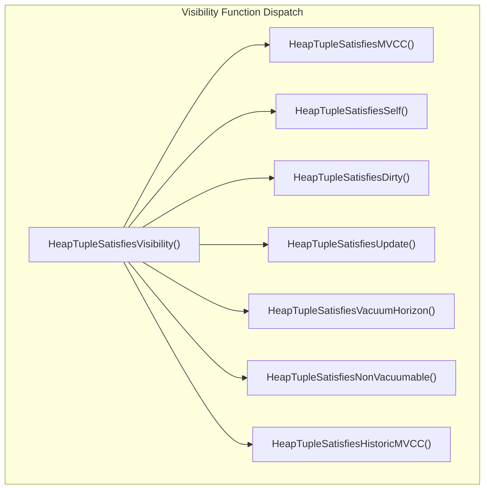

# Visibility Rules

> MVCC Documentation > Visibility Rules

**Prerequisites:** [Tuple Versioning](04_tuple_versioning.md), [Transaction Lifecycle](03_transaction_lifecycle.md)

---

## Overview

Visibility determination is the heart of PostgreSQL's MVCC system. It answers the fundamental question: "Is this tuple visible to the current transaction's snapshot?" The entire visibility subsystem resides in a single critical file: `src/backend/access/heap/heapam_visibility.c`.

The visibility logic examines each tuple's `t_xmin` (inserting transaction), `t_xmax` (deleting/updating transaction), and command IDs against the current [snapshot's](06_snapshot_management.md) boundaries (`xmin`, `xmax`, `xip[]`, `curcid`) to determine whether the tuple should be visible. Along the way, it opportunistically caches transaction commit/abort status as "hint bits" in the [tuple header](04_tuple_versioning.md) to accelerate future visibility checks.

## Key Concepts

### The Visibility Principle

A tuple is visible to a snapshot if and only if:
1. The inserting transaction (`t_xmin`) has committed AND committed before the snapshot was taken.
2. The deleting transaction (`t_xmax`) either does not exist, has not committed, or committed after the snapshot was taken.

### Hint Bits

Hint bits are optimization flags stored in the tuple's `t_infomask` field that cache the commit/abort status of the inserting and deleting transactions. Without hint bits, every visibility check would require a [CLOG](08_clog_transaction_status.md) lookup (shared memory access). With hint bits, the status is encoded directly in the tuple header.

| Hint Bit | Value | Meaning |
|----------|-------|---------|
| `HEAP_XMIN_COMMITTED` | 0x0100 | Inserting transaction committed |
| `HEAP_XMIN_INVALID` | 0x0200 | Inserting transaction aborted |
| `HEAP_XMIN_FROZEN` | 0x0300 | Both bits set: tuple is [frozen](09_vacuum_and_freezing.md) (always visible) |
| `HEAP_XMAX_COMMITTED` | 0x0400 | Deleting transaction committed |
| `HEAP_XMAX_INVALID` | 0x0800 | Deleting transaction invalid/aborted (tuple not deleted) |

### Race Condition Prevention

A critical invariant documented at the top of `heapam_visibility.c`:

> When using a non-MVCC snapshot, we must check `TransactionIdIsInProgress` (which looks in the [ProcArray](07_concurrency_infrastructure.md)) **before** `TransactionIdDidCommit` (which looks in [pg_xact](08_clog_transaction_status.md)). Otherwise we have a race condition: we might decide that a just-committed transaction crashed, because none of the tests succeed.

This race exists because `xact.c` records commit in CLOG **before** clearing the XID from ProcArray (see [Transaction Lifecycle: Commit Ordering](03_transaction_lifecycle.md)). There is a window where both `TransactionIdIsInProgress()` and `TransactionIdDidCommit()` return true. For MVCC snapshots, this race is avoided by using [XidInMVCCSnapshot()](06_snapshot_management.md) instead of `TransactionIdIsInProgress()`, since the snapshot is a frozen point-in-time view.

## Architecture



See also: [diagrams/mvcc_visibility_flowchart.mermaid](diagrams/mvcc_visibility_flowchart.mermaid) for the complete HeapTupleSatisfiesMVCC decision tree.

## Core APIs

### HeapTupleSatisfiesVisibility

**Purpose:** Central dispatcher that routes visibility checks to the appropriate function based on the `SnapshotType` field of the [snapshot](06_snapshot_management.md).

```c
/* Source: src/backend/access/heap/heapam_visibility.c:1767 */
bool HeapTupleSatisfiesVisibility(HeapTuple htup, Snapshot snapshot, Buffer buffer);
```

| Parameter | Type | Description |
|-----------|------|-------------|
| htup | HeapTuple | The tuple to check visibility for |
| snapshot | Snapshot | The snapshot to check against; type determines which function is called |
| buffer | Buffer | The buffer containing the tuple; caller must hold at least shared content lock |

**Dispatch table:**

| SnapshotType | Function Called | Use Case |
|-------------|----------------|----------|
| `SNAPSHOT_MVCC` | `HeapTupleSatisfiesMVCC()` | Normal query execution |
| `SNAPSHOT_SELF` | `HeapTupleSatisfiesSelf()` | See own uncommitted changes |
| `SNAPSHOT_ANY` | Returns true always | System catalog scans |
| `SNAPSHOT_TOAST` | `HeapTupleSatisfiesVacuum()` | TOAST tuple access |
| `SNAPSHOT_DIRTY` | `HeapTupleSatisfiesDirty()` | EvalPlanQual rechecks |
| `SNAPSHOT_HISTORIC_MVCC` | `HeapTupleSatisfiesHistoricMVCC()` | Logical decoding |
| `SNAPSHOT_NON_VACUUMABLE` | `HeapTupleSatisfiesNonVacuumable()` | Pruning eligibility |

---

### HeapTupleSatisfiesMVCC

**Purpose:** The primary visibility check for normal MVCC queries. Determines whether a heap tuple is valid for a given MVCC snapshot by examining xmin/xmax against the snapshot boundaries, hint bits, and command IDs.

```c
/* Source: src/backend/access/heap/heapam_visibility.c:960 */
static bool HeapTupleSatisfiesMVCC(HeapTuple htup, Snapshot snapshot, Buffer buffer);
```

#### Step-by-Step Walkthrough

The function follows a two-phase approach: first determine if the inserting transaction is visible, then check if the deleting transaction has made the tuple invisible.

**Phase 1: Check xmin (inserting transaction)**

**Case A: xmin hint bit COMMITTED is NOT set**

- **A1: xmin INVALID**: The inserting transaction aborted. Return **false** (invisible).

- **A2: HEAP_MOVED_OFF/MOVED_IN**: Legacy pre-9.0 VACUUM FULL handling.

- **A3: xmin is current transaction** (via [TransactionIdIsCurrentTransactionId](03_transaction_lifecycle.md)):
  - Check `cmin >= snapshot->curcid`: if true, the tuple was inserted AFTER our scan started, so return **false**.
  - Otherwise, check xmax:
    - If `HEAP_XMAX_INVALID`: no deleter, return **true**.
    - If `HEAP_XMAX_LOCK_ONLY`: only locked, not deleted, return **true**.
    - If `HEAP_XMAX_IS_MULTI`: resolve MultiXactId to the actual update XID, then check cmax vs curcid.
    - If xmax is our transaction: check `cmax >= curcid` (deleted after vs before scan).
    - If xmax is a different transaction: set `HEAP_XMAX_INVALID` hint and return **true**.

- **A4: xmin is in snapshot**: Call [XidInMVCCSnapshot](06_snapshot_management.md)(xmin, snapshot). If true, the inserting transaction is still in-progress according to our snapshot. Return **false**.
  - **Critical design note**: We intentionally do NOT call `TransactionIdIsInProgress()` here. Even if the transaction has actually committed by now, we treat it as in-progress per our snapshot. This avoids contention on ProcArrayLock.

- **A5: xmin committed**: Call [TransactionIdDidCommit](08_clog_transaction_status.md)(xmin). If true, set `HEAP_XMIN_COMMITTED` hint bit. If false, set `HEAP_XMIN_INVALID` hint bit and return **false**.

**Case B: xmin hint bit COMMITTED IS set**

- If NOT frozen (`HEAP_XMIN_FROZEN`), check `XidInMVCCSnapshot(xmin)`. If the committed xmin is still in our snapshot's in-progress list, return **false** (the commit happened after our snapshot was taken).
- If frozen, skip the snapshot check entirely (frozen tuples are always visible).

**Phase 2: Check xmax (deleting transaction)** -- reached only if xmin passes

- **B1: HEAP_XMAX_INVALID**: No valid deleter. Return **true**.

- **B2: HEAP_XMAX_LOCK_ONLY**: The xmax represents a row lock, not a delete. Return **true**.

- **B3: HEAP_XMAX_IS_MULTI**: Resolve the MultiXactId to extract the actual update XID. Then check status similarly to B4/B5.

- **B4: xmax NOT committed**:
  - If xmax is our transaction: compare cmax with curcid.
  - If `XidInMVCCSnapshot(xmax)`: deleter in-progress, return **true**.
  - If `!TransactionIdDidCommit(xmax)`: aborted/crashed, set `HEAP_XMAX_INVALID` hint, return **true**.
  - Otherwise: set `HEAP_XMAX_COMMITTED` hint, fall through.

- **B5: xmax COMMITTED**:
  - If `XidInMVCCSnapshot(xmax)`: committed but still in our snapshot's in-progress list (committed after snapshot), return **true**.
  - Otherwise: committed before our snapshot, return **false**.

#### Performance Characteristics

- **Best case**: Hint bits are set for both xmin and xmax. The function completes in a few comparisons with no CLOG lookups and no ProcArray scans.
- **Worst case**: No hint bits set, xmin and xmax both require `XidInMVCCSnapshot()` calls (array scans) and `TransactionIdDidCommit()` calls (CLOG lookups).
- **Amortization**: The first visitor to check a tuple after the inserting/deleting transaction completes will set hint bits, benefiting all subsequent visitors.

---

### SetHintBits

**Purpose:** Caches transaction commit/abort status as hint bits in the tuple's `t_infomask` field. This is a critical performance optimization that avoids repeated [CLOG](08_clog_transaction_status.md) lookups.

```c
/* Source: src/backend/access/heap/heapam_visibility.c:82 */
static inline void
SetHintBits(HeapTupleHeader tuple, Buffer buffer,
            uint16 infomask, TransactionId xid);
```

| Parameter | Type | Description |
|-----------|------|-------------|
| tuple | HeapTupleHeader | The tuple header to modify |
| buffer | Buffer | The buffer containing the tuple (used for LSN and dirty-marking) |
| infomask | uint16 | The hint bit(s) to set |
| xid | TransactionId | XID to verify WAL flush safety; InvalidTransactionId for abort hints |

**Safety protocol for commit hint bits:**

Setting commit hint bits requires special care because the hint bit modification is NOT WAL-logged. If a crash occurs after the hint bit is written to disk but before the transaction's commit WAL record reaches disk, the tuple would incorrectly appear committed after recovery.

1. **Abort hints**: Always safe to set. The `xid` parameter is passed as `InvalidTransactionId`.

2. **Commit hints**: The function calls [TransactionIdGetCommitLSN](08_clog_transaction_status.md)(xid) to get the LSN of the transaction's commit record. Then:
   - If the buffer is temporary/unlogged: safe.
   - If the commit LSN has already been flushed to disk: safe.
   - If the buffer's LSN >= the commit LSN: safe (the buffer cannot reach disk before the commit record).
   - Otherwise: **do not set the hint bit**.

3. **Marking dirty**: Calls `MarkBufferDirtyHint(buffer, true)` which marks the buffer dirty without generating a WAL record.

---

### HeapTupleSatisfiesUpdate

**Purpose:** Determines whether a tuple can be updated or deleted by the current transaction. Returns a detailed status code that enables proper concurrency conflict handling.

```c
/* Source: src/backend/access/heap/heapam_visibility.c:382 */
static TM_Result HeapTupleSatisfiesUpdate(HeapTuple htup, CommandId curcid, Buffer buffer);
```

**Return values:**

| Value | Meaning |
|-------|---------|
| `TM_Invisible` | Tuple is not visible (inserter not committed or aborted) |
| `TM_SelfModified` | Tuple was inserted/updated by the current command (curcid check) |
| `TM_Ok` | Tuple can be updated/deleted |
| `TM_Updated` | Tuple was updated by a committed concurrent transaction |
| `TM_Deleted` | Tuple was deleted by a committed concurrent transaction |
| `TM_BeingModified` | Tuple is being modified by an in-progress transaction (caller should wait) |

This function is called by [heap_update](04_tuple_versioning.md) and [heap_delete](04_tuple_versioning.md) before modifying a tuple. When it returns `TM_BeingModified`, the caller waits for the modifying transaction to complete and retries.

---

### HeapTupleSatisfiesVacuumHorizon

**Purpose:** Core [VACUUM](09_vacuum_and_freezing.md) visibility determination. Returns an `HTSV_Result` indicating whether a tuple is live, dead, recently dead, or has an in-progress inserter/deleter.

```c
/* Source: src/backend/access/heap/heapam_visibility.c:1236 */
static HTSV_Result
HeapTupleSatisfiesVacuumHorizon(HeapTuple htup, Buffer buffer,
                                TransactionId *dead_after);
```

**Return values (HTSV_Result):**

| Value | Meaning |
|-------|---------|
| `HEAPTUPLE_LIVE` | Tuple is live and visible to some transactions |
| `HEAPTUPLE_RECENTLY_DEAD` | Tuple is dead but may still be needed by some snapshot |
| `HEAPTUPLE_DELETE_IN_PROGRESS` | Deleting transaction is still running |
| `HEAPTUPLE_INSERT_IN_PROGRESS` | Inserting transaction is still running |
| `HEAPTUPLE_DEAD` | Tuple is definitely dead to all transactions |

The `dead_after` output parameter tells VACUUM the XID boundary after which the tuple became invisible, allowing comparison against `OldestXmin` to determine if the tuple can be safely removed.

---

### XidInMVCCSnapshot

**Purpose:** Tests whether a given XID is considered "in-progress" according to an MVCC snapshot. This is the snapshot-based alternative to `TransactionIdIsInProgress()` that avoids [ProcArray](07_concurrency_infrastructure.md) contention.

```c
/* Source: src/backend/utils/time/snapmgr.c:1856 */
bool XidInMVCCSnapshot(TransactionId xid, Snapshot snapshot);
```

**Algorithm:**

1. **Fast path -- below xmin**: If `xid < snapshot->xmin`, return **false** (completed before snapshot).
2. **Fast path -- at or above xmax**: If `xid >= snapshot->xmax`, return **true** (in progress).
3. **Normal path (xmin <= xid < xmax)**:
   - If `!suboverflowed`: search `snapshot->subxip[]` then `snapshot->xip[]`. Uses `pg_lfind32()` for efficient linear search (SIMD on supported platforms).
   - If `suboverflowed`: call `SubTransGetTopmostTransaction(xid)` to resolve to top-level parent, then search `snapshot->xip[]`.
4. **Not found**: Return **false** (completed before snapshot).

The fast paths eliminate most checks without array scanning. See [Snapshot Management](06_snapshot_management.md) for full details.

---

### TransactionIdDidCommit

**Purpose:** Queries the [CLOG](08_clog_transaction_status.md) to determine if a transaction committed. Handles the `SUB_COMMITTED` intermediate status by recursively checking the parent transaction.

```c
/* Source: src/backend/access/transam/transam.c:126 */
bool TransactionIdDidCommit(TransactionId transactionId);
```

1. **CLOG lookup**: Via `TransactionLogFetch()` which checks a single-item cache first.
2. **COMMITTED**: Returns `true` immediately.
3. **SUB_COMMITTED**: Recursively checks the parent via `SubTransGetParent()`.
4. **IN_PROGRESS or ABORTED**: Returns `false`.

**Important:** This function should NOT be called before checking `TransactionIdIsInProgress()` (non-MVCC) or `XidInMVCCSnapshot()` (MVCC). See the Race Condition Prevention section above.

## Other Visibility Functions

### HeapTupleSatisfiesSelf

Returns true if the tuple was inserted by a committed transaction or the current transaction (including the current command), and not deleted by a committed transaction. Used for seeing all of the current transaction's own changes.

### HeapTupleSatisfiesDirty

Similar to Self, but also makes in-progress transactions' changes visible. Used for `EvalPlanQual` (EPQ) rechecks in READ COMMITTED mode.

### HeapTupleSatisfiesNonVacuumable

Uses `GlobalVisState` (see [Concurrency Infrastructure](07_concurrency_infrastructure.md)) to determine if a tuple is vacuumable. Used for opportunistic pruning during normal operations.

### HeapTupleSatisfiesHistoricMVCC

Used by logical decoding. The snapshot semantics are inverted: the `xip[]` array contains COMMITTED transactions (not in-progress ones).

## Hint Bit State Machine

```
Initial state: No hint bits set (check CLOG)

                    +------------------+
                    | No xmin hints    |
                    | (check CLOG)     |
                    +--------+---------+
                             |
              +--------------+--------------+
              |                             |
    +---------v---------+      +------------v----------+
    | HEAP_XMIN_COMMITTED|     | HEAP_XMIN_INVALID     |
    | (xmin committed)   |     | (xmin aborted)        |
    +---------+----------+     | Tuple invisible to all|
              |                +-----------------------+
              |
    +---------v---------+
    | HEAP_XMIN_FROZEN   |
    | (both COMMITTED +  |
    |  INVALID bits set) |
    | Always visible     |
    +--------------------+
```

The xmax hint bits follow a similar pattern with `HEAP_XMAX_COMMITTED` and `HEAP_XMAX_INVALID`.

## Implementation Notes

1. **Hint bits are not WAL-logged**: They are reconstructable from the [CLOG](08_clog_transaction_status.md), so losing them in a crash is harmless. The buffer is marked dirty via `MarkBufferDirtyHint()`.

2. **Concurrent hint bit setting**: Multiple backends may try to set the same hint bit simultaneously. This is safe because: (a) they will all set the same value, (b) the OR operation on `t_infomask` is idempotent, and (c) they only hold a shared buffer content lock.

3. **The MVCC snapshot avoids the commit-then-ProcArray race**: By using `XidInMVCCSnapshot()` which checks the snapshot's frozen `xip[]` array rather than the live [ProcArray](07_concurrency_infrastructure.md), MVCC visibility is immune to the window where a transaction has updated CLOG but not yet cleared ProcArray.

4. **HeapTupleSatisfiesMVCC intentionally does NOT update hint bits for in-progress transactions**: Even if the inserting/deleting transaction has actually committed or aborted by the time we check, if our snapshot still considers it in-progress, we leave the hint bits unset.

## Source File References

| File | Key Symbols |
|------|-------------|
| `src/backend/access/heap/heapam_visibility.c` | All visibility functions, `SetHintBits` |
| `src/backend/utils/time/snapmgr.c` | `XidInMVCCSnapshot` |
| `src/backend/access/transam/transam.c` | `TransactionIdDidCommit`, `TransactionIdGetCommitLSN` |
| `src/include/access/htup_details.h` | Infomask flag definitions |

---

Previous: [Tuple Versioning](04_tuple_versioning.md) | Next: [Snapshot Management](06_snapshot_management.md)
