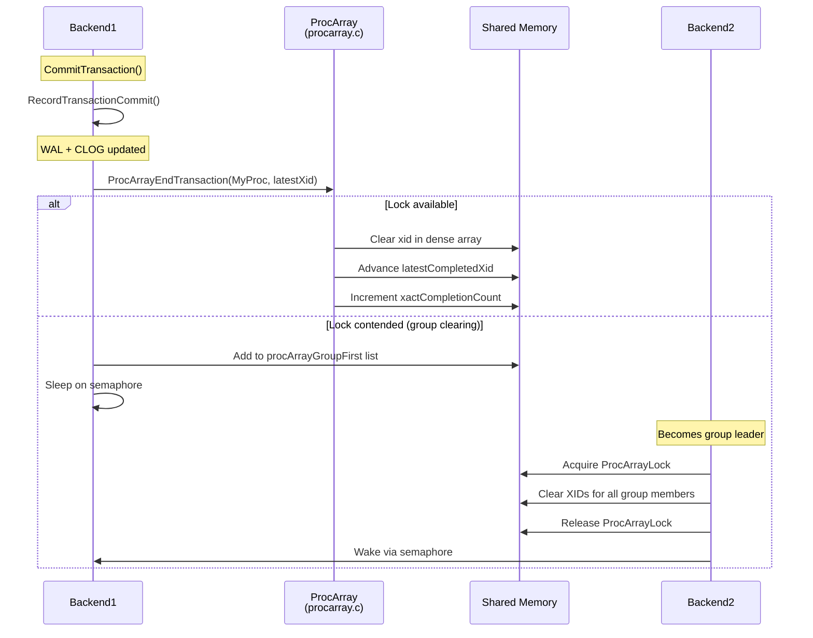

# Concurrency Infrastructure

> MVCC Documentation > Concurrency Infrastructure

**Prerequisites:** [Snapshot Management](06_snapshot_management.md)

---

## Overview

PostgreSQL's MVCC concurrency infrastructure provides the shared memory structures and algorithms that enable multiple backends to coordinate transaction state without traditional read locks on data. The infrastructure centers on the [PGPROC](appendix_data_structures.md) structure (per-backend shared memory), the ProcArray (the global registry of active backends), and the Serializable Snapshot Isolation (SSI) predicate locking system.

The key design principle is **optimistic concurrency**: readers never block writers, and writers never block readers. Conflicts are detected only when two writers attempt to modify the same row, or when the SSI system detects serialization anomalies. See [Deep Dives: SSI](10_deep_dives.md) for detailed SSI coverage.

## Key Concepts

### Dense Array Architecture

PostgreSQL 14 introduced a major optimization for ProcArray scanning: densely-packed arrays mirrored from PGPROC fields. Instead of scanning all PGPROC structures (which are large and spread across many cache lines), [GetSnapshotData()](06_snapshot_management.md) and `TransactionIdIsInProgress()` scan compact arrays:

- `ProcGlobal->xids[]` -- mirrors `PGPROC.xid`
- `ProcGlobal->subxidStates[]` -- mirrors `PGPROC.subxidStatus`
- `ProcGlobal->statusFlags[]` -- mirrors `PGPROC.statusFlags`

These arrays are indexed by `PGPROC.pgxactoff`, which is valid only while holding `ProcArrayLock` or `XidGenLock`.

### Group Clearing

To reduce lock contention when many transactions [commit](03_transaction_lifecycle.md) simultaneously, PostgreSQL uses a **group clearing** optimization: when a backend cannot immediately acquire `ProcArrayLock` for XID clearing, it joins a queue. The first backend in the queue becomes the leader and clears XIDs for all group members under a single lock acquisition.

## Data Structures

### PGPROC

The per-backend shared memory structure, defined at `src/include/storage/proc.h:162`. See [Appendix: Data Structures](appendix_data_structures.md) for the complete definition.

MVCC-relevant fields:

```c
struct PGPROC
{
    TransactionId xid;          /* top-level XID (mirrored in ProcGlobal->xids[]) */
    TransactionId xmin;         /* oldest XID needed by this backend */
    int           pgxactoff;    /* offset into ProcGlobal dense arrays */

    struct {
        ProcNumber  procNumber; /* backend identifier */
        LocalTransactionId lxid; /* virtual XID */
    } vxid;

    uint8         statusFlags;  /* PROC_IN_VACUUM, etc. (mirrored) */
    XidCacheStatus subxidStatus; /* count + overflowed (mirrored) */
    struct XidCache subxids;     /* cached subtransaction XIDs */

    /* Group XID clearing support */
    bool          procArrayGroupMember;
    pg_atomic_uint32 procArrayGroupNext;
    TransactionId procArrayGroupMemberXid;

    /* Group CLOG update support */
    bool          clogGroupMember;
    pg_atomic_uint32 clogGroupNext;
    TransactionId clogGroupMemberXid;
    XidStatus     clogGroupMemberXidStatus;
    int64         clogGroupMemberPage;
    XLogRecPtr    clogGroupMemberLsn;
};
```

### PROC_HDR (ProcGlobal)

The global process header structure containing the dense arrays, defined at `src/include/storage/proc.h:370`:

```c
typedef struct PROC_HDR
{
    PGPROC     *allProcs;               /* Array of all PGPROC structures */
    TransactionId *xids;                /* Dense mirror of PGPROC.xid */
    XidCacheStatus *subxidStates;       /* Dense mirror of PGPROC.subxidStatus */
    uint8      *statusFlags;            /* Dense mirror of PGPROC.statusFlags */
    uint32      allProcCount;           /* Length of allProcs array */

    /* Free lists for different backend types */
    dlist_head  freeProcs;
    dlist_head  autovacFreeProcs;
    dlist_head  bgworkerFreeProcs;
    dlist_head  walsenderFreeProcs;

    /* Group clearing atomic heads */
    pg_atomic_uint32 procArrayGroupFirst;
    pg_atomic_uint32 clogGroupFirst;
} PROC_HDR;
```

See [diagrams/shared_memory_layout.mermaid](diagrams/shared_memory_layout.mermaid) for a visual representation.

## Core APIs

### ProcArrayEndTransaction

**Purpose:** Clears a backend's XID from the ProcArray after transaction [commit](03_transaction_lifecycle.md) or [abort](03_transaction_lifecycle.md). This makes the transaction's completion visible to new [snapshots](06_snapshot_management.md).

```c
/* Source: src/backend/storage/ipc/procarray.c:667 */
void ProcArrayEndTransaction(PGPROC *proc, TransactionId latestXid);
```

| Parameter | Type | Description |
|-----------|------|-------------|
| proc | PGPROC* | The backend's PGPROC (always MyProc) |
| latestXid | TransactionId | Latest XID among xact and children; InvalidTransactionId if no XID was assigned |

**Case 1: Transaction had an XID**:

1. Attempts `LWLockConditionalAcquire(ProcArrayLock, LW_EXCLUSIVE)`.
2. **If lock acquired**: Calls `ProcArrayEndTransactionInternal()`:
   - Clears `proc->xid = 0` and `ProcGlobal->xids[pgxactoff] = 0`.
   - Clears `proc->vxid.lxid`, `proc->xmin`, subxid cache.
   - Advances `TransamVariables->latestCompletedXid` if `latestXid` is newer.
   - Increments `TransamVariables->xactCompletionCount` (for [snapshot reuse](06_snapshot_management.md)).
3. **If lock not available**: Calls `ProcArrayGroupClearXid()` for group clearing.

**Case 2: Transaction had no XID**: No lock needed; simply clears `proc->vxid.lxid`, `proc->xmin`, and status flags.

#### Group Clearing (ProcArrayGroupClearXid)

When `ProcArrayLock` is contended:

1. Stores `latestXid` in `proc->procArrayGroupMemberXid`.
2. Atomically adds itself to the `ProcGlobal->procArrayGroupFirst` linked list via compare-and-swap.
3. If not the first entry: sleeps on the semaphore until the leader processes the request.
4. If the first entry (becomes leader): acquires `ProcArrayLock` exclusively, walks the list, calls `ProcArrayEndTransactionInternal()` for each member, releases the lock, and wakes all sleeping group members.

This reduces lock acquisitions from N to 1 per group, significantly reducing contention under high commit rates.

---

### TransactionIdIsInProgress

**Purpose:** Checks if a given XID is still running by scanning the ProcArray. This is the definitive test for transaction liveness (as opposed to [XidInMVCCSnapshot()](05_visibility_rules.md) which checks a frozen snapshot).

```c
/* Source: src/backend/storage/ipc/procarray.c:1402 */
bool TransactionIdIsInProgress(TransactionId xid);
```

**Multi-level optimization:**

1. **Own transaction check**: If `xid` equals the current top-level XID, return true immediately.
2. **Quick xmax check**: If a recent snapshot's xmax is available and `xid >= xmax`, the XID must be in progress.
3. **ProcArray scan** (under ProcArrayLock shared):
   - Scans `ProcGlobal->xids[]` for the XID as a top-level transaction.
   - Scans each backend's `subxids.xids[]` cache for the XID as a subtransaction.
   - Records any overflowed backends for fallback.
4. **Subtransaction overflow fallback**: If any backend overflowed and the XID was not found, calls `SubTransGetTopmostTransaction(xid)` via `pg_subtrans` and re-scans.
5. **KnownAssignedXids** (recovery): Also checks the `KnownAssignedXids` array for XIDs from the primary.

**Important:** This function must be called BEFORE [TransactionIdDidCommit()](08_clog_transaction_status.md) in non-MVCC visibility paths. See [Visibility Rules: Race Condition Prevention](05_visibility_rules.md).

---

### GetOldestNonRemovableTransactionId

**Purpose:** Computes the oldest XID that might be needed by any running transaction, including replication slots. This is the horizon below which [VACUUM](09_vacuum_and_freezing.md) can safely remove dead tuples.

Scans all backends' `xid` and `xmin` fields, plus `replication_slot_xmin` and `replication_slot_catalog_xmin`, to find the minimum. This minimum determines `OldestXmin`.

---

### GlobalVisTestIsRemovableXid

**Purpose:** Fast check for whether a tuple with a given xmax can be removed, using cached visibility horizon bounds. Avoids the need to take ProcArrayLock for every pruning decision.

The `GlobalVisState` structures (`GlobalVisSharedRels`, `GlobalVisCatalogRels`, `GlobalVisDataRels`, `GlobalVisTempRels`) maintain two bounds:
- `definitely_needed`: XIDs above this are definitely needed by some backend.
- `maybe_needed`: XIDs below this are definitely not needed.

## Serializable Snapshot Isolation (SSI)

### Overview

PostgreSQL implements the SERIALIZABLE isolation level using Serializable Snapshot Isolation (SSI), based on the academic work by Cahill, Rohm, and Fekete. The SSI system detects **dangerous structures** in the dependency graph between serializable transactions and aborts one of the participants to prevent anomalies. See [Deep Dives: SSI](10_deep_dives.md) for detailed coverage.

The implementation resides in `src/backend/storage/lmgr/predicate.c`.

### Core SSI Functions

**CheckForSerializableConflictIn**: Called when a serializable transaction writes. Checks for SIREAD locks on the affected data and records rw-conflicts.

```c
void CheckForSerializableConflictIn(Relation relation, ItemPointer tid,
                                    BlockNumber blkno);
```

**CheckForSerializableConflictOut**: Called when a serializable transaction reads. Checks for concurrent writes.

**PreCommit_CheckForSerializationFailure**: Called at commit time. Examines rw-conflicts for dangerous structures (two consecutive rw-edges). Aborts if found.

## Processing Flow



## Implementation Notes

1. **Mirrored fields must be coherent**: When updating PGPROC fields that are mirrored in the dense arrays (xid, subxidStatus, statusFlags), both copies must be updated atomically under ProcArrayLock or XidGenLock.

2. **ProcArrayLock granularity**: A single LWLock that protects the entire ProcArray. The dense array optimization and group clearing significantly reduce contention. Shared-mode access (many readers, few writers) further reduces contention.

3. **xmin management**: `MyProc->xmin` is set during [GetSnapshotData()](06_snapshot_management.md) and cleared during `ProcArrayEndTransaction()`. It prevents [VACUUM](09_vacuum_and_freezing.md) from removing tuples the backend might still access.

4. **latestCompletedXid**: Tracks the newest completed XID. Used as the basis for snapshot `xmax` (set to `latestCompletedXid + 1`).

5. **xactCompletionCount**: Monotonically increasing counter incremented on every transaction completion. Enables [snapshot reuse](06_snapshot_management.md) when it has not changed since the last snapshot.

## Source File References

| File | Key Symbols |
|------|-------------|
| `src/include/storage/proc.h` | `PGPROC`, `PROC_HDR` |
| `src/backend/storage/ipc/procarray.c` | `ProcArrayEndTransaction`, `TransactionIdIsInProgress`, `GetSnapshotData` |
| `src/backend/storage/lmgr/predicate.c` | `CheckForSerializableConflictIn`, `PreCommit_CheckForSerializationFailure` |

---

Previous: [Snapshot Management](06_snapshot_management.md) | Next: [CLOG and Transaction Status](08_clog_transaction_status.md)
