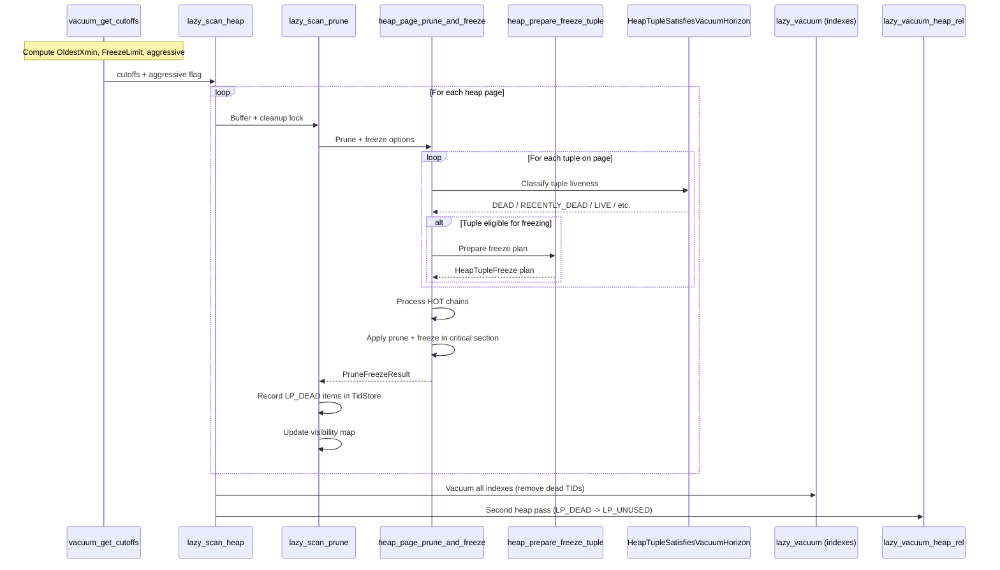

# VACUUM and Freezing

> MVCC Documentation > VACUUM and Freezing

**Prerequisites:** [CLOG and Transaction Status](08_clog_transaction_status.md), [Visibility Rules](05_visibility_rules.md)

---

## Overview

VACUUM is the subsystem responsible for reclaiming storage occupied by dead tuples, freezing old transaction IDs to prevent wraparound, and maintaining auxiliary data structures (the visibility map and free space map). In the context of MVCC, VACUUM is the garbage collector: it removes tuple versions that are no longer visible to any active transaction, and it freezes XIDs so that the 32-bit transaction ID space can be safely recycled.

The lazy VACUUM implementation operates in-place without rewriting tables. It uses a multi-pass strategy coordinated through the `LVRelState` structure, with the core logic spanning three source files:

- `src/backend/access/heap/vacuumlazy.c` -- VACUUM orchestration: heap scanning, index vacuuming, two-pass strategy.
- `src/backend/access/heap/pruneheap.c` -- Page-level pruning, HOT chain management, integrated freeze processing.
- `src/backend/commands/vacuum.c` -- VACUUM entry points, cutoff computation, catalog updates.

## Key Concepts

### Dead Tuple Lifecycle

A tuple becomes "dead" when its deleting (or updating) transaction commits and no running transaction can still see the old version:

1. **LIVE**: Tuple is visible to at least one active [snapshot](06_snapshot_management.md).
2. **RECENTLY_DEAD**: The deleting transaction committed, but some running transaction might still need the old version.
3. **DEAD**: No running transaction can see this version. The tuple's storage can be reclaimed.

[HeapTupleSatisfiesVacuumHorizon()](05_visibility_rules.md) classifies tuples into these states. The transition from RECENTLY_DEAD to DEAD is determined by comparing the tuple's xmax against the `GlobalVisState` horizon (derived from `OldestXmin` via [GetOldestNonRemovableTransactionId()](07_concurrency_infrastructure.md)).

### The Two-Pass Strategy

When a table has indexes, VACUUM uses a two-pass approach:

**Pass 1 (Initial Heap Scan -- `lazy_scan_heap`):**
- Scans every heap page (skipping all-visible pages when safe).
- Prunes HOT chains and dead tuples via `heap_page_prune_and_freeze()`.
- Freezes tuples that need freezing.
- Records LP_DEAD item TIDs in a `TidStore`.
- Updates the visibility map and free space map.

**Index Vacuuming (between passes):**
- Calls each index's `ambulkdelete` routine with the collected dead TIDs.
- Removes index entries pointing to LP_DEAD heap items.

**Pass 2 (Final Heap Vacuum -- `lazy_vacuum_heap_rel`):**
- Revisits only pages that had LP_DEAD items.
- Marks LP_DEAD line pointers as LP_UNUSED, reclaiming space.
- Updates the free space map.

**Key invariant:** No index tuple may ever point to an LP_UNUSED line pointer. Index entries must be removed before the heap line pointers they reference can be recycled.

When a table has no indexes, VACUUM uses a **one-pass strategy**: dead items are immediately marked LP_UNUSED during the initial scan.

### Freezing and XID Wraparound Prevention

PostgreSQL uses 32-bit transaction IDs with modular arithmetic (~2 billion usable range). To prevent wraparound, VACUUM must periodically "freeze" tuples by replacing their xmin/xmax with special values.

Freezing xmin means setting the `HEAP_XMIN_FROZEN` [infomask bit](04_tuple_versioning.md), which causes [visibility checks](05_visibility_rules.md) to treat the tuple as committed by an infinitely old transaction. Freezing xmax means clearing it to `InvalidTransactionId`.

The cutoff XIDs are computed by `vacuum_get_cutoffs()` at the start of each VACUUM. See also [Transaction Lifecycle: XID Wraparound Protection](03_transaction_lifecycle.md).

### Aggressive vs. Non-Aggressive VACUUM

- **Non-aggressive VACUUM**: Skips pages marked all-visible in the visibility map. Freezes tuples opportunistically.
- **Aggressive VACUUM**: Triggered when `relfrozenxid` or `relminmxid` is old enough (controlled by `vacuum_freeze_table_age`). Scans ALL pages. Must freeze all tuples older than `FreezeLimit`.

## VACUUM Cutoff Relationships

```
Transaction ID Timeline (increasing XIDs -->):

  relfrozenxid     FreezeLimit    OldestXmin    nextXID
       |                |              |            |
       v                v              v            v
  -----+----------------+--------------+------------+----->
       |                |              |
       |  Must freeze   |  May freeze  | Cannot freeze
       |  (aggressive)  | (opportun.)  | (still needed)
```

- **OldestXmin**: The oldest XID any running backend might need. Tuples deleted before this are DEAD.
- **FreezeLimit**: `nextXID - vacuum_freeze_min_age`. Tuples with xmin older than this CAN be frozen.
- **MultiXactCutoff**: Analogous cutoff for MultiXactIds.
- **relfrozenxid**: Stored in `pg_class`. All tuples guaranteed to have xmin >= relfrozenxid (or be frozen).

## Core APIs

### vacuum_get_cutoffs

**Purpose:** Computes all freeze cutoffs and the dead-tuple removal horizon for VACUUM. Determines aggressiveness.

```c
/* Source: src/backend/commands/vacuum.c:1083 */
bool vacuum_get_cutoffs(Relation rel, const VacuumParams *params,
                        struct VacuumCutoffs *cutoffs);
```

**Returns:** `true` if VACUUM should be aggressive.

Steps:
1. Reads `rel->rd_rel->relfrozenxid` and `relminmxid`.
2. Calls `GetOldestNonRemovableTransactionId(rel)` for OldestXmin. See [Concurrency Infrastructure](07_concurrency_infrastructure.md).
3. Computes `FreezeLimit = nextXID - freeze_min_age`.
4. Determines aggressiveness: `aggressive = (relfrozenxid <= nextXID - freeze_table_age)`.

---

### lazy_scan_heap

**Purpose:** The main workhorse of lazy VACUUM. Performs the initial heap scan pass.

```c
/* Source: src/backend/access/heap/vacuumlazy.c:779 */
static void lazy_scan_heap(LVRelState *vacrel);
```

For each block:

1. **Wraparound failsafe check**: Every `FAILSAFE_EVERY_PAGES` pages, checks if `relfrozenxid` is dangerously old. If so, disables index vacuuming to prioritize freezing.
2. **Dead items overflow**: If TidStore exceeds `max_bytes`, performs intermediate index + heap vacuuming.
3. **Buffer acquisition**: Reads the page and attempts a cleanup lock. Falls back to shared lock if unavailable.
4. **Pruning and freezing**: With cleanup lock, calls `lazy_scan_prune()` which delegates to `heap_page_prune_and_freeze()`.
5. **FSM update**: Records free space.

---

### heap_page_prune_and_freeze

**Purpose:** The unified page-level operation that prunes dead tuples from HOT chains, removes dead line pointers, and freezes eligible tuples in a single pass. See also [Deep Dives: HOT Chains](10_deep_dives.md).

```c
/* Source: src/backend/access/heap/pruneheap.c:297 */
void heap_page_prune_and_freeze(Relation relation, Buffer buffer,
                                GlobalVisState *vistest,
                                int options,
                                struct VacuumCutoffs *cutoffs,
                                PruneFreezeResult *presult,
                                PruneReason reason,
                                OffsetNumber *off_loc,
                                TransactionId *new_relfrozen_xid,
                                MultiXactId *new_relmin_mxid);
```

Operates in three phases:

**Phase 1: Classification** (reverse offset scan): Iterates all line pointers in reverse order (cache prefetch optimization). For each LP_NORMAL item, calls `heap_prune_satisfies_vacuum()` (which uses [HeapTupleSatisfiesVacuumHorizon()](05_visibility_rules.md)) to classify as LIVE, RECENTLY_DEAD, DEAD, or IN_PROGRESS.

**Phase 2: HOT Chain Processing**: Walks HOT chains, marks dead items LP_DEAD or LP_UNUSED, and redirects chains past dead intermediaries.

**Phase 3: Apply Changes** (critical section): Updates `pd_prune_xid`, applies prune and freeze operations, marks buffer dirty, writes `XLOG_HEAP2_PRUNE_FREEZE` WAL record.

**Freeze decision**: If `pagefrz.freeze_required` is set, freezing is mandatory. Otherwise, freezing is opportunistic: it only happens if the page would become all-frozen AND a full page image will be emitted anyway.

---

### heap_prepare_freeze_tuple

**Purpose:** Analyzes a single tuple's xmin, xmax, and xvac fields and constructs a freeze plan.

```c
/* Source: src/backend/access/heap/heapam.c:7009 */
bool heap_prepare_freeze_tuple(HeapTupleHeader tuple,
                               const struct VacuumCutoffs *cutoffs,
                               HeapPageFreeze *pagefrz,
                               HeapTupleFreeze *frz, bool *totally_frozen);
```

**Returns:** `true` if the freeze plan contains actions.

**xmin processing:**
- If xmin precedes `OldestXmin`, sets `freeze_xmin = true` with verification flag `HEAP_FREEZE_CHECK_XMIN_COMMITTED`.

**xmax processing** (most complex):
1. **MultiXactId xmax**: Calls `FreezeMultiXactId()` which returns `FRM_NOOP`, `FRM_RETURN_IS_XID`, `FRM_RETURN_IS_MULTI`, or `FRM_INVALIDATE_XMAX`.
2. **Normal XID xmax**: If it precedes `OldestXmin`, sets `freeze_xmax = true`.
3. **Invalid xmax**: Already frozen.

**Freeze plan assembly:**
- `freeze_xmin`: Sets `HEAP_XMIN_FROZEN` in `frz->t_infomask`.
- `freeze_xmax`: Clears xmax to `InvalidTransactionId` with `HEAP_XMAX_INVALID`.

See [Deep Dives: Freeze Map](10_deep_dives.md) for the freeze map and visibility map optimization.

---

### HeapTupleSatisfiesVacuumHorizon

**Purpose:** Classifies a tuple's liveness for VACUUM. See [Visibility Rules](05_visibility_rules.md) for the full description.

---

### lazy_vacuum_heap_rel

**Purpose:** Second pass. Marks LP_DEAD items as LP_UNUSED.

```c
/* Source: src/backend/access/heap/vacuumlazy.c:2089 */
static void lazy_vacuum_heap_rel(LVRelState *vacrel);
```

Iterates the `dead_items` TidStore, visiting only pages with dead items. Sets each LP_DEAD offset to LP_UNUSED and potentially marks the page all-visible.

## Visibility Map Integration

The visibility map (VM) is a bitmap with two bits per heap page:

- **ALL_VISIBLE**: All tuples on the page are visible to all current and future transactions.
- **ALL_FROZEN**: All tuples on the page are frozen (no unfrozen XIDs remain).

VACUUM's interaction with the VM:

1. After pruning and freezing, if a page has no LP_DEAD items and all tuples are visible, ALL_VISIBLE is set. If all tuples are also frozen, ALL_FROZEN is set.
2. During block iteration, the VM determines which pages to skip:
   - **Non-aggressive**: Skips ALL_VISIBLE pages.
   - **Aggressive**: Skips only ALL_FROZEN pages (must visit ALL_VISIBLE pages to check freezing).
3. Once all-frozen, VACUUM never needs to visit the page again until new modifications occur.

## Wraparound Failsafe

When `relfrozenxid` becomes dangerously old (within `vacuum_failsafe_age` of wraparound):

1. `lazy_check_wraparound_failsafe()` triggers.
2. Disables index vacuuming and index cleanup.
3. VACUUM focuses exclusively on freezing.
4. Logs a WARNING.

## CLOG Truncation

After VACUUM advances `relfrozenxid`:

1. `vac_update_relstats()` updates `pg_class.relfrozenxid`.
2. `vac_update_datfrozenxid()` computes database-wide minimum `datfrozenxid`.
3. `vac_truncate_clog()` truncates [CLOG](08_clog_transaction_status.md), pg_subtrans, pg_multixact, and pg_commit_ts segments.

## Processing Flow



## Implementation Notes

1. **TidStore for dead items**: PostgreSQL 17 replaced the fixed-size `dead_items` array with a TidStore (radix-tree-based), more memory-efficient for sparse TID distributions.

2. **Combined prune-freeze WAL record**: PostgreSQL 17 merged separate prune and freeze WAL records into a single `XLOG_HEAP2_PRUNE_FREEZE` record.

3. **Opportunistic freezing**: VACUUM freezes tuples even when not required if it would make the page all-frozen AND a full page image is being emitted anyway ("free" freezing).

4. **Reverse offset scanning**: `heap_page_prune_and_freeze()` scans offsets in reverse order for cache prefetch efficiency.

5. **HTSV result caching**: Each tuple's result is computed once and stored in `prstate.htsv[]` -- a correctness requirement since the GlobalVis horizon can advance during processing.

6. **Aggressive VACUUM and VM**: Aggressive VACUUM skips only ALL_FROZEN pages, not ALL_VISIBLE. It must visit ALL_VISIBLE pages to check freezing needs.

7. **Index vacuum bypass**: When very few LP_DEAD items exist (controlled by `vacuum_index_cleanup`), VACUUM can bypass index vacuuming entirely.

## Source File References

| File | Key Symbols |
|------|-------------|
| `src/backend/commands/vacuum.c` | `vacuum_get_cutoffs`, `vac_update_relstats`, `vac_truncate_clog` |
| `src/backend/access/heap/vacuumlazy.c` | `lazy_scan_heap`, `lazy_scan_prune`, `lazy_vacuum_heap_rel`, `LVRelState` |
| `src/backend/access/heap/pruneheap.c` | `heap_page_prune_and_freeze`, `heap_prune_chain` |
| `src/backend/access/heap/heapam.c` | `heap_prepare_freeze_tuple`, `FreezeMultiXactId` |
| `src/backend/access/heap/heapam_visibility.c` | `HeapTupleSatisfiesVacuumHorizon` |

---

Previous: [CLOG and Transaction Status](08_clog_transaction_status.md) | Next: [Deep Dives](10_deep_dives.md)
