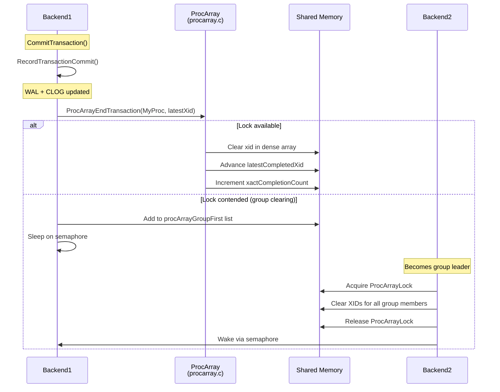

# Concurrency Infrastructure

## Overview

PostgreSQL's MVCC concurrency infrastructure provides the shared memory structures and algorithms that enable multiple backends to coordinate transaction state without traditional read locks on data. The infrastructure centers on the PGPROC structure (per-backend shared memory), the ProcArray (the global registry of active backends), and the Serializable Snapshot Isolation (SSI) predicate locking system.

The key design principle is **optimistic concurrency**: readers never block writers, and writers never block readers. Conflicts are detected only when two writers attempt to modify the same row, or when the SSI system detects serialization anomalies.

## Key Concepts

### Dense Array Architecture

PostgreSQL 14 introduced a major optimization for ProcArray scanning: densely-packed arrays mirrored from PGPROC fields. Instead of scanning all PGPROC structures (which are large and spread across many cache lines), `GetSnapshotData()` and `TransactionIdIsInProgress()` scan compact arrays of just the fields they need:

- `ProcGlobal->xids[]` -- mirrors `PGPROC.xid`
- `ProcGlobal->subxidStates[]` -- mirrors `PGPROC.subxidStatus`
- `ProcGlobal->statusFlags[]` -- mirrors `PGPROC.statusFlags`

These arrays are indexed by `PGPROC.pgxactoff`, which is valid only while holding `ProcArrayLock` or `XidGenLock`.

### Group Clearing

To reduce lock contention when many transactions commit simultaneously, PostgreSQL uses a **group clearing** optimization: when a backend cannot immediately acquire `ProcArrayLock` for XID clearing, it joins a queue. The first backend in the queue becomes the leader and clears XIDs for all group members under a single lock acquisition.

## Data Structures

### PGPROC

The per-backend shared memory structure, defined at `src/include/storage/proc.h:162-309`. MVCC-relevant fields:

```c
struct PGPROC
{
    TransactionId xid;          /* top-level XID (mirrored in ProcGlobal->xids[]) */
    TransactionId xmin;         /* oldest XID needed by this backend */
    int           pgxactoff;    /* offset into ProcGlobal dense arrays */

    struct {
        ProcNumber  procNumber; /* backend identifier */
        LocalTransactionId lxid; /* virtual XID */
    } vxid;

    uint8         statusFlags;  /* PROC_IN_VACUUM, etc. (mirrored) */

    XidCacheStatus subxidStatus; /* count + overflowed (mirrored) */
    struct XidCache subxids;     /* cached subtransaction XIDs */

    /* Group XID clearing support */
    bool          procArrayGroupMember;
    pg_atomic_uint32 procArrayGroupNext;
    TransactionId procArrayGroupMemberXid;

    /* Group CLOG update support */
    bool          clogGroupMember;
    pg_atomic_uint32 clogGroupNext;
    TransactionId clogGroupMemberXid;
    XidStatus     clogGroupMemberXidStatus;
    int64         clogGroupMemberPage;
    XLogRecPtr    clogGroupMemberLsn;
};
```

### PROC_HDR (ProcGlobal)

The global process header structure containing the dense arrays, defined at `src/include/storage/proc.h:370-412`:

```c
typedef struct PROC_HDR
{
    PGPROC     *allProcs;               /* Array of all PGPROC structures */
    TransactionId *xids;                /* Dense mirror of PGPROC.xid */
    XidCacheStatus *subxidStates;       /* Dense mirror of PGPROC.subxidStatus */
    uint8      *statusFlags;            /* Dense mirror of PGPROC.statusFlags */
    uint32      allProcCount;           /* Length of allProcs array */

    /* Free lists for different backend types */
    dlist_head  freeProcs;
    dlist_head  autovacFreeProcs;
    dlist_head  bgworkerFreeProcs;
    dlist_head  walsenderFreeProcs;

    /* Group clearing atomic heads */
    pg_atomic_uint32 procArrayGroupFirst;
    pg_atomic_uint32 clogGroupFirst;

    /* Process latches */
    Latch      *walwriterLatch;
    Latch      *checkpointerLatch;
} PROC_HDR;
```

See `diagrams/shared_memory_layout.mermaid` for a visual representation.

## Core APIs

### ProcArrayEndTransaction (Tier 1, importance: 0.86)

#### Purpose

Clears a backend's XID from the ProcArray after transaction commit or abort. This makes the transaction's completion visible to new snapshots.

#### Signature

```c
/* Source: src/backend/storage/ipc/procarray.c:653-723 */
void ProcArrayEndTransaction(PGPROC *proc, TransactionId latestXid);
```

#### Parameters

| Parameter | Type | Description | Constraints |
|-----------|------|-------------|-------------|
| proc | PGPROC* | The backend's PGPROC (always MyProc) | Must be in the ProcArray |
| latestXid | TransactionId | Latest XID among xact and children | InvalidTransactionId if no XID was assigned |

#### Detailed Description

**Case 1: Transaction had an XID** (`TransactionIdIsValid(latestXid)`):

1. Attempts `LWLockConditionalAcquire(ProcArrayLock, LW_EXCLUSIVE)`.
2. **If lock acquired immediately**: Calls `ProcArrayEndTransactionInternal()` directly:
   - Clears `proc->xid = 0` and `ProcGlobal->xids[pgxactoff] = 0`.
   - Clears `proc->vxid.lxid = InvalidLocalTransactionId`.
   - Clears `proc->xmin = InvalidTransactionId`.
   - Resets subxid cache (count = 0, overflowed = false).
   - Advances `TransamVariables->latestCompletedXid` if `latestXid` is newer.
   - Increments `TransamVariables->xactCompletionCount` (for snapshot reuse).
3. **If lock not available**: Calls `ProcArrayGroupClearXid()` for group clearing optimization.

**Case 2: Transaction had no XID** (`!TransactionIdIsValid(latestXid)`):

No lock needed since the backend was not visible to other backends' snapshots. Simply clears `proc->vxid.lxid`, `proc->xmin`, and status flags.

#### Group Clearing (ProcArrayGroupClearXid)

When `ProcArrayLock` is contended:

1. Stores `latestXid` in `proc->procArrayGroupMemberXid`.
2. Atomically adds itself to the `ProcGlobal->procArrayGroupFirst` linked list via compare-and-swap.
3. If not the first entry (a leader exists): sleeps on the semaphore until the leader processes the request.
4. If the first entry (becomes leader):
   - Acquires `ProcArrayLock` exclusively.
   - Atomically resets the group list head.
   - Walks the list, calling `ProcArrayEndTransactionInternal()` for each member.
   - Releases the lock.
   - Wakes all sleeping group members.

This reduces the number of `ProcArrayLock` acquisitions from N (one per committing backend) to 1 (one per group), significantly reducing contention under high commit rates.

---

### TransactionIdIsInProgress (Tier 1, importance: 0.92)

#### Purpose

Checks if a given XID is still running by scanning the ProcArray. This is the definitive test for transaction liveness (as opposed to `XidInMVCCSnapshot()` which checks a frozen snapshot).

#### Signature

```c
/* Source: src/backend/storage/ipc/procarray.c:1320-1582 */
bool TransactionIdIsInProgress(TransactionId xid);
```

#### Detailed Description

This function implements a multi-level optimization to minimize ProcArray scanning:

1. **Own transaction check**: If `xid` equals the current top-level XID, return true immediately.

2. **Quick xmax check**: If a recent snapshot's xmax is available and `xid >= xmax`, the XID started after our snapshot and must be in progress (if valid at all).

3. **ProcArray scan** (under ProcArrayLock shared):
   - Scans `ProcGlobal->xids[]` for the XID as a top-level transaction.
   - If found, return true.
   - Scans each backend's `subxids.xids[]` cache for the XID as a subtransaction.
   - If found, return true.
   - If any backend has `subxidStatus.overflowed`, records it for the fallback path.

4. **Subtransaction overflow fallback**: If any backend overflowed and we did not find the XID:
   - Call `SubTransGetTopmostTransaction(xid)` to resolve to the top-level XID via `pg_subtrans`.
   - Re-scan ProcArray for the resolved top-level XID.
   - This handles the case where the XID is a subtransaction whose parent is in the ProcArray but the subtransaction itself was not cached.

5. **KnownAssignedXids** (recovery): During hot standby, also checks the `KnownAssignedXids` array for XIDs from the primary.

#### Performance Characteristics

- Acquires `ProcArrayLock` in shared mode (non-blocking for concurrent snapshot-takers).
- The dense array scan is cache-friendly.
- The subtransaction overflow fallback (pg_subtrans SLRU lookup) is slow but rare.

#### Important Usage Note

This function must be called BEFORE `TransactionIdDidCommit()` in non-MVCC visibility paths. See the race condition discussion in `component_visibility.md`.

---

### GetOldestNonRemovableTransactionId (Tier 2, importance: 0.75)

#### Purpose

Computes the oldest XID that might be needed by any running transaction, including replication slots. This is the horizon below which VACUUM can safely remove dead tuples.

#### Detailed Description

Scans all backends' `xid` and `xmin` fields, plus `replication_slot_xmin` and `replication_slot_catalog_xmin`, to find the minimum. This minimum determines OldestXmin, which is the primary input to VACUUM's dead-tuple-removal decisions.

---

### GlobalVisTestIsRemovableXid (Tier 2, importance: 0.72)

#### Purpose

Fast check for whether a tuple with a given xmax can be removed, using cached visibility horizon bounds. Avoids the need to take ProcArrayLock for every pruning decision.

The `GlobalVisState` structures (`GlobalVisSharedRels`, `GlobalVisCatalogRels`, `GlobalVisDataRels`, `GlobalVisTempRels`) maintain two bounds:
- `definitely_needed`: XIDs above this are definitely needed by some backend.
- `maybe_needed`: XIDs below this are definitely not needed.

## Serializable Snapshot Isolation (SSI)

### Overview

PostgreSQL implements the SERIALIZABLE isolation level using Serializable Snapshot Isolation (SSI), based on the academic work by Cahill, Rohm, and Fekete. The SSI system detects **dangerous structures** in the dependency graph between serializable transactions and aborts one of the participants to prevent anomalies.

The implementation resides in `src/backend/storage/lmgr/predicate.c`.

### Key Concepts

#### Read-Write Dependencies (rw-conflicts)

An rw-conflict exists when:
- Transaction T1 reads a data item.
- Transaction T2 writes to the same data item.
- Both T1 and T2 are serializable transactions with overlapping snapshots.

The conflict is recorded as T1 --rw--> T2 (T1 has a read-write dependency on T2).

#### Dangerous Structures

A dangerous structure (also called a "pivot" structure) exists when there are two adjacent rw-conflicts forming a pattern:

```
T1 --rw--> T2 --rw--> T3
```

where T1 committed before T3 started. If this pattern is detected, one of the transactions (usually T2 or T3) must be aborted to maintain serializability.

### SIREAD Locks (Predicate Locks)

SIREAD locks are not traditional locks -- they do not block access. Instead, they track what data each serializable transaction has read:

- **Tuple-level**: Locks on specific tuple TIDs.
- **Page-level**: Locks on entire heap pages (escalated from tuple locks when there are too many).
- **Relation-level**: Locks on entire tables (escalated from page locks).

When a serializable transaction reads a tuple, it acquires a SIREAD lock. When another serializable transaction writes to the same data, the system checks for existing SIREAD locks and records rw-conflicts.

### Core SSI Functions

#### CheckForSerializableConflictIn (Tier 2, importance: 0.70)

Called when a serializable transaction writes (INSERT/UPDATE/DELETE). Checks if any concurrent serializable transaction holds a SIREAD lock on the affected data. If so, records an rw-conflict.

```c
void CheckForSerializableConflictIn(Relation relation, ItemPointer tid,
                                    BlockNumber blkno);
```

#### CheckForSerializableConflictOut (Tier 2, importance: 0.68)

Called when a serializable transaction reads data. Checks if any concurrent serializable transaction has written to the data being read. If so, records an rw-conflict.

#### PreCommit_CheckForSerializationFailure (Tier 2, importance: 0.72)

Called at commit time for serializable transactions. Examines the recorded rw-conflicts for dangerous structures (two consecutive rw-edges). If a dangerous structure is found, aborts the committing transaction with:

```
ERROR: could not serialize access due to read/write dependencies among transactions
```

### SSI Performance Considerations

- SIREAD locks consume shared memory. The lock pool is limited, and lock escalation (tuple -> page -> relation) occurs when the pool is exhausted.
- SSI adds overhead to every read and write in serializable transactions.
- The false positive rate (unnecessary aborts) is low but nonzero, especially with lock escalation.
- Read-only serializable transactions that start after all concurrent read-write serializable transactions can be marked as "safe" and exempt from conflict checking.

## Processing Flow



## Implementation Notes

1. **Mirrored fields must be coherent**: When updating PGPROC fields that are mirrored in the dense arrays (xid, subxidStatus, statusFlags), both copies must be updated atomically under ProcArrayLock or XidGenLock. The PGPROC copy is used by the backend itself (no lock needed for self-access), while the dense array copy is used by other backends scanning the ProcArray.

2. **ProcArrayLock granularity**: `ProcArrayLock` is a single LWLock that protects the entire ProcArray. While this is a potential bottleneck, the dense array optimization and group clearing significantly reduce contention in practice. The shared-mode access pattern (many readers, few writers) further reduces contention.

3. **xmin management**: `MyProc->xmin` is set to the snapshot's xmin during `GetSnapshotData()` and cleared during `ProcArrayEndTransaction()`. It is the backend's declaration of the oldest XID it might need, which prevents VACUUM from removing tuples that the backend might still access.

4. **latestCompletedXid**: This global variable tracks the newest completed XID. It is used as the basis for snapshot `xmax` (set to `latestCompletedXid + 1`). It is advanced during `ProcArrayEndTransactionInternal()` and is protected by `ProcArrayLock`.

5. **xactCompletionCount**: Introduced as an optimization to avoid unnecessary ProcArray scans. It is a monotonically increasing counter incremented on every transaction completion. If it has not changed since the last snapshot, the snapshot can be reused.

## Source File References

| File | Key Symbols | Lines |
|------|-------------|-------|
| `src/include/storage/proc.h` | `PGPROC`, `PROC_HDR` | 162-412 |
| `src/backend/storage/ipc/procarray.c` | `ProcArrayEndTransaction`, `TransactionIdIsInProgress`, `GetSnapshotData` | 653-723, 1320-1582, 2144-2523 |
| `src/backend/storage/lmgr/predicate.c` | `CheckForSerializableConflictIn`, `PreCommit_CheckForSerializationFailure` | -- |
