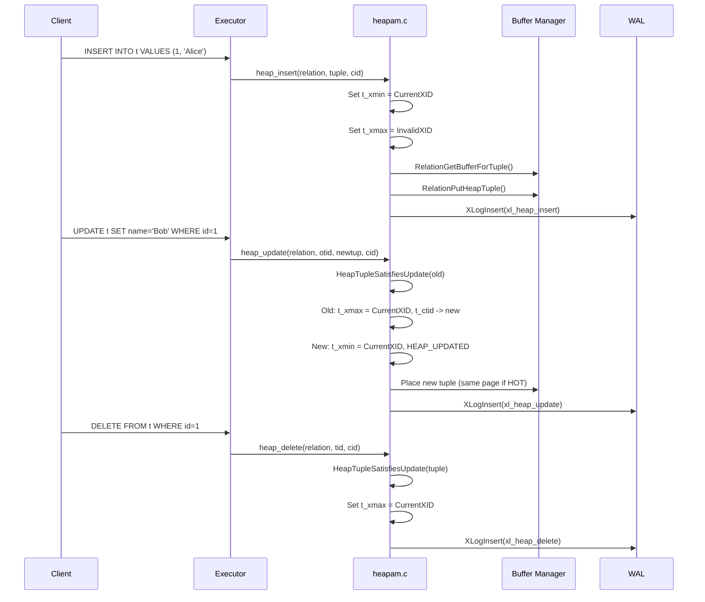

# Tuple Versioning

## Overview

PostgreSQL's MVCC system implements multi-versioning at the tuple level. Rather than modifying tuples in place, every UPDATE creates a new physical copy of the row (a new "version"), and DELETE merely marks the existing version as logically deleted by recording the deleting transaction's XID in the tuple header. Old versions remain on disk until VACUUM removes them.

The tuple header (`HeapTupleHeaderData`) contains the MVCC metadata that makes this work: `t_xmin` (the XID that created this version), `t_xmax` (the XID that deleted/superseded this version), `t_cid` (the command ID within the transaction), and `t_ctid` (a pointer to the next version in the update chain).

## Key Concepts

### Version Chains

When a row is updated, the old tuple's `t_ctid` is modified to point to the new tuple. This creates a chain of versions that can be traversed to find the current version. For HOT (Heap-Only Tuple) updates, the chain is confined to a single page, enabling efficient traversal without index updates.

### Infomask Flags

The `t_infomask` and `t_infomask2` fields encode a rich set of status flags that control visibility, locking, and HOT chain management. These are defined in `src/include/access/htup_details.h:190-293`.

## Data Structures

### HeapTupleHeaderData

The 23-byte fixed header for every heap tuple, defined at `src/include/access/htup_details.h:153-181`:

```c
struct HeapTupleHeaderData
{
    union
    {
        HeapTupleFields t_heap;      /* Transaction visibility fields */
        DatumTupleFields t_datum;    /* In-memory composite type fields */
    }           t_choice;

    ItemPointerData t_ctid;          /* Current TID of this or newer tuple
                                      * (or a speculative insertion token) */

    uint16      t_infomask2;         /* Number of attributes + flags */
    uint16      t_infomask;          /* Various flag bits */
    uint8       t_hoff;              /* Sizeof header incl. bitmap, padding */

    /* ^ - 23 bytes - ^ */

    bits8       t_bits[FLEXIBLE_ARRAY_MEMBER]; /* Bitmap of NULLs */

    /* MORE DATA FOLLOWS AT END OF STRUCT */
};
```

### HeapTupleFields

The transaction-related fields within the tuple header, defined at `src/include/access/htup_details.h:122-132`:

```c
typedef struct HeapTupleFields
{
    TransactionId t_xmin;        /* inserting xact ID */
    TransactionId t_xmax;        /* deleting or locking xact ID */

    union
    {
        CommandId   t_cid;       /* inserting or deleting command ID, or both */
        TransactionId t_xvac;   /* old-style VACUUM FULL xact ID */
    }           t_field3;
} HeapTupleFields;
```

**Five virtual fields in three physical fields**: PostgreSQL stores five logical values (xmin, cmin, xmax, cmax, xvac) in three physical fields. This works because:
- `cmin` and `cmax` are only meaningful during the lifetime of the inserting/deleting transaction.
- If a tuple is both inserted and deleted in the same transaction, a "combo CID" is used to represent both values in a single field (see ComboCID below).
- `xvac` is only used by legacy VACUUM FULL (pre-9.0).

### Infomask Flag Reference

#### t_infomask (16 bits)

| Flag | Value | Description |
|------|-------|-------------|
| `HEAP_HASNULL` | 0x0001 | Has null attribute(s) |
| `HEAP_HASVARWIDTH` | 0x0002 | Has variable-width attribute(s) |
| `HEAP_HASEXTERNAL` | 0x0004 | Has external (TOAST) stored attribute(s) |
| `HEAP_XMAX_KEYSHR_LOCK` | 0x0010 | xmax is a key-shared locker |
| `HEAP_COMBOCID` | 0x0020 | t_cid is a combo CID |
| `HEAP_XMAX_EXCL_LOCK` | 0x0040 | xmax is exclusive locker |
| `HEAP_XMAX_LOCK_ONLY` | 0x0080 | xmax is only a locker, not deleter |
| `HEAP_XMIN_COMMITTED` | 0x0100 | t_xmin committed (hint bit) |
| `HEAP_XMIN_INVALID` | 0x0200 | t_xmin invalid/aborted (hint bit) |
| `HEAP_XMIN_FROZEN` | 0x0300 | Both committed+invalid = frozen |
| `HEAP_XMAX_COMMITTED` | 0x0400 | t_xmax committed (hint bit) |
| `HEAP_XMAX_INVALID` | 0x0800 | t_xmax invalid/aborted (hint bit) |
| `HEAP_XMAX_IS_MULTI` | 0x1000 | t_xmax is a MultiXactId |
| `HEAP_UPDATED` | 0x2000 | This is an UPDATEd version of a row |
| `HEAP_MOVED_OFF` | 0x4000 | Moved by pre-9.0 VACUUM FULL |
| `HEAP_MOVED_IN` | 0x8000 | Moved from another place by pre-9.0 VACUUM FULL |

#### t_infomask2 (16 bits)

| Flag | Value | Description |
|------|-------|-------------|
| `HEAP_NATTS_MASK` | 0x07FF | Lower 11 bits: number of attributes |
| `HEAP_KEYS_UPDATED` | 0x2000 | Key columns modified, or tuple deleted |
| `HEAP_HOT_UPDATED` | 0x4000 | This tuple was HOT-updated |
| `HEAP_ONLY_TUPLE` | 0x8000 | This is a heap-only tuple (no index entry) |

## Core APIs

### heap_insert (Tier 1, importance: 0.93)

#### Purpose

Inserts a new heap tuple into a relation, setting the MVCC fields and writing the WAL record.

#### Signature

```c
/* Source: src/backend/access/heap/heapam.c */
void heap_insert(Relation relation, HeapTuple tup, CommandId cid,
                 int options, BulkInsertState bistate);
```

#### Parameters

| Parameter | Type | Description | Constraints |
|-----------|------|-------------|-------------|
| relation | Relation | The target table | Must be a heap relation |
| tup | HeapTuple | The tuple to insert | Modified in-place with system fields |
| cid | CommandId | The current command ID | Used for same-transaction visibility |
| options | int | Insert options flags | HEAP_INSERT_NO_LOGICAL, etc. |
| bistate | BulkInsertState | Bulk insert optimization state | NULL for single inserts |

#### Detailed Description

1. **Header initialization**:
   - `t_xmin = GetCurrentTransactionId()` -- assigns a real XID if not already assigned.
   - `t_xmax = InvalidTransactionId` (0).
   - `t_cid = cid` (with `HEAP_COMBOCID` cleared).
   - `t_ctid = self` (points to its own location after insertion).
   - `t_infomask |= HEAP_XMAX_INVALID` (no deleter).

2. **TOAST handling**: If the tuple has toastable attributes, calls `heap_toast_insert_or_update()` to store oversized values externally.

3. **Buffer allocation**: Calls `RelationGetBufferForTuple()` to find a page with enough free space.

4. **Visibility map**: If the target page was all-visible, clears the visibility map bit (since the new tuple is not yet visible to all).

5. **Physical insertion**: Calls `RelationPutHeapTuple()` to physically add the tuple to the page.

6. **WAL logging**: Writes an `xl_heap_insert` WAL record.

7. **CacheInvalidateHeapTuple**: Notifies the cache invalidation system if this is a catalog tuple.

8. **Speculative insertion**: If `HEAP_INSERT_SPECULATIVE` is set (for `INSERT ... ON CONFLICT`), the tuple is inserted with a speculative token stored in `t_ctid`, and `HEAP_XMAX_EXCL_LOCK` is set. The insertion is confirmed later via `heap_finish_speculative()` or cancelled via `heap_abort_speculative()`.

---

### heap_update (Tier 1, importance: 0.93)

#### Purpose

Updates a heap tuple by creating a new version and marking the old version as superseded. Handles HOT updates, TOAST, row locking, and serializable conflict detection.

#### Signature

```c
/* Source: src/backend/access/heap/heapam.c */
TM_Result heap_update(Relation relation, ItemPointer otid, HeapTuple newtup,
                      CommandId cid, Snapshot crosscheck, bool wait,
                      TM_FailureData *tmfd, LockTupleMode *lockmode,
                      TU_UpdateIndexes *update_indexes);
```

#### Detailed Description

1. **Fetch old tuple**: Reads the old tuple from the page.

2. **Visibility check**: Calls `HeapTupleSatisfiesUpdate()` to verify the current transaction can update this tuple. May return `TM_BeingModified` (wait for concurrent transaction) or `TM_Updated` (tuple already updated by another transaction).

3. **Serializable conflict check**: Calls `CheckForSerializableConflictIn()` to detect rw-conflicts in SERIALIZABLE mode.

4. **Compute key changes**: Determines if any indexed columns were modified. This affects whether a HOT update is possible.

5. **HOT update check**: A HOT (Heap-Only Tuple) update is possible when:
   - No indexed columns were changed.
   - The new tuple version fits on the same page as the old version.
   - There is sufficient free space on the page.

6. **Old tuple modifications**:
   - `old->t_xmax = CurrentTransactionId` (marks old version as superseded).
   - `old->t_ctid = newtid` (points to the new version).
   - If HOT: sets `HEAP_HOT_UPDATED` on old, `HEAP_ONLY_TUPLE` on new.
   - Clears old xmax hint bits.

7. **New tuple initialization**:
   - `new->t_xmin = CurrentTransactionId`.
   - `new->t_xmax = InvalidTransactionId`.
   - Sets `HEAP_UPDATED` flag.
   - `new->t_ctid = self`.

8. **TOAST handling**: If old or new tuple has TOAST pointers, manages the TOAST data (copying, deleting, or creating new external values).

9. **Placement**: If HOT, places the new tuple on the same page. Otherwise, finds a new page via `RelationGetBufferForTuple()`.

10. **WAL logging**: Writes an `xl_heap_update` or `xl_heap_hot_update` WAL record.

11. **Return value**: Sets `update_indexes` to indicate whether indexes need updating (`TU_None` for HOT, `TU_All` for regular update, `TU_Summarizing` for BRIN).

#### HOT Update Optimization

HOT updates provide significant performance benefits:
- **No index updates**: Since the new version has no index entries, index maintenance is avoided entirely.
- **Efficient page pruning**: VACUUM (and opportunistic pruning) can remove dead HOT chain members without scanning indexes.
- **Chain following**: Index scans follow the HOT chain from the root item pointer through `t_ctid` links to find the current version.

The trade-off is that HOT updates only work when no indexed columns change and the new version fits on the same page.

---

### heap_delete (Tier 1, importance: 0.92)

#### Purpose

Marks a tuple as deleted by setting `t_xmax` to the current transaction's XID. The tuple is NOT physically removed -- that is VACUUM's job.

#### Signature

```c
/* Source: src/backend/access/heap/heapam.c */
TM_Result heap_delete(Relation relation, ItemPointer tid,
                      CommandId cid, Snapshot crosscheck, bool wait,
                      TM_FailureData *tmfd, bool changingPart);
```

#### Detailed Description

1. **Fetch tuple**: Reads the tuple from the page.

2. **Visibility check**: Calls `HeapTupleSatisfiesUpdate()` with the same concurrency conflict handling as `heap_update`.

3. **Serializable conflict check**: `CheckForSerializableConflictIn()`.

4. **Set xmax**: `tuple->t_xmax = CurrentTransactionId`.

5. **Set KEYS_UPDATED**: Sets `HEAP_KEYS_UPDATED` in `t_infomask2` to indicate this is a DELETE (or key-changing update), which is important for row-level lock conflict detection.

6. **Handle partition moves**: If `changingPart` is true, sets a special `t_ctid` value via `ItemPointerSetMovedPartitions()` to indicate the row was moved to a different partition.

7. **Compute and set cmax**: Calls `HeapTupleHeaderAdjustCmax()` to handle combo CIDs if the same transaction inserted and is now deleting the tuple.

8. **WAL logging**: Writes an `xl_heap_delete` WAL record.

9. **TOAST cleanup**: If the tuple has external TOAST pointers, schedules them for deletion at transaction commit.

---

### heap_lock_tuple (Tier 2, importance: 0.78)

#### Purpose

Acquires a row-level lock on a tuple without updating or deleting it. Used by `SELECT ... FOR UPDATE/SHARE/NO KEY UPDATE/KEY SHARE`.

#### Signature

```c
TM_Result heap_lock_tuple(Relation relation, HeapTuple tuple,
                          CommandId cid, LockTupleMode mode, LockWaitPolicy wait_policy,
                          bool follow_updates,
                          Buffer *buffer, TM_FailureData *tmfd);
```

#### Lock Modes

| Mode | SQL | Conflicts With |
|------|-----|---------------|
| `LockTupleKeyShare` | FOR KEY SHARE | FOR UPDATE |
| `LockTupleShare` | FOR SHARE | FOR NO KEY UPDATE, FOR UPDATE |
| `LockTupleNoKeyExclusive` | FOR NO KEY UPDATE | FOR SHARE, FOR NO KEY UPDATE, FOR UPDATE |
| `LockTupleExclusive` | FOR UPDATE | All lock modes |

Row locks are encoded in `t_xmax` with `HEAP_XMAX_LOCK_ONLY` set. Multiple concurrent lockers use MultiXactIds to record all participants.

## ComboCID Management

### Problem

A tuple's header has only one field (`t_cid`) for command IDs, but a tuple that is both inserted and deleted within the same transaction needs both a `cmin` and a `cmax`.

### Solution

`src/backend/utils/time/combocid.c` implements a backend-local mapping from combo CID values to (cmin, cmax) pairs. When a tuple is deleted by the same transaction that inserted it:

1. A combo CID is allocated using a hash table that maps (cmin, cmax) to a single CommandId value.
2. The combo CID is stored in `t_cid`.
3. The `HEAP_COMBOCID` flag is set in `t_infomask`.
4. `HeapTupleHeaderGetCmin()` and `HeapTupleHeaderGetCmax()` check the flag and decode the combo CID using the backend-local hash table.

This is a backend-local optimization. The combo CID hash table is not stored in shared memory, so only the originating backend can decode combo CIDs. This is safe because command IDs are only meaningful within the originating transaction.

## HOT Chain Traversal

### heap_hot_search_buffer

When an index scan finds a TID pointing to a tuple that has been HOT-updated, the executor follows the HOT chain to find the current version:

1. Start at the root item (the TID from the index).
2. Check if the tuple at this location satisfies the snapshot.
3. If the tuple has `HEAP_HOT_UPDATED` set, follow `t_ctid` to the next version.
4. Verify the next version has `HEAP_ONLY_TUPLE` set and its `t_xmin` matches the previous version's `t_xmax`.
5. Repeat until a visible version is found or the chain ends.

### Chain Validation

When following a `t_ctid` link, it is necessary to verify:
- The referenced slot is not empty (VACUUM may have reclaimed it).
- The referenced tuple's `t_xmin` equals the referencing tuple's `t_xmax` (ensures it is actually the descendant version and not an unrelated tuple stored in a recently freed slot).

## Processing Flow



## Implementation Notes

1. **No in-place updates**: PostgreSQL never modifies existing tuple data in place (with the exception of hint bits and a few catalog-specific operations). Every UPDATE creates a new physical copy. This is fundamental to MVCC -- old versions must remain readable for concurrent transactions.

2. **t_ctid self-reference**: A tuple that has not been updated has `t_ctid` pointing to itself. This is how the system detects that a tuple is the latest version (or the only version).

3. **TOAST and version chains**: TOAST values are reference-counted across tuple versions. When a column is not modified during an UPDATE, the new tuple version shares the same external TOAST pointer. TOAST values are only physically deleted when the last tuple referencing them is removed by VACUUM.

4. **Speculative insertion tokens**: During `INSERT ... ON CONFLICT`, the tuple is first inserted speculatively with a token stored in `t_ctid` (using `SpecTokenOffsetNumber = 0xfffe`). This allows concurrent transactions to detect the speculative insertion and wait for its resolution.

## Source File References

| File | Key Symbols | Lines |
|------|-------------|-------|
| `src/include/access/htup_details.h` | `HeapTupleHeaderData`, `HeapTupleFields`, infomask defines | 122-293 |
| `src/backend/access/heap/heapam.c` | `heap_insert`, `heap_update`, `heap_delete`, `heap_lock_tuple` | -- |
| `src/backend/utils/time/combocid.c` | Combo CID hash table | -- |
| `src/include/access/htup.h` | `HeapTupleData`, `ItemPointerData` | -- |
