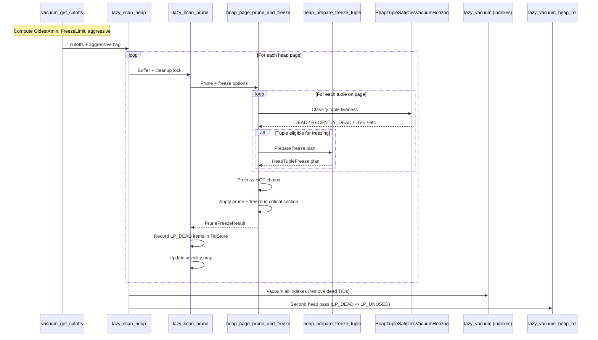

# VACUUM and Tuple Lifecycle Management

## Overview

VACUUM is the subsystem responsible for reclaiming storage occupied by dead tuples, freezing old transaction IDs to prevent wraparound, and maintaining auxiliary data structures (the visibility map and free space map). In the context of MVCC, VACUUM is the garbage collector: it removes tuple versions that are no longer visible to any active transaction, and it freezes XIDs so that the 32-bit transaction ID space can be safely recycled.

The lazy VACUUM implementation (the default, as opposed to the legacy VACUUM FULL) operates in-place without rewriting tables. It uses a multi-pass strategy coordinated through the `LVRelState` structure, with the core logic spanning three source files:

- `src/backend/access/heap/vacuumlazy.c` -- The VACUUM orchestration layer: heap scanning, index vacuuming, and the two-pass strategy.
- `src/backend/access/heap/pruneheap.c` -- Page-level pruning, HOT chain management, and integrated freeze processing.
- `src/backend/commands/vacuum.c` -- VACUUM entry points, cutoff computation, and catalog updates.

Additional MVCC-relevant logic resides in:
- `src/backend/access/heap/heapam.c` -- `heap_prepare_freeze_tuple()` for freeze plan construction.
- `src/backend/access/heap/heapam_visibility.c` -- `HeapTupleSatisfiesVacuumHorizon()` for tuple liveness classification.

## Key Concepts

### Dead Tuple Lifecycle

A tuple becomes "dead" when its deleting (or updating) transaction commits and no running transaction can still see the old version. The lifecycle is:

1. **LIVE**: Tuple is visible to at least one active snapshot.
2. **RECENTLY_DEAD**: The deleting transaction committed, but some running transaction might still need the old version (its xmax is newer than some backend's xmin).
3. **DEAD**: No running transaction can see this version. The tuple's storage can be reclaimed.

`HeapTupleSatisfiesVacuumHorizon()` classifies tuples into these states. The transition from RECENTLY_DEAD to DEAD is determined by comparing the tuple's xmax against the `GlobalVisState` horizon (which is derived from `OldestXmin`).

### The Two-Pass Strategy

When a table has indexes, VACUUM uses a two-pass approach:

**Pass 1 (Initial Heap Scan -- `lazy_scan_heap`):**
- Scans every heap page (skipping all-visible pages when safe).
- Prunes HOT chains and dead tuples via `heap_page_prune_and_freeze()`.
- Freezes tuples that need freezing.
- Records LP_DEAD item TIDs in a `TidStore` (the `dead_items` structure).
- Updates the visibility map and free space map.

**Index Vacuuming (between passes):**
- Calls each index's `ambulkdelete` routine with the collected dead TIDs.
- Removes index entries pointing to LP_DEAD heap items.

**Pass 2 (Final Heap Vacuum -- `lazy_vacuum_heap_rel`):**
- Revisits only pages that had LP_DEAD items.
- Marks those LP_DEAD line pointers as LP_UNUSED, reclaiming space.
- Updates the free space map with the newly available space.

The invariant enforced by the two-pass strategy is: **no index tuple may ever point to an LP_UNUSED line pointer**. Index entries must be removed before the heap line pointers they reference can be recycled.

When a table has no indexes, VACUUM uses a **one-pass strategy**: dead items are immediately marked LP_UNUSED during the initial scan (the `HEAP_PAGE_PRUNE_MARK_UNUSED_NOW` option), eliminating the need for a second pass.

### Freezing and XID Wraparound Prevention

PostgreSQL uses 32-bit transaction IDs with modular arithmetic, giving a usable range of approximately 2 billion transactions. To prevent wraparound (where old committed XIDs would appear to be "in the future" and thus invisible), VACUUM must periodically "freeze" tuples by replacing their xmin/xmax with special values that are always considered "in the past."

Freezing a tuple's xmin means setting the `HEAP_XMIN_FROZEN` infomask bit, which causes visibility checks to treat the tuple as committed by a transaction that is infinitely old. Freezing xmax means clearing it to `InvalidTransactionId` (with `HEAP_XMAX_INVALID`), indicating no deleter.

The cutoff XIDs that control freezing are computed by `vacuum_get_cutoffs()` at the start of each VACUUM operation.

### Aggressive vs. Non-Aggressive VACUUM

- **Non-aggressive VACUUM**: Skips pages marked all-visible in the visibility map. Freezes tuples opportunistically. Does not guarantee advancing `relfrozenxid`.
- **Aggressive VACUUM**: Triggered when the relation's `relfrozenxid` or `relminmxid` is old enough to risk wraparound (controlled by `vacuum_freeze_table_age`). Scans ALL pages, including all-visible ones. Must freeze all tuples older than `FreezeLimit` and advance `relfrozenxid` to at least `FreezeLimit`.

## Architecture

See `diagrams/vacuum_cleanup_flow.mermaid` for the complete VACUUM processing pipeline.

### VACUUM Cutoff Relationships

```
Transaction ID Timeline (increasing XIDs -->):

  relfrozenxid     FreezeLimit    OldestXmin    nextXID
       |                |              |            |
       v                v              v            v
  -----+----------------+--------------+------------+----->
       |                |              |
       |  Must freeze   |  May freeze  | Cannot freeze
       |  (aggressive)  | (opportun.)  | (still needed)
       |                |              |
       +-- freeze_min_age --+          |
                                       |
                    All tuples with xmax < OldestXmin
                    are DEAD (removable by VACUUM)
```

- **OldestXmin**: The oldest XID that any running backend might need. Tuples deleted by transactions older than this are DEAD.
- **FreezeLimit**: `nextXID - vacuum_freeze_min_age`. Tuples with xmin older than this CAN be frozen. In aggressive mode, they MUST be.
- **MultiXactCutoff**: The analogous cutoff for MultiXactIds.
- **relfrozenxid**: The relation's current frozen XID horizon, stored in `pg_class`. All tuples are guaranteed to have xmin >= relfrozenxid (or be frozen). VACUUM advances this after processing.

## Core APIs

### vacuum_get_cutoffs (Tier 1, importance: 0.80)

#### Purpose

Computes all the freeze cutoffs and the dead-tuple removal horizon (`OldestXmin`) that VACUUM will use throughout its operation. Also determines whether VACUUM should be aggressive.

#### Signature

```c
/* Source: src/backend/commands/vacuum.c:1070-1241 */
bool vacuum_get_cutoffs(Relation rel, const VacuumParams *params,
                        struct VacuumCutoffs *cutoffs);
```

#### Parameters

| Parameter | Type | Description | Constraints |
|-----------|------|-------------|-------------|
| rel | Relation | The target relation | Must be open |
| params | const VacuumParams* | VACUUM parameters (freeze ages, etc.) | From VACUUM command or autovacuum |
| cutoffs | struct VacuumCutoffs* | Output: computed cutoff values | Caller-allocated |

#### Return Value

Returns `true` if the VACUUM should be aggressive (must advance `relfrozenxid`/`relminmxid`), `false` for non-aggressive VACUUM.

#### Detailed Description

1. **Read relation state**: Copies `rel->rd_rel->relfrozenxid` and `rel->rd_rel->relminmxid` into the cutoffs structure.

2. **Compute OldestXmin**: Calls `GetOldestNonRemovableTransactionId(rel)` to find the oldest XID that any running backend (including replication slots) might still need. This is the dead-tuple removal horizon.

3. **Compute OldestMxact**: Calls `GetOldestMultiXactId()` for the MultiXact equivalent.

4. **Safety warnings**: If `OldestXmin` is held back to a dangerous degree (past `safeOldestXmin = nextXID - autovacuum_freeze_max_age`), emits a WARNING about potential wraparound.

5. **Compute FreezeLimit**:
   ```
   FreezeLimit = nextXID - freeze_min_age
   ```
   Clamped to `FirstNormalTransactionId` and to be no newer than `OldestXmin`. The `freeze_min_age` is capped at `autovacuum_freeze_max_age / 2` to ensure anti-wraparound vacuums are not too frequent.

6. **Compute MultiXactCutoff**: Analogous to FreezeLimit but for MultiXactIds, using `vacuum_multixact_freeze_min_age`.

7. **Determine aggressiveness**:
   ```
   aggressiveXIDCutoff = nextXID - freeze_table_age
   aggressive = (relfrozenxid <= aggressiveXIDCutoff)
   ```
   Also checks `relminmxid` against `aggressiveMXIDCutoff`. If either is too old, returns `true` (aggressive).

#### Performance Characteristics

This function is called once per VACUUM operation and is not performance-critical. However, the `GetOldestNonRemovableTransactionId()` call acquires `ProcArrayLock` in shared mode.

---

### lazy_scan_heap (Tier 1, importance: 0.88)

#### Purpose

The main workhorse of lazy VACUUM. Performs the initial pass over the heap, pruning dead tuples, freezing eligible tuples, recording LP_DEAD items for later index vacuuming, and maintaining the visibility map and free space map.

#### Signature

```c
/* Source: src/backend/access/heap/vacuumlazy.c:779-1067 */
static void lazy_scan_heap(LVRelState *vacrel);
```

#### Parameters

| Parameter | Type | Description | Constraints |
|-----------|------|-------------|-------------|
| vacrel | LVRelState* | VACUUM relation state | Fully initialized by caller |

#### Detailed Description

**Block iteration** (lines 822-1020):

The function iterates through heap blocks using `heap_vac_scan_next_block()`, which consults the visibility map to determine which blocks can be skipped (all-visible blocks are skipped in non-aggressive mode).

For each block:

1. **Wraparound failsafe check**: Every `FAILSAFE_EVERY_PAGES` pages, calls `lazy_check_wraparound_failsafe()`. If the failsafe triggers (relfrozenxid is dangerously old), disables index vacuuming and index cleanup to prioritize freezing.

2. **Dead items overflow**: If `TidStoreMemoryUsage(dead_items)` exceeds `max_bytes`, performs an intermediate round of index + heap vacuuming (`lazy_vacuum()`) to free space in the TidStore before continuing.

3. **Buffer acquisition**: Reads the page and attempts a cleanup lock (`ConditionalLockBufferForCleanup()`). If the cleanup lock cannot be obtained immediately:
   - Falls back to a shared lock.
   - Calls `lazy_scan_noprune()` for reduced processing (can still collect LP_DEAD items but cannot prune or defragment).
   - If aggressive mode requires freezing and `lazy_scan_noprune()` cannot handle it, upgrades to a blocking cleanup lock.

4. **Pruning and freezing**: With a cleanup lock, calls `lazy_scan_prune()` which delegates to `heap_page_prune_and_freeze()`. This is where the real MVCC work happens (see below).

5. **FSM update**: Records free space for pages that will not be revisited in the second pass.

**Post-scan processing** (lines 1022-1067):

- Estimates new `reltuples` value for `pg_class`.
- Performs final index + heap vacuuming for any remaining dead items.
- Vacuums the free space map.
- Runs index cleanup (`amvacuumcleanup` for each index).

#### Integration Points

- **Called by**: `heap_vacuum_rel()` (the top-level VACUUM entry point for heap relations)
- **Calls**: `lazy_scan_prune()`, `lazy_scan_noprune()`, `lazy_vacuum()`, `lazy_cleanup_all_indexes()`
- **Shared state**: `vacrel->dead_items` (TidStore), `vacrel->cutoffs`, visibility map, free space map

---

### heap_page_prune_and_freeze (Tier 1, importance: 0.83)

#### Purpose

The unified page-level operation that prunes dead tuples from HOT chains, removes dead line pointers, and freezes eligible tuples -- all in a single pass over the page. This is the central function where MVCC garbage collection and freeze processing converge.

#### Signature

```c
/* Source: src/backend/access/heap/pruneheap.c:297-910 */
void heap_page_prune_and_freeze(Relation relation, Buffer buffer,
                                GlobalVisState *vistest,
                                int options,
                                struct VacuumCutoffs *cutoffs,
                                PruneFreezeResult *presult,
                                PruneReason reason,
                                OffsetNumber *off_loc,
                                TransactionId *new_relfrozen_xid,
                                MultiXactId *new_relmin_mxid);
```

#### Parameters

| Parameter | Type | Description | Constraints |
|-----------|------|-------------|-------------|
| relation | Relation | The heap relation | Must be open |
| buffer | Buffer | The page buffer | Caller must hold pin + cleanup lock |
| vistest | GlobalVisState* | Visibility test state for dead/recently-dead classification | From vacrel |
| options | int | Bitmask: `HEAP_PAGE_PRUNE_FREEZE`, `HEAP_PAGE_PRUNE_MARK_UNUSED_NOW` | Controls freeze and immediate cleanup behavior |
| cutoffs | struct VacuumCutoffs* | Freeze cutoffs | Required when FREEZE option set |
| presult | PruneFreezeResult* | Output: pruning/freezing results | Caller-allocated |
| reason | PruneReason | Why pruning is being performed (VACUUM_SCAN, VACUUM_CLEANUP, etc.) | For WAL record |
| off_loc | OffsetNumber* | Offset for error callback | Updated during processing |
| new_relfrozen_xid | TransactionId* | In/out: oldest unfrozen XID for relation | Required when FREEZE option set |
| new_relmin_mxid | MultiXactId* | In/out: oldest MultiXact for relation | Required when FREEZE option set |

#### Detailed Description

The function operates in three phases:

**Phase 1: Classification** (reverse offset scan, lines 450-565):

Iterates through all line pointers on the page in REVERSE order (from maxoff down to FirstOffsetNumber). The reverse order is a performance optimization: since tuples are typically stored at decreasing offsets while items are at increasing offsets, reverse iteration reads tuples in increasing memory order, which is friendlier to CPU prefetchers.

For each line pointer:
- `LP_UNUSED`: Records as unchanged.
- `LP_DEAD`: If `mark_unused_now` is set, marks for conversion to LP_UNUSED; otherwise records as unchanged.
- `LP_REDIRECT`: Queued as a HOT chain root.
- `LP_NORMAL`: Calls `heap_prune_satisfies_vacuum()` (which uses `HeapTupleSatisfiesVacuumHorizon()`) to classify as LIVE, RECENTLY_DEAD, DEAD, INSERT_IN_PROGRESS, or DELETE_IN_PROGRESS. Queued as either a HOT chain root (if not heap-only) or a heap-only item.

Each tuple's HTSV (Heap Tuple Satisfies Vacuum) result is computed exactly once and cached in `prstate.htsv[]`. This is required for correctness: running HTSV twice could yield different results if the GlobalVis horizon advances between calls.

**Phase 2: HOT Chain Processing** (lines 575-640):

Processes HOT chains by walking from root items through the chain:
- Dead items at the end of a chain are marked LP_DEAD (or LP_UNUSED if no indexes).
- Dead items in the middle of a chain cause the chain to be redirected past them.
- The `heap_prune_chain()` function handles the chain-walking logic.

Also processes orphaned heap-only tuples (not reachable from any HOT chain root):
- DEAD heap-only tuples that are not HOT-updated are marked LP_UNUSED directly.
- DEAD heap-only tuples that ARE HOT-updated but not reachable from a chain indicate corruption (raises ERROR).

**Phase 3: Apply Changes** (critical section, lines 690-890):

Enters a critical section and:

1. Updates `pd_prune_xid` (the page hint for future pruning).
2. If pruning: calls `heap_page_prune_execute()` to physically redirect, kill, and free line pointers.
3. If freezing: calls `heap_freeze_prepared_tuples()` to apply freeze plans.
4. Marks the buffer dirty and writes a combined `XLOG_HEAP2_PRUNE_FREEZE` WAL record.

**Freeze decision logic** (lines 650-690):

The decision to actually freeze is nuanced:
- If `pagefrz.freeze_required` is set (some XID/MXID is older than FreezeLimit/MultiXactCutoff), freezing is mandatory.
- Otherwise, freezing is opportunistic: it only happens if the page would become all-frozen AND a full page image (FPI) will be emitted anyway (e.g., due to pruning or hint bit changes). This avoids unnecessary WAL writes.

#### Integration Points

- **Called by**: `lazy_scan_prune()` (VACUUM), `heap_page_prune_opt()` (opportunistic pruning during sequential scans)
- **Calls**: `heap_prune_satisfies_vacuum()`, `heap_prune_chain()`, `heap_page_prune_execute()`, `heap_freeze_prepared_tuples()`, `heap_prepare_freeze_tuple()`
- **Shared state**: Page buffer (exclusive lock held), visibility map

---

### heap_prepare_freeze_tuple (Tier 1, importance: 0.85)

#### Purpose

Analyzes a single tuple's xmin, xmax, and xvac fields to determine what freezing actions are needed, and constructs a "freeze plan" that can be executed later. This function embodies the detailed rules for when and how tuple XIDs can be frozen.

#### Signature

```c
/* Source: src/backend/access/heap/heapam.c:6965-7271 */
bool heap_prepare_freeze_tuple(HeapTupleHeader tuple,
                               const struct VacuumCutoffs *cutoffs,
                               HeapPageFreeze *pagefrz,
                               HeapTupleFreeze *frz, bool *totally_frozen);
```

#### Parameters

| Parameter | Type | Description | Constraints |
|-----------|------|-------------|-------------|
| tuple | HeapTupleHeader | The tuple to analyze | Must not be HEAPTUPLE_DEAD |
| cutoffs | const struct VacuumCutoffs* | Freeze cutoffs from vacuum_get_cutoffs | |
| pagefrz | HeapPageFreeze* | Page-level freeze tracking | Shared across all tuples on the page |
| frz | HeapTupleFreeze* | Output: freeze plan for this tuple | Caller-allocated |
| totally_frozen | bool* | Output: will the tuple be totally frozen? | |

#### Return Value

Returns `true` if the freeze plan contains actions (caller should execute it). Returns `false` if nothing needs to change.

#### Detailed Description

**xmin processing** (lines 7030-7048):

- If xmin is not a normal XID (e.g., `FrozenTransactionId`), it is already frozen.
- If xmin precedes `relfrozenxid`, raises ERROR (data corruption).
- If xmin precedes `OldestXmin`, sets `freeze_xmin = true` and adds `HEAP_FREEZE_CHECK_XMIN_COMMITTED` to the verification flags (to confirm xmin actually committed before freezing).

**xvac processing** (lines 7050-7065):

Legacy field from pre-9.0 VACUUM FULL. If present and normal, always forces freezing (`pagefrz->freeze_required = true`).

**xmax processing** (lines 7067-7190):

This is the most complex part, with three major cases:

1. **MultiXactId xmax**: Calls `FreezeMultiXactId()` which returns one of four outcomes:
   - `FRM_NOOP`: MultiXact is still needed; no change.
   - `FRM_RETURN_IS_XID`: MultiXact can be reduced to a single updater XID.
   - `FRM_RETURN_IS_MULTI`: MultiXact must be replaced with a new, smaller MultiXact.
   - `FRM_INVALIDATE_XMAX`: Entire xmax can be cleared (all members are done).

2. **Normal XID xmax**: If it precedes `OldestXmin`, sets `freeze_xmax = true`. If the xmax represents an actual update (not just a lock), adds `HEAP_FREEZE_CHECK_XMAX_ABORTED` to verify the deleter aborted before clearing xmax.

3. **Invalid xmax**: Already frozen; nothing to do.

**Freeze plan assembly** (lines 7200-7255):

- `freeze_xmin`: Sets `HEAP_XMIN_FROZEN` in `frz->t_infomask`.
- `freeze_xmax`: Clears xmax to `InvalidTransactionId` with `HEAP_XMAX_INVALID`.
- `replace_xmax`: Sets the new xmax value computed above.
- Sets `*totally_frozen` to true if both xmin and xmax are (or will be) frozen.

**Page-level tracking** (lines 7257-7268):

If no previous tuple on the page forced freezing, calls `heap_tuple_should_freeze()` to check if THIS tuple forces it. Updates `pagefrz->NoFreezePageRelfrozenXid` and `NoFreezePageRelminMxid` to track the oldest unfrozen values on the page (used when the page is NOT frozen, to know the minimum relfrozenxid that can be safely set).

---

### HeapTupleSatisfiesVacuumHorizon (Tier 1, importance: 0.84)

#### Purpose

Classifies a tuple's liveness for VACUUM purposes. Unlike `HeapTupleSatisfiesMVCC()` (which answers "is this tuple visible to a specific snapshot?"), this function answers "is this tuple needed by anyone, and if not, when did it become unneeded?"

#### Signature

```c
/* Source: src/backend/access/heap/heapam_visibility.c:1183-1413 */
HTSV_Result HeapTupleSatisfiesVacuumHorizon(HeapTuple htup, Buffer buffer,
                                             TransactionId *dead_after);
```

#### Parameters

| Parameter | Type | Description | Constraints |
|-----------|------|-------------|-------------|
| htup | HeapTuple | The tuple to classify | Must have valid t_self and t_tableOid |
| buffer | Buffer | The buffer containing the tuple | For hint bit setting |
| dead_after | TransactionId* | Output: XID after which the tuple is dead | Set only for RECENTLY_DEAD |

#### Return Value

One of the HTSV_Result enum values:

| Result | Meaning |
|--------|---------|
| `HEAPTUPLE_DEAD` | Definitely dead; can be removed immediately |
| `HEAPTUPLE_RECENTLY_DEAD` | Dead but might still be needed; caller checks `*dead_after` against horizon |
| `HEAPTUPLE_LIVE` | Definitely alive |
| `HEAPTUPLE_INSERT_IN_PROGRESS` | Inserting transaction still running |
| `HEAPTUPLE_DELETE_IN_PROGRESS` | Deleting transaction still running |

#### Detailed Description

The key innovation compared to the older `HeapTupleSatisfiesVacuum()` is the `dead_after` output parameter. Instead of making the dead/recently-dead decision internally (which requires a single fixed horizon), this function returns `HEAPTUPLE_RECENTLY_DEAD` along with the XID that needs to be compared against a horizon. The caller (`heap_prune_satisfies_vacuum`) then uses `GlobalVisTestIsRemovableXid()` to make the final determination, which allows different horizons for different relation types (shared vs. catalog vs. user data).

**xmin analysis** (lines 1210-1295):

1. If `HEAP_XMIN_COMMITTED` hint bit is set, xmin is known committed; skip to xmax analysis.
2. If `HEAP_XMIN_INVALID` hint bit is set, the inserter aborted: return `HEAPTUPLE_DEAD`.
3. If xmin is the current transaction: classify based on xmax state (INSERT_IN_PROGRESS or DELETE_IN_PROGRESS).
4. If xmin is in progress (`TransactionIdIsInProgress()`): return `HEAPTUPLE_INSERT_IN_PROGRESS`.
5. If xmin committed (`TransactionIdDidCommit()`): set the `HEAP_XMIN_COMMITTED` hint bit.
6. Otherwise (aborted or crashed): set `HEAP_XMIN_INVALID` hint bit; return `HEAPTUPLE_DEAD`.

**xmax analysis** (lines 1297-1413):

Once xmin is confirmed committed:

1. If `HEAP_XMAX_INVALID`: return `HEAPTUPLE_LIVE`.
2. If `HEAP_XMAX_IS_LOCKED_ONLY`: the tuple is only locked, not deleted. Attempt to set appropriate hint bits on completed lock transactions. Return `HEAPTUPLE_LIVE`.
3. If xmax is a MultiXactId with an update component:
   - If the updater is in progress: `HEAPTUPLE_DELETE_IN_PROGRESS`.
   - If the updater committed: set `*dead_after = xmax`; return `HEAPTUPLE_RECENTLY_DEAD`.
   - If the updater aborted and the multi is no longer running: set `HEAP_XMAX_INVALID`; return `HEAPTUPLE_LIVE`.
4. If xmax is a normal XID:
   - If in progress: `HEAPTUPLE_DELETE_IN_PROGRESS`.
   - If committed: set `HEAP_XMAX_COMMITTED` hint; set `*dead_after = xmax`; return `HEAPTUPLE_RECENTLY_DEAD`.
   - If aborted: set `HEAP_XMAX_INVALID` hint; return `HEAPTUPLE_LIVE`.

#### Performance Characteristics

This function is called once per tuple during VACUUM's initial scan. It performs CLOG lookups (via `TransactionIdDidCommit()` and `TransactionIdIsInProgress()`) only when hint bits are not set. On subsequent VACUUMs, most tuples will already have hint bits, making this function very fast.

---

### lazy_vacuum_heap_rel (Tier 2, importance: 0.72)

#### Purpose

The second pass over the heap in the two-pass VACUUM strategy. Marks LP_DEAD items as LP_UNUSED, reclaiming line pointer space.

#### Signature

```c
/* Source: src/backend/access/heap/vacuumlazy.c:2089-2184 */
static void lazy_vacuum_heap_rel(LVRelState *vacrel);
```

#### Detailed Description

Iterates over the `dead_items` TidStore using `TidStoreBeginIterate()` / `TidStoreIterateNext()`. For each page that has dead items:

1. Pins the visibility map page.
2. Reads the heap page with an exclusive lock (not a cleanup lock -- sufficient for LP_DEAD -> LP_UNUSED transitions).
3. Calls `lazy_vacuum_heap_page()` which sets each recorded LP_DEAD offset to LP_UNUSED and potentially marks the page all-visible.
4. Records the page's free space in the FSM.

This pass only visits pages that had LP_DEAD items recorded during the first pass. Pages that had no dead items, or that were fully cleaned during pruning, are never revisited.

---

### lazy_scan_prune (Tier 2, importance: 0.70)

#### Purpose

Bridge function between `lazy_scan_heap()` and `heap_page_prune_and_freeze()`. Handles VACUUM-specific bookkeeping around the page-level prune-and-freeze operation.

#### Signature

```c
/* Source: src/backend/access/heap/vacuumlazy.c:1394-1631 */
static int lazy_scan_prune(LVRelState *vacrel, Buffer buf,
                           BlockNumber blkno, Page page,
                           Buffer vmbuffer,
                           bool all_visible_according_to_vm,
                           bool *has_lpdead_items);
```

#### Detailed Description

1. **Calls heap_page_prune_and_freeze**: Passes the VACUUM's cutoffs, freeze tracking variables (`NewRelfrozenXid`, `NewRelminMxid`), and the `HEAP_PAGE_PRUNE_FREEZE` option (plus `HEAP_PAGE_PRUNE_MARK_UNUSED_NOW` if the table has no indexes).

2. **Records dead items**: Sorts `presult.deadoffsets` and adds them to the `dead_items` TidStore via `dead_items_add()`.

3. **Accumulates statistics**: Adds page-level counts (tuples deleted, frozen, LP_DEAD, live, recently dead) to the whole-VACUUM counters.

4. **Visibility map maintenance**: Based on the pruning results:
   - If the page became all-visible (and was not already), sets the VM bit (and the all-frozen bit if applicable).
   - If the VM bit was incorrectly set, clears it with a WARNING.
   - If the page is all-visible and all-frozen but only the all-visible VM bit was set, upgrades to all-frozen.

## Data Structures

### LVRelState

The central state structure for the entire lazy VACUUM operation, defined at `src/backend/access/heap/vacuumlazy.c:136-219`. Key MVCC-relevant fields:

```c
typedef struct LVRelState
{
    Relation    rel;                /* Target heap relation */
    Relation   *indrels;            /* Index relations */
    int         nindexes;           /* Number of indexes */

    bool        aggressive;         /* Must advance relfrozenxid? */
    bool        do_index_vacuuming; /* Performing index vacuuming? */
    bool        do_rel_truncate;    /* Truncating relation? */

    struct VacuumCutoffs cutoffs;   /* Freeze/prune cutoffs */
    GlobalVisState *vistest;        /* Dead-tuple visibility test */
    TransactionId NewRelfrozenXid;  /* Tracking oldest unfrozen XID */
    MultiXactId NewRelminMxid;      /* Tracking oldest unfrozen MXID */

    TidStore   *dead_items;         /* Dead item TIDs for index cleanup */
    VacDeadItemsInfo *dead_items_info; /* Dead items metadata */

    /* Counters */
    int64       tuples_deleted;
    int64       tuples_frozen;
    int64       lpdead_items;
    int64       live_tuples;
    int64       recently_dead_tuples;
    int64       missed_dead_tuples;
} LVRelState;
```

### VacuumCutoffs

The freeze cutoff structure, defined at `src/include/commands/vacuum.h`:

```c
struct VacuumCutoffs
{
    TransactionId relfrozenxid;    /* Current pg_class.relfrozenxid */
    MultiXactId relminmxid;        /* Current pg_class.relminmxid */
    TransactionId OldestXmin;      /* Dead-tuple removal horizon */
    MultiXactId OldestMxact;       /* MultiXact removal horizon */
    TransactionId FreezeLimit;     /* XIDs below this must be frozen (aggressive) */
    MultiXactId MultiXactCutoff;   /* MXIDs below this must be frozen (aggressive) */
};
```

### HeapTupleFreeze

The per-tuple freeze plan, defined at `src/include/access/heapam.h`:

```c
typedef struct HeapTupleFreeze
{
    TransactionId xmax;            /* New xmax value */
    uint16      t_infomask2;       /* New infomask2 */
    uint16      t_infomask;        /* New infomask */
    uint8       frzflags;          /* Freeze action flags */
    uint8       checkflags;        /* Verification flags */
    OffsetNumber offset;           /* Tuple's offset on the page */
} HeapTupleFreeze;
```

### HeapPageFreeze

Page-level freeze tracking, maintained across all tuples on a page:

```c
typedef struct HeapPageFreeze
{
    bool        freeze_required;          /* Must freeze this page? */
    TransactionId FreezePageRelfrozenXid; /* Oldest XID if page is frozen */
    TransactionId NoFreezePageRelfrozenXid; /* Oldest XID if page is NOT frozen */
    MultiXactId FreezePageRelminMxid;     /* Oldest MXID if page is frozen */
    MultiXactId NoFreezePageRelminMxid;   /* Oldest MXID if page is NOT frozen */
} HeapPageFreeze;
```

The dual tracking (Freeze vs. NoFreeze variants) allows the caller to make the freeze decision after all tuples on the page have been analyzed: if freezing happens, the Freeze variants are used as the page's contribution to the new relfrozenxid; if not, the NoFreeze variants are used.

## Processing Flow



## Visibility Map Integration

The visibility map (VM) is a bitmap with two bits per heap page:

- **ALL_VISIBLE**: All tuples on the page are visible to all current and future transactions.
- **ALL_FROZEN**: All tuples on the page are frozen (no unfrozen XIDs remain).

VACUUM is the primary maintainer of these bits:

1. During `lazy_scan_prune()`, after pruning and freezing, if the page has no LP_DEAD items and all remaining tuples are visible to everyone, the ALL_VISIBLE bit is set. If all tuples are also frozen, the ALL_FROZEN bit is set.

2. During the block iteration in `lazy_scan_heap()`, `heap_vac_scan_next_block()` uses the VM to skip pages:
   - **Non-aggressive**: Skips ALL_VISIBLE pages entirely.
   - **Aggressive**: Skips only ALL_FROZEN pages (must visit ALL_VISIBLE pages to check for freezing needs).

3. The ALL_FROZEN optimization is important: once a page is all-frozen, VACUUM never needs to visit it again (until new tuples are inserted or updates occur), because there are no XIDs that could ever cause wraparound issues.

## Wraparound Failsafe

When `relfrozenxid` becomes dangerously old (within `vacuum_failsafe_age` of wraparound), the VACUUM failsafe mechanism activates:

1. `lazy_check_wraparound_failsafe()` calls `vacuum_xid_failsafe_check()`.
2. If triggered, disables index vacuuming (`do_index_vacuuming = false`) and index cleanup (`do_index_cleanup = false`).
3. This allows VACUUM to focus exclusively on freezing, skipping the expensive index vacuum passes.
4. The failsafe logs a WARNING message to alert the DBA.

The failsafe ensures that even under pathological conditions (massive tables, many indexes, limited memory), VACUUM can always make forward progress on freezing.

## CLOG Truncation

After VACUUM completes and advances `relfrozenxid` for all databases, the CLOG can be truncated. The flow is:

1. `vac_update_relstats()` updates `pg_class.relfrozenxid` and `pg_class.relminmxid`.
2. `vac_update_datfrozenxid()` computes the database-wide minimum `datfrozenxid`.
3. `vac_truncate_clog()` (called from `vacuum_database()`) truncates CLOG, pg_subtrans, pg_multixact, and pg_commit_ts segments older than the oldest `datfrozenxid` across all databases.

This closes the loop: VACUUM freezes tuples (eliminating references to old XIDs), allowing the CLOG pages for those XIDs to be physically removed from disk.

## Implementation Notes

1. **TidStore for dead items**: PostgreSQL 17 replaced the fixed-size `dead_items` array with a TidStore, a radix-tree-based structure that is more memory-efficient for sparse TID distributions. The maximum memory is controlled by `maintenance_work_mem`.

2. **Combined prune-freeze WAL record**: PostgreSQL 17 merged the previously separate prune and freeze WAL records into a single `XLOG_HEAP2_PRUNE_FREEZE` record. This reduces WAL volume when pruning and freezing happen on the same page (which is the common case during VACUUM).

3. **Opportunistic freezing**: VACUUM freezes tuples even when not strictly required if doing so would make the page all-frozen AND a full page image is being emitted anyway. This "free" freezing reduces future VACUUM work without increasing WAL volume.

4. **Reverse offset scanning**: `heap_page_prune_and_freeze()` scans offsets in reverse order (maxoff to FirstOffsetNumber) for cache prefetch efficiency, since tuples are typically stored in reverse offset order on the page.

5. **HTSV result caching**: Each tuple's `HeapTupleSatisfiesVacuumHorizon()` result is computed exactly once and stored in `prstate.htsv[]`. This is a correctness requirement, not just an optimization: the GlobalVis horizon can advance during processing, which could cause a second HTSV call to return a different result.

6. **Aggressive VACUUM and VM**: An aggressive VACUUM skips only ALL_FROZEN pages (not ALL_VISIBLE). It must visit ALL_VISIBLE-but-not-ALL_FROZEN pages to check whether any tuples need freezing. Only ALL_FROZEN pages are guaranteed to have no unfrozen XIDs.

7. **Index vacuum bypass**: When there are very few LP_DEAD items (controlled by `vacuum_index_cleanup`), VACUUM can bypass index vacuuming entirely. This trades some index bloat for significantly faster VACUUM completion.

## Source File References

| File | Key Symbols | Lines |
|------|-------------|-------|
| `src/backend/commands/vacuum.c` | `vacuum_get_cutoffs`, `vac_update_relstats`, `vac_truncate_clog` | 1070-1241 |
| `src/backend/access/heap/vacuumlazy.c` | `lazy_scan_heap`, `lazy_scan_prune`, `lazy_vacuum_heap_rel`, `LVRelState` | 779-1067, 1394-1631, 2089-2184, 136-219 |
| `src/backend/access/heap/pruneheap.c` | `heap_page_prune_and_freeze`, `heap_prune_chain` | 297-910 |
| `src/backend/access/heap/heapam.c` | `heap_prepare_freeze_tuple`, `FreezeMultiXactId` | 6965-7271 |
| `src/backend/access/heap/heapam_visibility.c` | `HeapTupleSatisfiesVacuumHorizon` | 1183-1413 |
