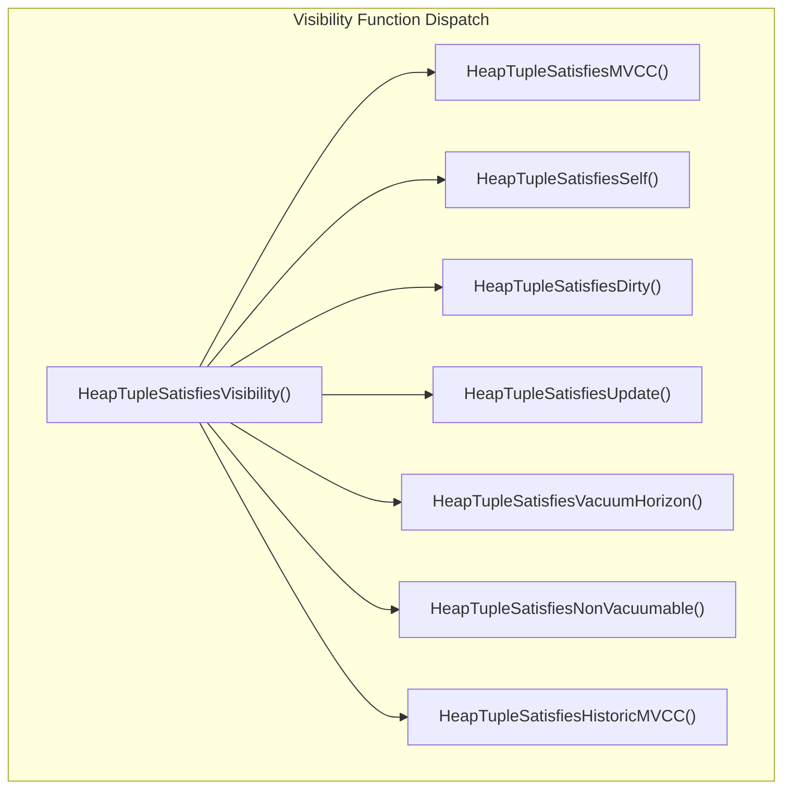

# Visibility Determination

## Overview

Visibility determination is the heart of PostgreSQL's MVCC system. It answers the fundamental question: "Is this tuple visible to the current transaction's snapshot?" The entire visibility subsystem resides in a single critical file: `src/backend/access/heap/heapam_visibility.c`.

The visibility logic examines each tuple's `t_xmin` (inserting transaction), `t_xmax` (deleting/updating transaction), and command IDs against the current snapshot's boundaries (`xmin`, `xmax`, `xip[]`, `curcid`) to determine whether the tuple should be visible. Along the way, it opportunistically caches transaction commit/abort status as "hint bits" in the tuple header to accelerate future visibility checks.

## Key Concepts

### The Visibility Principle

A tuple is visible to a snapshot if and only if:
1. The inserting transaction (`t_xmin`) has committed AND committed before the snapshot was taken.
2. The deleting transaction (`t_xmax`) either does not exist, has not committed, or committed after the snapshot was taken.

### Hint Bits

Hint bits are optimization flags stored in the tuple's `t_infomask` field that cache the commit/abort status of the inserting and deleting transactions. Without hint bits, every visibility check would require a CLOG lookup (shared memory access). With hint bits, the status is encoded directly in the tuple header.

| Hint Bit | Value | Meaning |
|----------|-------|---------|
| `HEAP_XMIN_COMMITTED` | 0x0100 | Inserting transaction committed |
| `HEAP_XMIN_INVALID` | 0x0200 | Inserting transaction aborted |
| `HEAP_XMIN_FROZEN` | 0x0300 | Both bits set: tuple is frozen (always visible) |
| `HEAP_XMAX_COMMITTED` | 0x0400 | Deleting transaction committed |
| `HEAP_XMAX_INVALID` | 0x0800 | Deleting transaction invalid/aborted (tuple not deleted) |

### Race Condition Prevention

A critical invariant documented at the top of `heapam_visibility.c` (lines 1-42):

> When using a non-MVCC snapshot, we must check `TransactionIdIsInProgress` (which looks in the PGPROC array) **before** `TransactionIdDidCommit` (which looks in pg_xact). Otherwise we have a race condition: we might decide that a just-committed transaction crashed, because none of the tests succeed.

This race exists because `xact.c` records commit in CLOG **before** clearing the XID from ProcArray. There is a window where both `TransactionIdIsInProgress()` and `TransactionIdDidCommit()` return true. For MVCC snapshots, this race is avoided by using `XidInMVCCSnapshot()` instead of `TransactionIdIsInProgress()`, since the snapshot is a frozen point-in-time view.

## Architecture



See also: `diagrams/mvcc_visibility_flowchart.mermaid` for the complete HeapTupleSatisfiesMVCC decision tree.

## Core APIs

### HeapTupleSatisfiesVisibility

#### Purpose

Central dispatcher that routes visibility checks to the appropriate function based on the `SnapshotType` field of the snapshot.

#### Signature

```c
/* Source: src/backend/access/heap/heapam_visibility.c:1756-1808 */
bool
HeapTupleSatisfiesVisibility(HeapTuple htup, Snapshot snapshot, Buffer buffer);
```

#### Parameters

| Parameter | Type | Description | Constraints |
|-----------|------|-------------|-------------|
| htup | HeapTuple | The tuple to check visibility for | Must have valid t_self and t_tableOid |
| snapshot | Snapshot | The snapshot to check against | Type determines which function is called |
| buffer | Buffer | The buffer containing the tuple | Caller must hold at least shared content lock |

#### Dispatch Table

| SnapshotType | Function Called | Use Case |
|-------------|----------------|----------|
| `SNAPSHOT_MVCC` | `HeapTupleSatisfiesMVCC()` | Normal query execution |
| `SNAPSHOT_SELF` | `HeapTupleSatisfiesSelf()` | See own uncommitted changes |
| `SNAPSHOT_ANY` | Returns true always | System catalog scans |
| `SNAPSHOT_TOAST` | `HeapTupleSatisfiesVacuum()` | TOAST tuple access |
| `SNAPSHOT_DIRTY` | `HeapTupleSatisfiesDirty()` | EvalPlanQual rechecks |
| `SNAPSHOT_HISTORIC_MVCC` | `HeapTupleSatisfiesHistoricMVCC()` | Logical decoding |
| `SNAPSHOT_NON_VACUUMABLE` | `HeapTupleSatisfiesNonVacuumable()` | Pruning eligibility |

---

### HeapTupleSatisfiesMVCC (Tier 1, importance: 0.98)

#### Purpose

The primary visibility check for normal MVCC queries. Determines whether a heap tuple is valid for a given MVCC snapshot by examining xmin/xmax against the snapshot boundaries, hint bits, and command IDs.

#### Signature

```c
/* Source: src/backend/access/heap/heapam_visibility.c:937-1145 */
static bool
HeapTupleSatisfiesMVCC(HeapTuple htup, Snapshot snapshot, Buffer buffer);
```

#### Detailed Description -- Step-by-Step Walkthrough

The function follows a two-phase approach: first determine if the inserting transaction is visible, then check if the deleting transaction has made the tuple invisible.

**Phase 1: Check xmin (inserting transaction)**

**Case A: xmin hint bit COMMITTED is NOT set** (line 968)

- **A1: xmin INVALID** (line 970): The inserting transaction aborted. Return **false** (invisible).

- **A2: HEAP_MOVED_OFF/MOVED_IN** (lines 973-1003): Legacy pre-9.0 VACUUM FULL handling. Checks the xvac field for the moving transaction's status.

- **A3: xmin is current transaction** (lines 1004-1046): The tuple was inserted by our own transaction.
  - Check `cmin >= snapshot->curcid`: if true, the tuple was inserted AFTER our scan started, so return **false**.
  - Otherwise, check xmax:
    - If `HEAP_XMAX_INVALID`: no deleter, return **true**.
    - If `HEAP_XMAX_LOCK_ONLY`: only locked, not deleted, return **true**.
    - If `HEAP_XMAX_IS_MULTI`: resolve MultiXactId to the actual update XID, then check if it is our transaction and compare cmax with curcid.
    - If xmax is our transaction: check `cmax >= curcid` (deleted after vs before scan).
    - If xmax is a different transaction (aborted subtransaction of ours): set `HEAP_XMAX_INVALID` hint and return **true**.

- **A4: xmin is in snapshot** (line 1048): Call `XidInMVCCSnapshot(xmin, snapshot)`. If true, the inserting transaction is still in-progress according to our snapshot. Return **false**.
  - **Critical design note** (from the function comment, lines 937-958): We intentionally do NOT call `TransactionIdIsInProgress()` here. Even if the transaction has actually committed by now, we treat it as in-progress per our snapshot. This avoids contention on ProcArrayLock and produces correct results because our snapshot is a frozen view.

- **A5: xmin committed** (line 1050): Call `TransactionIdDidCommit(xmin)`. If true, set `HEAP_XMIN_COMMITTED` hint bit and proceed. If false, the transaction aborted or crashed -- set `HEAP_XMIN_INVALID` hint bit and return **false**.

**Case B: xmin hint bit COMMITTED IS set** (line 1056)

- If NOT frozen (`HEAP_XMIN_FROZEN`), check `XidInMVCCSnapshot(xmin)`. If the committed xmin is still in our snapshot's in-progress list, return **false** (the commit happened after our snapshot was taken, so we should not see it).
- If frozen, skip the snapshot check entirely (frozen tuples are always visible).

**Phase 2: Check xmax (deleting transaction)** -- reached only if xmin passes

- **B1: HEAP_XMAX_INVALID** (line 1063): No valid deleter. Return **true**.

- **B2: HEAP_XMAX_LOCK_ONLY** (line 1066): The xmax represents a row lock, not a delete. Return **true**.

- **B3: HEAP_XMAX_IS_MULTI** (lines 1068-1091): Resolve the MultiXactId to extract the actual update XID. Then:
  - If the update XID is our transaction: compare cmax with curcid.
  - If `XidInMVCCSnapshot(xmax)`: deleter is still in-progress per snapshot, return **true**.
  - If `TransactionIdDidCommit(xmax)`: deleter committed, return **false**.
  - Otherwise: deleter aborted, return **true**.

- **B4: xmax NOT committed** (lines 1093-1121):
  - If xmax is our transaction: compare cmax with curcid.
  - If `XidInMVCCSnapshot(xmax)`: deleter in-progress, return **true**.
  - If `!TransactionIdDidCommit(xmax)`: aborted/crashed, set `HEAP_XMAX_INVALID` hint, return **true**.
  - Otherwise: set `HEAP_XMAX_COMMITTED` hint, fall through.

- **B5: xmax COMMITTED** (lines 1122-1131):
  - If `XidInMVCCSnapshot(xmax)`: committed but still in our snapshot's in-progress list (committed after snapshot), return **true**.
  - Otherwise: committed before our snapshot, return **false**.

#### Performance Characteristics

- **Best case**: Hint bits are set for both xmin and xmax. The function makes no CLOG lookups, no ProcArray scans, and completes in a few comparisons.
- **Worst case**: No hint bits set, xmin and xmax both require `XidInMVCCSnapshot()` calls (array scans) and `TransactionIdDidCommit()` calls (CLOG lookups).
- **Amortization**: The first visitor to check a tuple after the inserting/deleting transaction completes will set hint bits, benefiting all subsequent visitors.

#### Caller/Callee Relationships

- **Called by**: `HeapTupleSatisfiesVisibility()` for `SNAPSHOT_MVCC` type
- **Calls**: `XidInMVCCSnapshot()`, `TransactionIdDidCommit()`, `SetHintBits()`, `TransactionIdIsCurrentTransactionId()`, `HeapTupleHeaderGetCmin/Cmax()`

---

### SetHintBits (Tier 1, importance: 0.87)

#### Purpose

Caches transaction commit/abort status as hint bits in the tuple's `t_infomask` field. This is a critical performance optimization that avoids repeated CLOG lookups.

#### Signature

```c
/* Source: src/backend/access/heap/heapam_visibility.c:82-132 */
static inline void
SetHintBits(HeapTupleHeader tuple, Buffer buffer,
            uint16 infomask, TransactionId xid);
```

#### Parameters

| Parameter | Type | Description | Constraints |
|-----------|------|-------------|-------------|
| tuple | HeapTupleHeader | The tuple header to modify | Caller must hold at least shared buffer lock |
| buffer | Buffer | The buffer containing the tuple | Used for LSN and dirty-marking |
| infomask | uint16 | The hint bit(s) to set | HEAP_XMIN_COMMITTED, HEAP_XMIN_INVALID, HEAP_XMAX_COMMITTED, or HEAP_XMAX_INVALID |
| xid | TransactionId | XID to verify WAL flush safety | InvalidTransactionId if no check needed |

#### Detailed Description

Setting commit hint bits requires special care because the hint bit modification is NOT WAL-logged. If a crash occurs after the hint bit is written to disk but before the transaction's commit WAL record reaches disk, the tuple would incorrectly appear committed after recovery.

The safety check works as follows:

1. **Abort hints**: Always safe to set. If a crash occurs, the presumption is that the transaction aborted anyway. The `xid` parameter is passed as `InvalidTransactionId` for abort hints.

2. **Commit hints**: The function calls `TransactionIdGetCommitLSN(xid)` to get the LSN of the transaction's commit record. Then:
   - If the buffer is temporary/unlogged (`!BufferIsPermanent(buffer)`): safe (crash destroys the data anyway).
   - If the commit LSN has already been flushed to disk (`!XLogNeedsFlush(commitLSN)`): safe.
   - If the buffer's LSN is >= the commit LSN (`BufferGetLSNAtomic(buffer) >= commitLSN`): safe (the buffer cannot reach disk before the commit record).
   - Otherwise: **do not set the hint bit**. A future visitor will set it once the WAL has been flushed.

3. **Marking dirty**: Calls `MarkBufferDirtyHint(buffer, true)` which marks the buffer dirty without generating a WAL record. This is safe because hint bits are reconstructable from the CLOG.

---

### HeapTupleSatisfiesUpdate (Tier 1, importance: 0.88)

#### Purpose

Determines whether a tuple can be updated or deleted by the current transaction. Returns a detailed status code that enables proper concurrency conflict handling, including wait-for-lock semantics.

#### Signature

```c
/* Source: src/backend/access/heap/heapam_visibility.c:382-714 */
static TM_Result
HeapTupleSatisfiesUpdate(HeapTuple htup, CommandId curcid, Buffer buffer);
```

#### Return Values

| Value | Meaning |
|-------|---------|
| `TM_Invisible` | Tuple is not visible (inserter not committed or aborted) |
| `TM_SelfModified` | Tuple was inserted/updated by the current command (curcid check) |
| `TM_Ok` | Tuple can be updated/deleted |
| `TM_Updated` | Tuple was updated by a committed concurrent transaction |
| `TM_Deleted` | Tuple was deleted by a committed concurrent transaction |
| `TM_BeingModified` | Tuple is being modified by an in-progress transaction (caller should wait) |

#### Detailed Description

This function is more complex than `HeapTupleSatisfiesMVCC` because it must handle additional cases:

1. **Speculative insertions**: Checks for `HeapTupleHeaderIsSpeculative()` and returns `TM_Updated` if found (forces the caller to wait for the speculative insertion to resolve).

2. **In-progress inserter**: Unlike MVCC which would simply return invisible, this function distinguishes between:
   - The inserter is the current transaction (checks curcid for self-modification).
   - The inserter is another in-progress transaction (returns `TM_Invisible`).

3. **Concurrent delete/update detection**: When xmax is set by another committed transaction:
   - If `HEAP_KEYS_UPDATED`: returns `TM_Updated` (key columns changed, or DELETE).
   - Otherwise: returns `TM_Deleted` (non-key UPDATE).

4. **Wait semantics**: When xmax is set by an in-progress transaction, returns `TM_BeingModified`. The caller (`heap_update`, `heap_delete`) will then wait for that transaction to complete and retry.

---

### HeapTupleSatisfiesVacuumHorizon (Tier 1, importance: 0.84)

#### Purpose

Core vacuum visibility determination. Returns an `HTSV_Result` indicating whether a tuple is live, dead, recently dead, or has an in-progress inserter/deleter.

#### Signature

```c
/* Source: src/backend/access/heap/heapam_visibility.c:1236-1578 */
static HTSV_Result
HeapTupleSatisfiesVacuumHorizon(HeapTuple htup, Buffer buffer,
                                TransactionId *dead_after);
```

#### Parameters

| Parameter | Type | Description | Constraints |
|-----------|------|-------------|-------------|
| htup | HeapTuple | The tuple to check | Must be valid |
| buffer | Buffer | The containing buffer | At least share lock held |
| dead_after | TransactionId* | Output: the XID after which the tuple became dead | Set for HEAPTUPLE_RECENTLY_DEAD results |

#### Return Values (HTSV_Result)

| Value | Meaning |
|-------|---------|
| `HEAPTUPLE_LIVE` | Tuple is live and visible to some transactions |
| `HEAPTUPLE_RECENTLY_DEAD` | Tuple is dead but may still be needed by some snapshot |
| `HEAPTUPLE_DELETE_IN_PROGRESS` | Deleting transaction is still running |
| `HEAPTUPLE_INSERT_IN_PROGRESS` | Inserting transaction is still running |
| `HEAPTUPLE_DEAD` | Tuple is definitely dead to all transactions |

The `dead_after` output parameter is critical for VACUUM: it tells VACUUM the XID boundary after which the tuple became invisible, allowing it to compare against `OldestXmin` to determine if the tuple can be safely removed.

---

### XidInMVCCSnapshot (Tier 1, importance: 0.91)

#### Purpose

Tests whether a given XID is considered "in-progress" according to an MVCC snapshot. This is the snapshot-based alternative to `TransactionIdIsInProgress()` that avoids ProcArray contention.

#### Signature

```c
/* Source: src/backend/utils/time/snapmgr.c:1845-1950 */
bool XidInMVCCSnapshot(TransactionId xid, Snapshot snapshot);
```

#### Detailed Description

1. **Fast path -- below xmin**: If `xid < snapshot->xmin`, the transaction completed before the snapshot was taken. Return **false** (not in progress).

2. **Fast path -- at or above xmax**: If `xid >= snapshot->xmax`, the transaction had not yet been assigned when the snapshot was taken. Return **true** (in progress).

3. **Normal path (xmin <= xid < xmax)**:

   **Non-recovery snapshots**:
   - If `!suboverflowed`: search `snapshot->subxip[]` for subtransaction XIDs, then search `snapshot->xip[]` for top-level XIDs. Uses `pg_lfind32()` for efficient linear search.
   - If `suboverflowed`: call `SubTransGetTopmostTransaction(xid)` to resolve the XID to its top-level parent, then search only `snapshot->xip[]`.

   **Recovery snapshots** (hot standby):
   - All XIDs are stored in `subxip[]` (because recovery cannot distinguish top-level from subtransaction XIDs).
   - If overflowed, resolve via `SubTransGetTopmostTransaction()` first.
   - Search `subxip[]`.

4. **Not found**: Return **false** (not in the in-progress list, so the transaction completed before the snapshot).

#### Performance Characteristics

- The fast paths (xid < xmin or xid >= xmax) eliminate most checks without array scanning.
- Array scans use `pg_lfind32()` which may use SIMD instructions on supported platforms.
- The subtransaction overflow fallback (`SubTransGetTopmostTransaction()`) involves SLRU I/O and is significantly slower.

---

### TransactionIdDidCommit (Tier 1, importance: 0.90)

#### Purpose

Queries the CLOG to determine if a transaction committed. Handles the `SUB_COMMITTED` intermediate status by recursively checking the parent transaction.

#### Signature

```c
/* Source: src/backend/access/transam/transam.c:125-172 */
bool TransactionIdDidCommit(TransactionId transactionId);
```

#### Detailed Description

1. **CLOG lookup**: Calls `TransactionLogFetch()` which first checks a single-item cache, then reads the CLOG via `TransactionIdGetStatus()`.

2. **COMMITTED**: Returns `true` immediately.

3. **SUB_COMMITTED**: The transaction is a subtransaction that was marked committed but whose parent has not yet been finalized. The function:
   - Checks if the XID is older than `TransactionXmin` (if so, the parent crashed without cleanup -- return false).
   - Calls `SubTransGetParent()` to find the parent XID.
   - Recursively calls `TransactionIdDidCommit()` on the parent.

4. **IN_PROGRESS or ABORTED**: Returns `false`.

#### Important Note

This function should NOT be called before checking `TransactionIdIsInProgress()` (for non-MVCC paths) or `XidInMVCCSnapshot()` (for MVCC paths). See the race condition discussion in the Overview section.

## Other Visibility Functions

### HeapTupleSatisfiesSelf

Returns true if the tuple was inserted by a committed transaction or the current transaction (including the current command), and not deleted by a committed transaction. Used for seeing all of the current transaction's own changes.

### HeapTupleSatisfiesDirty

Similar to Self, but also makes in-progress transactions' changes visible. Used for `EvalPlanQual` (EPQ) rechecks in READ COMMITTED mode. Outputs the in-progress xmin/xmax and speculative token via the snapshot struct.

### HeapTupleSatisfiesNonVacuumable

Uses `GlobalVisState` to determine if a tuple is vacuumable. This is used for opportunistic pruning during normal operations (not full VACUUM).

### HeapTupleSatisfiesHistoricMVCC

Used by logical decoding. The snapshot semantics are inverted: the `xip[]` array contains COMMITTED transactions (not in-progress ones), and the function checks whether the tuple's xmin is in the set of known-committed transactions.

## Hint Bit State Machine

```
Initial state: No hint bits set (t_infomask & HEAP_XACT_MASK has no xmin/xmax status bits)

                    +------------------+
                    | No xmin hints    |
                    | (check CLOG)     |
                    +--------+---------+
                             |
              +--------------+--------------+
              |                             |
    +---------v---------+      +------------v----------+
    | HEAP_XMIN_COMMITTED|     | HEAP_XMIN_INVALID     |
    | (xmin committed)   |     | (xmin aborted)        |
    +---------+----------+     | Tuple invisible to all|
              |                +-----------------------+
              |
    +---------v---------+
    | HEAP_XMIN_FROZEN   |
    | (both COMMITTED +  |
    |  INVALID bits set) |
    | Always visible     |
    +--------------------+
```

The xmax hint bits follow a similar pattern but with `HEAP_XMAX_COMMITTED` and `HEAP_XMAX_INVALID`.

## Implementation Notes

1. **Hint bits are not WAL-logged**: They are reconstructable from the CLOG, so losing them in a crash is harmless. The buffer is marked dirty via `MarkBufferDirtyHint()` which may or may not cause an actual write, depending on the `wal_log_hints` setting and full-page-write configuration.

2. **Concurrent hint bit setting**: Multiple backends may try to set the same hint bit simultaneously. This is safe because: (a) they will all set the same value, (b) the OR operation on `t_infomask` is idempotent, and (c) they only hold a shared buffer content lock.

3. **The MVCC snapshot avoids the "commit-then-ProcArray" race**: By using `XidInMVCCSnapshot()` which checks the snapshot's frozen xip[] array rather than the live ProcArray, MVCC visibility is immune to the window where a transaction has updated CLOG but not yet cleared ProcArray.

4. **HeapTupleSatisfiesMVCC intentionally does NOT update hint bits for in-progress transactions** (per the function's header comment, lines 937-958). Even if the inserting/deleting transaction has actually committed or aborted by the time we check, if our snapshot still considers it in-progress, we leave the hint bits unset. The first visitor with a newer snapshot will set them.

## Source File References

| File | Key Symbols | Lines |
|------|-------------|-------|
| `src/backend/access/heap/heapam_visibility.c` | All visibility functions, SetHintBits | Full file (1808 lines) |
| `src/backend/utils/time/snapmgr.c` | `XidInMVCCSnapshot` | 1845-1950 |
| `src/backend/access/transam/transam.c` | `TransactionIdDidCommit`, `TransactionIdGetCommitLSN` | 125-172, 381-405 |
| `src/include/access/htup_details.h` | Infomask flag definitions | 190-282 |
