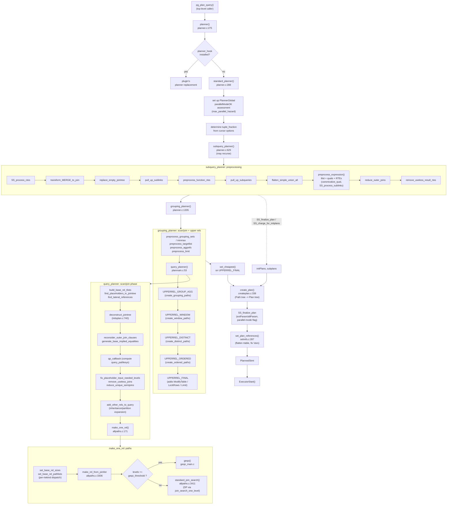

# 02. Architecture Overview

Prerequisites: [01_executive_summary.md](./01_executive_summary.md).

This module shows the planner's full pipeline as a single connected
diagram and walks through each major sub-pipeline. Use it as a
roadmap; subsequent modules zoom in on individual stages.

---

## 1. Top-level pipeline

The diagram below is the canonical "what happens, in order" view of
the planner. Source: `src/backend/optimizer/plan/planner.c`,
`planmain.c`, `allpaths.c`, `createplan.c`, `setrefs.c`. Each box
links (in spirit; click via the table that follows) to the module
that documents it.

---

## 2. The five sub-pipelines

Reading the diagram top-down, the planner has five clearly-bounded
sub-pipelines.

### 2.1 Preprocessing — subgraph PRE

Goal: rewrite the `Query` so the cost-based machinery sees a
canonical, simplified form. Operations include sublink → join
conversion, simple-subquery inlining, UNION ALL flattening, qual
canonicalization (`canonicalize_qual`), constant folding
(`eval_const_expressions`), and outer-join reduction.

This phase is *not* cost-driven — it's purely logical. Every transform
either definitely helps or is provably neutral. The detailed walkthrough
is in [04_preprocessing.md](./04_preprocessing.md).

Key entry points: `pull_up_sublinks` (`src/backend/optimizer/prep/prepjointree.c:453`),
`pull_up_subqueries` (`prepjointree.c:934`), `reduce_outer_joins`
(prepjointree.c), `canonicalize_qual` (`prepqual.c`).

### 2.2 Initial setup — subgraph QP (top half)

Goal: build the data structures that the path generators operate on:
`RelOptInfo` per base rel, `SpecialJoinInfo` per non-inner join,
`RestrictInfo` per qual (anchored to the lowest level where it can
fire), `EquivalenceClass` seeds, and the `joinlist` describing the
search-tree shape.

The single most consequential function here is `deconstruct_jointree`
(`src/backend/optimizer/plan/initsplan.c:740`). It populates
`root->join_info_list` (the `SpecialJoinInfo` list, used by
`join_is_legal`), distributes quals into `baserestrictinfo` /
`joininfo`, and returns the joinlist for the next stage. It also
performs identity-3 clone construction for outer-join-relevant
quals.

Detailed walkthrough: [05_initial_setup_and_jointree.md](./05_initial_setup_and_jointree.md).

### 2.3 Path generation — subgraph MOR

Goal: build, per `RelOptInfo`, every interesting `Path` and prune
the non-interesting ones via `add_path`.

Two layers:

- **Base-rel paths**: per RTE-kind dispatch in `set_rel_pathlist`
  (`src/backend/optimizer/path/allpaths.c:469`). Builds seqscan,
  index, bitmap, sample, function, values, CTE, etc.
- **Join paths**: DP search in `standard_join_search` (or GEQO).
  Builds nestloop, mergejoin, hashjoin, plus their parallel variants.

Documented in [06_base_relation_paths.md](./06_base_relation_paths.md),
[07_index_paths.md](./07_index_paths.md), and
[08_join_paths_and_search.md](./08_join_paths_and_search.md).

### 2.4 Upper-level planning — subgraph GP (after `query_planner`)

Goal: layer aggregation, window functions, distinct, ordering, and
modify-table on top of the scan/join rel.

The pipeline builds a chain of "upper rels" (UPPERREL_GROUP_AGG →
UPPERREL_WINDOW → UPPERREL_DISTINCT → UPPERREL_ORDERED →
UPPERREL_FINAL), each adding new paths via dedicated functions:

- `create_grouping_paths` — UPPERREL_GROUP_AGG (HashAgg, GroupAgg, sorted-grouping-sets, partial-then-finalize for parallel).
- `create_window_paths` — UPPERREL_WINDOW (one or more `WindowAggPath`).
- `create_distinct_paths` — UPPERREL_DISTINCT.
- `create_ordered_paths` — UPPERREL_ORDERED (top-level ORDER BY).
- The UPPERREL_FINAL stage glues on `LockRowsPath`, `LimitPath`, and `ModifyTablePath`.

Each stage's `RelOptInfo` is fetched lazily by `fetch_upper_rel`. See
[03_lifecycle_and_entry_points.md](./03_lifecycle_and_entry_points.md#api-grouping_planner)
and [18_path_catalog.md](./18_path_catalog.md#upper-paths).

### 2.5 Plan creation and finalization

Goal: convert the chosen `Path` tree into a self-contained `Plan`
tree the executor can run, then patch in run-time references
(rangetable indices, parameter slots, parallel-mode flag).

The dispatcher is `create_plan_recurse` (`createplan.c:389`). It
matches on `path->pathtype` and calls one of ~40 `create_*_plan`
helpers. After the tree is built, `SS_finalize_plan` walks it to
compute extParam / allParam (subplan parameters), and
`set_plan_references` (`setrefs.c:287`) flattens the rangetable
and rewrites every `Var` to point at the executor's flat
`PlannedStmt.rtable`.

Documented in [16_plan_creation_and_setrefs.md](./16_plan_creation_and_setrefs.md).

---

## 3. Data flow at a glance

The data flow can be summarized in three artefacts that each phase
produces and the next consumes:

| Phase | Consumes | Produces |
|-------|----------|----------|
| Preprocessing | `Query` (post-rewrite) | `Query` (canonicalized) |
| Initial setup | canonicalized `Query` | `simple_rel_array`, `join_info_list`, base `RestrictInfo`s, EC seeds, `joinlist` |
| Base-rel paths | base RelOptInfos + RestrictInfos | per-rel `pathlist` + `cheapest_*` pointers |
| Join search | per-rel pathlists + `joinlist` + `join_info_list` | top scan/join `RelOptInfo` with pathlist |
| Upper rels | top scan/join rel | `upper_rels[UPPERREL_FINAL]` with pathlist |
| Plan creation | cheapest `Path` of UPPERREL_FINAL | `Plan` tree + `PlannedStmt` |

`PlannerInfo` (the "root" pointer threaded through everything) is the
shared data bus. `PlannerGlobal` (one per top-level `Query`) holds
state shared across sub-`PlannerInfo`s, like the global
`subplans` list and ID counters.

For the field-level reference of `PlannerInfo`, `PlannerGlobal`,
`RelOptInfo`, and `Path`, see
[appendix_data_structures.md](./appendix_data_structures.md).

---

## 4. Reading map

Once you've internalized the diagram, the most useful linear reading
order is:

1. [03_lifecycle_and_entry_points.md](./03_lifecycle_and_entry_points.md) — entry-point functions in detail.
2. [04_preprocessing.md](./04_preprocessing.md) — what the planner does to the `Query` before any path is built.
3. [05_initial_setup_and_jointree.md](./05_initial_setup_and_jointree.md) — the data structures that drive everything below.
4. [06_base_relation_paths.md](./06_base_relation_paths.md) — first concrete `Path` objects.
5. [07_index_paths.md](./07_index_paths.md) — index access deep dive.
6. [08_join_paths_and_search.md](./08_join_paths_and_search.md) — DP and the three join methods.
7. [09_cost_model_and_selectivity.md](./09_cost_model_and_selectivity.md) — how every cost number is computed.
8. [10_equivalence_classes_and_pathkeys.md](./10_equivalence_classes_and_pathkeys.md) — the unified treatment of value-equality and sort-order.

Subsequent modules (11–17) cover specialized concerns
(quals, subqueries, partitioning, parallel, GEQO, plan creation,
hooks). The catalogs (18–19) and appendices are reference material.

---

Next: [03_lifecycle_and_entry_points.md](./03_lifecycle_and_entry_points.md)
