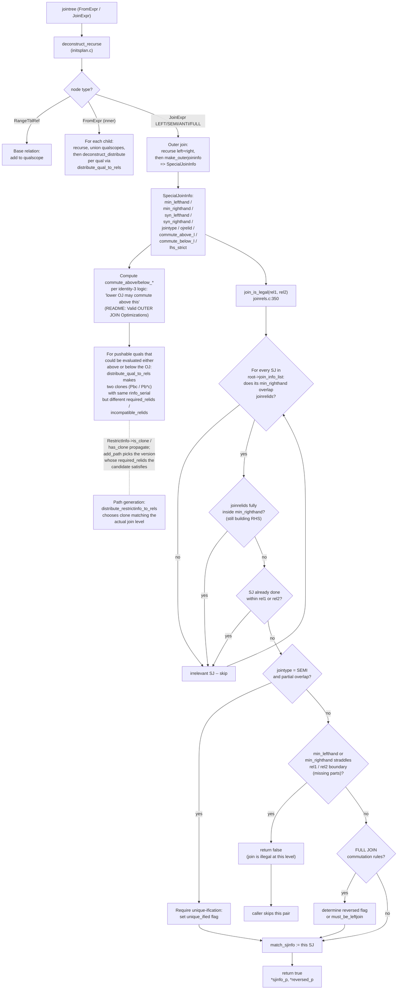

# 05. Initial Setup and Jointree Decomposition

Prerequisites: [04_preprocessing.md](./04_preprocessing.md).

This module documents how the planner translates the canonicalized
`Query`'s jointree into the data structures the path generators
operate on. Source: most of `src/backend/optimizer/plan/initsplan.c`.

---

## 1. Why this exists

Once preprocessing is done, the planner needs to translate the SQL
jointree into the data structures that the cost-based machinery
actually operates on:

- **`RelOptInfo`** for every base rel that appears.
- **`SpecialJoinInfo`** for every non-inner join — these record
  join-order constraints, identity-3 commutation possibilities,
  semi-join factors, etc.
- **`RestrictInfo`** for every qual, distributed to the lowest
  base/join level where it can be evaluated.
- **`EquivalenceClass`** seeds for mergejoinable equality quals.
- The **joinlist** that DP / GEQO will iterate over.

This is also where **identity-3 clones** of OJ quals are made (the
so-called "Pbc / Pb*c" mechanism — see §6 below).

---

## 2. Symbol table

| Symbol                               | File:line                                        | Importance |
|--------------------------------------|--------------------------------------------------|------------|
| `deconstruct_jointree`               | `src/backend/optimizer/plan/initsplan.c:740`     | 0.86 |
| `distribute_qual_to_rels`            | `src/backend/optimizer/plan/initsplan.c:2197`    | 0.78 |
| `make_outerjoininfo`                 | `src/backend/optimizer/plan/initsplan.c`         | 0.70 |
| `process_implied_equality`           | `src/backend/optimizer/plan/initsplan.c`         | 0.55 |
| `build_implied_join_equality`        | `src/backend/optimizer/plan/initsplan.c`         | 0.50 |
| `compute_semijoin_info`              | `src/backend/optimizer/plan/initsplan.c`         | 0.45 |
| `find_lateral_references`            | `src/backend/optimizer/plan/initsplan.c`         | 0.50 |
| `extract_lateral_references`         | `src/backend/optimizer/plan/initsplan.c`         | 0.45 |
| `create_lateral_join_info`           | `src/backend/optimizer/plan/initsplan.c`         | 0.50 |
| `add_base_rels_to_query`             | `src/backend/optimizer/plan/initsplan.c`         | 0.55 |
| `build_base_rel_tlists`              | `src/backend/optimizer/plan/initsplan.c`         | 0.55 |
| `add_vars_to_targetlist`             | `src/backend/optimizer/plan/initsplan.c`         | 0.45 |
| `find_placeholders_in_jointree`      | `src/backend/optimizer/plan/initsplan.c`         | 0.45 |
| `JoinDomain`                         | `src/include/nodes/pathnodes.h:1317`             | 0.50 |
| `SpecialJoinInfo`                    | `src/include/nodes/pathnodes.h:2891`             | 0.65 |

---

## 3. SpecialJoinInfo legality flow

The diagram below combines two related but separately-implemented
flows: (1) how `make_outerjoininfo` builds a `SpecialJoinInfo` from a
`JoinExpr`, and (2) how `join_is_legal` later consults the
`SpecialJoinInfo` list to gate join-search decisions. Both come from
`src/backend/optimizer/plan/initsplan.c` and
`src/backend/optimizer/path/joinrels.c:350`.



---

## 4. `add_base_rels_to_query` and `build_base_rel_tlists`

### 4.1 `add_base_rels_to_query`

Walks `parse->jointree`. For every `RangeTblRef` it calls
`build_simple_rel` to construct a `RelOptInfo` of `reloptkind =
RELOPT_BASEREL`. If the rel is an inheritance/partition parent
(`rte->inh`), only the parent rel is built here; children are added
later by `add_other_rels_to_query`.

Side effects on each `RelOptInfo`:

- `relid = rti` (RT index).
- `rtekind = rte->rtekind`.
- `min_attr` / `max_attr` and the `attr_needed[]` / `attr_widths[]`
  arrays sized accordingly.
- `lateral_vars` = `extract_lateral_references` for that rel.
- For RELATION rtekind: `pages`, `tuples`, `allvisfrac`, `indexlist`,
  `statlist`, `relhasindex`, `relistemp`, `notnullattnums` are
  filled in from `pg_class`/`pg_index`/`pg_statistic` via
  `get_relation_info`.

### 4.2 `build_base_rel_tlists`

Walks `processed_tlist`. For every `Var(varno=N, varattno=k)`
referenced, sets `rel->attr_needed[k - rel->min_attr] |=
bms_make_singleton(top_relid)`.

PlaceHolderVars get `find_placeholders_in_expr` treatment which
records the PHV in `placeholder_list`.

### 4.3 `add_vars_to_targetlist`

Helper used elsewhere to add Vars to `rel->reltarget->exprs` and
update `attr_needed` accordingly.

---

## 5. `deconstruct_jointree`

### 5.1 Signature

```c
List *deconstruct_jointree(PlannerInfo *root);
```

Source: `src/backend/optimizer/plan/initsplan.c:740`.

### 5.2 Purpose

The single most consequential function in initial setup. It:

1. Walks the jointree top-down (`deconstruct_recurse`).
2. Builds `JoinTreeItem` records (one per jointree node) that pair
   each node with the relids that fall under it (`qualscope`) and
   its parent's `qualscope` for collapse-limit accounting.
3. Builds `SpecialJoinInfo` for each non-inner join via
   `make_outerjoininfo`.
4. After the tree walk, distributes every qual it has accumulated
   via `deconstruct_distribute` → `distribute_qual_to_rels`.
5. Handles **postponed** non-degenerate outer-join quals via
   `deconstruct_distribute_oj_quals` in a second pass.
6. Returns the **joinlist** for `make_rel_from_joinlist` to consume.

Body summary (initsplan.c:740-803):

```c
root->placeholdersFrozen = true;
top_jdomain = linitial_node(JoinDomain, root->join_domains);
root->all_baserels = NULL;
root->outer_join_rels = NULL;

result = deconstruct_recurse(root, parse->jointree, top_jdomain, NULL,
                              &item_list);

root->all_query_rels = bms_union(root->all_baserels, root->outer_join_rels);

foreach(item, item_list)
    deconstruct_distribute(root, jtitem);

if (root->join_info_list)
    foreach(item with jtitem->oj_joinclauses)
        deconstruct_distribute_oj_quals(root, item_list, jtitem);
```

### 5.3 `deconstruct_recurse` per node

- **`RangeTblRef`**: just records the relid into `parent_domain` and
  `all_baserels`. `qualscope = {varno}`. `joinlist =
  list_make1(jtnode)`.
- **`FromExpr`**: recurses on children, unions their `qualscope`s.
  Implements **`from_collapse_limit`**:
  ```c
  if (sub_members <= 1 ||
      list_length(joinlist) + sub_members + remaining
        <= from_collapse_limit)
      joinlist = list_concat(joinlist, sub_joinlist);  /* flatten */
  else
      joinlist = lappend(joinlist, sub_joinlist);      /* keep nested */
  ```
- **`JoinExpr`**:
  - **JOIN_INNER**: same as FromExpr but applies
    **`join_collapse_limit`** instead of `from_collapse_limit`.
  - **LEFT/SEMI/ANTI/FULL**: builds a child JoinDomain only for FULL
    JOIN (FULL JOIN cannot commute with anything, so its inputs
    form a separate join-domain). Calls `make_outerjoininfo` to
    build a `SpecialJoinInfo` appended to `root->join_info_list`.
    Adds the OJ rel to `root->outer_join_rels`. The joinlist
    becomes a sublist `list_make1(this JoinExpr's joinlist)` — the
    DP search then treats this sub-problem as a single planning
    unit (it can choose order *within* but cannot merge it with the
    outer level beyond the sublist boundary).

### 5.4 `make_outerjoininfo`

Builds a `SpecialJoinInfo` per outer join. Key fields:

- `min_lefthand` / `min_righthand`: the **minimum** relid sets that
  must appear under the LHS / RHS of this join. Computed by
  inspecting the outer-join's quals and tightening using the
  `JOIN_INNER` collapse rules. This is the canonical way join-order
  legality is enforced (`join_is_legal` uses these fields).
- `syn_lefthand` / `syn_righthand`: the syntactic relid sets under
  the LHS / RHS.
- `jointype`: INNER / LEFT / FULL / SEMI / ANTI (RIGHT joins are
  flipped to LEFT during parsing).
- `ojrelid`: the OJ-relid that represents the OJ in the relids
  namespace. Used by `varnullingrels` and by parameterized-path
  safety checks (`try_nestloop_path` rejects paths whose param_info
  contains its own `ojrelid`).
- `commute_above_l`, `commute_above_r`, `commute_below_l`,
  `commute_below_r`: set when the upper jointree allows identity-3
  commutation. See §6.
- `lhs_strict`: true if a join clause is strict for some LHS rel
  (used to decide if certain optimizations are safe).
- `semi_can_btree`, `semi_can_hash`, `semi_operators`,
  `semi_rhs_exprs`: populated for SEMI joins so unique-ification
  and semi-cost estimation have the operator info.

```c
typedef struct SpecialJoinInfo SpecialJoinInfo;
struct SpecialJoinInfo {
    NodeTag     type;
    Relids      min_lefthand;
    Relids      min_righthand;
    Relids      syn_lefthand;
    Relids      syn_righthand;
    JoinType    jointype;
    Index       ojrelid;
    Relids      commute_above_l;
    Relids      commute_above_r;
    Relids      commute_below_l;
    Relids      commute_below_r;
    bool        lhs_strict;
    bool        semi_can_btree;
    bool        semi_can_hash;
    List       *semi_operators;
    List       *semi_rhs_exprs;
};
```

Source: `src/include/nodes/pathnodes.h:2891`.

---

## 6. `distribute_qual_to_rels`

### 6.1 Signature

```c
static void
distribute_qual_to_rels(PlannerInfo *root, Node *clause,
                        JoinTreeItem *jtitem,
                        SpecialJoinInfo *sjinfo,
                        Index security_level,
                        Relids qualscope,
                        Relids ojscope,
                        Relids outerjoin_nonnullable,
                        Relids incompatible_relids,
                        bool allow_equivalence,
                        bool has_clone,
                        bool is_clone,
                        List **postponed_oj_qual_list);
```

Source: `src/backend/optimizer/plan/initsplan.c:2197`.

### 6.2 What it does (logical steps)

1. **Compute `relids = pull_varnos(clause)`** — every base+OJ relid
   the clause references.
2. **Lateral postponement** — if `relids ⊄ qualscope`, find the
   nearest enclosing jointree level whose `qualscope` does cover
   `relids` and stash the clause on that parent's
   `lateral_clauses`. (This is how pulled-up LATERAL subqueries
   that reference outer rels get correctly anchored.
   initsplan.c:2234-2256.)
3. **Variable-free clause handling** (initsplan.c:2285-2319):
   - If attached to an OJ, force eval at `ojscope`.
   - Else if volatile, eval at original `qualscope`.
   - Else, mark `pseudoconstant = true`. Push to top of the topmost
     join domain (so it can become a gating Result above the whole
     plan). Sets `root->hasPseudoConstantQuals = true`.
4. **`is_pushed_down` decision** (initsplan.c:2353-2400):
   - If clause references the OJ's nonnullable side, it's a
     non-degenerate OJ qual: `is_pushed_down = false`. Cannot be
     used for equivalence because the values may differ above the
     join (one side could be NULL). May still be useful as a
     mergejoin clause, so it's added to `oj_joinclauses` for
     postponed second-pass treatment.
   - Else if it's a "degenerate" OJ qual (mentions only the
     nullable side): `is_pushed_down = true`. Push it down into the
     RHS scope.
   - WHERE / inner-JOIN ON quals: `is_pushed_down = true`.
5. **Build `RestrictInfo`** via `make_restrictinfo`
   (restrictinfo.c). This computes `clause_relids`, `required_relids`,
   `outer_relids`, `incompatible_relids`, `left_relids`,
   `right_relids`, etc. `rinfo_serial` is assigned from
   `root->last_rinfo_serial++`. **Clones** inherit the parent's
   `rinfo_serial` (see §7).
6. **Anchor the RestrictInfo**:
   - If single-rel scope → `baserestrictinfo` of that rel.
   - Else → `joininfo` of every rel mentioned (each rel gets a copy
     of the same RestrictInfo pointer; the JOIN level is determined
     by `required_relids` at runtime).
7. **Equivalence-class extraction**: if `allow_equivalence` and the
   clause is mergejoinable equality, attempt `process_equivalence`
   (equivclass.c). On success the clause is logged in the EC's
   `ec_sources` and **not** placed in `joininfo` (it'll be
   regenerated on demand by `generate_join_implied_equalities`). On
   failure (e.g. cross-EC or broken EC) it falls through to be
   added normally. See [10_equivalence_classes_and_pathkeys.md](./10_equivalence_classes_and_pathkeys.md).
8. **Postponed OJ quals**: if `postponed_oj_qual_list != NULL` and
   the clause is non-degenerate, append the bare clause to that
   list and return. The second-pass call
   `deconstruct_distribute_oj_quals` re-evaluates these once all
   SJs are known.

### 6.3 `incompatible_relids`

A clone's `incompatible_relids` records the OJ relids whose *other*
commute position the clone is **NOT** for. When `add_path` selects
which clone to apply, it checks `bms_overlap(joinrelids,
rinfo->incompatible_relids) == false`. This is the runtime gate
that ensures only one clone of each pair is applied at any join
level.

---

## 7. Identity-3 outer-join optimizations and Pbc / Pb*c clones

This is the single hardest part of the planner to grasp. The
`src/backend/optimizer/README` section "Valid OUTER JOIN
Optimizations" should be the primary reference; this section
summarizes how the *implementation* works.

### 7.1 The identity

Identity 3 (informally): when an upper join is INNER and certain
strictness conditions hold, an upper qual that mentions both sides
of a lower OUTER JOIN can be evaluated **either** as a pushed-down
qual at the OJ level **or** as a regular WHERE qual at the upper
inner-join level. The two positions yield different costing
behaviour:

- **Position Pbc** (push down into the OJ): the qual is checked
  before null extension, eliminating rows that would otherwise
  survive as null-extended dummies but be discarded by the upper
  inner join.
- **Position Pb\*c** (apply at the upper join): the qual is
  evaluated only once per surviving inner-join row, but
  null-extended rows have already been formed.

Either is *correct*; only one should be applied in any given plan.

### 7.2 Implementation: clone pairs

`distribute_qual_to_rels` makes **two RestrictInfo clones** for an
identity-3-eligible qual:

- Clone Pbc: `is_clone = true`, `has_clone = true`,
  `required_relids` includes the OJ scope, `incompatible_relids`
  includes the upper inner-join's level relids.
- Clone Pb*c: `is_clone = true`, `has_clone = true`,
  `required_relids` includes the upper inner-join level,
  `incompatible_relids` includes the OJ scope.

Both clones share the same `rinfo_serial`, so `add_path` knows they
represent **one** logical condition (and any plan must apply
**exactly one** of them).

The selection during path generation:

```c
/* In add_path-style selection, not literal source: */
foreach(rinfo in restrictlist) {
    if (bms_overlap(joinrelids, rinfo->incompatible_relids))
        skip;       /* wrong clone for this level */
    else
        keep;
}
```

The `incompatible_relids` test is what makes this work without
explicit "clone selection" code at every join-path constructor.

### 7.3 `commute_above_*` / `commute_below_*` fields

Used by `make_outerjoininfo` to remember which neighboring OJs are
*commutable* with this one. `add_paths_to_joinrel` uses these when
forming parameterized paths (commutation makes some
parameterizations safe that otherwise wouldn't be).

### 7.4 `varnullingrels` and PlaceHolderVar

- A `Var` (or `PlaceHolderVar`) that flows through an OJ on its
  nullable side gets the OJ's `ojrelid` added to its
  `varnullingrels` (`phnullingrels` for PHVs). Two Vars that look
  identical syntactically are NOT `equal()` if their
  `varnullingrels` differ. This is the mechanism that prevents an
  EC from incorrectly equating "pre-OJ" and "post-OJ" Var values.
- A `PlaceHolderVar` exists for any expression that must be
  evaluated below an OJ (because some of its inputs come from
  below) but might be null-extended. PHVs carry `phnullingrels` to
  signal that they may yield NULL above the OJ even though their
  underlying expression doesn't.
- A `RestrictInfo`'s `clause_relids` is a *relids set* (varnos +
  varnullingrels). This is why a single qual referencing
  `t.x = u.y` after an OJ may have `clause_relids = {t, u, oj}`.

A deeper algorithmic walkthrough of identity-3 reasoning is in
[20_deep_dives.md](./20_deep_dives.md#identity-3-and-outer-join-clones).

---

## 8. `process_implied_equality` and `build_implied_join_equality`

`process_implied_equality` is the entry point used by
`generate_base_implied_equalities` and (indirectly) by the join-time
implied-equality machinery. It builds a synthetic `op_expr LHS =
RHS` qual, runs it through `make_restrictinfo`, and either sticks it
in a base rel's `baserestrictinfo` (for `var = const` consts) or in
`joininfo` of every rel it touches (for `var = var` cross-rel
quals).

`build_implied_join_equality` is the lower-level helper used inside
`equivclass.c`'s `generate_join_implied_equalities_normal` to build
a fresh `RestrictInfo` from two EquivalenceMembers across a join.

For `var = const` equivalences, a single EC produces one
RestrictInfo *per* base rel that has a Var member: that's the
"constant" implied equality applied as a baserestriction.

For `var = var` cross-EC pairs, RestrictInfos are generated lazily
per-join (cached in `ec_derives`) so we only emit the ones whose two
sides are both reachable at the actual join level.

---

## 9. LATERAL handling

### 9.1 `find_lateral_references`

Source: `src/backend/optimizer/plan/initsplan.c`.

Per `RelOptInfo` whose RTE is `lateral`, walks the rel's defining
expression (subquery's tlist for RTE_SUBQUERY, function args for
RTE_FUNCTION, etc.) and records every Var or PHV that references an
outer rel. Result is stored in `rel->lateral_vars`.

### 9.2 `extract_lateral_references`

Helper that does the actual expression walk and extracts the outer
references.

### 9.3 `create_lateral_join_info`

Per rel, computes the closure of laterally-referenced rels and
writes `rel->direct_lateral_relids` and `rel->lateral_relids`. Also
updates `lateral_referencers` for the *referenced* rels (so we know
who needs us before we can be joined).

These fields constrain join-order: a rel cannot be the outer of a
nestloop if its `lateral_relids` aren't already in the outer side
(checked in `try_nestloop_path` and `make_rels_by_clause_joins`).
See [08_join_paths_and_search.md](./08_join_paths_and_search.md).

---

## 10. `JoinDomain`

Source: `src/include/nodes/pathnodes.h:1317`.

```c
typedef struct JoinDomain {
    NodeTag    type;
    Relids     jd_relids;   /* rels in this domain */
} JoinDomain;
```

A JoinDomain is the set of relations among which equivalence-class
deductions are unconditional. Concretely:

- The whole query starts in one top-level JoinDomain.
- Each FULL JOIN creates a new sub-JoinDomain for its inputs
  (because FULL JOIN cannot commute, and quals on the FULL JOIN
  inputs must not be inferred to apply outside).
- Each SEMI / ANTI subquery (after pull-up) is in the parent's
  domain *unless* it had a FULL JOIN inside.

Why it matters: `EquivalenceClass`'s pseudoconstant members are
tagged with their **source JoinDomain** (`em_jdomain`). Two `var =
const` members in different JoinDomains will not collapse,
preventing incorrect inferences across a FULL JOIN boundary.

---

## 11. Performance characteristics

- `deconstruct_jointree` runs once per query level; cost is roughly
  proportional to (jointree-size + total qual count +
  join_info_list length²) due to the SJ scan in `make_outerjoininfo`.
- `distribute_qual_to_rels` is O(qual size + relids work). With
  identity-3 cloning, a qual can become two RestrictInfos.
- `find_lateral_references` is O(sum of rel definitions × outer rel
  count).

---

## 12. Cross-references

- Pipeline overview: [03_lifecycle_and_entry_points.md](./03_lifecycle_and_entry_points.md)
- `RestrictInfo` internals:
  [11_restrictinfo_and_clause_utils.md](./11_restrictinfo_and_clause_utils.md)
- ECs and pathkeys:
  [10_equivalence_classes_and_pathkeys.md](./10_equivalence_classes_and_pathkeys.md)
- Join legality test (`join_is_legal`):
  [08_join_paths_and_search.md](./08_join_paths_and_search.md)
- Identity-3 deep dive: [20_deep_dives.md](./20_deep_dives.md#identity-3-and-outer-join-clones)
- Data-structure reference (`SpecialJoinInfo`, `JoinDomain`,
  `RelOptInfo`): [appendix_data_structures.md](./appendix_data_structures.md)

---

Next: [06_base_relation_paths.md](./06_base_relation_paths.md)
