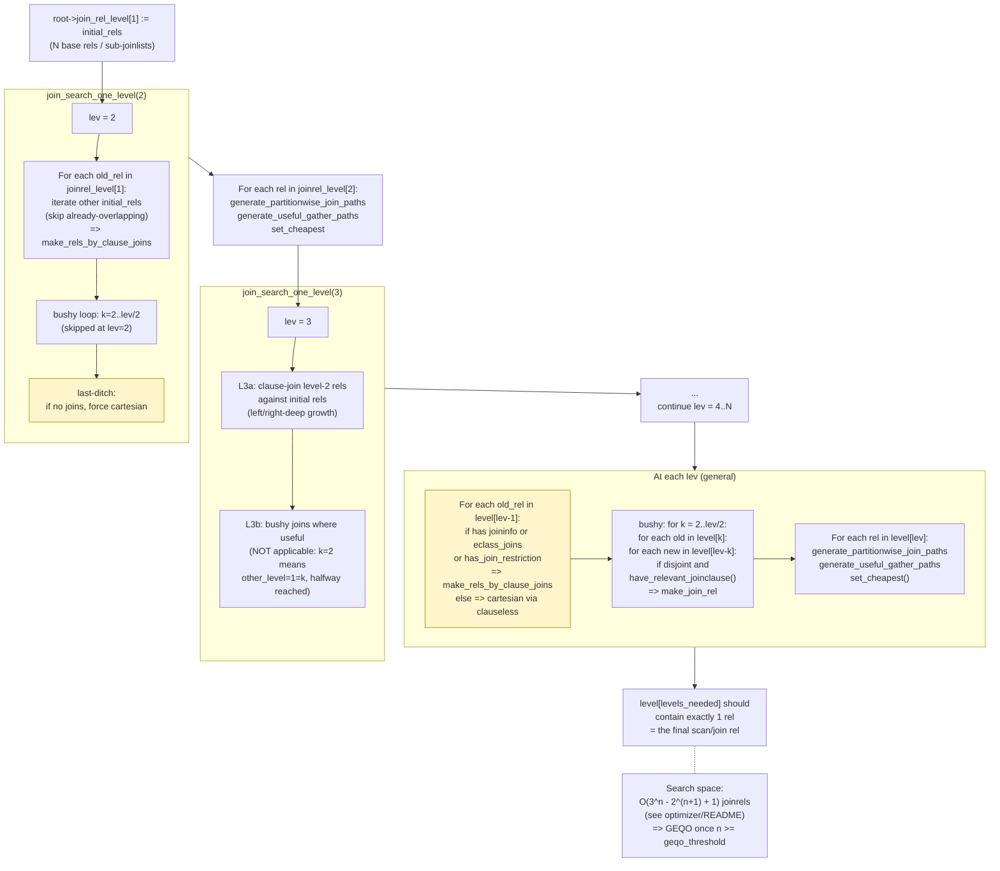
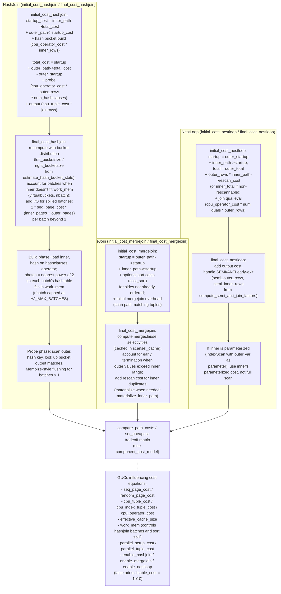

# 08. Join Paths and Join Search

Prerequisites: [07_index_paths.md](./07_index_paths.md),
[05_initial_setup_and_jointree.md](./05_initial_setup_and_jointree.md).

This module documents the largest functional area of the planner:
DP-style join search, the three join methods (nestloop, mergejoin,
hashjoin), and the `add_path` Pareto pruner. Source files:

- `src/backend/optimizer/path/joinpath.c` (`try_*_path`,
  `sort_inner_and_outer`, `match_unsorted_outer`,
  `hash_inner_and_outer`)
- `src/backend/optimizer/path/joinrels.c`
  (`join_search_one_level`, `make_join_rel`,
  `populate_joinrel_with_paths`, `join_is_legal`)
- `src/backend/optimizer/util/pathnode.c` (`add_path`,
  `set_cheapest`, `create_*_path`)
- `src/backend/optimizer/path/allpaths.c`
  (`standard_join_search`, `make_rel_from_joinlist`)

---

## 1. Why this exists

The base-rel layer hands us N RelOptInfos with their `pathlist`s.
The job of the join layer is to build a single RelOptInfo
representing the join of all of them, with at least one viable path
attached. Three sub-problems must be solved:

1. **Order**: which N-1 binary joins, in which order, and bushy or
   left-deep?
2. **Method**: NestLoop vs MergeJoin vs HashJoin per pair?
3. **Pareto-optimal pruning**: which paths to keep on each
   joinrel's pathlist?

PostgreSQL uses **DP (dynamic programming) by levels** in
`standard_join_search`, falling back to GEQO for very large N (see
[15_geqo.md](./15_geqo.md)).

---

## 2. Symbol table

| Symbol                            | File:line                                          | Importance |
|-----------------------------------|----------------------------------------------------|------------|
| `add_path`                        | `src/backend/optimizer/util/pathnode.c:420`        | 0.94 |
| `set_cheapest`                    | `src/backend/optimizer/util/pathnode.c:242`        | 0.92 |
| `standard_join_search`            | `src/backend/optimizer/path/allpaths.c:3411`       | 0.92 |
| `make_rel_from_joinlist`          | `src/backend/optimizer/path/allpaths.c:3306`       | 0.90 |
| `join_search_one_level`           | `src/backend/optimizer/path/joinrels.c:73`         | 0.90 |
| `add_paths_to_joinrel`            | `src/backend/optimizer/path/joinpath.c:124`        | 0.92 |
| `make_join_rel`                   | `src/backend/optimizer/path/joinrels.c:705`        | 0.88 |
| `populate_joinrel_with_paths`     | `src/backend/optimizer/path/joinrels.c:894`        | 0.86 |
| `join_is_legal`                   | `src/backend/optimizer/path/joinrels.c:350`        | 0.82 |
| `try_nestloop_path`               | `src/backend/optimizer/path/joinpath.c:721`        | 0.84 |
| `try_mergejoin_path`              | `src/backend/optimizer/path/joinpath.c:920`        | 0.82 |
| `try_hashjoin_path`               | `src/backend/optimizer/path/joinpath.c:1096`       | 0.84 |
| `try_partial_nestloop_path`       | `src/backend/optimizer/path/joinpath.c:843`        | 0.65 |
| `try_partial_mergejoin_path`      | `src/backend/optimizer/path/joinpath.c:1026`       | 0.65 |
| `try_partial_hashjoin_path`       | `src/backend/optimizer/path/joinpath.c`            | 0.65 |
| `sort_inner_and_outer`            | `src/backend/optimizer/path/joinpath.c`            | 0.70 |
| `match_unsorted_outer`            | `src/backend/optimizer/path/joinpath.c:1717`       | 0.78 |
| `hash_inner_and_outer`            | `src/backend/optimizer/path/joinpath.c`            | 0.70 |
| `select_mergejoin_clauses`        | `src/backend/optimizer/path/joinpath.c`            | 0.55 |
| `make_rels_by_clause_joins`       | `src/backend/optimizer/path/joinrels.c:280`        | 0.78 |
| `make_rels_by_clauseless_joins`   | `src/backend/optimizer/path/joinrels.c`            | 0.55 |
| `have_relevant_joinclause`        | `src/backend/optimizer/util/joininfo.c`            | 0.50 |
| `have_join_order_restriction`     | `src/backend/optimizer/path/joinrels.c`            | 0.50 |
| `get_memoize_path`                | `src/backend/optimizer/path/joinpath.c`            | 0.50 |
| `JoinPathExtraData`               | `src/include/nodes/pathnodes.h:3230`               | 0.45 |

---

## 3. DP join search visualized

The two diagrams below come from
`stage2/diagrams/03_dp_join_search.mermaid` and
`stage2/diagrams/12_join_cost_decomposition.mermaid`. The first
shows the level-by-level join expansion; the second shows how the
three join methods decompose into individual cost terms.

### 3.1 Level expansion



### 3.2 Per-method cost decomposition



---

## 4. Top-level join search: `make_rel_from_joinlist` and `standard_join_search`

### 4.1 `make_rel_from_joinlist` (allpaths.c:3306)

- Counts joinlist depth = `levels_needed = list_length(joinlist)`.
- Builds `initial_rels` by recursing into nested joinlists
  (sub-problems arising from `from_collapse_limit` /
  `join_collapse_limit` boundaries or from FULL JOIN sub-domains).
- Dispatches to:
    1. `join_search_hook` (extension override) if installed.
    2. `geqo` if `enable_geqo && levels_needed >= geqo_threshold`
       (`DEFAULT_GEQO_THRESHOLD = 12`, same as `geqo.h`'s default).
    3. `standard_join_search` otherwise.

### 4.2 `standard_join_search` (allpaths.c:3411)

DP by levels:

- `root->join_rel_level[1] = initial_rels`.
- For `lev = 2..levels_needed`:
  - `join_search_one_level(root, lev)`.
  - Per joinrel at this level: `generate_partitionwise_join_paths`,
    `generate_useful_gather_paths` (unless this is the topmost rel),
    `set_cheapest`.
- Asserts `len(level[N]) == 1`.

---

## 5. `join_search_one_level`

Source: `src/backend/optimizer/path/joinrels.c:73`.

```c
void join_search_one_level(PlannerInfo *root, int level)
{
    /* (1) Left/right-deep growth: join level-1 against initial rels */
    foreach(r, joinrels[level - 1]) {
        RelOptInfo *old_rel = ...;
        if (old_rel->joininfo != NIL || old_rel->has_eclass_joins ||
            has_join_restriction(root, old_rel))
        {
            int first_rel = (level == 2) ? foreach_current_index(r)+1 : 0;
            make_rels_by_clause_joins(root, old_rel,
                                       joinrels[1], first_rel);
        }
        else
            make_rels_by_clauseless_joins(root, old_rel, joinrels[1]);
    }

    /* (2) Bushy plans: pair level-k rels with level-(level-k) rels */
    for (k = 2;; k++) {
        int other_level = level - k;
        if (k > other_level) break;
        foreach(r, joinrels[k]) {
            ... only if old_rel has join clauses or restrictions ...
            for_each_from(r2, joinrels[other_level], first_rel) {
                if (!bms_overlap(old_rel->relids, new_rel->relids) &&
                    (have_relevant_joinclause(root, old_rel, new_rel) ||
                     have_join_order_restriction(root, old_rel, new_rel)))
                    (void) make_join_rel(root, old_rel, new_rel);
            }
        }
    }

    /* (3) Last-ditch cartesian if level is empty */
    if (joinrels[level] == NIL) {
        foreach(r, joinrels[level - 1])
            make_rels_by_clauseless_joins(root, old_rel, joinrels[1]);
        if (joinrels[level] == NIL && root->join_info_list == NIL &&
            !root->hasLateralRTEs)
            elog(ERROR, "failed to build any %d-way joins", level);
    }
}
```

### 5.1 Why the order matters

- Step 1 covers all left-deep and right-deep plans (the typical
  case).
- Step 2 generates bushy plans only when there's a *reason* to (a
  join clause or a SpecialJoinInfo restriction). Without this
  filter the search space explodes; see §13 below.
- Step 3 handles cases like a sub-jointree that has only
  outer-pointing join clauses, where every step-1 attempt yields a
  cartesian we'd rather not do — but at this sub-level we have no
  choice.

### 5.2 DP search complexity

For an inner-join-only query, the number of distinct joinrels
considered is bounded by:

> O(3^n − 2^(n+1) + 1) joinrels.

This is the size of the lattice of non-empty proper subsets — the
standard result for left-deep + bushy DP (`optimizer/README`
derivation). It quickly dominates planning time, which is why
`geqo_threshold = 12`: 12 rels is roughly 3^12 ≈ 530k joinrels,
still tractable; 13 rels would be ~1.6M.

`from_collapse_limit` and `join_collapse_limit` (both default 8)
bound the size of any sub-problem the DP search sees by
partitioning the joinlist. Increasing `join_collapse_limit` past 8
lets explicit JOIN syntax be reordered with FROM lists; raising it
to N lets the DP search consider all N-rel orderings unrestricted.
A deeper analysis is in [20_deep_dives.md](./20_deep_dives.md#dp-complexity-analysis).

---

## 6. `make_join_rel` and `populate_joinrel_with_paths`

### 6.1 `make_join_rel` (joinrels.c:705)

Steps:

1. Compute `joinrelids = bms_union(rel1->relids, rel2->relids)` plus
   the OJ relid if a SpecialJoinInfo applies.
2. Call `join_is_legal(root, rel1, rel2, joinrelids, &sjinfo,
   &reversed)`. If illegal, return NULL.
3. If `reversed`, swap `rel1, rel2`.
4. Look up the joinrel in `root->join_rel_hash`/`join_rel_list` via
   `find_join_rel`. If found, use it; else create a new one via
   `build_join_rel(root, joinrelids, ...)`.
5. Call `populate_joinrel_with_paths` to add paths.

### 6.2 `populate_joinrel_with_paths` (joinrels.c:894)

Dispatches to `add_paths_to_joinrel` based on the SpecialJoinInfo's
`jointype`:

- INNER, LEFT, FULL, ANTI: one call, jointype passed through.
- SEMI: one call with `JOIN_SEMI`. Optionally a second call with
  `JOIN_UNIQUE_INNER` to consider unique-ifying the RHS and
  treating the join as a normal inner join (when the RHS isn't
  already provably unique).

For UNIQUE_INNER it builds a `UniquePath` over the inner's paths
and then re-enters `add_paths_to_joinrel` with `jointype =
JOIN_INNER` and `sjinfo->jointype` still SEMI (so cost code knows
it's a unique-ified semijoin).

---

## 7. `join_is_legal`

Source: `src/backend/optimizer/path/joinrels.c:350`. The full
decision tree is in the SpecialJoinInfo legality diagram in
[05_initial_setup_and_jointree.md](./05_initial_setup_and_jointree.md#3-specialjoininfo-legality-flow).

The legality test scans `root->join_info_list`. For each
`SpecialJoinInfo`:

- Skip if `min_righthand` doesn't overlap `joinrelids` (irrelevant
  SJ).
- Skip if `joinrelids ⊆ min_righthand` (we're still building the
  RHS).
- Skip if the SJ is fully done within `rel1` or `rel2`.
- For SEMI: if RHS already partially joined to outside, it must
  have been unique-ified — set `unique_ified = true`.
- Verify `min_lefthand ⊆ rel1` and `min_righthand ⊆ rel2` (or the
  reverse with `reversed = true`). If not, the SJ straddles the
  proposed join boundary illegally — return false.
- For FULL JOIN: must `must_be_leftjoin = false` apply, no other SJ
  partially overlaps.
- Set `match_sjinfo` to the matched SJ.

After the loop, if exactly one SJ matched, return true with that SJ
(and `*reversed_p`). If no SJ matched, the join is a plain inner
join and `*sjinfo_p = NULL`.

---

## 8. `add_paths_to_joinrel`

Source: `src/backend/optimizer/path/joinpath.c:124`.

The "method dispatcher". For a single `(outerrel, innerrel,
jointype, sjinfo, restrictlist)`:

1. **Build `JoinPathExtraData extra`**:
   - `extra.restrictlist = restrictlist`.
   - `extra.sjinfo = sjinfo`.
   - `extra.inner_unique = ...` from `innerrel_is_unique` per
     jointype.
   - `extra.mergeclause_list = select_mergejoin_clauses(root,
     joinrel, outerrel, innerrel, restrictlist, jointype,
     &mergejoin_allowed)` (skipped if neither mergejoin nor full
     join).
   - `extra.semifactors = ...` from `compute_semi_anti_join_factors`
     if SEMI/ANTI/inner_unique.
   - `extra.param_source_rels` — see §9.
2. **Call the four method generators**:
   - `sort_inner_and_outer(root, joinrel, outerrel, innerrel,
     jointype, &extra)` — explicit-sort merge joins.
   - `match_unsorted_outer(root, joinrel, outerrel, innerrel,
     jointype, &extra)` — nestloops + already-sorted outer
     mergejoins.
   - (skipped: NOT_USED `match_unsorted_inner` for redundancy
     reasons.)
   - `hash_inner_and_outer(root, joinrel, outerrel, innerrel,
     jointype, &extra)` — hash joins (always tried for FULL JOIN
     regardless of GUC).
3. **FDW push-down**: if both rels are foreign tables on the same
   server, give the FDW a chance via `GetForeignJoinPaths`.
4. **`set_join_pathlist_hook`**: extension hook (see
   [17_hooks_and_extensibility.md](./17_hooks_and_extensibility.md)).

### 8.1 `enable_*` GUCs and `disable_cost`

- `enable_mergejoin = false` is bypassed when `jointype ==
  JOIN_FULL` because hash/merge are the only ways to do FULL.
- `enable_hashjoin = false` likewise.
- `enable_nestloop = false` doesn't prevent nestloop generation;
  instead, `cost_*` functions add `disable_cost = 1.0e10` to make
  those paths unattractive. See
  [09_cost_model_and_selectivity.md](./09_cost_model_and_selectivity.md#disable_cost-and-forced-method-exceptions).

---

## 9. `param_source_rels` heuristic

`add_paths_to_joinrel` builds `extra.param_source_rels`
(joinpath.c:242-276) as:

```
For each SpecialJoinInfo sj:
    if joinrelids overlaps sj->min_righthand
       AND joinrelids does NOT overlap sj->min_lefthand:
        param_source_rels |= (all_baserels - sj->min_righthand)
    /* full join symmetry */
    if sj->jointype == JOIN_FULL
       AND joinrelids overlaps sj->min_lefthand
       AND joinrelids does NOT overlap sj->min_righthand:
        param_source_rels |= (all_baserels - sj->min_lefthand)
param_source_rels |= joinrel->lateral_relids
```

This restricts which outer rels a parameterized join path may
depend on. Only param sources that overlap `param_source_rels` are
accepted, unless `allow_star_schema_join` overrides.

### 9.1 Star-schema relaxation

`allow_star_schema_join(root, outerrelids, inner_paramrels)`
returns true when the outer rel provides *some* but not all of the
inner's parameterization. This lets stacked nestloops correctly
handle star-schema patterns where a fact table is parameterized by
multiple small dimensions but the dimensions never join directly to
each other.

---

## 10. `try_nestloop_path` deep dive

Source: `src/backend/optimizer/path/joinpath.c:721`.

```c
static void
try_nestloop_path(PlannerInfo *root, RelOptInfo *joinrel,
                  Path *outer_path, Path *inner_path,
                  List *pathkeys, JoinType jointype,
                  JoinPathExtraData *extra)
{
    Relids required_outer;
    JoinCostWorkspace workspace;

    /* (a) If forming an outer join here, neither input may be
           parameterized by THIS outer join's ojrelid */
    if (extra->sjinfo->ojrelid != 0 &&
        (bms_is_member(extra->sjinfo->ojrelid, PATH_REQ_OUTER(inner_path)) ||
         bms_is_member(extra->sjinfo->ojrelid, PATH_REQ_OUTER(outer_path))))
        return;

    /* (b) Parameterization handling: outerrelids vs top_parent_relids */
    innerrelids = innerrel->top_parent_relids ? innerrel->top_parent_relids
                                              : innerrel->relids;
    outerrelids = outerrel->top_parent_relids ? outerrel->top_parent_relids
                                              : outerrel->relids;

    /* (c) Compute the required_outer of the resulting nestloop */
    required_outer = calc_nestloop_required_outer(outerrelids, outer_paramrels,
                                                  innerrelids, inner_paramrels);

    /* (d) Reject parameterization not in extra->param_source_rels,
           unless allow_star_schema_join saves it; also reject if
           have_dangerous_phv detects an unsafe PHV reference */
    if (required_outer &&
        ((!bms_overlap(required_outer, extra->param_source_rels) &&
          !allow_star_schema_join(root, outerrelids, inner_paramrels)) ||
         have_dangerous_phv(root, outerrelids, inner_paramrels)))
    {
        bms_free(required_outer);
        return;
    }

    /* (e) Reparameterization: ensure the inner can be reparam'd
           by the outer's actual parent (not topmost) at create_plan time */
    if (PATH_PARAM_BY_PARENT(inner_path, outer_path->parent) &&
        !path_is_reparameterizable_by_child(inner_path, outer_path->parent))
    {
        bms_free(required_outer);
        return;
    }

    /* (f) Fast lower-bound cost via initial_cost_nestloop */
    initial_cost_nestloop(root, &workspace, jointype,
                          outer_path, inner_path, extra);

    /* (g) Use add_path_precheck to decide whether to materialize */
    if (add_path_precheck(joinrel,
                          workspace.startup_cost, workspace.total_cost,
                          pathkeys, required_outer))
    {
        add_path(joinrel, (Path *)
                 create_nestloop_path(root, joinrel, jointype, &workspace,
                                       extra, outer_path, inner_path,
                                       extra->restrictlist, pathkeys,
                                       required_outer));
    }
    else
        bms_free(required_outer);
}
```

Key observations:

- `initial_cost_nestloop` computes a cheap **lower bound** so the
  precheck can skip expensive `final_cost_nestloop` work for
  clearly losing candidates.
- `create_nestloop_path` runs `final_cost_nestloop` and assembles
  the full `NestPath` struct.
- `pathkeys` is the outer's pathkeys (nestloop preserves outer
  order).

`try_partial_nestloop_path` (joinpath.c:843) is the parallel-aware
sibling: same gating but uses `add_partial_path_precheck`. It
rejects paths whose `inner_paramrels` aren't fully satisfied by the
outer (parameterized partial paths are not supported).

---

## 11. `try_mergejoin_path` and `try_hashjoin_path`

### 11.1 `try_mergejoin_path` (joinpath.c:920)

Adds a `MergePath`. Skips if `outersortkeys` is already covered by
`outer_path->pathkeys` (no sort needed). `initial_cost_mergejoin`
computes a lower bound; `final_cost_mergejoin` (called inside
`create_mergejoin_path`) computes the precise cost using cached
`MergeScanSelCache` from the RestrictInfo.

### 11.2 `try_hashjoin_path` (joinpath.c:1096)

Builds a `HashPath` (which represents the HashJoin + Hash node
pair). Hashjoin paths have `pathkeys = NIL` because the hash phase
reorders. Cost via `initial_cost_hashjoin` /
`final_cost_hashjoin` with batch calculation:

- `nbatch` = nearest power of 2 such that `inner_pages ×
  pages_per_batch ≤ work_mem`.
- `nbatch` capped at `HJ_MAX_BATCHES = 1048576` (executor side).
- When `nbatch > 1`, an I/O penalty applies: outer + inner
  re-scanned once per extra batch.

For FULL/RIGHT joins the hashjoin is required to use the inner side
as the hashed side (hash table can spill rows that didn't match).

---

## 12. `sort_inner_and_outer`, `match_unsorted_outer`, `hash_inner_and_outer`

### 12.1 `sort_inner_and_outer`

For each set of mergeclauses (typically derived from
EquivalenceClasses spanning the join), build a MergePath where
**both** sides are explicitly sorted to the merge order. This is
the easiest mergejoin strategy.

### 12.2 `match_unsorted_outer` (joinpath.c:1717)

The richest variant: iterate over every path of `outerrel`
(cheapest total + cheapest startup + every "interesting-ordering"
path):

- For each outer:
  - Try `try_nestloop_path` against each interesting inner path
    (cheapest total, cheapest by parameterization, paths matching
    the inner's `mergejoinable_clauses`).
  - Try `try_mergejoin_path` if the outer's pathkeys cover some
    prefix of the merge order; sort only the inner.
  - Try `get_memoize_path`-wrapped nestloop when the inner path is
    parameterized by columns equality-comparable for memoization.
- Also explores partial paths when `joinrel->consider_parallel`.

### 12.3 `hash_inner_and_outer`

For each pair of (outer-cheapest, inner-cheapest), and for each
parameterization, call `try_hashjoin_path`. Considers parallel hash
(both sides parallel-aware) when supported.

---

## 13. `add_path` — Pareto-dominance test

Source: `src/backend/optimizer/util/pathnode.c:420`.

The pathlist is the set of "interesting" paths for a rel. A new
candidate is "interesting" if there's no existing path that
dominates it on ALL of:

- `total_cost`
- `startup_cost`
- `pathkeys` (sort order — superset is "better")
- `parameterization` (`PATH_REQ_OUTER` — subset is "better")
- `rows`
- `parallel_safe`

### 13.1 Fuzzy comparison

```c
#define STD_FUZZ_FACTOR 1.01
```

(`pathnode.c:47`). Costs that differ by less than 1 % are treated
as equal. This is the **Pareto fuzz factor**: it intentionally
trims paths that differ only by float-roundoff levels of cost, both
for performance and to make plan choice stable across platforms.

### 13.2 The five-way decision

For each `old_path` in the pathlist, the new path can:

- Dominate it (remove old).
- Be dominated (reject new).
- Be incomparable (keep both).

The decision combines `compare_path_costs_fuzzily` with
`compare_pathkeys` and `bms_subset_compare` of `PATH_REQ_OUTER`.
The table below summarizes (PK = pathkeys, RO = required_outer, R =
rows, PS = parallel_safe; comparison columns indicate which side is
favoured):

| costcmp     | keyscmp  | RO compare       | R compare       | PS compare         | Result |
|-------------|----------|------------------|-----------------|--------------------|--------|
| EQUAL       | BETTER1  | EQ or SUBSET1    | new ≤ old       | new ≥ old          | new dominates old |
| EQUAL       | BETTER2  | EQ or SUBSET2    | new ≥ old       | new ≤ old          | old dominates new |
| EQUAL       | EQUAL    | EQ               | tie-break       | tie-break          | keep one — PS, then R, then ultra-fine cost |
| EQUAL       | EQUAL    | SUBSET1          | new ≤ old       | new ≥ old          | new dominates old |
| EQUAL       | EQUAL    | SUBSET2          | new ≥ old       | new ≤ old          | old dominates new |
| BETTER1     | not BETTER2 | EQ or SUBSET1 | new ≤ old       | new ≥ old          | new dominates old |
| BETTER2     | not BETTER1 | EQ or SUBSET2 | new ≥ old       | new ≤ old          | old dominates new |
| DIFFERENT   | (any)    | (any)            | (any)           | (any)              | keep both |

### 13.3 Special cases in body

- **Parameterized paths are pretended to have NIL pathkeys** for
  comparison purposes (`pathnode.c:434`). Reasoning in the comment
  block at `pathnode.c:381-385`: parameterized paths are usable
  only inside a nestloop, so their sort order can't beat
  unparameterized paths. This dramatically reduces the number of
  paths kept.
- **IndexPath is never `pfree()`d** when removed
  (`pathnode.c:591-592`) because it may be referenced as a child of
  a BitmapHeapPath. All other dominated path objects are
  immediately freed to keep memory bounded.

### 13.4 `add_path_precheck`

A cheap version called *before* the candidate is fully built. Used
by `try_*_path` after `initial_cost_*`, to skip building a full
path when even the lower bound is dominated. Iterates the
(cost-sorted) pathlist, exiting early once it finds an old path
with `total_cost` larger than the candidate's lower bound.

---

## 14. `add_partial_path` semantics

Simpler than `add_path`:

- No parameterized paths considered.
- Comparison only on `pathkeys` and `total_cost`.
- pfree always (no `IndexPath` exception, since partial bitmap heap
  scans don't reference partial index paths the same way).

`add_partial_path_precheck` similarly exits early using cost
ordering.

---

## 15. Memoize and Material wrappers

### 15.1 `get_memoize_path`

Wraps a parameterized inner with a `MemoizePath` that caches the
inner's results keyed by the parameter values. Built only when the
parameter expressions can be compared for equality (hashable). The
cost model in `cost_memoize_rescan` accounts for cache hit rate
based on inner row distribution.

### 15.2 `MaterialPath`

Inserted by `match_unsorted_outer` for nestloops where the inner is
not rescannable (or rescanning would be expensive) and the outer
has > 1 row. `cost_material` charges write+read of the inner.

---

## 16. Performance and tuning levers

| Knob | Effect |
|------|--------|
| `from_collapse_limit` (default 8) | Caps the size of FROM-list flattening before a sub-jointree is treated as a separate problem. |
| `join_collapse_limit` (default 8) | Same for explicit JOIN syntax. Raise to let DP search consider more orderings. |
| `geqo_threshold` (default 12) | Number of rels at which GEQO takes over from DP. |
| `enable_hashjoin / enable_mergejoin / enable_nestloop` | Add `disable_cost` (`1e10`) to that method. |
| `enable_memoize` | Disables memoize wrapping. |
| `enable_partitionwise_join` | Enables per-partition joining. |
| `work_mem` | Influences hashjoin batching and sort spill. |

Full GUC reference: [appendix_guc_parameters.md](./appendix_guc_parameters.md).

---

## 17. Cross-references

- DP search visualization (the diagrams above are reproductions):
  `../diagrams/03_dp_join_search.mermaid`,
  `../diagrams/12_join_cost_decomposition.mermaid`.
- Cost model deep dive:
  [09_cost_model_and_selectivity.md](./09_cost_model_and_selectivity.md).
- Pathkeys (sort orders) and EC interplay:
  [10_equivalence_classes_and_pathkeys.md](./10_equivalence_classes_and_pathkeys.md).
- Parameterized paths in `indxpath.c`:
  [07_index_paths.md](./07_index_paths.md).
- GEQO (alternative search): [15_geqo.md](./15_geqo.md).
- Outer-join legality and identity 3 clones:
  [05_initial_setup_and_jointree.md](./05_initial_setup_and_jointree.md).
- Hooks: [17_hooks_and_extensibility.md](./17_hooks_and_extensibility.md).
- Path catalog (`NestPath`, `MergePath`, `HashPath`, `MemoizePath`,
  `MaterialPath`, `UniquePath`):
  [18_path_catalog.md](./18_path_catalog.md#join-paths).
- Algorithmic deep dive (DP complexity, identity-3, broken ECs):
  [20_deep_dives.md](./20_deep_dives.md).

---

Next: [09_cost_model_and_selectivity.md](./09_cost_model_and_selectivity.md)
