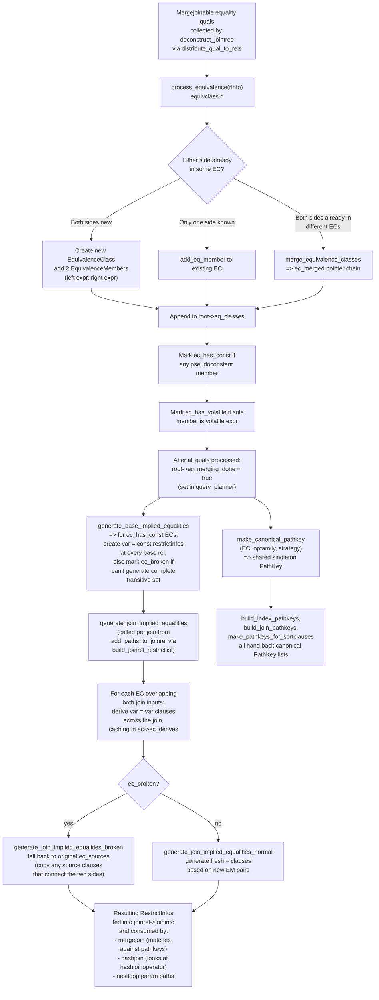
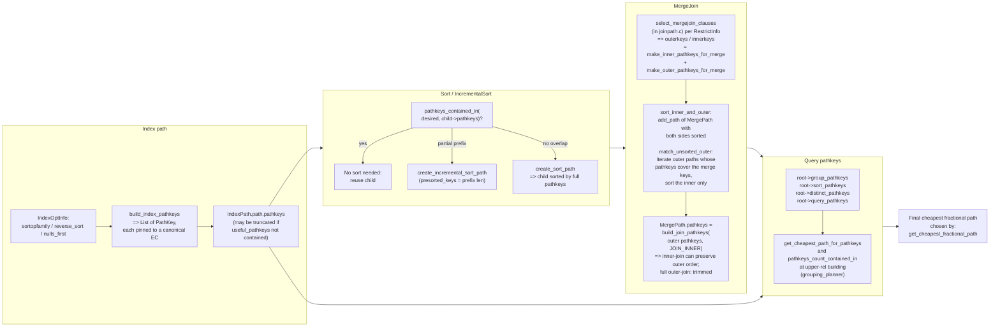

# 10. Equivalence Classes and PathKeys

Prerequisites: [09_cost_model_and_selectivity.md](./09_cost_model_and_selectivity.md),
[05_initial_setup_and_jointree.md](./05_initial_setup_and_jointree.md).

This module documents how equality and sort-order are reasoned
about uniformly in the planner. Sources:

- `src/backend/optimizer/path/equivclass.c` (~3400 lines): EC
  creation, merging, derivation of implied equalities.
- `src/backend/optimizer/path/pathkeys.c` (~2300 lines): PathKey
  construction, comparison, propagation.
- `src/include/nodes/pathnodes.h`: structures (`EquivalenceClass`
  at line 1379, `EquivalenceMember` at 1430, `PathKey` at 1463).

---

## 1. Why this exists

Equivalence classes (ECs) and pathkeys are PostgreSQL's mechanism
for **reasoning about value equality and sort order across a query**.

- An **`EquivalenceClass`** captures the fact that several
  expressions are guaranteed to be equal under btree-mergejoinable
  equality. For example, `a.x = b.y AND b.y = c.z` implies
  `{a.x, b.y, c.z}` are all equal.
- A **`PathKey`** is the canonical handle the planner uses to
  represent a sort-order requirement; it points to an EC, plus the
  btree opfamily / strategy / nulls-first to identify a specific
  direction.

This unification gives the planner three powerful capabilities:

1. **Implied join clauses**: from `a.x = b.y` alone, the planner
   can generate `a.x = c.z` and `b.y = c.z` on demand.
2. **Sort-order equivalence**: an `ORDER BY a.x` is satisfied by
   any path whose pathkeys lead with `pk_eclass = EC{a.x, b.y,
   c.z}`, regardless of which underlying expression it actually
   emits.
3. **Cheap mergeclause selection**: mergejoinable RestrictInfos
   cache pointers to their own ECs (`left_ec`, `right_ec`); if both
   sides are in the same EC, the clause is mergejoinable.

---

## 2. Symbol table

| Symbol                                            | File:line                                     | Importance |
|---------------------------------------------------|-----------------------------------------------|------------|
| `EquivalenceClass`                                | `src/include/nodes/pathnodes.h:1379`          | 0.78 |
| `EquivalenceMember`                               | `src/include/nodes/pathnodes.h:1430`          | 0.65 |
| `PathKey`                                         | `src/include/nodes/pathnodes.h:1463`          | 0.65 |
| `process_equivalence`                             | `src/backend/optimizer/path/equivclass.c:117` | 0.70 |
| `add_eq_member`                                   | `src/backend/optimizer/path/equivclass.c`     | 0.50 |
| `merge_equivalence_classes`                       | `src/backend/optimizer/path/equivclass.c`     | 0.55 |
| `get_eclass_for_sort_expr`                        | `src/backend/optimizer/path/equivclass.c`     | 0.55 |
| `generate_base_implied_equalities`                | `src/backend/optimizer/path/equivclass.c`     | 0.60 |
| `generate_join_implied_equalities`                | `src/backend/optimizer/path/equivclass.c`     | 0.60 |
| `generate_join_implied_equalities_for_ecs`        | `src/backend/optimizer/path/equivclass.c`     | 0.45 |
| `generate_join_implied_equalities_normal`         | `src/backend/optimizer/path/equivclass.c`     | 0.45 |
| `generate_join_implied_equalities_broken`         | `src/backend/optimizer/path/equivclass.c`     | 0.45 |
| `make_canonical_pathkey`                          | `src/backend/optimizer/path/pathkeys.c`       | 0.55 |
| `make_pathkey_from_sortinfo`                      | `src/backend/optimizer/path/pathkeys.c`       | 0.50 |
| `make_pathkeys_for_sortclauses`                   | `src/backend/optimizer/path/pathkeys.c`       | 0.50 |
| `build_index_pathkeys`                            | `src/backend/optimizer/path/pathkeys.c`       | 0.55 |
| `build_join_pathkeys`                             | `src/backend/optimizer/path/pathkeys.c`       | 0.55 |
| `build_expression_pathkey`                        | `src/backend/optimizer/path/pathkeys.c`       | 0.45 |
| `build_partition_pathkeys`                        | `src/backend/optimizer/path/pathkeys.c`       | 0.45 |
| `pathkeys_contained_in`                           | `src/backend/optimizer/path/pathkeys.c`       | 0.55 |
| `pathkeys_count_contained_in`                     | `src/backend/optimizer/path/pathkeys.c`       | 0.45 |
| `get_cheapest_path_for_pathkeys`                  | `src/backend/optimizer/path/pathkeys.c`       | 0.45 |
| `compare_pathkeys`                                | `src/backend/optimizer/path/pathkeys.c`       | 0.50 |

---

## 3. EC derivation pipeline

The diagram below (from `06_eclass_derivation.mermaid`) shows the
full EC lifecycle: how mergejoinable equality quals enter the
system, how they are merged into ECs, and how implied equalities
are later derived for joins and base rels.



---

## 4. PathKey propagation

The companion diagram (`07_pathkey_propagation.mermaid`) shows how
pathkeys flow through indexscan, sort, and mergejoin:



---

## 5. EquivalenceClass and EquivalenceMember

```c
typedef struct EquivalenceClass {
    NodeTag      type;
    List        *ec_opfamilies;     /* btree operator family OIDs */
    Oid          ec_collation;       /* collation, if collatable types */
    List        *ec_members;        /* List of EquivalenceMember */
    List        *ec_sources;        /* RestrictInfos that generated this EC */
    List        *ec_derives;         /* RestrictInfos derived from this EC */
    Relids       ec_relids;          /* relids of all non-child members */
    bool         ec_has_const;       /* any pseudoconstant member? */
    bool         ec_has_volatile;    /* sole member is a volatile expr? */
    bool         ec_broken;          /* couldn't generate full inference set */
    Index        ec_sortref;         /* originating SortGroupRef, or 0 */
    Index        ec_min_security;    /* min security level seen */
    Index        ec_max_security;    /* max security level seen */
    EquivalenceClass *ec_merged;     /* if non-NULL, merged into another EC */
} EquivalenceClass;
```

Source: `src/include/nodes/pathnodes.h:1379`.

```c
typedef struct EquivalenceMember {
    NodeTag       type;
    Expr         *em_expr;            /* the expression */
    Relids        em_relids;          /* relids in em_expr */
    bool          em_is_const;        /* pseudoconstant? */
    bool          em_is_child;        /* derived for an appendrel child? */
    Oid           em_datatype;        /* nominal type used by opfamily */
    JoinDomain   *em_jdomain;         /* JD of source clause (consts only really need this) */
    EquivalenceMember *em_parent;    /* if em_is_child, parent EM */
} EquivalenceMember;
```

Source: `src/include/nodes/pathnodes.h:1430`.

### 5.1 Important invariants

- **Pointer identity**: ECs are not copied. `copyObject()` on a
  struct containing an EC pointer just copies the pointer.
  `equal()` compares by pointer (the `copy_as_scalar` /
  `equal_as_scalar` attributes enforce this).
- **`ec_merged`** chains: when `merge_equivalence_classes` is
  called, the loser gets `ec_merged = winner`. Code that holds an
  EC pointer can detect a stale reference via `ec_merged != NULL`
  and follow the chain. After `ec_merging_done = true`, no new
  merges happen, so it's safe to ignore `ec_merged` chains.
- **Child members** (`em_is_child`): not real first-class members.
  They reflect a parent EM into appendrel child relids for
  pathkey-from-child purposes. Most code skips them.
- **`ec_has_const`** triggers `EC_MUST_BE_REDUNDANT`: a PathKey on
  this EC is redundant (only one possible value), so it's stripped
  from a path's pathkeys list.

---

## 6. PathKey

```c
typedef struct PathKey {
    NodeTag      type;
    EquivalenceClass *pk_eclass;
    Oid          pk_opfamily;          /* btree opfamily defining ordering */
    int          pk_strategy;          /* BTLessStrategyNumber=ASC, BTGreaterStrategyNumber=DESC */
    bool         pk_nulls_first;
} PathKey;
```

Source: `src/include/nodes/pathnodes.h:1463`.

A `pathkeys` list is the path's sort order. The first PathKey is
the primary key. `NIL` means "unsorted".

### 6.1 Canonicalization

`make_canonical_pathkey(root, eclass, opfamily, strategy,
nulls_first)` returns a **shared** PathKey object (recorded in
`root->canon_pathkeys`). Two paths sorted by the same EC + opfamily
+ direction will share `==` PathKey pointers, making
`compare_pathkeys` essentially a pointer comparison.

This is also why pathkey computation must wait for
`ec_merging_done`: otherwise canonical pathkeys would point to ECs
that later get `ec_merged`, leaving dangling references.

### 6.2 `compare_pathkeys`

Returns:

- `PATHKEYS_EQUAL` — same prefix, both sides equal length.
- `PATHKEYS_BETTER1` — list 1 is a strict prefix-extension of list
  2.
- `PATHKEYS_BETTER2` — list 2 is a strict prefix-extension of list
  1.
- `PATHKEYS_DIFFERENT` — incompatible somewhere.

Used heavily by `add_path` (Pareto), `pathkeys_contained_in` (sort
elimination), and merge-key matching.

---

## 7. EC creation and merging

### 7.1 `process_equivalence`

Source: `src/backend/optimizer/path/equivclass.c:117`. Signature:

```c
bool
process_equivalence(PlannerInfo *root,
                    RestrictInfo **p_restrictinfo,
                    JoinDomain *jdomain);
```

Called from `distribute_qual_to_rels` for every mergejoinable
equality clause. Returns `true` on success (the clause was
absorbed); on `false` the caller must keep the clause as a normal
RestrictInfo. Outline:

1. Extract `(item1, item2, opfamily, opstrategy, opcollation)`.
2. Look up each side: is it already an `EquivalenceMember` of some
   EC?
3. **Case analysis**:
   - **Both new**: create a new EC, two members, append to
     `root->eq_classes`.
   - **One side known**: `add_eq_member` to the existing EC.
   - **Both in the same EC**: it's a redundant clause — record in
     `ec_sources` only.
   - **Both in different ECs**: `merge_equivalence_classes` (set
     `ec_merged` on the loser, splice members and sources).
4. Special-case: if either side is a pseudoconstant, mark
   `ec_has_const = true` and remember the constant's `JoinDomain`
   in the new const member's `em_jdomain` (prevents cross-domain
   merges through a pseudoconstant).

### 7.2 `add_eq_member`

Adds an `EquivalenceMember` and updates `ec_relids` (for non-child
members) and `ec_has_const`.

### 7.3 `merge_equivalence_classes`

Splices `loser->ec_members` into `winner`, similarly for sources.
Sets `loser->ec_merged = winner`. Updates `ec_relids`.

### 7.4 `get_eclass_for_sort_expr`

Used to introduce sort-only ECs for ORDER BY / GROUP BY expressions
that aren't already in any EC. Builds a singleton EC if needed
(with `ec_sortref` recording the SortGroupRef).

---

## 8. Implied equalities

### 8.1 `generate_base_implied_equalities` (called from query_planner)

For each EC:

- If it has `ec_has_const = true`, generate one `var = const`
  RestrictInfo per non-const member at every rel that has the var.
  These are added to the rel's `baserestrictinfo`.
- For ECs without a const, **broken-EC path**: if any member is
  unreachable from another (e.g. due to outer-join boundaries),
  set `ec_broken = true`. Then keep the original `ec_sources`
  clauses visible as join clauses (since we can't generate the
  full transitive closure).

### 8.2 `generate_join_implied_equalities` (called per join)

Signature:

```c
List *generate_join_implied_equalities(PlannerInfo *root,
                                        Relids join_relids,
                                        Relids outer_relids,
                                        RelOptInfo *inner_rel,
                                        SpecialJoinInfo *sjinfo);
```

For each EC overlapping both `outer_relids` and
`inner_rel->relids`:

- Choose representative members, one from each side.
- If `ec_broken`, fall back to
  `generate_join_implied_equalities_broken` which copies any source
  clauses connecting the two sides.
- Else `generate_join_implied_equalities_normal` builds fresh
  `var = var` RestrictInfos via `build_implied_join_equality`.
- Cache derived RestrictInfos in `ec->ec_derives` to avoid
  rebuilding on subsequent join attempts.

The result is folded into the joinrel's restrictlist, so
`add_paths_to_joinrel` sees these implied clauses alongside the
original RestrictInfos.

### 8.3 Broken ECs and outer joins

A "broken" EC is one where the planner couldn't safely propagate
equality across the whole class because some intermediate clause is
on the nullable side of an OUTER JOIN. Concretely:

```sql
SELECT *
FROM a LEFT JOIN b ON a.x = b.y
       LEFT JOIN c ON b.y = c.z
WHERE a.x = c.z;       -- <-- WHERE qual, applied above all joins
```

The WHERE clause `a.x = c.z` would let us infer `a.x = b.y = c.z`
… but `b.y` may be NULL after the first LEFT JOIN. The planner
cannot freely substitute `b.y` for `a.x` in clauses below the LEFT
JOIN. `reconsider_outer_join_clauses` (planmain.c) walks the
postponed OJ clauses and either grafts them onto an existing EC
(if the EC's membership covers the OJ's nullable side correctly)
or marks the EC broken.

When `ec_broken = true`, derivation falls back to
`generate_join_implied_equalities_broken`, which only re-emits
source clauses that exactly span the requested `outer_relids` /
`inner_rel->relids` boundary. This sacrifices some optimization
opportunities but preserves correctness. A more thorough
walkthrough is in [20_deep_dives.md](./20_deep_dives.md#broken-ecs).

---

## 9. PathKey construction

### 9.1 `make_canonical_pathkey`

Returns a singleton PathKey for a given (EC, opfamily, strategy,
nulls_first) tuple. Caches in `root->canon_pathkeys`.

### 9.2 `make_pathkey_from_sortinfo`

Builds a PathKey from a sort-info tuple (collation, opno,
nulls_first) — used by `make_pathkeys_for_sortclauses` for ORDER
BY/GROUP BY.

### 9.3 `make_pathkeys_for_sortclauses`

Convert a `List` of `SortGroupClause` into the corresponding
pathkeys list. Used to build `root->sort_pathkeys`,
`root->distinct_pathkeys`, `root->group_pathkeys`,
`root->query_pathkeys`.

### 9.4 `build_index_pathkeys`

Source: `src/backend/optimizer/path/pathkeys.c`.

For an ordered index, build a pathkeys list reflecting the index's
sort order. Each index column becomes a PathKey via the EC obtained
by `get_eclass_for_sort_expr` on the column's expression. PathKeys
beyond the first column not actually being constrained by index
quals are kept (they still describe the order).

For a multi-column index, if the leading column's EC has a const,
the leading PathKey is redundant (`EC_MUST_BE_REDUNDANT`) and
stripped; the next column's PathKey becomes the primary.

### 9.5 `build_join_pathkeys`

Given the outer's pathkeys and the join type, produce the join's
output pathkeys:

- INNER join: outer pathkeys preserved (mergejoin/nestloop).
- LEFT join: outer pathkeys preserved (NULL-extended rows still in
  outer order).
- RIGHT/RIGHT-ANTI: usually `NIL` because the LHS isn't ordered
  unconditionally.
- FULL: usually `NIL`.
- For nestloop: outer pathkeys preserved.
- For hashjoin: always `NIL` (hash reorders).
- For mergejoin: outer pathkeys preserved (the merge order matches
  outer input order).

### 9.6 `build_partition_pathkeys`

Used for ordered append over range-partitioned tables to produce a
`MergeAppendPath`. PathKeys reflect the partition keys' order
across children.

### 9.7 `build_expression_pathkey`

For a single expression, build a pathkey via
`get_eclass_for_sort_expr` (will create a singleton EC if needed).
Used e.g. for window-function PARTITION BY ordering.

---

## 10. Pathkey usage

### 10.1 `pathkeys_contained_in(keys1, keys2)`

True iff `keys1` is a prefix of `keys2`. The classic test for "do I
need a Sort?". Used by:

- `try_mergejoin_path`: skip explicit sort if outer/inner already
  cover the merge keys.
- `get_cheapest_path_for_pathkeys`: select cheapest path with a
  given sort prefix.
- `cost_sort` decision in `create_sort_path` /
  `create_incremental_sort_path`.

### 10.2 `pathkeys_count_contained_in(keys1, keys2, &n_common)`

Returns true with `*n_common` set to the length of the common
prefix. Used by **incremental sort**: if `n_common < len(target)`,
the prefix is presorted and only the suffix needs sorting per
group.

### 10.3 `get_cheapest_path_for_pathkeys`

Among `pathlist`, return the cheapest path whose pathkeys cover the
required sort order. Used for picking sources in
`create_ordered_paths`, `create_grouping_paths`, etc.

---

## 11. Performance considerations

- **EC merging is O(N)** in the EC list (scanning to find members).
  After merging, the merged EC's members may need `ec_relids =
  ec_union(...)` recomputation. For large queries the total EC
  merge work is small relative to DP search.
- **PathKey canonicalization** is O(canon_pathkeys size) per
  lookup; `root->canon_pathkeys` is typically << 100 entries.
- **`generate_join_implied_equalities`** is called per `(outer,
  inner, ...)` join attempt. ECs with caching in `ec_derives` keep
  this cheap on subsequent attempts.

---

## 12. Cross-references

- Where ECs are seeded from quals:
  [05_initial_setup_and_jointree.md](./05_initial_setup_and_jointree.md)
- Pathkey-driven sort decisions in upper rels:
  [03_lifecycle_and_entry_points.md](./03_lifecycle_and_entry_points.md#api-grouping_planner)
- Mergejoin clause selection:
  [08_join_paths_and_search.md](./08_join_paths_and_search.md)
- `RestrictInfo` `parent_ec` / `left_ec` / `right_ec` fields:
  [11_restrictinfo_and_clause_utils.md](./11_restrictinfo_and_clause_utils.md)
- Algorithmic deep dive (broken EC handling, identity-3 interplay):
  [20_deep_dives.md](./20_deep_dives.md)
- Data-structure reference (`EquivalenceClass`,
  `EquivalenceMember`, `PathKey`):
  [appendix_data_structures.md](./appendix_data_structures.md)

---

Next: [11_restrictinfo_and_clause_utils.md](./11_restrictinfo_and_clause_utils.md)
