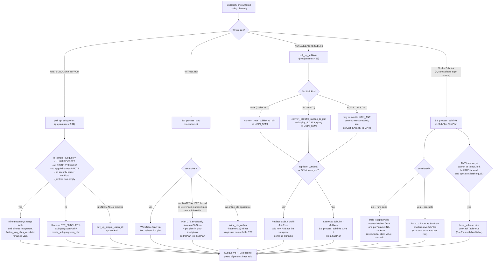

# 12. Subqueries, SubLinks, and Join Removal

Prerequisites: [06 Preprocessing](06_preprocessing.md), [11 RestrictInfo and clause utilities](11_restrictinfo_and_clause_utils.md).

A "subquery" can take many forms in SQL, and the planner has very different optimization paths for each form. This module describes how the planner classifies subqueries, when it pulls them up into the parent (so the cost-based optimizer sees one big query), when it leaves them as a standalone plan reachable through SubqueryScan, and when it materializes them as SubPlan or InitPlan nodes referenced from expressions. It also covers two cleanup passes — useless-join removal and unique-semijoin reduction — that often produce dramatic plan simplifications, plus the MIN/MAX index trick implemented by `planagg.c`.

Sources:
- `src/backend/optimizer/plan/subselect.c` (~3000 lines): SubLink conversion, SubPlan / InitPlan construction, `SS_finalize_plan`.
- `src/backend/optimizer/plan/analyzejoins.c`: useless-join removal, semijoin reduction.
- `src/backend/optimizer/prep/prepjointree.c`: subquery and sublink pull-up (also covered in [Module 06](06_preprocessing.md)).
- `src/backend/optimizer/plan/planagg.c`: MIN/MAX aggregate optimization.

## 12.1 The five kinds of subquery

| Form                                     | Where it appears | Resolution                                   |
|------------------------------------------|------------------|----------------------------------------------|
| FROM-clause subquery                     | RTE_SUBQUERY     | `pull_up_subqueries` or SubqueryScan         |
| WITH list                                | CTE              | `SS_process_ctes` (inline / SubPlan / RecursiveUnion) |
| ANY/ALL/EXISTS predicate                 | SubLink in WHERE | `pull_up_sublinks` or `SS_process_sublinks`  |
| Scalar subquery in expression context    | SubLink in tlist | `SS_process_sublinks` → SubPlan/InitPlan     |
| Correlation reference                    | Inside any of the above | `SS_replace_correlation_vars`         |

The planner's job is to:

1. Pull up what can be pulled up so the cost-based optimizer sees one big query (best plan space).
2. For what cannot be pulled up, decide between SubqueryScan (FROM subquery, planned independently), InitPlan (uncorrelated scalar subquery, runs once), SubPlan (correlated, runs per row), and AlternativeSubPlan (planner emits both forms; executor picks at runtime).
3. Remove useless joins (LEFT JOIN where the inner is unique on the join key and unreferenced from above) and reduce semi-joins to inner joins when the RHS is unique.
4. Recognize MIN/MAX patterns that can be served by an index-ordered scan + LIMIT 1.

The decision tree is captured in the diagram below.



## 12.2 Symbol table

| Symbol                                | File:line                                          | Importance | Tier |
|---------------------------------------|----------------------------------------------------|------------|------|
| `convert_ANY_sublink_to_join`         | `src/backend/optimizer/plan/subselect.c`           | 0.65 | 2 |
| `convert_EXISTS_sublink_to_join`      | `src/backend/optimizer/plan/subselect.c`           | 0.65 | 2 |
| `simplify_EXISTS_query`               | `src/backend/optimizer/plan/subselect.c`           | 0.50 | 2 |
| `convert_EXISTS_to_ANY`               | `src/backend/optimizer/plan/subselect.c`           | 0.45 | 3 |
| `convert_VALUES_to_ANY`               | `src/backend/optimizer/plan/subselect.c`           | 0.40 | 3 |
| `SS_process_ctes`                     | `src/backend/optimizer/plan/subselect.c`           | 0.55 | 2 |
| `SS_process_sublinks`                 | `src/backend/optimizer/plan/subselect.c`           | 0.65 | 2 |
| `SS_replace_correlation_vars`         | `src/backend/optimizer/plan/subselect.c`           | 0.55 | 2 |
| `SS_assign_special_param`             | `src/backend/optimizer/plan/subselect.c`           | 0.45 | 3 |
| `SS_charge_for_initplans`             | `src/backend/optimizer/plan/subselect.c`           | 0.40 | 3 |
| `SS_identify_outer_params`            | `src/backend/optimizer/plan/subselect.c`           | 0.40 | 3 |
| `SS_finalize_plan`                    | `src/backend/optimizer/plan/subselect.c`           | 0.65 | 2 |
| `make_subplan` / `build_subplan`      | `src/backend/optimizer/plan/subselect.c`           | 0.55 | 2 |
| `inline_cte`                          | `src/backend/optimizer/plan/subselect.c`           | 0.45 | 3 |
| `preprocess_minmax_aggregates`        | `src/backend/optimizer/plan/planagg.c`             | 0.50 | 2 |
| `build_minmax_path`                   | `src/backend/optimizer/plan/planagg.c`             | 0.45 | 3 |
| `remove_useless_joins`                | `src/backend/optimizer/plan/analyzejoins.c`        | 0.55 | 2 |
| `join_is_removable`                   | `src/backend/optimizer/plan/analyzejoins.c`        | 0.50 | 2 |
| `reduce_unique_semijoins`             | `src/backend/optimizer/plan/analyzejoins.c`        | 0.50 | 2 |
| `rel_supports_distinctness`           | `src/backend/optimizer/plan/analyzejoins.c`        | 0.40 | 3 |
| `innerrel_is_unique`                  | `src/backend/optimizer/plan/analyzejoins.c`        | 0.50 | 2 |

## 12.3 SubLink kinds

`SubLink.subLinkType` enumerates:

| Kind                | Meaning                          | Conversion goal |
|---------------------|----------------------------------|-----------------|
| `EXISTS_SUBLINK`    | `EXISTS (subquery)`              | JOIN_SEMI       |
| `ALL_SUBLINK`       | `expr op ALL (subquery)`         | mostly stays as SubPlan |
| `ANY_SUBLINK`       | `expr op ANY (subquery)` / `IN`  | JOIN_SEMI       |
| `ROWCOMPARE_SUBLINK`| `(a, b) op (subquery)`           | SubPlan         |
| `EXPR_SUBLINK`      | `(SELECT ...)` scalar context    | InitPlan / SubPlan |
| `MULTIEXPR_SUBLINK` | `(a, b) := (subquery)` (UPDATE)  | SubPlan with multi-output |
| `ARRAY_SUBLINK`     | `ARRAY(subquery)`                | SubPlan         |
| `CTE_SUBLINK`       | (synthetic) reference to CTE     | resolved by `SS_process_ctes` |

`pull_up_sublinks` handles `ANY` and `EXISTS` (and their `NOT` variants) at top-level WHERE / inner-JOIN ON positions, producing JoinExpr nodes. Anything else is left for `SS_process_sublinks` (inside `preprocess_expression`) which produces SubPlan / InitPlan / AlternativeSubPlan nodes.

## 12.4 `convert_ANY_sublink_to_join`

Given `lhs op ANY (SELECT y FROM ...)` the conversion:

1. Inserts the subquery's range table into the parent's rangetable as RTE_SUBQUERY.
2. Constructs a JoinExpr with `jointype = JOIN_SEMI`, `larg = original jointree position`, `rarg = RangeTblRef to the pulled-up subquery`, and `quals` set to `lhs op subquery_output`.
3. Returns the new JoinExpr; the caller splices it in.

Eligibility checks (in the caller `pull_up_sublinks_qual_recurse`):

- The SubLink is not inside an OR (would change semantics).
- The SubLink is not volatile / set-returning in a forbidden context.
- The qual is in a position where converting to SEMI-JOIN preserves semantics (top of WHERE, or in INNER JOIN ON).

After conversion, the inner subquery is itself a candidate for `pull_up_subqueries`. The pulled-up subquery's `tlist` becomes referenceable Vars in the parent.

## 12.5 `convert_EXISTS_sublink_to_join`

Outline:

1. Simplify the EXISTS subquery via `simplify_EXISTS_query`:
   - Replace the targetlist with `SELECT 1` (EXISTS only cares about row existence).
   - Drop ORDER BY / DISTINCT / GROUP BY (no effect on existence).
   - Drop LIMIT/OFFSET except in cases that change row presence (LIMIT 0 etc.).
   - Drop window functions and other no-op clauses.
2. Build the JoinExpr with `jointype = JOIN_SEMI` (or `JOIN_ANTI` for `NOT EXISTS`), with empty `quals` (the qualifier is implicit in the EXISTS structure).
3. The subquery's WHERE clause becomes the JOIN ON condition.

### 12.5.1 `convert_EXISTS_to_ANY`

For `EXISTS (SELECT ... WHERE outer_var = inner_var)`, the planner may rewrite to `outer_var = ANY (SELECT inner_var ...)` to produce a JOIN_SEMI on a single equality clause, which downstream code costs better. Eligibility: simple correlation pattern, no GROUP/aggregates, etc.

### 12.5.2 `convert_VALUES_to_ANY`

`x = ANY (VALUES (1), (2), (3))` rewrites the VALUES into an array and uses ScalarArrayOpExpr semantics, avoiding subquery overhead entirely. Eligibility: small VALUES list and equality operator with array-OpExpr support.

## 12.6 CTE handling

### 12.6.1 `SS_process_ctes`

For each `CommonTableExpr` in `parse->cteList`:

- If recursive: plan it via `subquery_planner` and stash a Plan referencing a `RecursiveUnion`. The non-recursive arm becomes the seed; the recursive arm scans the work-table identified by `wt_param_id`.
- If non-recursive and inlinable (single use, not MATERIALIZED, no side-effect operations): mark for inlining via `inline_cte_walker`.
- Else plan as a standalone subquery and store the resulting SubPlan in `glob->subplans`. Make this CTE referenceable via `cte_plan_ids`.

### 12.6.2 `inline_cte`

The walker that replaces `RangeTblRef → CteScan` references with the CTE's parsed body. Done before `pull_up_subqueries` so the inlined body has a chance to be pulled up further.

The "inlinable" determination is conservative: a CTE referenced once, not marked MATERIALIZED, and free of side effects qualifies. PostgreSQL 12 introduced this default-inline behavior, replacing the older "always materialize" semantics that were a frequent source of slow plans.

## 12.7 SubPlans, InitPlans, and AlternativeSubPlan

### 12.7.1 `SS_process_sublinks`

Walks an expression. For each remaining SubLink:

- Recursively process child expressions so nested SubLinks are handled bottom-up.
- Call `make_subplan` to construct a SubPlan or InitPlan from the SubLink.
- Replace the SubLink with the resulting node in the expression tree.

### 12.7.2 `make_subplan` and `build_subplan`

`make_subplan` decides which subplan style is appropriate based on the SubLink kind and correlation:

- **Uncorrelated EXPR_SUBLINK**: build an InitPlan (runs at most once; result cached in a PARAM_EXEC).
- **Correlated EXPR_SUBLINK**: build a SubPlan (per-row).
- **ANY/ALL with hashable RHS**: build a SubPlan with `useHashTable = true`; executor builds a hash of the RHS and probes per outer tuple (fast for non-pull-uppable IN cases).
- **MULTIEXPR_SUBLINK**: SubPlan returning multiple outputs; the parent UPDATE references them via `multiexpr_params`.

`build_subplan` does the actual `subquery_planner` recursion, then builds the SubPlan/Plan node.

### 12.7.3 InitPlan vs SubPlan

- **InitPlan**: uncorrelated. Stored in `Plan.initPlan` of the node that uses its result; executed once at plan startup. Reads of the InitPlan's output go through PARAM_EXEC slots set by the executor when the InitPlan completes.
- **SubPlan**: correlated. Stored inline in expressions. Executed per-row when its parameter values change.

### 12.7.4 AlternativeSubPlan

For ANY/ALL where both hashed and non-hashed implementations are plausible, the planner builds **both** as `AlternativeSubPlan` and the executor picks at run-time using `numCalls × cost` heuristics. This is one of the few places where PostgreSQL emits adaptive plans.

## 12.8 `SS_finalize_plan`

`src/backend/optimizer/plan/subselect.c`. Called from `standard_planner` after `set_plan_references`. Walks the final Plan tree to:

1. Compute `extParam` and `allParam` for each plan node. `allParam` is the set of PARAM_EXEC IDs that any descendant evaluates; `extParam` is the subset this node depends on (i.e. supplied from outside).
2. Determine `parallel_safe` propagation up the plan tree.
3. Number sub-plans in `glob->subplans` and assign final IDs.
4. Compute `rewindPlanIDs`: set membership for SubPlans that need their tuplestore rewound (e.g. when used inside a node that calls them multiple times with the same parameter).

`SS_finalize_plan` also moves InitPlans to the right nodes — InitPlans are attached to the lowest plan node whose `extParam` set includes the InitPlan's outputs.

### 12.8.1 `SS_assign_special_param`

Allocates a fresh PARAM_EXEC ID in `glob->paramExecTypes`. Used by correlation vars, recursive worktables, alternative subplans, etc.

### 12.8.2 `SS_replace_correlation_vars`

Replaces `Var(varlevelsup > 0)` references with `Param(PARAM_EXEC, paramid)` nodes during `preprocess_expression`. The mapping is recorded in `root->plan_params` so the parent query's planner knows which expressions to evaluate for each Param.

### 12.8.3 `SS_charge_for_initplans`

Adjust path costs in the topmost rel to account for InitPlan execution (one-time cost added to startup of the plan that owns the InitPlan).

### 12.8.4 `SS_identify_outer_params`

Records `root->outer_params` — the PARAM_EXEC IDs visible from outer query levels. Used by lower-level subquery planning to know which Params it can reference.

## 12.9 MIN/MAX optimization

`src/backend/optimizer/plan/planagg.c`.

`preprocess_minmax_aggregates` recognizes:

```sql
SELECT min(x), max(y) FROM t WHERE ...;
```

where each min/max can be served by an index-ordered scan + LIMIT 1 on `t`. Conditions:

- The aggregate is `min` or `max` (datatype must have an opclass).
- An index `t(x)` exists with sort order matching the aggregate.
- The qual list is "safe" — the scan with extra WHERE filter would return matching rows in index order.
- No GROUP BY (the optimization is for ungrouped scalar aggregates).

`build_minmax_path` constructs one inner SortPath / IndexPath + LimitPath per aggregate. The aggregates collectively become a `MinMaxAggPath`; create_plan turns this into a `Result` whose expression refers to per-aggregate subplans (see [Module 18 MinMaxAggPath](18_path_catalog.md#minmaxaggpath-t_minmaxaggpath) and [Module 19 create_minmaxagg_plan](19_plan_creator_catalog.md#create_minmaxagg_plan)).

If multiple aggregates can be optimized this way, all benefit. If even one cannot, the optimization is abandoned for the whole query.

Example:

```sql
SELECT min(id) FROM big;
-- Result
--   InitPlan 1 (returns $0)
--     ->  Limit
--           ->  Index Only Scan using big_pkey on big
--                 Index Cond: (id IS NOT NULL)
```

## 12.10 `remove_useless_joins`

`src/backend/optimizer/plan/analyzejoins.c`.

Walks `joinlist` produced by `deconstruct_jointree`. For each LEFT JOIN, `join_is_removable` checks:

- The inner side is referenced ONLY by the join condition (no references in tlist, no references in joins above this).
- The inner is provably **unique** on its join columns (via `rel_supports_distinctness` — checks unique constraints, primary keys, EC-derived uniqueness).
- The join clauses are pure equalities on the join columns.

If yes, drop the LEFT JOIN entirely: the result is the same as just the LHS. Update `joinlist` and remove the inner rel from `simple_rel_array` markers.

This optimization is a big win for views and ORM-generated joins where the joined table is never accessed. It also runs again at the end of preprocessing because earlier transformations may newly satisfy its conditions.

## 12.11 `reduce_unique_semijoins`

For each `SpecialJoinInfo` with `jointype == JOIN_SEMI`, `innerrel_is_unique` tests whether the inner side is provably unique on the semi-join's RHS expressions. If yes, the SJ can be downgraded to a plain inner join — at most one inner row matches each outer row, so the semi-join's "first match wins" is a no-op.

Effect: the SpecialJoinInfo's `jointype` becomes `JOIN_INNER` (or the SJ is dropped entirely if no constraints remain). This unlocks more join orderings that were illegal under SEMI.

### 12.11.1 `innerrel_is_unique`

Cached via `rel->unique_for_rels` / `rel->non_unique_for_rels`. Checks:

- Unique constraint or primary key over the join columns.
- Unique partial index whose predicate is implied.
- For sub-rels: the underlying subquery's `DISTINCT`/`GROUP BY` makes it unique.

The cache makes repeated probes cheap, which matters because the question is asked on every (outer, inner) pair the join search considers.

## 12.12 Performance characteristics

- `pull_up_sublinks` / `pull_up_subqueries`: O(jointree size + sublink count). Each pulled-up subquery may trigger further pull-up.
- `SS_process_sublinks`: O(expression size). Each remaining SubLink triggers a `subquery_planner` recursion.
- `SS_finalize_plan`: O(plan tree size). Linear walk.
- `remove_useless_joins`: O(joinlist size × per-join uniqueness check). Uniqueness checks are cached per rel.
- `reduce_unique_semijoins`: O(SpecialJoinInfo count × per-rel uniqueness check). Same caching applies.

## 12.13 Cross-references

- Pull-up details: [06 Preprocessing](06_preprocessing.md).
- SpecialJoinInfo / OJ legality: [05 Initial setup and jointree](05_initial_setup_and_jointree.md).
- JoinDomain and EC interactions: [07 Equivalence classes and pathkeys](07_equivalence_classes_and_pathkeys.md).
- The PlannerInfo fields touched here (`init_plans`, `cte_plan_ids`, `multiexpr_params`, `plan_params`, `outer_params`, `wt_param_id`): [04 Lifecycle and entry points](04_lifecycle_and_entry_points.md).
- Plan finalization (`SS_finalize_plan` runs from `standard_planner`): [16 Plan creation and setrefs](16_plan_creation_and_setrefs.md).
- Path counterparts: [18 SubqueryScanPath](18_path_catalog.md#subqueryscanpath-t_subqueryscanpath), [18 MinMaxAggPath](18_path_catalog.md#minmaxaggpath-t_minmaxaggpath).
- Plan creator counterpart: [19 create_subqueryscan_plan](19_plan_creator_catalog.md#create_subqueryscan_plan).
- Subquery pull-up rules deep dive: [Module 20.10](20_deep_dives.md#2010-subquery-pull-up-rules-and-the-simple-subquery-predicate).

Next: [13 Inheritance and Partitioning](13_inheritance_and_partitioning.md).
