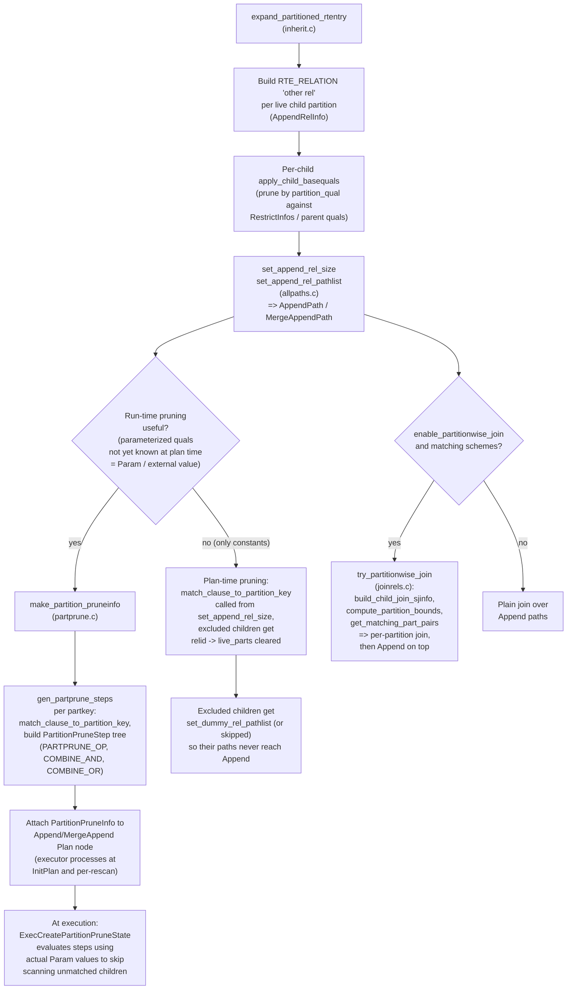

# 13. Inheritance and Partitioning

Prerequisites: [05 Initial setup and jointree](05_initial_setup_and_jointree.md), [08 Base relation paths](08_base_relation_paths.md), [11 RestrictInfo and clause utilities](11_restrictinfo_and_clause_utils.md).

Inheritance and partitioning add a fundamental concept to the planner: the **AppendRel**. An AppendRel is a parent RelOptInfo that represents the union of its children's rows. A partitioned table is the canonical example, but UNION ALL of compatible subqueries and pre-partitioning inheritance hierarchies use the same machinery. This module documents how the planner expands parent rels into per-child RelOptInfos, how it translates Vars between parent and child, how it prunes children at plan time and at execution time, and how it builds partitionwise joins and partitionwise aggregates.

Sources:
- `src/backend/optimizer/util/inherit.c` — `expand_inherited_rtentry`, `expand_partitioned_rtentry`, child RTE creation.
- `src/backend/optimizer/util/appendinfo.c` — `AppendRelInfo` helpers (`make_append_rel_info`, `adjust_appendrel_attrs`, `find_appinfos_by_relids`).
- `src/backend/optimizer/path/allpaths.c` — `set_append_rel_size`, `set_append_rel_pathlist`, `add_paths_to_append_rel`, `generate_orderedappend_paths`, `accumulate_append_subpath`, `get_cheapest_parameterized_child_path`.
- `src/backend/partitioning/partprune.c` — plan-time and run-time partition pruning.
- `src/backend/optimizer/path/joinrels.c` — `try_partitionwise_join`, `build_child_join_sjinfo`, `compute_partition_bounds`, `get_matching_part_pairs`.

## 13.1 What the planner has to do

An AppendRel forces seven decisions:

1. **Expand**: at the right point in the lifecycle, produce one child RelOptInfo per included child.
2. **Translate**: a Var referring to the parent must be rewritten to reference the child's column for plans built on children.
3. **Prune**: avoid scanning child relations whose range is excluded by query quals (compile-time pruning) or by parameter values (run-time pruning).
4. **Push down**: parent-level quals must be propagated to children (`apply_child_basequals`).
5. **Combine**: children's paths are unioned via `AppendPath` or `MergeAppendPath`.
6. **Partitionwise join**: when both sides are partitioned compatibly, per-partition joins followed by an Append are usually faster than a single big join.
7. **Partitionwise aggregate**: aggregates can sometimes be pushed below an Append.

The diagram below illustrates expansion through path generation, plan-time pruning, and runtime pruning.



## 13.2 Symbol table

| Symbol                                       | File:line                                     | Importance | Tier |
|----------------------------------------------|-----------------------------------------------|------------|------|
| `expand_inherited_rtentry`                   | `src/backend/optimizer/util/inherit.c:86`     | 0.65 | 2 |
| `expand_partitioned_rtentry`                 | `src/backend/optimizer/util/inherit.c:318`    | 0.55 | 2 |
| `expand_single_inheritance_child`            | `src/backend/optimizer/util/inherit.c`        | 0.45 | 3 |
| `apply_child_basequals`                      | `src/backend/optimizer/util/inherit.c`        | 0.50 | 2 |
| `make_append_rel_info`                       | `src/backend/optimizer/util/appendinfo.c`     | 0.50 | 2 |
| `adjust_appendrel_attrs`                     | `src/backend/optimizer/util/appendinfo.c`     | 0.55 | 2 |
| `find_appinfos_by_relids`                    | `src/backend/optimizer/util/appendinfo.c`     | 0.40 | 3 |
| `set_append_rel_size`                        | `src/backend/optimizer/path/allpaths.c`       | 0.55 | 2 |
| `set_append_rel_pathlist`                    | `src/backend/optimizer/path/allpaths.c:1232`  | 0.78 | 1 |
| `add_paths_to_append_rel`                    | `src/backend/optimizer/path/allpaths.c:1302`  | 0.78 | 1 |
| `generate_orderedappend_paths`               | `src/backend/optimizer/path/allpaths.c`       | 0.55 | 2 |
| `accumulate_append_subpath`                  | `src/backend/optimizer/path/allpaths.c`       | 0.45 | 3 |
| `get_cheapest_parameterized_child_path`      | `src/backend/optimizer/path/allpaths.c`       | 0.45 | 3 |
| `make_partition_pruneinfo`                   | `src/backend/partitioning/partprune.c`        | 0.55 | 2 |
| `gen_partprune_steps`                        | `src/backend/partitioning/partprune.c`        | 0.50 | 2 |
| `prune_append_rel_partitions`                | `src/backend/partitioning/partprune.c`        | 0.50 | 2 |
| `match_clause_to_partition_key`              | `src/backend/partitioning/partprune.c`        | 0.45 | 3 |
| `get_matching_partitions`                    | `src/backend/partitioning/partprune.c`        | 0.45 | 3 |
| `try_partitionwise_join`                     | `src/backend/optimizer/path/joinrels.c`       | 0.50 | 2 |
| `build_child_join_sjinfo`                    | `src/backend/optimizer/path/joinrels.c`       | 0.45 | 3 |
| `compute_partition_bounds`                   | `src/backend/optimizer/path/joinrels.c`       | 0.45 | 3 |
| `create_partitionwise_grouping_paths`        | `src/backend/optimizer/plan/planner.c`        | 0.45 | 3 |
| `AppendRelInfo`                              | `src/include/nodes/pathnodes.h:2959`          | 0.55 | 2 |

## 13.3 When inheritance expansion happens

Inheritance and partition expansion is intentionally delayed until after preprocessing, EquivalenceClass merging, and qual distribution, so that:

- Pruning quals are visible per-child with full RestrictInfo information.
- The parent's `notnullattnums`, `pages`, `tuples` etc. are settled.
- ECs and pathkeys are known so child-rel pathkey adjustment works.

In `query_planner`:

```c
/* most setup */
add_other_rels_to_query(root);   /* expansion step */
distribute_row_identity_vars(root);
/* then */
final_rel = make_one_rel(root, joinlist);
```

`add_other_rels_to_query` (initsplan.c) calls `expand_inherited_rtentry` for every parent RTE with `inh = true`.

## 13.4 `expand_inherited_rtentry` and `expand_partitioned_rtentry`

### 13.4.1 `expand_inherited_rtentry`

For a non-partitioned parent (regular inheritance):

1. Compute the children via `find_inheritance_children`.
2. For each child:
   - Build a child RTE_RELATION RTE.
   - Build a child RelOptInfo via `build_simple_rel(root, child_rti, parent_rel)` with `reloptkind = RELOPT_OTHER_MEMBER_REL`.
   - Build an `AppendRelInfo` linking parent ↔ child.
3. Call `apply_child_basequals` to propagate parent quals to children.

Signature in source: `expand_inherited_rtentry(PlannerInfo *root, RelOptInfo *rel, ...)` at `src/backend/optimizer/util/inherit.c:86`.

### 13.4.2 `expand_partitioned_rtentry`

For a partitioned parent:

1. Walk the partition descriptor (`PartitionDesc`) recursively (sub-partitioned tables produce intermediate "other partitioned rels").
2. Apply partition pruning at expansion time using `prune_append_rel_partitions` to skip whole subtrees that are definitively excluded.
3. Build `AppendRelInfo`s like the non-partitioned case, but the parent keeps its partitioning metadata (`part_scheme`, `boundinfo`, `partexprs`, `nullable_partexprs`) for later partitionwise-join matching.

Signature: `expand_partitioned_rtentry(PlannerInfo *root, RelOptInfo *relinfo, ...)` at `src/backend/optimizer/util/inherit.c:318`.

### 13.4.3 `apply_child_basequals`

Translates each parent-level RestrictInfo through `adjust_appendrel_attrs` so it refers to the child's columns, then adds the translated RestrictInfo to the child's `baserestrictinfo`.

## 13.5 `AppendRelInfo`

```c
typedef struct AppendRelInfo {
    NodeTag    type;
    Index      parent_relid;
    Index      child_relid;
    Oid        parent_reltype;
    Oid        child_reltype;
    List      *translated_vars;     /* parent-attno -> child Var/Expr */
    int        num_child_cols;
    AttrNumber *parent_colnos;       /* child-attno -> parent attno */
    Oid        parent_reloid;
} AppendRelInfo;
```

`src/include/nodes/pathnodes.h:2959`.

`translated_vars` enables forward translation: given a parent `Var(varattno=k)`, look up `list_nth(translated_vars, k-1)` to get the child expression. For inheritance the entries are simple Vars; for UNION ALL pull-up they may be arbitrary expressions.

`adjust_appendrel_attrs(root, expr, naps, appinfos)` walks `expr` and substitutes parent Vars accordingly. It is used for:

- Building child `baserestrictinfo` (parent qual → child qual).
- Translating parent `joininfo` references to children for partitionwise-join.
- Building child PathTargets.
- Parameterized path child-translation in `reparameterize_path_by_child`.

## 13.6 AppendRel path generation

### 13.6.1 `set_append_rel_size`

For a parent appendrel:

1. For each live child RelOptInfo, run `set_rel_size` (recurses into each child).
2. Sum child `rows` to get parent rows.
3. Sum child widths weighted by row count for parent width.
4. `consider_parallel` becomes the AND of children's flags.

### 13.6.2 `set_append_rel_pathlist`

`src/backend/optimizer/path/allpaths.c:1232`. For a parent appendrel:

1. For each live child, recurse `set_rel_pathlist`.
2. Call `add_paths_to_append_rel` with the surviving children.
3. Optionally generate ordered-append paths via `generate_orderedappend_paths` if the children share a pathkey order — a `MergeAppendPath` can preserve it.

### 13.6.3 `add_paths_to_append_rel`

`src/backend/optimizer/path/allpaths.c:1302`. Builds Append / MergeAppend / parallel-Append paths:

- **AppendPath (cheapest_total)**: pick each child's `cheapest_total_path` (or `cheapest_unique_path` etc.).
- **AppendPath (parameterized)**: for each distinct parameterization needed, pick `get_cheapest_parameterized_child_path` per child.
- **AppendPath (partial)**: parallel-aware Append. Children's `partial_pathlist` mixed with non-partial cheapest paths; partial children come first.
- **MergeAppendPath**: only if all children's pathkeys cover the required ordering. Built by `generate_orderedappend_paths`.

`accumulate_append_subpath` flattens nested AppendPaths whose subpaths can be merged into the outer Append's subpath list, avoiding redundant Append nodes — important for deep inheritance hierarchies that would otherwise build pyramidal Append trees.

## 13.7 Partition pruning

### 13.7.1 Plan-time pruning

Done from inside `expand_partitioned_rtentry` via `prune_append_rel_partitions`:

1. Walk the parent's `baserestrictinfo`.
2. For each clause, `match_clause_to_partition_key` decides whether the clause can be evaluated against the partition key (must be a stable expression of partition columns vs. constants).
3. `gen_partprune_steps` builds `PartitionPruneStep` nodes: AND/OR combinators and per-step operator information.
4. `get_matching_partitions` evaluates the steps using the constant sides; partitions whose bounds are excluded are dropped from `live_parts` and skipped during expansion.

### 13.7.2 Run-time pruning

When clauses depend on Params (parameter values unknown at plan time, e.g. PreparedStatement parameters or nestloop parameter sources), `make_partition_pruneinfo` builds a `PartitionPruneInfo` attached to the Append/MergeAppend Plan node. The executor evaluates the steps:

- At InitPlan time using initial Param values (`exec_init_partition_prune`).
- Per-rescan when nestloop parameter values change (`exec_partition_prune_subnodes`).

### 13.7.3 `PartitionPruneStep` shapes

| Step kind                | Meaning                              |
|--------------------------|--------------------------------------|
| `T_PartitionPruneStepOp` | Apply one operator-clause to bounds. |
| `T_PartitionPruneStepCombine` | AND/OR of step results.         |

The hierarchical step tree is generated once; the executor evaluates it per partition pruning request. See [Module 20.12](20_deep_dives.md#2012-partition-pruning-at-plan-vs-execution-time) for a detailed walkthrough.

## 13.8 Partitionwise join

`src/backend/optimizer/path/joinrels.c`.

`try_partitionwise_join(root, joinrel, ...)` runs at each join level when `enable_partitionwise_join = true`. It checks:

- Both inputs are partitioned, with `part_scheme` matching (same partition strategy, partition keys, opclasses).
- The join clauses include equality on the partition keys (so each child partition has at most one matching child on the other side).
- The partition bounds are mergeable (`partition_bounds_can_match` and `compute_partition_bounds`).

If matched, `get_matching_part_pairs` lists the (left-child, right-child) pairs to join. For each pair:

1. `build_child_join_sjinfo` produces a child-level SpecialJoinInfo.
2. Recursively call `add_paths_to_joinrel` for the per-partition join.
3. Append the children up via an AppendPath built on the joinrel.

This adds a path that is sometimes much cheaper than a single big-table join (especially with hash-partitioning that aligns join keys).

The cost may still lose to a non-partitionwise plan when partitions are imbalanced; the planner doesn't pre-decide — it builds the partitionwise candidate alongside the standard candidates and lets `add_path` pick.

## 13.9 Partitionwise aggregate

`enable_partitionwise_aggregate` allows partial aggregates to be pushed below an Append:

- `create_partitionwise_grouping_paths` (planner.c) is called from `create_grouping_paths` when applicable.
- Each partition's local aggregate path produces partial groups; the Append is on top, then a final aggregate combines partial results.
- For full pushdown (when the GROUP BY is the partition key), no combine step is needed — each partition's groups are already final.

## 13.10 PlannerGlobal interactions

`glob->appendRelations` accumulates all AppendRelInfo records in plan order. `set_plan_references` uses this to fix up Vars that reference parent rels (replacing them with child Vars at plan-finalization time when the chosen path is on a child rel).

## 13.11 Performance characteristics

- `expand_inherited_rtentry`: O(children) per parent.
- `apply_child_basequals`: O(children × parent_quals).
- `gen_partprune_steps`: O(quals × partition_keys).
- `prune_append_rel_partitions`: O(partitions × steps).
- `try_partitionwise_join`: O(partitions × per-pair join planning) — can be expensive if both sides have many partitions.

## 13.12 GUC summary

| GUC                                  | Default       | Effect |
|--------------------------------------|---------------|--------|
| `enable_partitionwise_join`          | off           | Allow partition-wise joins. |
| `enable_partitionwise_aggregate`     | off           | Push partial aggregates below Append. |
| `enable_partition_pruning`           | on            | Master switch for both plan-time and run-time pruning. |
| `enable_parallel_append`             | on            | Parallel-aware AppendPath. |
| `enable_async_append`                | on            | Asynchronous-execution Append (mostly for FDW children). |
| `constraint_exclusion`               | `'partition'` | For non-partition inheritance: enable CHECK-constraint exclusion. |

The two `partitionwise` flags are off by default because they raise planning time noticeably for tables with many partitions; enable them per-session for analytic workloads.

## 13.13 Cross-references

- Where AppendRelInfo originates for UNION ALL pull-up: [06 Preprocessing](06_preprocessing.md) (`flatten_simple_union_all`).
- Base-rel paths that become children: [08 Base relation paths](08_base_relation_paths.md).
- Parameterized child-path translation (`reparameterize_path_by_child`): [09 Join paths and search](09_join_paths_and_search.md).
- Partition-aware EC inference: [07 Equivalence classes and pathkeys](07_equivalence_classes_and_pathkeys.md).
- AppendPath / MergeAppendPath details: [18 Append and partition paths](18_path_catalog.md#append-and-partition-paths).
- Plan creators for Append / MergeAppend: [19 create_append_plan / create_merge_append_plan](19_plan_creator_catalog.md#create_append_plan).
- Deep dive on plan-time vs execution-time pruning: [Module 20.12](20_deep_dives.md#2012-partition-pruning-at-plan-vs-execution-time).

Next: [14 Parallel Planning](14_parallel_planning.md).
