# 14. Parallel Planning

Prerequisites: [08 Base relation paths](08_base_relation_paths.md), [09 Join paths and search](09_join_paths_and_search.md), [10 Cost model and selectivity](10_cost_model_and_selectivity.md), [13 Inheritance and partitioning](13_inheritance_and_partitioning.md).

Parallel query splits a table scan, a join, or an aggregate among multiple backends. The planner must decide whether parallelism is **safe** (no parallel-unsafe functions, no temp tables, etc.), how many workers to request per rel, how to construct **partial paths** that produce a partition of the result, where to insert a `Gather` or `GatherMerge` node to combine them, and how to cost the parallel option fairly so the cheapest plan wins.

This module documents those decisions end-to-end: the safety classification, the worker-count formula, the partial-path lifecycle, the `add_partial_path` decision rule, the `generate_gather_paths` / `generate_useful_gather_paths` insertion logic, parallel hash join, parallel append, and parallel aggregate.

Sources:
- `src/backend/optimizer/path/allpaths.c` — `compute_parallel_worker`, `set_rel_consider_parallel`, `create_plain_partial_paths`, `create_partial_bitmap_paths`, `generate_gather_paths`, `generate_useful_gather_paths`.
- `src/backend/optimizer/path/costsize.c` — `cost_gather`, `cost_gather_merge`, parallel divisors.
- `src/backend/optimizer/util/clauses.c` — `is_parallel_safe`, `max_parallel_hazard`, `max_parallel_hazard_walker`.
- `src/backend/optimizer/util/pathnode.c` — `add_partial_path`, `add_partial_path_precheck`, `create_gather_path`, `create_gather_merge_path`.
- `src/backend/optimizer/path/joinpath.c` — `try_partial_*_path`.

```mermaid
%% Parallel path generation: partial_pathlist -> generate_gather_paths -> Gather/GatherMerge.
%% Source: src/backend/optimizer/path/allpaths.c, src/backend/optimizer/util/pathnode.c
flowchart TB
    Gate["standard_planner: parallelModeOK?<br/>= max_parallel_hazard != UNSAFE<br/>&& not in parallel worker<br/>&& CMD_SELECT && cursor allows"] --> SetupRel["set_rel_consider_parallel<br/>(per base rel: quals parallel-safe?)"]

    SetupRel --> CompW["compute_parallel_worker(rel,<br/>pages, index_pages,<br/>max_parallel_workers_per_gather)<br/>(allpaths.c)<br/>uses log2(pages / min_parallel_table_scan_size)"]

    CompW --> PartialBase["create_plain_partial_paths /<br/>create_partial_bitmap_paths"]
    PartialBase --> PPL["rel->partial_pathlist<br/>(maintained via add_partial_path,<br/>simpler than add_path:<br/>only pathkeys + total_cost,<br/>no parameterization)"]

    PPL --> JoinPP["Join level:<br/>try_partial_nestloop_path<br/>try_partial_mergejoin_path<br/>try_partial_hashjoin_path<br/>(both inputs partial /<br/>parallel-aware)"]

    JoinPP --> PPLJoin["joinrel->partial_pathlist"]

    PPLJoin --> Gather["After all paths added:<br/>generate_gather_paths(rel)<br/>generate_useful_gather_paths(rel)"]

    Gather --> GatherChoice{"gather variant"}
    GatherChoice -- "no useful sort" --> Gpath["create_gather_path<br/>=> GatherPath in pathlist"]
    GatherChoice -- "preserves sort order<br/>(useful for query_pathkeys / merge)" --> Gmerge["create_gather_merge_path<br/>=> GatherMergePath in pathlist"]

    Gpath --> SetCheap["set_cheapest(rel)"]
    Gmerge --> SetCheap

    %% Top-level scan/join rel handling
    SetCheap --> Top{"rel = topmost<br/>scan/join rel?"}
    Top -- "no" --> Done["proceed to next level"]
    Top -- "yes (deferred)" --> ApplyTL["apply_scanjoin_target_to_paths<br/>then generate_useful_gather_paths<br/>after final tlist known"]

    %% Upper-level partial paths
    ApplyTL --> Upper["Upper rels (group/agg/window):<br/>partial paths with<br/>AGGSPLIT_INITIAL_SERIAL,<br/>then Gather + AGGSPLIT_FINAL_DESERIAL<br/>(see grouping_planner)"]

    %% Notes
    Done -.- Note1["add_partial_path policies:<br/>- no parameterized partials<br/>- compares only pathkeys + total_cost<br/>- pfree dominated paths"]
    Upper -.- Note2["Parallel hash:<br/>create_hashjoin_path with<br/>parallel_aware = true,<br/>controlled by enable_parallel_hash"]
```



## 14.1 Symbol table

| Symbol                                | File:line                                       | Importance | Tier |
|---------------------------------------|-------------------------------------------------|------------|------|
| `add_partial_path`                    | `src/backend/optimizer/util/pathnode.c:747`     | 0.78 | 1 |
| `add_partial_path_precheck`           | `src/backend/optimizer/util/pathnode.c`         | 0.55 | 2 |
| `compute_parallel_worker`             | `src/backend/optimizer/path/allpaths.c`         | 0.55 | 2 |
| `set_rel_consider_parallel`           | `src/backend/optimizer/path/allpaths.c`         | 0.50 | 2 |
| `create_plain_partial_paths`          | `src/backend/optimizer/path/allpaths.c`         | 0.50 | 2 |
| `create_partial_bitmap_paths`         | `src/backend/optimizer/path/allpaths.c`         | 0.45 | 3 |
| `generate_gather_paths`               | `src/backend/optimizer/path/allpaths.c:3052`    | 0.55 | 2 |
| `generate_useful_gather_paths`        | `src/backend/optimizer/path/allpaths.c:3190`    | 0.55 | 2 |
| `cost_gather`                         | `src/backend/optimizer/path/costsize.c:436`     | 0.50 | 2 |
| `cost_gather_merge`                   | `src/backend/optimizer/path/costsize.c:474`     | 0.45 | 3 |
| `max_parallel_hazard`                 | `src/backend/optimizer/util/clauses.c`          | 0.50 | 2 |
| `max_parallel_hazard_walker`          | `src/backend/optimizer/util/clauses.c`          | 0.40 | 3 |
| `is_parallel_safe`                    | `src/backend/optimizer/util/clauses.c`          | 0.45 | 3 |
| `try_partial_nestloop_path`           | `src/backend/optimizer/path/joinpath.c`         | 0.65 | 2 |
| `try_partial_mergejoin_path`          | `src/backend/optimizer/path/joinpath.c`         | 0.65 | 2 |
| `try_partial_hashjoin_path`           | `src/backend/optimizer/path/joinpath.c`         | 0.65 | 2 |
| `create_gather_path`                  | `src/backend/optimizer/util/pathnode.c`         | 0.50 | 2 |
| `create_gather_merge_path`            | `src/backend/optimizer/util/pathnode.c`         | 0.45 | 3 |

## 14.2 Parallel safety classification

`pg_proc.proparallel`:

- `s` (PROPARALLEL_SAFE): callable from a worker.
- `r` (PROPARALLEL_RESTRICTED): callable from leader only.
- `u` (PROPARALLEL_UNSAFE): cannot run in parallel mode.

### 14.2.1 `max_parallel_hazard`

```c
char max_parallel_hazard(Query *parse);
```

Walks the entire query tree once at `standard_planner` start and returns the worst hazard level encountered. The return value seeds `glob->maxParallelHazard` and `glob->parallelModeOK`.

Hazards include: parallel-unsafe functions, temp tables, RowMarks (`SELECT FOR UPDATE`), modifying CTE, user-defined aggregates without combinefunc, foreign tables (FDW must opt in via `IsForeignScanParallelSafe`), and Vars referencing the leader's `upper_params`.

### 14.2.2 `is_parallel_safe(root, expr)`

Per-expression check used during path generation (e.g. when deciding whether a qual can be pushed into a partial scan). Calls `max_parallel_hazard_walker` on the expression with the appropriate hazard threshold (UNSAFE for "must not appear", RESTRICTED for "OK in leader paths only").

### 14.2.3 `set_rel_consider_parallel`

Per-rel decision. For RTE_RELATION it checks: not temp, no parallel-unsafe quals, FDW says OK if foreign. For RTE_SUBQUERY it checks recursively that the sub-Plan is parallel-safe. Sets `rel->consider_parallel = true` on success.

The relationship between `parallel_safe` and `parallel_aware` is covered in [Module 20.13](20_deep_dives.md#2013-parallel-safe-vs-parallel-restricted-classification): every parallel-aware path is parallel-safe, but not every parallel-safe path is parallel-aware.

## 14.3 `compute_parallel_worker`

```c
int compute_parallel_worker(RelOptInfo *rel,
                             double heap_pages,
                             double index_pages,
                             int max_workers);
```

`src/backend/optimizer/path/allpaths.c`. Logic:

- If `rel->rel_parallel_workers >= 0`, use the explicit setting (per-table `parallel_workers` reloption).
- Else compute `parallel_workers = log2(rel->pages / min_parallel_table_scan_size) + 1`. Doubles per 2x-larger table.
- Apply the same log2 step for `index_pages` against `min_parallel_index_scan_size`.
- Cap at `max_parallel_workers_per_gather` (and at the `max_workers` argument).

Defaults:
- `min_parallel_table_scan_size`: 8 MB.
- `min_parallel_index_scan_size`: 512 KB.
- `max_parallel_workers_per_gather`: 2.

A return of 0 means "do not bother with parallel".

## 14.4 Partial paths

### 14.4.1 `create_plain_partial_paths`

For a base RTE_RELATION rel:
1. Compute `parallel_workers` via `compute_parallel_worker`.
2. If > 0: emit a parallel-aware SeqScan partial path via `create_seqscan_path` with that worker count.

### 14.4.2 `create_partial_bitmap_paths`

For a base rel, called from `create_index_paths` after a useful `bitmapqual` has been chosen. Emits a partial `BitmapHeapScan` path. Index nodes inside the bitmap do not need to be parallel-aware (one worker scans the bitmap; the others share the page reads via parallel table scan).

### 14.4.3 `add_partial_path` semantics

`src/backend/optimizer/util/pathnode.c:747`. Simpler than `add_path`:

- No parameterization considered (parameterized partial paths are unsupported because parallel workers cannot synchronize parameter values).
- Compares only pathkeys + `total_cost` (no startup cost, no rows — every partial path produces the same overall row count).
- pfrees dominated paths immediately (no IndexPath exception).

The `partial_pathlist` is kept sorted by total_cost so the cheapest is first.

### 14.4.4 Parallel join partial paths

`try_partial_nestloop_path` / `try_partial_mergejoin_path` / `try_partial_hashjoin_path` (joinpath.c):

- For nestloop: outer must be partial (workers split outer rows); inner can be regular.
- For mergejoin: outer partial, inner regular; inner is rescanned per worker.
- For hashjoin: outer partial, inner can be parallel-aware (Parallel Hash) when `enable_parallel_hash`.

These call `initial_cost_*join`, then `add_partial_path_precheck`, then `create_*_path`. The resulting paths land in `joinrel->partial_pathlist`.

## 14.5 Gather insertion

### 14.5.1 `generate_gather_paths`

`src/backend/optimizer/path/allpaths.c:3052`. For each Path in `rel->partial_pathlist`:

- Build a `GatherPath` (`cost_gather`):
  - `total_cost = subpath->total_cost + parallel_setup_cost + parallel_tuple_cost × subpath->rows`.
  - Output is unsorted (Gather does not preserve order).
  - `rows` adjusted by the parallel divisor.
- `add_path(rel, GatherPath)`.

### 14.5.2 `generate_useful_gather_paths`

`src/backend/optimizer/path/allpaths.c:3190`. Extends the above by also building `GatherMergePath`s where useful:

- For each interesting set of pathkeys (`root->query_pathkeys`, pathkeys requested by upper rels), find a partial path whose pathkeys cover the prefix; if found, build a `GatherMergePath` that preserves the per-worker sort order via a binary heap merge.
- `cost_gather_merge` adds `log2(num_workers)` per-tuple CPU on top of `cost_gather` to account for the heap maintenance.

### 14.5.3 When `generate_useful_gather_paths` is called

- After `set_rel_pathlist` for each base rel **except**:
  - inheritance children (one Gather per child blows the worker pool),
  - the topmost scan/join rel (deferred to `apply_scanjoin_target_to_paths` in grouping_planner so we can use the final tlist for projection).
- After `join_search_one_level` for each non-topmost joinrel.
- After GEQO's `merge_clump` (geqo_eval.c) for non-topmost joinrels.
- For the top scan/join rel: from `apply_scanjoin_target_to_paths` in grouping_planner — using `false` for `override_rows` initially, then `true` for upper rels.

## 14.6 Parallel aggregate

When the GROUP BY (or scalar agg) is parallel-safe and has a combinefunc, the planner builds:

- A partial Agg path with `aggsplit = AGGSPLIT_INITIAL_SERIAL`. Each worker computes per-worker partial aggregates.
- A Gather/GatherMerge wrapper.
- A final Agg with `aggsplit = AGGSPLIT_FINAL_DESERIAL` that combines partials.

`create_grouping_paths` (planner.c) does this when the `UPPERREL_GROUP_AGG` rel has `partial_pathlist` and the aggregates' combinefuncs are parallel-safe.

## 14.7 Parallel hash join

Planner side: `try_partial_hashjoin_path` builds a HashPath with `parallel_aware = true` on the inner Hash node. Inner side is built in shared memory; all workers probe in parallel.

`enable_parallel_hash` controls whether this is considered. Executor side lives in `src/backend/executor/nodeHashjoin.c`.

## 14.8 Parallel append

The planner emits an `AppendPath` with `parallel_aware = true` and worker-level subpaths. `enable_parallel_append` controls the feature. The executor coordinates which workers scan which subpaths via shared state, automatically loading the next subpath as soon as a worker is free (no lockstep).

`add_paths_to_append_rel` (allpaths.c) builds the parallel Append path when at least some children have partial paths.

## 14.9 Parallel-mode flag and final plan

After `create_plan` builds the top plan, `standard_planner`:

```c
if (top_plan->parallel_safe && glob->parallelModeOK
    && debug_parallel_query == DEBUG_PARALLEL_REGRESS) {
    /* wrap top_plan in a Gather for testing */
}

/* SS_finalize_plan computes parallel_safe propagation up the tree */
SS_finalize_plan(root, top_plan);

/* glob->parallelModeNeeded becomes true if any Gather/GatherMerge
   was actually emitted */
```

`glob->parallelModeNeeded` is what the executor checks to decide whether to enter parallel mode (acquire ExecParallel state, set up shared memory, etc.).

## 14.10 Cost-model intuition

- **Setup cost dominates** for very small queries: `parallel_setup_cost = 1000.0` discourages parallelism unless the workload is large.
- **Per-tuple shipping cost**: `parallel_tuple_cost = 0.1`. Each tuple sent worker→leader costs 100x a per-tuple operator. This prefers plans that ship few tuples (post-filter, post-aggregate).
- The **parallel divisor** in worker-side cost is approximately `parallel_workers + leader_contribution`. Leader contribution is fractional (default 0.5 — leader does some work alongside workers).

## 14.11 Tuning checklist

| Symptom                                  | Knob                                  |
|------------------------------------------|---------------------------------------|
| Parallel never chosen for big tables     | Lower `parallel_setup_cost`, raise `max_parallel_workers_per_gather` |
| Worker count too low for big scans       | Lower `min_parallel_table_scan_size`  |
| Gather cost dominates                    | Lower `parallel_tuple_cost` (rare)   |
| Hash join not going parallel             | `enable_parallel_hash`, ensure inner is parallel-safe |
| Append on partitions runs serially       | `enable_parallel_append`, partial paths per child |

## 14.12 Cross-references

- Worker safety classification (volatile / proparallel checks): [11 RestrictInfo and clause utilities](11_restrictinfo_and_clause_utils.md).
- AppendPath details: [13 Inheritance and partitioning](13_inheritance_and_partitioning.md).
- Cost equations: [10 Cost model and selectivity](10_cost_model_and_selectivity.md).
- Plan-final fixups touching `parallelModeNeeded`: [16 Plan creation and setrefs](16_plan_creation_and_setrefs.md).
- GatherPath / GatherMergePath in the path catalog: [18 Parallel paths](18_path_catalog.md#parallel-paths).
- Plan creators: [19 create_gather_plan / create_gather_merge_plan](19_plan_creator_catalog.md#create_gather_plan).
- Deep dive: [20.13 Parallel-safe vs parallel-restricted classification](20_deep_dives.md#2013-parallel-safe-vs-parallel-restricted-classification).

Next: [15 GEQO](15_geqo.md).
