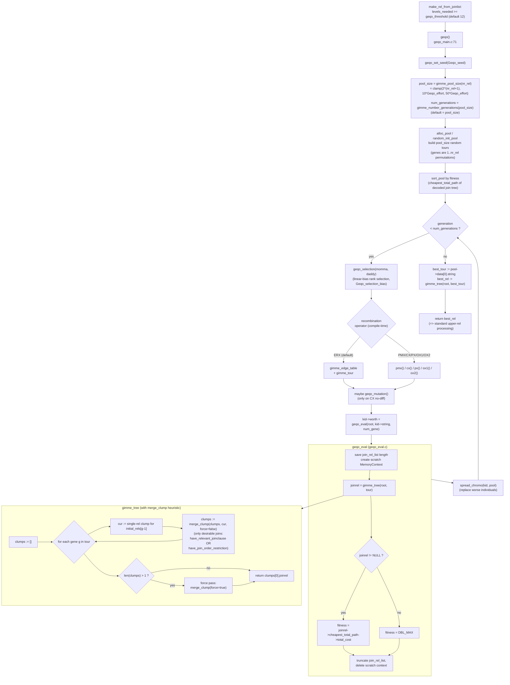

# 15. Genetic Query Optimization (GEQO)

Prerequisites: [09 Join paths and search](09_join_paths_and_search.md) (for `standard_join_search` and `make_join_rel`).

GEQO is the planner's escape hatch for queries with too many relations to enumerate exhaustively. The DP join search in `standard_join_search` evaluates every legal joinrel of every level. For an n-way inner-join query it considers **O(3ⁿ − 2ⁿ⁺¹ + 1)** distinct joinrels (see [Module 20.5](20_deep_dives.md#205-dp-join-search-complexity)). For n = 12 that is approximately 530k. For n = 15 it is approximately 14M. Memory and CPU usage become prohibitive.

GEQO replaces exhaustive enumeration with a **genetic algorithm**:

- A "chromosome" is a permutation of the rels (an indication of join order).
- A "fitness function" decodes the chromosome into a join tree and returns its cost.
- A population of chromosomes is evolved over many generations via selection, recombination, and mutation.

The result is a *good* plan (not provably optimal) found in a fraction of the time DP would take.

GEQO is enabled by default (`enable_geqo = on`) but kicks in only when `levels_needed >= geqo_threshold` (default 12). The GUC defaults are documented in `src/include/optimizer/geqo.h`.

Sources:
- `src/backend/optimizer/geqo/geqo_main.c` (~360 lines): the main loop.
- `src/backend/optimizer/geqo/geqo_eval.c`: `geqo_eval`, `gimme_tree`, `merge_clump`.
- `src/backend/optimizer/geqo/geqo_pool.c`: pool allocation, `random_init_pool`, `sort_pool`, `spread_chromo`.
- `src/backend/optimizer/geqo/geqo_selection.c`: linear-bias rank selection.
- `src/backend/optimizer/geqo/geqo_recombination.c`, `geqo_cx.c`, `geqo_erx.c`, `geqo_ox1.c`, `geqo_ox2.c`, `geqo_pmx.c`, `geqo_px.c`: crossover variants.
- `src/backend/optimizer/geqo/geqo_mutation.c`: mutation.
- `src/backend/optimizer/geqo/geqo_random.c`: PRNG.
- `src/include/optimizer/geqo.h`: GUCs and the crossover-mechanism macro.
- `src/backend/optimizer/README` includes a conceptual GEQO description.



## 15.1 Symbol table

| Symbol                              | File:line                                        | Importance | Tier |
|-------------------------------------|--------------------------------------------------|------------|------|
| `geqo`                              | `src/backend/optimizer/geqo/geqo_main.c:72`      | 0.65 | 2 |
| `geqo_eval`                         | `src/backend/optimizer/geqo/geqo_eval.c:57`      | 0.55 | 2 |
| `gimme_tree`                        | `src/backend/optimizer/geqo/geqo_eval.c:163`     | 0.55 | 2 |
| `merge_clump`                       | `src/backend/optimizer/geqo/geqo_eval.c:238`     | 0.50 | 2 |
| `desirable_join`                    | `src/backend/optimizer/geqo/geqo_eval.c:325`     | 0.40 | 3 |
| `gimme_pool_size`                   | `src/backend/optimizer/geqo/geqo_main.c:320`     | 0.45 | 3 |
| `gimme_number_generations`          | `src/backend/optimizer/geqo/geqo_main.c:352`     | 0.40 | 3 |
| `alloc_pool` / `random_init_pool`   | `src/backend/optimizer/geqo/geqo_pool.c`         | 0.40 | 3 |
| `sort_pool`                         | `src/backend/optimizer/geqo/geqo_pool.c`         | 0.35 | 3 |
| `spread_chromo`                     | `src/backend/optimizer/geqo/geqo_pool.c`         | 0.40 | 3 |
| `geqo_selection`                    | `src/backend/optimizer/geqo/geqo_selection.c`    | 0.45 | 3 |
| `gimme_edge_table` / `gimme_tour`   | `src/backend/optimizer/geqo/geqo_erx.c`          | 0.40 | 3 |
| `cx`                                | `src/backend/optimizer/geqo/geqo_cx.c`           | 0.30 | 3 |
| `pmx`                               | `src/backend/optimizer/geqo/geqo_pmx.c`          | 0.30 | 3 |
| `px`                                | `src/backend/optimizer/geqo/geqo_px.c`           | 0.30 | 3 |
| `ox1` / `ox2`                       | `src/backend/optimizer/geqo/geqo_ox1.c` / `ox2.c`| 0.30 | 3 |
| `geqo_mutation`                     | `src/backend/optimizer/geqo/geqo_mutation.c`     | 0.40 | 3 |
| `geqo_set_seed`                     | `src/backend/optimizer/geqo/geqo_random.c`       | 0.30 | 3 |

## 15.2 GUCs and constants

From `src/include/optimizer/geqo.h`:

```c
#define DEFAULT_GEQO_EFFORT      5
#define MIN_GEQO_EFFORT          1
#define MAX_GEQO_EFFORT          10

extern bool   enable_geqo;            /* default true */
extern int    geqo_threshold;         /* default 12 */
extern int    Geqo_effort;            /* 1..10, default 5 */
extern int    Geqo_pool_size;         /* 0 = auto */
extern int    Geqo_generations;       /* 0 = pool_size */
extern double Geqo_selection_bias;    /* 1.5..2.0; default 2.0 */
extern double Geqo_seed;              /* 0.0..1.0; default 0 */
```

The recombination operator is **chosen at compile time** via macro defines in `geqo.h`:
- `ERX` (default) — Edge Recombination Crossover.
- `PMX`, `CX`, `PX`, `OX1`, `OX2` — alternatives.

All produce permutations (legal "tours" through the rels).

## 15.3 The `geqo` main loop

`src/backend/optimizer/geqo/geqo_main.c:72`. Annotated body:

```c
RelOptInfo *
geqo(PlannerInfo *root, int number_of_rels, List *initial_rels)
{
    GeqoPrivateData private;
    Pool       *pool;
    int         pool_size, number_generations;
    Chromosome *momma, *daddy, *kid;

    root->join_search_private = (void *) &private;
    private.initial_rels = initial_rels;

    /* Seed the GEQO PRNG (separate from libc rand) */
    geqo_set_seed(root, Geqo_seed);

    /* Sizing heuristics */
    pool_size           = gimme_pool_size(number_of_rels);
    number_generations  = gimme_number_generations(pool_size);

    /* Build initial random pool of permutations */
    pool   = alloc_pool(root, pool_size, number_of_rels);
    random_init_pool(root, pool);
    sort_pool(root, pool);     /* by fitness (cheapest first) */

    momma = alloc_chromo(root, pool->string_length);
    daddy = alloc_chromo(root, pool->string_length);
    /* ERX path also allocates edge_table; other paths allocate kid */

    for (generation = 0; generation < number_generations; generation++)
    {
        /* SELECTION */
        geqo_selection(root, momma, daddy, pool, Geqo_selection_bias);

        /* RECOMBINATION (chooses ONE based on compile-time macro) */
#if defined(ERX)
        gimme_edge_table(root, momma->string, daddy->string,
                         pool->string_length, edge_table);
        kid = momma;       /* reuse storage */
        edge_failures += gimme_tour(root, edge_table, kid->string,
                                     pool->string_length);
#elif defined(PMX)
        pmx(root, momma->string, daddy->string, kid->string,
            pool->string_length);
#elif ... cx / px / ox1 / ox2
#endif

        /* OPTIONAL MUTATION (CX special-case only) */
#if defined(CX)
        if (cycle_diffs == 0) {
            mutations++;
            geqo_mutation(root, kid->string, pool->string_length);
        }
#endif

        /* FITNESS via geqo_eval -> gimme_tree -> make_join_rel chain */
        kid->worth = geqo_eval(root, kid->string, pool->string_length);

        /* Place kid into pool by displacing a worse individual */
        spread_chromo(root, kid, pool);
    }

    /* Decode best tour */
    best_tour = pool->data[0].string;
    best_rel  = gimme_tree(root, best_tour, pool->string_length);
    if (!best_rel) elog(ERROR, "geqo failed to make a valid plan");
    return best_rel;
}
```

### 15.3.1 Pool sizing

```c
static int
gimme_pool_size(int nr_rel) {
    if (Geqo_pool_size >= 2) return Geqo_pool_size;
    size = pow(2.0, nr_rel + 1.0);
    maxsize = 50 * Geqo_effort;        /* 50..500 */
    if (size > maxsize) return maxsize;
    minsize = 10 * Geqo_effort;        /* 10..100 */
    if (size < minsize) return minsize;
    return (int) ceil(size);
}
```

For 12 rels: `2^13 = 8192`, capped at 250 (effort 5). For 8 rels: `2^9 = 512`, capped at 250.

### 15.3.2 Generation count

```c
static int
gimme_number_generations(int pool_size) {
    if (Geqo_generations > 0) return Geqo_generations;
    return pool_size;          /* default = pool_size */
}
```

## 15.4 `geqo_eval` and `gimme_tree`

### 15.4.1 `geqo_eval`

```c
double geqo_eval(PlannerInfo *root, Gene *tour, int num_gene);
```

`src/backend/optimizer/geqo/geqo_eval.c:57`. Steps:

- Save current `join_rel_list` length and hashtable so we can roll back any joinrels created during evaluation (each chromo is evaluated against an isolated copy of the join_rel state).
- Create a scratch `MemoryContext` so all allocations are freed at the end of the eval.
- Call `gimme_tree(root, tour, num_gene)` to decode the tour into a joinrel (or NULL on illegal order).
- Fitness = `joinrel->cheapest_total_path->total_cost` (or DBL_MAX if NULL).
- Restore `join_rel_list` and delete the scratch context.

### 15.4.2 `gimme_tree` and `merge_clump`

`src/backend/optimizer/geqo/geqo_eval.c:163`. The decoder uses a **clump-merging heuristic** (rather than blindly joining in tour order, which would only produce left-deep trees):

```c
clumps = NIL;
for each gene g in tour:
    cur = single-rel clump for initial_rels[g - 1]
    clumps = merge_clump(root, clumps, cur, num_gene, force=false)

if length(clumps) > 1:
    /* Force pass: combine remaining clumps in any legal order */
    foreach c in clumps:
        clumps = merge_clump(root, fclumps, c, num_gene, force=true)

if length(clumps) != 1: return NULL
return clumps[0].joinrel
```

`merge_clump` (geqo_eval.c:238):

1. For each existing clump, try to join the new clump to it via `make_join_rel`. With `force=false`, only "desirable" joins (`desirable_join` = there is a relevant join clause or join-order restriction) are attempted.
2. If `make_join_rel` succeeds:
   - Run `generate_partitionwise_join_paths`.
   - Run `generate_useful_gather_paths` (unless this is the topmost scan/join rel).
   - `set_cheapest`.
   - Absorb new clump into old; **recursively** try to merge the enlarged old clump with others.
3. If no merge succeeds, insert as a new clump in size-sorted order.

The size-sorted clump list ensures that bigger clumps are tried first, which biases toward bushy-but-balanced trees. The `desirable_join` filter in the first pass avoids cartesian products unless they are forced.

### 15.4.3 Why clumps + force pass

Without the clump idea, a tour like `[t1, t2, t3, t4, t5]` where `t1` joins to `t4`, `t2` joins to `t5`, and `t3` joins to neither would force an early cartesian. With clumps, we build `{t1, t4}` and `{t2, t5}` independently, then the force pass merges them.

This is a **bushy-friendly** decoder, which empirically gives much better plans than the original left-deep-only GEQO.

## 15.5 Selection

`src/backend/optimizer/geqo/geqo_selection.c`. `geqo_selection(root, momma, daddy, pool, bias)`:

- The pool is sorted by fitness (best first).
- A **linear bias** function picks a chromosome with probability weighted toward the front of the pool. `bias = 2.0` gives the best individual `2/pool_size` selection probability vs. uniform `1/pool_size`. `bias = 1.0` would be uniform random; `bias > 2.0` is not allowed.
- Two distinct individuals are chosen (momma ≠ daddy).

This is **rank-based selection**, not fitness-proportional: it cares about the *order* of fitness, not the absolute values, which makes it robust against fitness scaling issues.

## 15.6 Recombination operators

All operate on permutations of `[1..num_gene]` and produce permutations.

### 15.6.1 ERX — Edge Recombination Crossover (`geqo_erx.c`)

The default in mainline PostgreSQL:

- Build an **edge table**: for each gene, the set of genes adjacent in either parent.
- Walk the kid: at each step, pick the next gene as the unvisited neighbor with the fewest remaining edges. Ties broken randomly.
- If a dead-end is hit (no unvisited neighbor), pick any unvisited gene; this is an "edge failure" and is counted in `edge_failures`.

Preserves adjacency relations from the parents; tends to find good joins because neighbors in a tour often correspond to joins.

### 15.6.2 PMX — Partially Matched Crossover (`geqo_pmx.c`)

- Choose two crossover points.
- Copy segment between them from one parent.
- For positions outside the segment, take from the other parent, using a "matching" lookup to resolve duplicates.

### 15.6.3 CX — Cycle Crossover (`geqo_cx.c`)

- Identify cycles between the two parents (positions that map back to each other) and copy alternate cycles from alternating parents.

### 15.6.4 PX, OX1, OX2 — Position / Order crossovers

- PX: pick a subset of positions to copy from one parent; fill rest from the other in remaining order.
- OX1, OX2: pick a contiguous block; preserve relative ordering of remaining elements from the other parent.

### 15.6.5 Selecting between operators

The macro `defined(ERX)` etc. is set in `geqo.h` and rebuilds the binary with that operator. End users have no GUC to switch operators at runtime; that is a build-time configuration choice. Module 20.6 ([GEQO chromosome encoding and crossover operator selection](20_deep_dives.md#206-geqo-chromosome-encoding-and-crossover-operator-selection)) discusses why ERX is the default.

## 15.7 Mutation

`src/backend/optimizer/geqo/geqo_mutation.c`.

Only used in CX mode when `cycle_diffs == 0` (parents are already identical so crossover produces a clone). Mutation does a swap of two random positions.

ERX (the default) does not use explicit mutation — its dead-end handling acts as an implicit mutation source.

## 15.8 `spread_chromo`

`src/backend/optimizer/geqo/geqo_pool.c`. Insert the new kid into the (sorted) pool so the worst individual is displaced. Uses a binary search to find the kid's position and shifts entries down. Maintains the pool's sortedness invariant for the next selection round.

## 15.9 Tuning levers

| GUC                          | Effect |
|------------------------------|--------|
| `enable_geqo`                | Master switch. |
| `geqo_threshold` (12)        | Use GEQO when ≥ N rels in `make_rel_from_joinlist`. Lower this for faster planning of medium-sized joins. |
| `geqo_effort` (5)            | Multiplier on pool size and (indirectly) generations. Higher = better plans, slower planning. |
| `geqo_pool_size` (0)         | Override auto pool size. 0 = auto. |
| `geqo_generations` (0)       | Override generations. 0 = pool size. |
| `geqo_selection_bias` (2.0)  | Higher = more aggressive convergence on best individuals. |
| `geqo_seed` (0)              | Seeds the GEQO PRNG; 0 means "different seed each invocation". Set to a fixed value for reproducible plans. |

For repeatable benchmarking, set `geqo_seed` to a fixed value; otherwise the same query may produce different plans across runs.

## 15.10 Performance characteristics

- One generation = one `geqo_eval` call = one `gimme_tree` + several `make_join_rel` calls. Each `make_join_rel` invokes `add_paths_to_joinrel` which costs as much as in DP.
- Total work ≈ `pool_size × num_generations × (avg gimme_tree cost)`.
- For 12 rels at default settings: ≈ 250 × 250 × small = tractable (typically 50-200 ms planning time).
- Memory bounded by the scratch context per `geqo_eval` (released each call) plus the persistent pool.

## 15.11 Limitations

Per the README and implementation comments:

- GEQO does **not** consider parameterized paths during fitness evaluation (`geqo_eval.c` comment near line 107).
- GEQO does **not** support `tuple_fraction` for fast-start plans.
- LATERAL with restrictive ordering can defeat the clump heuristic (the comment at `gimme_tree:158` calls this out).

## 15.12 Cross-references

- DP join search (the alternative): [09 Join paths and search](09_join_paths_and_search.md).
- `make_join_rel`, `populate_joinrel_with_paths`: [09 Join paths and search](09_join_paths_and_search.md).
- The `join_search_hook` extension point that overrides even GEQO: [17 Hooks and extensibility](17_hooks_and_extensibility.md).
- DP complexity formula and the geqo_threshold cutoff: [Module 20.5](20_deep_dives.md#205-dp-join-search-complexity).
- GEQO chromosome encoding and crossover operator selection: [Module 20.6](20_deep_dives.md#206-geqo-chromosome-encoding-and-crossover-operator-selection).

Next: [16 Plan creation and setrefs](16_plan_creation_and_setrefs.md).
