# 16. Plan Creation and Setrefs

Prerequisites: [04 Lifecycle and entry points](04_lifecycle_and_entry_points.md), [09 Join paths and search](09_join_paths_and_search.md), [11 RestrictInfo and clause utilities](11_restrictinfo_and_clause_utils.md), [12 Subqueries and SubLinks](12_subquery_and_sublink.md).

The cost-based optimizer works in **Path** space. Paths describe a plan abstractly — they reference RelOptInfos and PathTargets, with Vars carrying `varno`-as-relid semantics. The executor needs **Plan** nodes — concrete trees with Vars referenced by `(varno, varattno)` into a single flat rangetable, with all expressions in their final post-projection form.

This module covers the conversion: `create_plan` walks the chosen Path tree producing Plan nodes, then `set_plan_references` traverses the Plan tree to flatten the rangetable and rewrite every Var. Per-creator detail for each `create_*_plan` function lives in [Module 19](19_plan_creator_catalog.md); here we cover the orchestration and the post-create_plan finalization passes.

Sources:
- `src/backend/optimizer/plan/createplan.c` (~7300 lines): Path → Plan conversion. The big switch at `create_plan_recurse`.
- `src/backend/optimizer/plan/setrefs.c` (~3650 lines): post-create_plan pass that flattens the rangetable and rewrites Vars into final form.
- `src/include/nodes/plannodes.h`: Plan node hierarchy (`Plan` at line 119).

```mermaid
%% Path -> Plan correspondence map.
%% Sources: src/include/nodes/pathnodes.h, src/backend/optimizer/plan/createplan.c,
%% src/backend/optimizer/util/pathnode.c, src/backend/optimizer/path/costsize.c
flowchart LR
    subgraph PATHS["Path nodes (pathnodes.h)"]
        Pseq["Path<br/>(T_SeqScan etc)"]
        Pidx["IndexPath"]
        Pbmp["BitmapHeapPath / BitmapAndPath / BitmapOrPath"]
        Ptid["TidPath / TidRangePath"]
        Psub["SubqueryScanPath"]
        Pforeign["ForeignPath"]
        Pcustom["CustomPath"]
        Pap["AppendPath / MergeAppendPath"]
        Pmat["MaterialPath"]
        Pmem["MemoizePath"]
        Punq["UniquePath"]
        Pgth["GatherPath / GatherMergePath"]
        Pnest["NestPath"]
        Pmrg["MergePath"]
        Phsh["HashPath"]
        Pproj["ProjectionPath / ProjectSetPath"]
        Psort["SortPath / IncrementalSortPath"]
        Pgrp["GroupPath / AggPath / GroupingSetsPath"]
        Pmma["MinMaxAggPath"]
        Pwin["WindowAggPath"]
        Pset["SetOpPath / RecursiveUnionPath"]
        Plk["LockRowsPath"]
        Pmt["ModifyTablePath"]
        Plim["LimitPath"]
    end

    subgraph CREATORS["create_*_plan functions (createplan.c)"]
        Cscan["create_scan_plan / create_seqscan_plan ..."]
        Cidx["create_indexscan_plan"]
        Cbmp["create_bitmap_scan_plan"]
        Ctid["create_tidscan_plan / create_tidrangescan_plan"]
        Csub["create_subqueryscan_plan"]
        Cforeign["create_foreignscan_plan"]
        Ccustom["create_customscan_plan"]
        Capp["create_append_plan / create_merge_append_plan"]
        Cmat["create_material_plan"]
        Cmem["create_memoize_plan"]
        Cunq["create_unique_plan"]
        Cgth["create_gather_plan / create_gather_merge_plan"]
        Cjoin["create_nestloop_plan / create_mergejoin_plan / create_hashjoin_plan"]
        Cproj["create_projection_plan / create_project_set_plan"]
        Csort["create_sort_plan / create_incrementalsort_plan"]
        Cgrp["create_group_plan / create_agg_plan / create_groupingsets_plan"]
        Cmma["create_minmaxagg_plan"]
        Cwin["create_windowagg_plan"]
        Cset["create_setop_plan / create_recursiveunion_plan"]
        Clk["create_lockrows_plan"]
        Cmt["create_modifytable_plan"]
        Clim["create_limit_plan"]
    end

    subgraph PLANS["Plan nodes (plannodes.h)"]
        Plseq["SeqScan / SampleScan / FunctionScan / ValuesScan / CteScan / WorkTableScan / Result"]
        Plidx["IndexScan / IndexOnlyScan"]
        Plbmp["BitmapHeapScan / BitmapAnd / BitmapOr"]
        Pltid["TidScan / TidRangeScan"]
        Plsub["SubqueryScan"]
        Plforeign["ForeignScan"]
        Plcustom["CustomScan"]
        Plap["Append / MergeAppend"]
        Plmat["Material"]
        Plmem["Memoize"]
        Plunq["Unique  /  Agg(AGG_HASHED)"]
        Plgth["Gather / GatherMerge"]
        Pljoin["NestLoop / MergeJoin / HashJoin (+ Hash)"]
        Plproj["Result / ProjectSet"]
        Plsort["Sort / IncrementalSort"]
        Plgrp["Group / Agg"]
        Plmma["Result (with subplan)"]
        Plwin["WindowAgg"]
        Plset["SetOp / RecursiveUnion"]
        Pllk["LockRows"]
        Plmt["ModifyTable"]
        Pllim["Limit"]
    end

    Pseq --> Cscan --> Plseq
    Pidx --> Cidx --> Plidx
    Pbmp --> Cbmp --> Plbmp
    Ptid --> Ctid --> Pltid
    Psub --> Csub --> Plsub
    Pforeign --> Cforeign --> Plforeign
    Pcustom --> Ccustom --> Plcustom
    Pap --> Capp --> Plap
    Pmat --> Cmat --> Plmat
    Pmem --> Cmem --> Plmem
    Punq --> Cunq --> Plunq
    Pgth --> Cgth --> Plgth
    Pnest --> Cjoin --> Pljoin
    Pmrg --> Cjoin
    Phsh --> Cjoin
    Pproj --> Cproj --> Plproj
    Psort --> Csort --> Plsort
    Pgrp --> Cgrp --> Plgrp
    Pmma --> Cmma --> Plmma
    Pwin --> Cwin --> Plwin
    Pset --> Cset --> Plset
    Plk --> Clk --> Pllk
    Pmt --> Cmt --> Plmt
    Plim --> Clim --> Pllim
```



## 16.1 Symbol table

| Symbol                              | File:line                                    | Importance | Tier |
|-------------------------------------|----------------------------------------------|------------|------|
| `create_plan`                       | `src/backend/optimizer/plan/createplan.c:338` | 0.96 | 1 |
| `create_plan_recurse`               | `src/backend/optimizer/plan/createplan.c:389` | 0.92 | 1 |
| `create_scan_plan`                  | `src/backend/optimizer/plan/createplan.c:560` | 0.78 | 1 |
| `create_join_plan`                  | `src/backend/optimizer/plan/createplan.c:1082`| 0.78 | 1 |
| `create_gating_plan`                | `src/backend/optimizer/plan/createplan.c:1023`| 0.50 | 2 |
| `mark_async_capable_plan`           | `src/backend/optimizer/plan/createplan.c`    | 0.45 | 3 |
| `Plan`                              | `src/include/nodes/plannodes.h:119`          | 0.84 | 1 |
| `set_plan_references`               | `src/backend/optimizer/plan/setrefs.c:287`   | 0.90 | 1 |
| `set_plan_refs`                     | `src/backend/optimizer/plan/setrefs.c`       | 0.65 | 2 |
| `add_rtes_to_flat_rtable`           | `src/backend/optimizer/plan/setrefs.c`       | 0.55 | 2 |
| `fix_scan_expr`                     | `src/backend/optimizer/plan/setrefs.c:159`   | 0.55 | 2 |
| `set_join_references`               | `src/backend/optimizer/plan/setrefs.c:163`   | 0.55 | 2 |
| `set_upper_references`              | `src/backend/optimizer/plan/setrefs.c:164`   | 0.55 | 2 |
| `fix_upper_expr`                    | `src/backend/optimizer/plan/setrefs.c:195`   | 0.55 | 2 |
| `set_indexonlyscan_references`      | `src/backend/optimizer/plan/setrefs.c:1313`  | 0.45 | 3 |
| `set_subqueryscan_references`       | `src/backend/optimizer/plan/setrefs.c`       | 0.45 | 3 |
| `set_foreignscan_references`        | `src/backend/optimizer/plan/setrefs.c`       | 0.45 | 3 |
| `set_param_references`              | `src/backend/optimizer/plan/setrefs.c`       | 0.45 | 3 |

## 16.2 Plan node hierarchy

`src/include/nodes/plannodes.h:119`:

```c
typedef struct Plan {
    pg_node_attr(abstract, no_equal, no_query_jumble);
    NodeTag       type;

    /* estimated execution costs (set in createplan.c) */
    int           disabled_nodes;     /* propagated count of disabled nodes */
    Cost          startup_cost;
    Cost          total_cost;
    Cardinality   plan_rows;
    int           plan_width;

    /* parallel-safety */
    bool          parallel_aware;
    bool          parallel_safe;
    bool          async_capable;

    /* identifier; set by set_plan_references */
    int           plan_node_id;

    /* output target list */
    List         *targetlist;
    /* implicit-AND list of qual conditions */
    List         *qual;

    /* lefttree / righttree / initPlan */
    struct Plan  *lefttree;
    struct Plan  *righttree;
    List         *initPlan;          /* SubPlans evaluated once before this node */

    /* extParam / allParam */
    Bitmapset    *extParam;
    Bitmapset    *allParam;
} Plan;
```

`disabled_nodes` is the count of `enable_*=false` nodes on this and descendants. Used by `add_path_with_disabled_count` decisions and EXPLAIN annotations.

`extParam` / `allParam` are filled by `SS_finalize_plan` (after `set_plan_references`).

Subclasses include: `SeqScan`, `IndexScan`, `IndexOnlyScan`, `BitmapHeapScan`, `BitmapAnd`, `BitmapOr`, `TidScan`, `TidRangeScan`, `SubqueryScan`, `FunctionScan`, `ValuesScan`, `CteScan`, `WorkTableScan`, `NamedTuplestoreScan`, `ForeignScan`, `CustomScan`, `Append`, `MergeAppend`, `Material`, `Memoize`, `Unique`, `Gather`, `GatherMerge`, `NestLoop`, `MergeJoin`, `HashJoin`, `Hash`, `Result`, `ProjectSet`, `Sort`, `IncrementalSort`, `Group`, `Agg`, `WindowAgg`, `SetOp`, `RecursiveUnion`, `LockRows`, `ModifyTable`, `Limit`.

## 16.3 `create_plan`

`src/backend/optimizer/plan/createplan.c:338`:

```c
Plan *create_plan(PlannerInfo *root, Path *best_path);
```

What it does:

1. Initialize `root->curOuterRels = NULL` and `root->curOuterParams = NIL` (used for nestloop parameter passing).
2. Call `create_plan_recurse(root, best_path, CP_EXACT_TLIST)`.
3. Verify nestloop param ledger is empty (`Assert(root->curOuterParams == NIL)`) — every param assigned by a parameterized inner path should have been consumed by an enclosing nestloop.

`CP_EXACT_TLIST` is one of the **CP_*** flags telling `create_plan_recurse` how strict the projection requirements are. Other flags include `CP_SMALL_TLIST` (allow projection trim), `CP_LABEL_TLIST` (preserve sortgroupref labels for upper rels), and `CP_IGNORE_TLIST` (do not bother with tlist matching).

## 16.4 `create_plan_recurse` — the big switch

`src/backend/optimizer/plan/createplan.c:389`. The dispatch:

```c
switch (best_path->pathtype)
{
    case T_SeqScan / T_SampleScan / T_FunctionScan / T_TableFuncScan
       / T_ValuesScan / T_CteScan / T_NamedTuplestoreScan
       / T_WorkTableScan / T_Result:
        plan = create_scan_plan(...);     /* further dispatch */
        break;
    case T_IndexScan / T_IndexOnlyScan:
        plan = create_indexscan_plan(...);
        break;
    case T_BitmapHeapScan:
        plan = create_bitmap_scan_plan(...);
        break;
    case T_TidScan:
        plan = create_tidscan_plan(...);
        break;
    case T_TidRangeScan:
        plan = create_tidrangescan_plan(...);
        break;
    case T_SubqueryScan:
        plan = create_subqueryscan_plan(...);
        break;
    case T_ForeignScan:
        plan = create_foreignscan_plan(...);
        break;
    case T_CustomScan:
        plan = create_customscan_plan(...);
        break;
    case T_NestLoop / T_MergeJoin / T_HashJoin:
        plan = create_join_plan(...);     /* further dispatch */
        break;
    case T_Append / T_MergeAppend / T_Material / T_Memoize / T_Unique
       / T_Gather / T_GatherMerge / T_Result (group result)
       / T_ProjectSet / T_Sort / T_IncrementalSort / T_Group / T_Agg
       / T_WindowAgg / T_MinMaxAgg / T_SetOp / T_RecursiveUnion
       / T_LockRows / T_ModifyTable / T_Limit / T_Projection:
        plan = create_<type>_plan(...);
        break;
}
```

Each `create_<type>_plan`:

1. Recursively converts subpaths via `create_plan_recurse`.
2. Builds the appropriate Plan subtype.
3. Copies cost from the Path: `plan->startup_cost = path->startup_cost`, `plan->total_cost = path->total_cost`, `plan->plan_rows = path->rows`, `plan->plan_width = path->pathtarget->width`.
4. Sets `parallel_aware`, `parallel_safe`.
5. Sets `targetlist` and `qual` from the path's RestrictInfo lists, filtering through `extract_actual_clauses` to bare expressions.
6. For scan/join Plan types, returns the Plan with **unflattened Vars** — Vars still use `varno = relid`. setrefs.c will rewrite.

The per-creator details (e.g. `create_indexscan_plan` building `indexorderby` from the IndexPath, `create_hashjoin_plan` splitting `HashPath` into a `HashJoin` + `Hash` pair, etc.) are documented in [Module 19](19_plan_creator_catalog.md).

### 16.4.1 `create_scan_plan` (createplan.c:560)

The dispatcher for the 9 plain-`Path` scan types (those that all share `Path` struct, distinguished by `path->pathtype`). It also applies projection wrappers (`create_projection_plan` / `create_set_projection_plan`) when the path's PathTarget differs from the rel's reltarget.

### 16.4.2 `create_join_plan` (createplan.c:1082)

Wraps the per-method creators (`create_nestloop_plan`, `create_mergejoin_plan`, `create_hashjoin_plan`) and handles:

- **Gating quals** — pseudoconstant clauses that should become a Result on top of the join.
- **Tlist trim** — outer joins can introduce extra Vars from PHV expansion that the upper plan does not need; trim them.

### 16.4.3 `create_gating_plan` (createplan.c:1023)

For pseudoconstant quals (`hasPseudoConstantQuals`), wraps a child plan in a `Result` whose `resconstantqual` is the constant-time WHERE clause; the executor evaluates it once, skipping the child if false. Used both in scan and join contexts.

### 16.4.4 `mark_async_capable_plan`

Walks an Append's children and marks them async-capable if they are ForeignScans whose FDW supports async execution. Used by the executor's async-event-loop dispatch.

## 16.5 `set_plan_references`

`src/backend/optimizer/plan/setrefs.c:287`:

```c
Plan *set_plan_references(PlannerInfo *root, Plan *plan);
```

Phases:

1. **Flatten the rangetable**:
   - Build `glob->finalrtable` from the per-subroot rangetables. Each subroot's RTEs get appended; sub-Query-level RTE indices are adjusted by `rtoffset` per sub-root.
   - `add_rtes_to_flat_rtable` does this; it also collects RowMarks and RTEPermissionInfos.
2. **Walk the plan tree** via `set_plan_refs`:
   - Per Plan subtype, call `fix_scan_expr` (for scan-style nodes) or `set_join_references` / `set_upper_references` (for higher nodes).
   - For SubqueryScan, recurse into the child plan via `set_plan_refs(root, splan->subplan, rtoffset)`.
   - For ForeignScan, fix `fdw_private` etc.
3. **Renumber `plan_node_id`** sequentially from `glob->lastPlanNodeId++`.
4. **Build `glob->relationOids` and `glob->invalItems`** for plan invalidation.
5. **Build `glob->resultRelations`** for ModifyTable.

### 16.5.1 `fix_scan_expr` (setrefs.c:159)

For scan-level expressions (targetlist, qual), simply rewrite Vars' `varno` to apply the current `rtoffset`. Vars at scan level still use `varno = relid + rtoffset`. Strip useless `RelabelType` nodes.

### 16.5.2 `set_join_references` (setrefs.c:163)

For Join Plans (NestLoop, MergeJoin, HashJoin), rewrite Vars in `targetlist`, `qual`, `joinqual`, etc. to use **OUTER_VAR** (`varno = OUTER_VAR = INT16_MAX - 1`) for outer-side Vars and **INNER_VAR** (`varno = INNER_VAR = INT16_MAX - 2`) for inner-side Vars, with `varattno` indexing into the corresponding child plan's tlist.

This builds an `indexed_tlist` for outer and inner (a hashtable from expression to tlist position), then walks the Join's expressions substituting OUTER_VAR / INNER_VAR references.

### 16.5.3 `set_upper_references` (setrefs.c:164)

For non-Scan, non-Join Plans (Sort, Agg, Group, Limit, Result, Append, etc.), rewrite Vars to **OUTER_VAR** with `varattno` indexing into the lefttree's output tlist. (Most upper plans have only one child.)

### 16.5.4 `fix_upper_expr` (setrefs.c:195)

The expression mutator backing `set_upper_references`. Looks up each expression in the child's `indexed_tlist`; if found, replaces with `Var(OUTER_VAR, attno)`. Otherwise, recurses to fix Var refs inside the expression.

### 16.5.5 `set_indexonlyscan_references` (setrefs.c:1313)

Special: an IndexOnlyScan's targetlist references **index columns**, not heap columns. So Vars need to be rewritten using a synthetic `indexed_tlist` built from the index's columns rather than from a child's tlist.

### 16.5.6 `set_subqueryscan_references`

Recurses into the SubqueryScan's child plan, then fixes the SubqueryScan's tlist/qual to reference the child's output via `fix_upper_expr`.

### 16.5.7 `set_foreignscan_references`

Fixes `fdw_exprs` and `fdw_recheck_quals`. For an FDW-pushed join/upper, the ForeignScan represents a multi-relation scan, so its fix is more complex; the FDW provides hints via `fs_relids`.

### 16.5.8 `set_param_references`

For nodes carrying `paramIds` (subplans, AlternativeSubPlan), update PARAM_EXEC IDs to the final glob-level numbering.

## 16.6 The full plan-finalization sequence

In `standard_planner` after `create_plan`:

```c
top_plan = create_plan(root, best_path);

if (cursorOptions & CURSOR_OPT_SCROLL)
    if (!ExecSupportsBackwardScan(top_plan))
        top_plan = materialize_finished_plan(top_plan);

if (debug_parallel_query != DEBUG_PARALLEL_OFF && top_plan->parallel_safe)
    top_plan = wrap-in-Gather (...);

SS_finalize_plan(root, top_plan);   /* extParam/allParam, parallel_safe up */

foreach subroot in glob->subroots:
    sub_plan = list_nth(glob->subplans, ...);
    sub_plan = set_plan_references(subroot, sub_plan);
    /* update glob->subplans */

top_plan = set_plan_references(root, top_plan);

result = makeNode(PlannedStmt);
result->commandType = parse->commandType;
result->planTree = top_plan;
result->rtable = glob->finalrtable;
result->subplans = glob->subplans;
... etc.
```

`SS_finalize_plan` MUST happen **before** `set_plan_references` because the latter strips information that the former needs (Var references in their original form).

## 16.7 PlannedStmt: the executor handoff

```c
typedef struct PlannedStmt {
    NodeTag    type;
    CmdType    commandType;
    uint64     queryId;
    bool       hasReturning;
    bool       hasModifyingCTE;
    bool       canSetTag;
    bool       transientPlan;
    bool       dependsOnRole;
    bool       parallelModeNeeded;

    int        jitFlags;
    Plan      *planTree;          /* the top of the tree */
    List      *rtable;             /* RangeTblEntry list */
    List      *permInfos;          /* RTEPermissionInfo list */
    List      *resultRelations;    /* RT indexes of the result rels */
    List      *appendRelations;    /* AppendRelInfo list */
    List      *subplans;           /* Plan trees for SubPlans */
    Bitmapset *rewindPlanIDs;      /* SubPlans needing rewind */
    List      *rowMarks;
    List      *relationOids;       /* OIDs that, if changed, invalidate plan */
    List      *invalItems;         /* other invalidation triggers */
    List      *paramExecTypes;
    Node      *utilityStmt;
    int        stmt_location;
    int        stmt_len;
} PlannedStmt;
```

All the interesting cross-tree data lives here, ready for `ExecutorStart` / `ExecutorRun`.

## 16.8 Performance characteristics

- `create_plan_recurse`: O(plan tree size).
- `set_plan_references`: O(plan tree size × tlist size of each Plan) due to the `indexed_tlist` lookups (hashtable so each lookup is O(1) amortized).
- `SS_finalize_plan`: O(plan tree size).

For typical OLTP queries, the create_plan + setrefs pass is fast (sub-millisecond). For very wide tlists or deep plans, the tlist hashtable construction dominates.

## 16.9 Cross-references

- Path subtypes and their constructors: [18 Path catalog](18_path_catalog.md).
- Plan subtypes and per-creator deep dives: [19 Plan creator catalog](19_plan_creator_catalog.md).
- SubPlan / InitPlan finalization: [12 Subqueries and SubLinks](12_subquery_and_sublink.md).
- `glob->parallelModeNeeded` flip happens in `create_gather_plan` / `create_gather_merge_plan`: [14 Parallel planning](14_parallel_planning.md).
- The diagram source is `topic_specific_generated_docs/about_planner/stage2/diagrams/05_path_to_plan_map.mermaid`.

Next: [17 Hooks and extensibility](17_hooks_and_extensibility.md).
