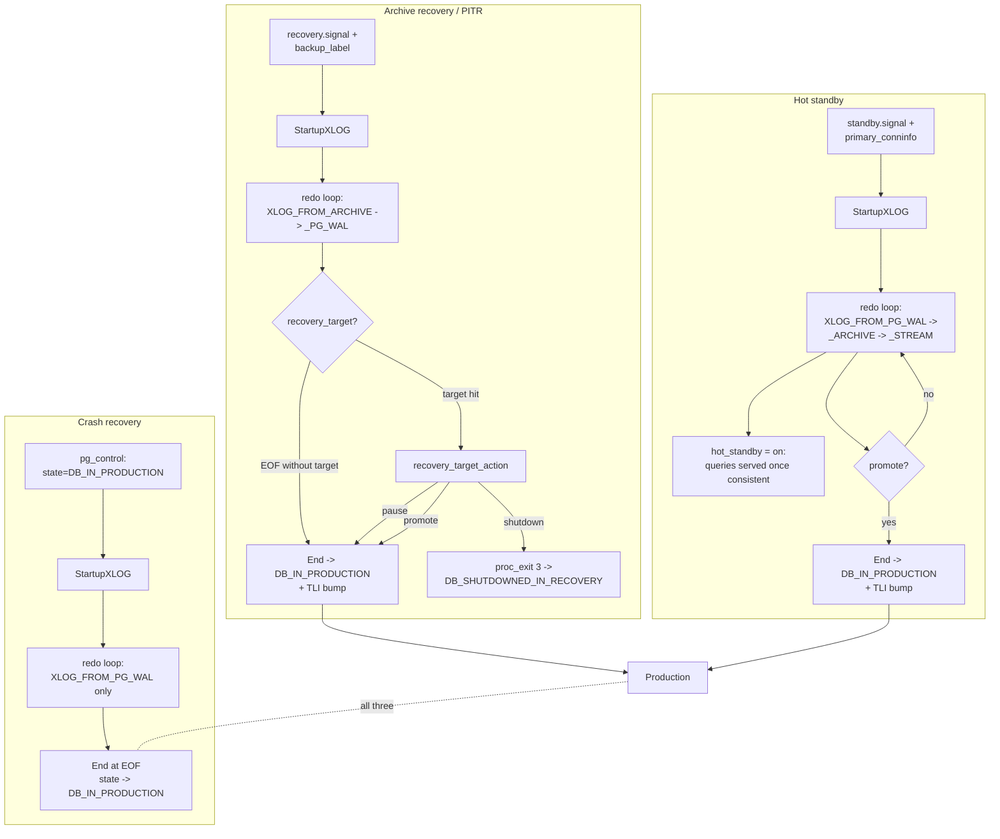

# 02 — Architecture Overview

[← Executive Summary](01_executive_summary.md) | [next: Recovery Driver and Lifecycle →](03_recovery_driver_and_lifecycle.md)

---

## The recovery pipeline end to end

The full pipeline of a recovering cluster, from postmaster fork to
production:

```mermaid
graph TB
    PM[Postmaster] -->|fork+exec| SP[Startup Process<br/>postmaster/startup.c]
    SP -->|StartupProcessMain| SPM[Register signals<br/>+ standby timeouts]
    SPM --> SX[StartupXLOG<br/>xlog.c:5384]
    SX --> RCF[ReadControlFile]
    RCF --> CF[(pg_control)]
    SX --> IWR[InitWalRecovery<br/>xlogrecovery.c:512]
    IWR --> SF{signal files?}
    SF -->|recovery.signal| ARC[ArchiveRecoveryRequested = true]
    SF -->|standby.signal| STB[StandbyMode + ArchiveRecoveryRequested]
    SF -->|none| CR[Crash recovery]
    IWR --> RBL[read_backup_label?<br/>read_tablespace_map?]
    IWR --> ALLOC[XLogReaderAllocate<br/>+ XLogPrefetcherAllocate<br/>+ readTimeLineHistory]
    IWR --> VRP[validateRecoveryParameters]
    SX --> PWR[PerformWalRecovery<br/>xlogrecovery.c:1652]
    PWR -->|ReadRecord| RR[XLogPrefetcherReadRecord]
    RR -->|XLogPageRead| WAIT[WaitForWALToBecomeAvailable<br/>xlogrecovery.c:3542]
    WAIT -->|XLOG_FROM_PG_WAL| PGWAL[(pg_wal/)]
    WAIT -->|XLOG_FROM_ARCHIVE| RAF[RestoreArchivedFile]
    WAIT -->|XLOG_FROM_STREAM| WALRCV[walreceiver]
    PWR -->|ApplyWalRecord| AWR[ApplyWalRecord<br/>xlogrecovery.c:1908]
    AWR -->|GetRmgr.rm_redo| RT[(RmgrTable[]<br/>22 redo callbacks)]
    AWR -->|conflict?| RC[ResolveRecoveryConflictWith*<br/>standby.c]
    RC -->|signal vxid| BACK[Standby backend<br/>SIGUSR1]
    AWR -->|XLOG_CHECKPOINT_*| RRP[RecoveryRestartPoint]
    RRP -->|posts to| CKPT[Checkpointer]
    CKPT --> CRP[CreateRestartPoint<br/>xlog.c:7585]
    PWR -->|stop predicate hits| FWR[FinishWalRecovery<br/>xlogrecovery.c:1458]
    FWR --> SX2[StartupXLOG continues]
    SX2 --> RPT[RecoverPreparedTransactions]
    SX2 --> EOR[Write XLOG_END_OF_RECOVERY<br/>or end-of-recovery checkpoint]
    EOR --> WTH[writeTimeLineHistory<br/>findNewestTimeLine]
    WTH --> UCF[UpdateControlFile<br/>state = DB_IN_PRODUCTION]
    UCF --> RD[SharedRecoveryState = RECOVERY_STATE_DONE]
    RD --> PMC[PMSIGNAL_RECOVERY_COMPLETED]
    PMC --> PM
    PM -->|release backends| PROD[Production]
```

(`../diagrams/01_recovery_pipeline_end_to_end.mermaid`)

## The three configuration variants



(`../diagrams/02_three_configuration_variants.mermaid`)

The selection is made by `InitWalRecovery` based on the combination
of:

* `pg_control->state` (`DB_IN_PRODUCTION` ⇒ crash; `DB_SHUTDOWNED` ⇒
  no recovery; `DB_IN_ARCHIVE_RECOVERY` ⇒ resuming).
* `recovery.signal` ⇒ `ArchiveRecoveryRequested = true`.
* `standby.signal` ⇒ `ArchiveRecoveryRequested = true` AND
  `StandbyMode = true`.
* `backup_label` ⇒ override REDO start with the backup's checkpoint.

The three variants share **one driver** (`StartupXLOG` ➜
`PerformWalRecovery`). The **only** difference is what
`WaitForWALToBecomeAvailable` does when WAL runs out:

| Variant | EOF behavior |
|---------|--------------|
| Crash | End redo loop. |
| Archive | Try archive (`RestoreArchivedFile`) then `pg_wal/`; on EOF, end. |
| Standby | Try `pg_wal/` then archive then stream (`RequestXLogStreaming`); block waiting for more WAL; only end on promote. |

## Cross-process layout

The recovery subsystem is one of the few PostgreSQL features that
exercises *multi-process coordination* across the lifetime of a
single recovery run:

```
                          ┌──────────────────┐
                          │   Postmaster     │
                          │ (pid 1; parent)  │
                          └────┬─────┬───────┘
                               │     │
            fork+exec  fork+exec  fork+exec
                               │     │
              ┌────────────────┘     └─────────────────┐
              │                                        │
   ┌──────────▼─────────┐                   ┌──────────▼──────────┐
   │  Startup process    │                   │   Walreceiver       │
   │ (StartupXLOG)       │ ◄─── shmem ────►  │   (WalReceiverMain) │
   │  redo loop          │   WalRcvData      │   libpqwalreceiver  │
   └────┬───────────────┬┘   PMSIGNAL_*      └──────────┬──────────┘
        │ signals        │                              │
        │  Resolve*      │ XLogRecoveryCtl              │ libpq
        ▼               ▼                              ▼
   ┌─────────┐  ┌──────────────┐                ┌──────────────┐
   │ Standby │  │ Checkpointer │                │  Primary     │
   │ backend │  │ (CreateR.P.) │                │  walsender   │
   └─────────┘  └──────────────┘                └──────────────┘
```

* **Startup process**: owns the redo loop, reads WAL from
  `pg_wal/`, decides when to switch sources, signals walreceiver
  startup, signals conflicting backends.
* **Postmaster**: spawns/respawns the walreceiver via
  `PMSIGNAL_START_WALRECEIVER`, transitions PMState
  (`PM_STARTUP → PM_RECOVERY → PM_HOT_STANDBY → PM_RUN`), releases
  backends after `PMSIGNAL_RECOVERY_COMPLETED`.
* **Walreceiver**: only runs in standby mode. Connects to primary
  via libpq, receives WAL, writes to `pg_wal/`, advances
  `WalRcv->flushedUpto`, sets the Startup process's latch.
* **Checkpointer**: only runs *after* the consistency point on
  hot standbys. Performs restartpoints when `RecoveryRestartPoint`
  posts a request via `XLogCtl->lastCheckPointIsRequired`.
* **Standby backends**: read-only queries (only when
  `RecoveryInProgress() && hot_standby && SNAPSHOT_READY`). Receive
  recovery-conflict signals.

## Shared-memory map (recovery slice)

| Struct | Location | Owner | Readers |
|--------|----------|-------|---------|
| `XLogCtl` | `xlog.c` | xlog write side | All processes |
| `XLogRecoveryCtl` | `xlogrecovery.c` | Startup | All processes |
| `WalRcvData` | `walreceiver.c` | Walreceiver | Startup, monitoring |
| `ControlFile` | `xlog.c` shmem mirror of `pg_control` | Startup, Checkpointer | All |
| `KnownAssignedXids` (within procarray) | `procarray.c` | Startup (HS) | All backends via `GetSnapshotData` |
| `TwoPhaseState` | `twophase.c` | Startup, backends | All |

Key fields from `XLogRecoveryCtl` consulted across processes:

| Field | Used by |
|-------|---------|
| `lastReplayedReadRecPtr` | `pg_last_wal_replay_lsn`, walsenders, monitoring |
| `lastReplayedEndRecPtr` | Cascade replication wakeup |
| `lastReplayedTLI` | Same |
| `recoveryLastXTime` | `pg_last_xact_replay_timestamp` |
| `recoveryPauseState` | `pg_get_wal_replay_pause_state` |
| `SharedHotStandbyActive` | `HotStandbyActive` predicate |
| `SharedPromoteIsTriggered` | `PromoteIsTriggered` predicate |

`XLogCtl->SharedRecoveryState` is what `RecoveryInProgress` reads
(once it has been published as `RECOVERY_STATE_DONE`, the per-process
cache flips and never flips back).

## How a single record gets applied — the cross-cutting view

```mermaid
sequenceDiagram
    participant Pri as Primary (xlog write)
    participant Disk as standby pg_wal/
    participant WR as walreceiver
    participant SP as Startup (redo loop)
    participant RM as RmgrTable[rmid].rm_redo
    participant Buf as Buffer manager
    participant Ck as Checkpointer
    participant Be as Standby backend

    Pri->>Pri: XLogInsert(rmid, info, ...)
    Pri-->>WR: streaming bytes (libpq)
    WR->>Disk: XLogWalRcvWrite + Flush
    WR->>SP: SetLatch (WalRcv->latch)
    SP->>SP: WaitForWALToBecomeAvailable<br/>(picks XLOG_FROM_PG_WAL or _STREAM)
    SP->>SP: ReadRecord -> XLogPrefetcherReadRecord
    SP->>SP: ApplyWalRecord:<br/>recoveryStopsBefore? recoveryApplyDelay?
    SP->>RM: GetRmgr(rmid).rm_redo(record)
    alt page modification
        RM->>Buf: XLogReadBufferForRedo(rec, blkid, &buf)
        Buf-->>RM: BLK_NEEDS_REDO (or BLK_DONE if pd_lsn >= rec_lsn)
        RM->>Buf: PageSetLSN; MarkBufferDirty
    end
    alt snapshot conflict
        RM->>SP: ResolveRecoveryConflictWithSnapshot(horizon)
        SP->>Be: SendProcSignal(PROCSIG_RECOVERY_CONFLICT_SNAPSHOT)
        Be->>Be: HandleRecoveryConflictInterrupt sets bit
        SP->>SP: sleep up to max_standby_*_delay
        Be->>Be: next CFI -> ProcessRecoveryConflictInterrupt -> ERROR
    end
    SP->>SP: lastReplayedEndRecPtr = rec.EndRecPtr
    SP->>SP: recoveryStopsAfter? -> next iteration
    alt was XLOG_CHECKPOINT_*
        SP->>Ck: post lastCheckPointIsRequired = true
        Ck->>Ck: CreateRestartPoint -> CheckPointGuts
        Ck->>Disk: flush buffers + SLRUs; UpdateControlFile (minRecoveryPoint advances)
        Ck->>Disk: RemoveOldXlogFiles
    end
```

This is the unifying picture. Everything in the rest of the document
fills in details about each step.

## Read flow on a hot standby

The above shows the *write side* (recovery applying WAL). The
**read side** is what makes the standby useful:

```mermaid
graph LR
    Q[SELECT on standby] --> CFI{CHECK_FOR_INTERRUPTS}
    CFI -->|RecoveryConflictPending?| RC[ProcessRecoveryConflictInterrupt]
    RC -->|reason| ACT[ERROR or FATAL or release pin]
    Q -->|GetSnapshotData| KAX[(KnownAssignedXids)]
    KAX -->|xip[]<br/>xmin/xmax| SS[Snapshot]
    SS -->|HeapTupleSatisfies*| HEAP[(Heap pages)]
    HEAP -->|tuple visible?<br/>uses CLOG, KAX, etc.| RES[Result]
    Q -->|RecoveryInProgress?<br/>fast path| WRT[Write attempt]
    WRT -->|true| FAIL[ERROR: cannot execute INSERT/UPDATE/DELETE]
```

Standby backends:

* Refuse all write paths via `RecoveryInProgress() == true`.
* Build snapshots from `KnownAssignedXids`, which is populated and
  maintained by `standby_redo` (RM_STANDBY) replaying
  `XLOG_RUNNING_XACTS`, plus `xact_redo_commit/abort` removing
  expired xids.
* Respect AccessExclusiveLocks held by **primary** transactions via
  the virtual locks set up by `StandbyAcquireAccessExclusiveLock`
  during `standby_redo` of `XLOG_STANDBY_LOCK`.
* Process recovery-conflict signals at the next CFI.

See [10_hot_standby_and_recovery_conflicts.md](10_hot_standby_and_recovery_conflicts.md)
for full mechanics.

## See also

* [03_recovery_driver_and_lifecycle.md](03_recovery_driver_and_lifecycle.md) for the spine
* [14_rmgr_dispatch.md](14_rmgr_dispatch.md) for the rmgr table
* [appendix_data_structures.md](appendix_data_structures.md) for `XLogRecoveryCtl`, `WalRcvData`, `ControlFileData`
