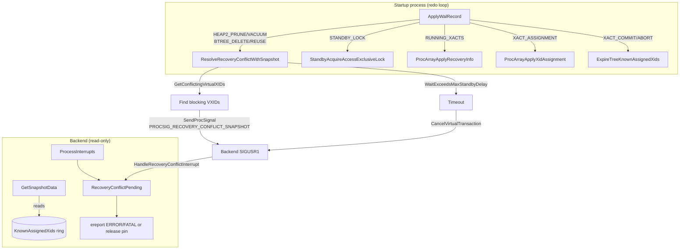
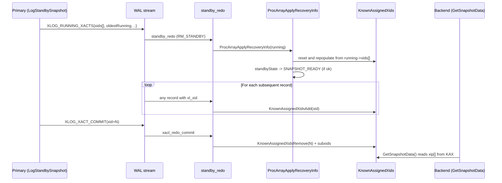

# 10 — Hot Standby and Recovery Conflicts

[← WAL Receiver and Streaming Handshake](09_walreceiver_and_streaming_handshake.md) | [index](index.md) | [next: Two-Phase Commit Recovery →](11_two_phase_recovery.md)

---


Hot standby is the feature that makes a recovery-mode cluster
serve **read-only queries** while WAL is being replayed. The
machinery has three layers:

1. **`RecoveryInProgress()`** — the predicate every backend checks
   before any write path. Lock-free fast path; consulted millions
   of times per second cluster-wide.
2. **`KnownAssignedXids` + standby snapshot construction** — how
   the standby reconstructs the primary's in-flight transaction
   set so `GetSnapshotData` returns sensible visibility.
3. **Recovery conflicts** — when the redo loop replays a record
   whose effects would invalidate a backend's snapshot, lock, or
   buffer pin, the startup process signals the conflicting backend
   via `PROCSIG_RECOVERY_CONFLICT_*`, waits up to
   `max_standby_*_delay`, then cancels.


## Architecture



## Tier 1 APIs

### `RecoveryInProgress` (`src/backend/access/transam/xlog.c`, importance 0.93)

#### Signature

```c
bool RecoveryInProgress(void);
```

#### Purpose

The universal predicate. Every backend's write path consults this
*at least once* per transaction, often per statement. It must be
**very fast** — the implementation uses a process-local cached flag
plus a shared atomic check.

#### Implementation: lock-free fast path

```c
bool
RecoveryInProgress(void)
{
    /* (1) process-local cache: once we've seen 'not in recovery',
     * we can never go back, so the cache is valid forever after. */
    if (!LocalRecoveryInProgress)
        return false;

    /* (2) shared atomic read */
    bool localState = (XLogCtl->SharedRecoveryState != RECOVERY_STATE_DONE);

    if (!localState) {
        /* (3) double-check under barrier; re-read globals that
         * the recovery-driver published before flipping to DONE */
        pg_memory_barrier();
        InitXLOGAccess();
        LocalRecoveryInProgress = false;
    }

    return LocalRecoveryInProgress;
}
```

Once a backend has seen `RecoveryInProgress() == false`, it will
never see true again (the cluster can never re-enter recovery
without restarting). So the cache is monotonic — no invalidation
ever needed.

#### Recovery invariants

* Returns false ⇔ the recovery-driver has flipped
  `SharedRecoveryState = RECOVERY_STATE_DONE` AND the necessary
  globals (`ThisTimeLineID`, `RedoRecPtr`, `doPageWrites`, etc.)
  have been published before the flip.
* The reverse direction (true → false) is one-way per backend.
* Used by `XLogInsert`, `RelationGetBufferForTuple`,
  `LockAcquire`, etc., to refuse writes during recovery.

---

### `XLogRecoveryCtl` and `standbyState`

`standbyState` is a global enum in `xlogrecovery.c`:

```c
typedef enum {
    STANDBY_DISABLED,           /* startup hasn't entered HS mode yet */
    STANDBY_INITIALIZED,        /* InitRecoveryTransactionEnvironment done */
    STANDBY_SNAPSHOT_PENDING,   /* waiting for first non-overflowed RUNNING_XACTS */
    STANDBY_SNAPSHOT_READY      /* snapshot construction OK; HS is queryable */
} HotStandbyState;
```

Transitions:

* `DISABLED → INITIALIZED`: `InitRecoveryTransactionEnvironment`
  runs once `ArchiveRecoveryRequested && hot_standby` and the
  Startup process is set up to act like a backend (procarray entry,
  vxid).
* `INITIALIZED → SNAPSHOT_PENDING`: a `XLOG_RUNNING_XACTS` record is
  replayed but had `subxid_overflow` set — we know *which* xids are
  running but possibly not all subxids. We wait for a clean record.
* `INITIALIZED/SNAPSHOT_PENDING → SNAPSHOT_READY`: a non-overflowed
  `XLOG_RUNNING_XACTS` is replayed; `KnownAssignedXids` is now
  authoritative and `GetSnapshotData` can serve queries.

`HotStandbyActive()` returns true iff `standbyState == SNAPSHOT_READY
&& reachedConsistency && EnableHotStandby`.

---

### `ProcArrayApplyRecoveryInfo` (`src/backend/storage/ipc/procarray.c`, importance 0.81)

#### Signature

```c
void ProcArrayApplyRecoveryInfo(RunningTransactions running);
```

#### Purpose

Replays `XLOG_RUNNING_XACTS` (issued by `LogStandbySnapshot` on the
primary). Materializes a consistent snapshot from the running-xacts
state plus the records seen since the last snapshot.

#### Step-by-step

1. If `running->subxid_overflow` is true and we're not yet
   SNAPSHOT_READY, transition to SNAPSHOT_PENDING and return.
   We can't be sure we know all subxids.
2. Lock `ProcArrayLock` exclusive.
3. Reset `KnownAssignedXids`:
   * Add every xid in `running->xids[]`.
   * Treat `running->oldestRunningXid` as the new lower bound;
     remove any xid < oldest from the ring.
4. Update `latestObservedXid = running->latestCompletedXid + 1`.
5. Update `TransamVariables->latestCompletedXid` for snapshot xmax
   computation.
6. Update `nextXid` if `running->nextXid > nextXid`.
7. Process subxids: if `subxid_overflow == false`, register each
   subxid in `pg_subtrans` so visibility checks find their parents.
8. If `standbyState == STANDBY_INITIALIZED || SNAPSHOT_PENDING`:
   transition to `SNAPSHOT_READY` (provided no overflow).
9. Release lock.

#### "Overflowed" RUNNING_XACTS

If a transaction on the primary acquires more than
`PGPROC_MAX_CACHED_SUBXIDS` (default 64) subtransactions, the
RUNNING_XACTS record marks `subxid_overflow=true` and omits the
overflowed subxids. The standby can't construct correct snapshots
in that case (subxids are unknown), so it stays in SNAPSHOT_PENDING
until a non-overflowed record arrives. Until then, queries fail
with `database system is in recovery; cannot accept connections`.

This is why bulk-loading workloads that use savepoints heavily can
**delay hot-standby availability** after restart.

---

### `KnownAssignedXids` (`src/backend/storage/ipc/procarray.c`, importance 0.74)

A **sorted ring buffer** of xids known to be in flight on the
primary. Why a ring rather than a hash:

* Operations are dominated by adds/removes at the **head** (new
  xids; xact_redo_assignment) and removes anywhere in the middle
  (commits/aborts).
* `GetSnapshotData` on the standby needs to walk the ring linearly
  to fill `xip[]` — sorted order makes binary-search prune trivial.
* `KnownAssignedXidsCompress` periodically squeezes out the
  `valid=false` slots to keep the ring dense.

Helpers:

* `KnownAssignedXidsAdd` — called by
  `RecordKnownAssignedTransactionIds` from `ApplyWalRecord` whenever
  `record->xl_xid` is valid.
* `KnownAssignedXidsRemove` — called by
  `ExpireTreeKnownAssignedTransactionIds` from `xact_redo_commit/abort`.
* `KnownAssignedXidsRemovePreceding` — called when a RUNNING_XACTS
  arrives with a higher `oldestRunningXid`.
* `KnownAssignedXidsCompress` — called periodically when the ring
  has too many invalid entries.

### Lifecycle diagram



---

## Recovery conflicts

A recovery conflict is the situation where a redo step would
invalidate a still-open standby query. The Resolve* family
(`standby.c`) implements the wait-then-cancel logic.

### Common subroutine `ResolveRecoveryConflictWithVirtualXIDs` (`standby.c:359`, importance 0.62)

#### Signature

```c
void ResolveRecoveryConflictWithVirtualXIDs(VirtualTransactionId *waitlist,
                                            ProcSignalReason reason,
                                            uint32 wait_event_info,
                                            bool report_waiting);
```

#### Purpose

Common path used by Snapshot, Tablespace, and Lock conflict
resolvers. For each VXID in `waitlist`:

1. Send the appropriate `PROCSIG_RECOVERY_CONFLICT_*` signal via
   `SendProcSignal`. Backend reception is via `procsignal.c`'s
   SIGUSR1 dispatch.
2. Sleep up to `max_standby_archive_delay` /
   `max_standby_streaming_delay` (chosen via
   `WaitExceedsMaxStandbyDelay`, which compares
   `XLogReceiptTime` to `now`).
3. If the timeout fires, cancel via
   `CancelVirtualTransaction(vxid, reason)`.

#### The streaming vs archive distinction

The choice between `max_standby_archive_delay` and
`max_standby_streaming_delay` is made by `XLogReceiptTime`:

* Records that came in via streaming have `XLogReceiptTime` close
  to "now" → `max_standby_streaming_delay` applies (default 30s).
* Records replayed from the archive have `XLogReceiptTime` set to
  the moment the segment was *opened* (typically far in the past)
  → `max_standby_archive_delay` applies (default 30s, but commonly
  set to `-1` = wait forever for archive-only PITR).

This split is important: the operator may want very different
behavior for live replication vs offline catch-up.

---

## Conflicts are per-VirtualXID, not per-XID

A read-only standby backend has no XID (no write happened). So
conflict resolution must target **VirtualTransactionId** =
`(backendID, localXid_counter)`. `GetConflictingVirtualXIDs` walks
the procarray and returns the VXIDs whose `xmin` precedes the
record's `snapshotConflictHorizon`.

```c
typedef struct VirtualTransactionId
{
    BackendId      backendId;
    LocalTransactionId localTransactionId;
} VirtualTransactionId;
```

The `(backendId, localXid)` pair uniquely identifies a *running*
backend's transaction without needing it to have an XID assigned.
`CancelVirtualTransaction` looks up the backend and signals its
PGPROC.

---

## Backend-side dispatch

```c
/* postgres.c:3062 */
HandleRecoveryConflictInterrupt(ProcSignalReason reason)
{
    RecoveryConflictPending = true;
    RecoveryConflictPendingReasons[reason] = true;
    InterruptPending = true;        /* prompts next CFI to call ProcessInterrupts */
}

/* postgres.c:3074, 3232 */
ProcessRecoveryConflictInterrupt(reason) dispatches:
    DATABASE                 -> proc_exit(1)
    TABLESPACE/LOCK/SNAPSHOT -> ereport(ERROR, ..., "canceling statement due to conflict with recovery")
    BUFFERPIN                -> if idle: release pin; else ERROR
    LOGICALSLOT              -> ereport(ERROR) for slot consumer
    STARTUP_DEADLOCK         -> ereport(FATAL)
```

The two-stage protocol (signal → `RecoveryConflictPending` →
ProcessInterrupts) ensures the conflict is resolved at a CFI
(`CHECK_FOR_INTERRUPTS()`) and not in the middle of a critical
section.

---

## Snapshot conflict sequence (worked example)

```mermaid
sequenceDiagram
    participant SP as Startup (replaying)
    participant H2 as heap2_redo XLOG_HEAP2_PRUNE_VACUUM_SCAN
    participant RC as ResolveRecoveryConflictWithSnapshot
    participant PA as ProcArray
    participant Bk as Backend (running SELECT)

    SP->>H2: dispatch via rm_redo
    H2->>H2: extract snapshotConflictHorizon
    H2->>RC: ResolveRecoveryConflictWithSnapshot(horizon)
    RC->>PA: GetConflictingVirtualXIDs(horizon)
    PA-->>RC: [vxid1, vxid2]
    RC->>Bk: SendProcSignal(vxid1, PROCSIG_RECOVERY_CONFLICT_SNAPSHOT)
    RC->>Bk: SendProcSignal(vxid2, PROCSIG_RECOVERY_CONFLICT_SNAPSHOT)
    Note over RC: sleep up to max_standby_streaming_delay
    Bk->>Bk: HandleRecoveryConflictInterrupt sets bit
    Bk->>Bk: next CFI -> ProcessRecoveryConflictInterrupt
    Bk->>Bk: ereport ERROR "canceling statement due to conflict with recovery"
    PA-->>RC: GetConflictingVirtualXIDs returns []
    RC-->>SP: return; redo continues
```

If the backend doesn't release in time, `RC` calls
`CancelVirtualTransaction(vxid, PROCSIG_RECOVERY_CONFLICT_SNAPSHOT)`
which sends another signal — the backend is now in a state where
the next CFI will ERROR out unconditionally.

---

## `LogStandbySnapshot` (primary side, importance 0.71)

Called from `BackgroundWriterMain` / checkpoint path and from
`pg_log_standby_snapshot()`. Captures the current procarray state
and emits an `XLOG_RUNNING_XACTS` record. Key data:

```c
typedef struct xl_running_xacts
{
    int            xcnt;
    int            subxcnt;
    bool           subxid_overflow;
    TransactionId  nextXid;
    TransactionId  oldestRunningXid;
    TransactionId  latestCompletedXid;
    TransactionId  xids[FLEXIBLE_ARRAY_MEMBER];
} xl_running_xacts;
```

Also captures `xl_standby_lock` for each held AccessExclusiveLock so
the standby can rebuild lock state.

---

## `standby_redo` (importance 0.78)

The redo callback for `RM_STANDBY`. Handles three info types:

| Info | Action |
|------|--------|
| `XLOG_STANDBY_LOCK` | Iterate `xl_standby_locks.locks[]`; for each, `StandbyAcquireAccessExclusiveLock(xid, db, rel)` |
| `XLOG_RUNNING_XACTS` | `ProcArrayApplyRecoveryInfo(running)` |
| `XLOG_INVALIDATIONS` | `ProcessCommittedInvalidationMessages(...)` for primary-side `StartTransactionCommand` |

See [redo_callback_catalog/standby_redo.md](17_redo_callback_catalog.md#9-standby_redo--rm_standby_id--8) for full detail.

---

## AccessExclusiveLock on the standby

Standby backends must respect `AccessExclusiveLock` held by primary
transactions, even though those transactions don't exist on the
standby. The mechanism:

1. Primary acquires `AccessExclusiveLock` ⇒ `LogAccessExclusiveLocks`
   emits an `XLOG_STANDBY_LOCK` record naming the relation and
   primary xid.
2. Standby `standby_redo` processes the record:
   `StandbyAcquireAccessExclusiveLock` registers a *virtual lock*
   on behalf of the primary's xid, using the recovery
   transaction-environment vxid.
3. Standby backend's own lock-acquire blocks against this virtual
   lock just like a regular lock.
4. Primary commits ⇒ `xact_redo_commit` calls
   `StandbyReleaseLockTree(xid)` which releases the virtual lock.
5. End of recovery: `StandbyReleaseAllLocks` clears any remaining
   virtual locks (defensive cleanup).

The cost: every primary-side AccessExclusiveLock acquisition writes
a WAL record. This is the price of correct standby visibility.

---

## Two-phase commit recovery

See [component_two_phase_recovery.md](11_two_phase_recovery.md) for the
hot-standby-specific part: `StandbyRecoverPreparedTransactions`
skips heavyweight locks because `standby_redo` will re-issue them
via `XLOG_STANDBY_LOCK` records.

---

## GUC summary

| GUC | Default | Effect |
|-----|---------|--------|
| `hot_standby` | on | If false, standby never opens for queries |
| `max_standby_archive_delay` | 30s | Wait for backends before canceling on archive replay |
| `max_standby_streaming_delay` | 30s | Same, for streaming replay |
| `recovery_min_apply_delay` | 0 | Wait *before* applying COMMIT records by this delay (commit-time-based) |
| `hot_standby_feedback` | off | Walreceiver sends xmin to primary so vacuum defers |
| `wal_receiver_status_interval` | 10s | How often feedback is sent |
| `log_recovery_conflict_waits` | off | Log waits longer than `deadlock_timeout` |

---

## Tier 2/3 supporting symbols

* `InitRecoveryTransactionEnvironment` (`standby.c`, importance 0.71) —
  sets up Startup as a backend-like entity for vxid usage.
* `ShutdownRecoveryTransactionEnvironment` — counterpart at
  recovery exit.
* `HotStandbyActive` (importance 0.66) — public predicate.
* `StandbyAcquireAccessExclusiveLock` — virtual lock acquire.
* `StandbyReleaseAllLocks` — bulk release at recovery end.
* `StandbyTimeoutHandler` / `StandbyDeadLockHandler` /
  `StandbyLockTimeoutHandler` — timer slots registered in
  `StartupProcessMain`.
* `LogRecoveryConflict` (`standby.c:282`) — emits
  `log_recovery_conflict_waits` lines after `deadlock_timeout`.

---

## Source references

* `src/backend/access/transam/xlog.c` — `RecoveryInProgress`
* `src/backend/storage/ipc/standby.c` — entire file (~1516 lines):
  Resolve* family, `LogStandbySnapshot`, `standby_redo`,
  `LogRecoveryConflict`
* `src/backend/storage/ipc/procarray.c` —
  `KnownAssignedXids*`, `ProcArrayApplyRecoveryInfo`,
  `ProcArrayApplyXidAssignment`, `ExpireTreeKnownAssignedTransactionIds`
* `src/backend/tcop/postgres.c:3062` —
  `HandleRecoveryConflictInterrupt`
* `src/backend/tcop/postgres.c:3074, :3232` —
  `ProcessRecoveryConflictInterrupt(s)`
* `src/include/storage/procsignal.h:42-48` — `PROCSIG_RECOVERY_CONFLICT_*`
* `src/include/storage/standby.h` — `xl_running_xacts`,
  `xl_standby_locks`, `xl_standby_lock`, `xl_invalidations`

## Related catalogs

See `recovery_conflict_catalog/` for per-conflict-type details:

* [snapshot_conflicts.md](18_recovery_conflict_catalog.md) (SNAPSHOT, LOGICALSLOT)
* [lock_conflicts.md](18_recovery_conflict_catalog.md) (LOCK)
* [bufferpin_conflicts.md](18_recovery_conflict_catalog.md) (BUFFERPIN)
* [database_and_tablespace_conflicts.md](18_recovery_conflict_catalog.md)
* [deadlock_and_startup_deadlock.md](18_recovery_conflict_catalog.md)
