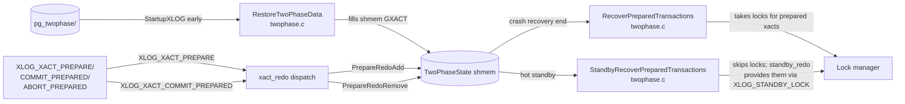

# 11 — Two-Phase Commit Recovery

[← Hot Standby and Recovery Conflicts](10_hot_standby_and_recovery_conflicts.md) | [index](index.md) | [next: Restartpoints →](12_restartpoints.md)

---


PostgreSQL's two-phase commit (2PC) keeps prepared-transaction state
in `pg_twophase/<XID>` files. Recovery must rebuild the in-memory
`GXACT` table from those files plus from any
`XLOG_XACT_PREPARE`/`COMMIT_PREPARED`/`ABORT_PREPARED` records seen
during redo. The result is two recovery flavors: full
(`RecoverPreparedTransactions`) used at end of crash recovery, and
standby (`StandbyRecoverPreparedTransactions`) used while hot
standby is active.


## Architecture



## Tier 2 APIs

### `RestoreTwoPhaseData` (`src/backend/access/transam/twophase.c`)

#### Purpose

Called early in `StartupXLOG` (before redo) to scan
`pg_twophase/` and load any pre-existing prepared-xact state into
shared memory. This makes the GXACT table reflect *durable*
state at recovery start.

#### Why

`pg_twophase/<XID>` files persist across crashes; if a primary
crashed mid-checkpoint after writing a 2PC file but before the
next checkpoint, the file is the authoritative source. The redo
loop will replay any `XLOG_XACT_PREPARE` records that *post-date*
the checkpoint, calling `PrepareRedoAdd` to keep GXACT in sync.

---

### `RecoverPreparedTransactions` (`twophase.c`, importance 0.66)

#### Signature

```c
void RecoverPreparedTransactions(void);
```

#### Purpose

End-of-recovery hook called by `StartupXLOG` *after* redo finishes
on a non-standby cluster. For each prepared xact still recorded in
shmem (i.e., not yet COMMIT_PREPARED'd or ABORT_PREPARED'd):

1. Re-read the `pg_twophase/<XID>` file.
2. Re-acquire heavyweight locks recorded in the file (so a
   subsequent `COMMIT PREPARED` from a normal backend operates
   under the same lock set the original transaction held).
3. Restore subxact state into pg_subtrans.
4. Mark the GXACT as fully recovered.

After this call the cluster can transition to `DB_IN_PRODUCTION`
with prepared transactions visible to user queries.

---

### `StandbyRecoverPreparedTransactions` (`twophase.c`)

#### Purpose

Hot-standby variant. Called by `xact_redo_prepare` (the
`PrepareRedoAdd` path) when a prepared xact is encountered during
replay. **Skips the lock-acquire step** — locks come from
`XLOG_STANDBY_LOCK` records via `standby_redo`, not from the
2PC file.

#### Why two flavors?

* On the primary at startup, no walreceiver records lock state,
  so the locks must be reconstructed from the 2PC file directly.
* On a standby, the primary has been (or will be) emitting
  `XLOG_STANDBY_LOCK` records during normal operation. Re-acquiring
  locks from the 2PC file would *double-acquire* them.

---

### Interaction with `xact_redo`

The xact_redo paths for prepared-related records:

| info | xact_redo helper | GXACT effect | 2PC file effect |
|------|------------------|--------------|-----------------|
| `XLOG_XACT_PREPARE` | `PrepareRedoAdd` | Add to in-memory list | Write `pg_twophase/<XID>` |
| `XLOG_XACT_COMMIT_PREPARED` | `xact_redo_commit + PrepareRedoRemove` | Remove from list | `RemoveTwoPhaseFile(xid)` |
| `XLOG_XACT_ABORT_PREPARED` | `xact_redo_abort + PrepareRedoRemove` | Remove from list | `RemoveTwoPhaseFile(xid)` |

The on-disk file is updated *during* redo so a crash mid-recovery
leaves a consistent view: any prepared xact has either an existing
file plus an in-memory entry, or neither.

---

## Tier 3 supporting symbols

* `PrepareRedoAdd` — adds a GXACT entry from a redo'd PREPARE.
  Reads the prepared-xact data block from the WAL record (the
  payload is the same as the original 2PC file content).
* `PrepareRedoRemove` — removes a GXACT entry on redo'd
  COMMIT_PREPARED / ABORT_PREPARED. Calls `RemoveTwoPhaseFile`.
* `RemoveTwoPhaseFile` — `unlink(pg_twophase/<XID>)`.
* `MarkAsPreparing` / `MarkAsPrepared` — primary-side counterparts
  to redo paths.
* `EndPrepare` — primary-side: writes `pg_twophase/<XID>` and
  emits `XLOG_XACT_PREPARE`.

---

## Source references

* `src/backend/access/transam/twophase.c`:
  * `RestoreTwoPhaseData`
  * `RecoverPreparedTransactions`
  * `StandbyRecoverPreparedTransactions`
  * `PrepareRedoAdd`, `PrepareRedoRemove`
* `src/backend/access/transam/xact.c:6301` — `xact_redo`
  (dispatches to xact_redo_commit/abort and PrepareRedoAdd/Remove)

## Files on disk

```
$PGDATA/pg_twophase/<XID>      # one file per prepared xact
                               # contains: TwoPhaseFileHeader,
                               # subxact list, lock list, invals,
                               # CRC
```
