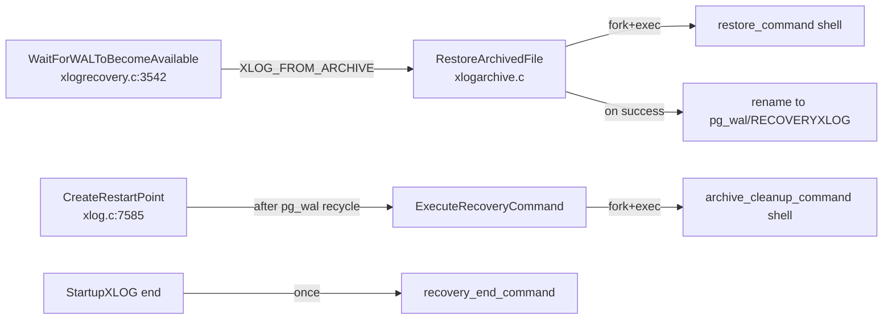

# Archive Fetch and `restore_command`

This component implements the *archive* WAL source: WAL segments and
timeline-history files that have been shipped to a third-party
location by `archive_command` are pulled back via `restore_command`
when recovery cannot find the segment in `pg_wal`. The same code
also drives `archive_cleanup_command` (called from restartpoints) and
`recovery_end_command` (called once when recovery completes).

[Top index for symbol-by-symbol pages](../../README.md)

## Architecture



## Tier 1/2 APIs

### `RestoreArchivedFile` (`src/backend/access/transam/xlogarchive.c`, importance 0.78)

#### Signature

```c
bool RestoreArchivedFile(char *path, const char *xlogfname,
                         const char *recovername, off_t expectedSize,
                         bool cleanupEnabled);
```

#### Purpose

Invokes `restore_command` to fetch one file from the WAL archive
into `pg_wal/<recovername>` (typically `RECOVERYXLOG` or
`RECOVERYHISTORY`). On success, returns true and the caller may
proceed to read the file. On failure (exit code != 0, or the file
was not produced), returns false.

#### Substitution table

The string parsed from `restore_command` undergoes three
substitutions before `system(3)` is called:

| Escape | Replacement | Source |
|--------|-------------|--------|
| `%f` | The WAL filename being requested (e.g., `00000001000000020000003F`) | `xlogfname` arg |
| `%p` | Full path to the destination (e.g., `pg_wal/RECOVERYXLOG`) | `path` arg |
| `%r` | Filename of the *last* restartpoint's redo segment, used by archive_cleanup_command to know what's safe to remove | `cleanupEnabled` ? compute : "0" |

A literal `%%` becomes `%`. Any other `%` triggers an error.

#### Step-by-step

1. Build the destination path
   (`$PGDATA/pg_wal/<recovername>` typically `pg_wal/RECOVERYXLOG`).
2. Format the command via the substitution table.
3. Block SIGTERM via `PreRestoreCommand()`. The Startup process must
   not die while the child shell is running (otherwise the child
   could be orphaned).
4. `system(cmd)` — invoke the shell.
5. `PostRestoreCommand()` re-enables SIGTERM.
6. If exit status was non-zero ⇒ log at DEBUG (expected for "no
   more files in archive"); return false.
7. Verify the produced file exists and matches `expectedSize`
   (`expectedSize == 0` ⇒ skip size check; used for history files
   whose size isn't known).
8. Rename — actually no, the file is left at `pg_wal/RECOVERYXLOG`,
   which is what `XLogFileRead` opens.

#### Recovery invariants

* On true return, `pg_wal/<recovername>` exists and is at least
  `expectedSize` bytes.
* On false return, no file is left behind (any partial output is
  removed).
* This routine never runs except in the Startup process.

#### Performance

* One `fork(2)` + `execve(2)` per invocation.
* Network archive fetches dominate; the redo loop blocks on the
  child until exit.
* The implicit cost of *not* finding a segment is one extra
  `fork`+wait — measurable on archives with many missing segments.

---

### `ExecuteRecoveryCommand` (`xlogarchive.c`, importance ~0.55)

#### Signature

```c
void ExecuteRecoveryCommand(const char *command, const char *commandName,
                            bool failOnSignal, uint32 wait_event_info);
```

#### Purpose

Generic shell-out utility used by:

* `archive_cleanup_command` — invoked from `CreateRestartPoint`
  after pg_wal recycling.
* `recovery_end_command` — invoked once from `StartupXLOG` after
  the cluster transitions out of recovery.

#### `archive_cleanup_command`

Substitutes only `%r` (path of the last restartpoint's redo
segment). Typical content:

```sh
archive_cleanup_command = 'pg_archivecleanup /mnt/wal-archive %r'
```

The shipped tool `pg_archivecleanup` prunes the archive of any WAL
file with name lexically less than `%r`.

#### `recovery_end_command`

Substitutes `%r`. Useful for "tell ops we promoted":

```sh
recovery_end_command = 'curl -X POST https://hooks.example.com/promoted'
```

The command is run **once**, after `XLOG_END_OF_RECOVERY` is written
and `pg_control` is in `DB_IN_PRODUCTION`.

---

### `KeepFileRestoredFromArchive` (`xlogarchive.c`)

When a restored file (`pg_wal/RECOVERYXLOG`) is verified valid, this
function renames it to its proper segment name (e.g.,
`pg_wal/00000001000000020000003F`) so subsequent reads can find it
in `pg_wal` without re-running `restore_command`. This is the
mechanism that turns the archive into a transparent extension of
`pg_wal`.

### `XLogArchiveCheckDone` (`xlogarchive.c`)

Used during shutdown to ensure all archived segments are durable.

---

## #define constants

```c
#define MAXFNAMELEN  64        /* max length of a WAL file name */
```

## Source references

* `src/backend/access/transam/xlogarchive.c` — entire file
* `src/backend/access/transam/xlogrecovery.c:3542` — caller chain
  via `WaitForWALToBecomeAvailable`
* `src/backend/access/transam/xlog.c:7585` — `CreateRestartPoint`
  caller for `archive_cleanup_command`

## Failure cascade

```
WaitForWALToBecomeAvailable
  -> RestoreArchivedFile (XLOG_FROM_ARCHIVE)
       -> false (exit nonzero) — log DEBUG, fall through
  -> XLogFileRead (XLOG_FROM_PG_WAL)
       -> false (file not found)
  -> if standby_mode:
       RequestXLogStreaming + WaitLatch on walreceiver
     else:
       declare end of WAL — break out of redo loop
```
