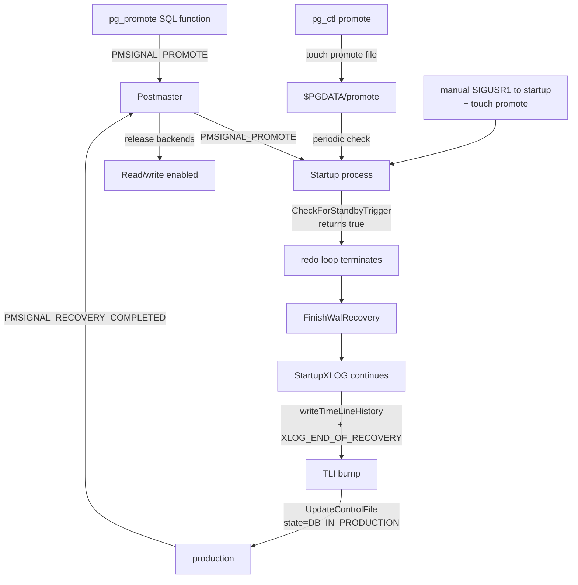

# Promotion and End of Recovery

Promotion is the transition that turns a standby (or any cluster
in recovery) into a writable primary. Three things must happen
atomically (from an outside observer's perspective):

1. The redo loop terminates.
2. The cluster picks up a new timeline ID.
3. `pg_control` flips to `DB_IN_PRODUCTION` and the postmaster
   releases backends to write.

[Top index for symbol-by-symbol pages](../../README.md)

## Trigger paths



## Tier 1 APIs

### `pg_promote` (`src/backend/access/transam/xlogfuncs.c`, importance 0.66)

#### Signature (SQL)

```sql
pg_promote(wait boolean DEFAULT true, wait_seconds integer DEFAULT 60) RETURNS boolean
```

#### Purpose

SQL-callable promotion. The function:

1. Verifies `RecoveryInProgress()` (else error: not in recovery).
2. Sends `PMSIGNAL_PROMOTE` to the postmaster.
3. If `wait=true`: polls `XLogCtl->SharedRecoveryState` every
   100ms up to `wait_seconds`; returns true when state becomes
   `RECOVERY_STATE_DONE`, false on timeout.
4. If `wait=false`: returns immediately.

The postmaster's signal handler responds by writing a `promote`
file (so a Startup-process restart would still see the request)
and signaling the Startup process via `procsignal`/`SIGUSR2`.

---

### `CheckForStandbyTrigger` (`xlogrecovery.c`, importance 0.66)

#### Signature

```c
static bool CheckForStandbyTrigger(void);
```

#### Purpose

The Startup process polls this from inside the redo loop (via
`HandleStartupProcInterrupts` and from `recoveryPausesHere`,
`recoveryApplyDelay`). On a true return, the redo loop arranges to
exit cleanly.

#### Logic

```c
if (LocalPromoteIsTriggered)         return true;     /* fast cached check */
if (CheckPromoteSignal())            { LocalPromoteIsTriggered = true; ... }
if (PromoteIsTriggered())            { ... }
return LocalPromoteIsTriggered;
```

Promotion sources:

* `pg_promote()` SQL function (sends PMSIGNAL_PROMOTE).
* `pg_ctl promote` (touches `$PGDATA/promote`).
* Any process that creates `$PGDATA/promote` and signals the
  Startup process.

`CheckPromoteSignal` checks for the existence of the `promote`
signal file (`PROMOTE_SIGNAL_FILE`).

---

### `FinishWalRecovery` (`xlogrecovery.c:1458`, importance 0.83)

Already covered in
[component_recovery_driver_and_lifecycle.md](component_recovery_driver_and_lifecycle.md).
Captures end-of-WAL state for the timeline bump.

---

## Sequence: promotion

```mermaid
sequenceDiagram
    participant U as User (psql)
    participant Pri as Promoting Standby (Startup)
    participant CKPT as Checkpointer
    participant PM as Postmaster
    participant PG as pg_control

    U->>Pri: SELECT pg_promote()
    Pri->>PM: PMSIGNAL_PROMOTE
    PM->>Pri: SIGUSR2 (also writes promote file)
    Pri->>Pri: redo loop: CheckForStandbyTrigger -> true
    Pri->>Pri: break out of loop -> FinishWalRecovery
    Pri->>Pri: ShutdownWalRcv (stop walreceiver)
    Pri->>Pri: findNewestTimeLine; newTLI = +1
    Pri->>Pri: writeTimeLineHistory(newTLI, oldTLI, switchpoint, "after standby")
    Pri->>Pri: emit XLOG_END_OF_RECOVERY (carries oldTLI->newTLI)
    Pri->>Pri: RemoveNonParentXlogFiles (clean future segments on oldTLI)
    Pri->>Pri: CreateCheckPoint(CHECKPOINT_END_OF_RECOVERY|CHECKPOINT_IMMEDIATE)
    Pri->>PG: UpdateControlFile state=DB_IN_PRODUCTION
    Pri->>PG: SharedRecoveryState=RECOVERY_STATE_DONE
    Pri->>PM: PMSIGNAL_RECOVERY_COMPLETED
    PM->>CKPT: spawn checkpointer (already running)
    PM->>U: backends now writable
    U->>Pri: pg_promote returns true
```

---

## End-of-recovery WAL records on the new timeline

After `FinishWalRecovery`, the Startup process writes one of two
records:

### `XLOG_END_OF_RECOVERY`

* Carries `xl_end_of_recovery { ThisTimeLineID, PrevTimeLineID,
  end_time, fullPageWrites }`.
* Logged when timeline is bumped (promotion or PITR with TLI
  advance).
* Tells downstream replicas about the TLI switch via
  `ApplyWalRecord`'s TLI detection.

### End-of-recovery checkpoint

* `CreateCheckPoint(CHECKPOINT_END_OF_RECOVERY |
  CHECKPOINT_IMMEDIATE)` — flushes everything.
* Bumps `pg_control->checkPoint`.
* On `DB_SHUTDOWNED` clean restart (no recovery actually run),
  this is a no-op equivalent.

---

## Promotion races

The postmaster must serialize promotion against shutdown. Two
relevant `PMState` values handle this:

```c
typedef enum {
    PM_INIT, PM_STARTUP, PM_RECOVERY, PM_HOT_STANDBY,
    PM_RUN, PM_STOP_BACKENDS, PM_WAIT_BACKUP, PM_WAIT_BACKENDS,
    PM_SHUTDOWN, PM_SHUTDOWN_2, PM_WAIT_DEAD_END, PM_NO_CHILDREN
} PMState;
```

Specifically the postmaster has fields like `Shutdown` and
`processing_promote` that mediate:

* If a SIGTERM is received during promotion, the postmaster
  finishes the in-flight promotion before processing the shutdown.
* If a promotion arrives during shutdown, it is ignored.

The PMPromote* states track the promotion sequence:

* `PM_RECOVERY` — Startup process running (no HS yet).
* `PM_HOT_STANDBY` — Startup process running, HS enabled.
* Promotion: Startup writes new TLI, sends
  `PMSIGNAL_RECOVERY_COMPLETED`, postmaster transitions to `PM_RUN`.

---

## Pause / resume during PITR

Already covered in
[component_recovery_target_system.md](component_recovery_target_system.md);
the relevant interaction with promotion is that
`pg_wal_replay_resume` after a recovery-target-PAUSE *promotes the
cluster* (see `RECOVERY_TARGET_ACTION_PAUSE` falls through to
`RECOVERY_TARGET_ACTION_PROMOTE` in `PerformWalRecovery`).

---

## Promote-related globals

```c
bool LocalPromoteIsTriggered;       /* process-local cached flag */
/* In XLogRecoveryCtl: */
bool SharedPromoteIsTriggered;      /* shmem flag for cross-backend visibility */
```

`PromoteIsTriggered()` returns the shared flag under spinlock;
`CheckForStandbyTrigger` updates the local cache.

`RemovePromoteSignalFiles` is called from `StartupXLOG` post-loop
cleanup to delete the `promote` file (and the legacy
`fallback_promote` file).

---

## Source references

* `src/backend/access/transam/xlogfuncs.c` — `pg_promote`
* `src/backend/access/transam/xlogrecovery.c` —
  `CheckForStandbyTrigger`, `CheckPromoteSignal`,
  `PromoteIsTriggered`, `RemovePromoteSignalFiles`
* `src/backend/access/transam/xlogrecovery.c:1458` —
  `FinishWalRecovery`
* `src/backend/access/transam/xlog.c:5384` — `StartupXLOG`
  end-of-recovery actions
* `src/backend/access/transam/xlog.c` —
  `CreateEndOfRecoveryRecord`
* `src/backend/postmaster/postmaster.c` — `PMPromote*` states,
  `process_pm_promote_signal`

## Related

* [component_recovery_driver_and_lifecycle.md](component_recovery_driver_and_lifecycle.md)
* [component_timelines.md](component_timelines.md) for `writeTimeLineHistory`
