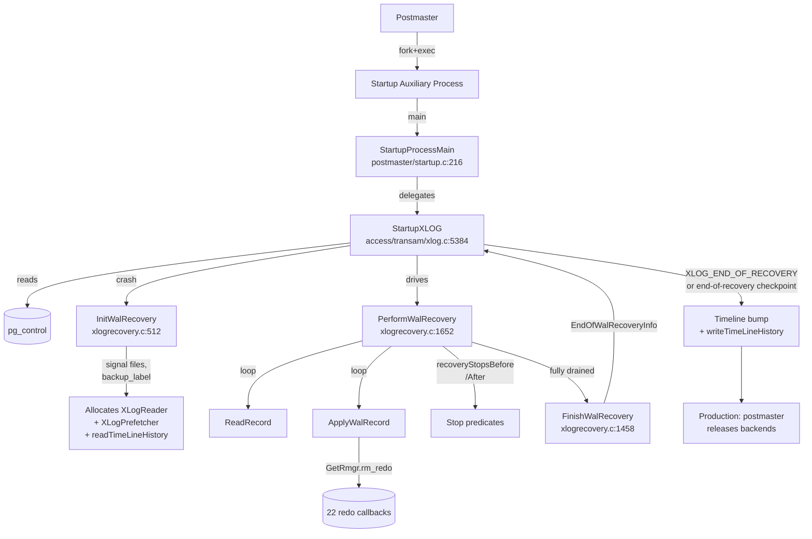

# Recovery Driver and Lifecycle

This component owns the *spine* of PostgreSQL recovery: the postmaster
forks a Startup auxiliary process whose `main()` calls `StartupXLOG`,
which in turn calls `InitWalRecovery`, then `PerformWalRecovery` (the
redo loop), then `FinishWalRecovery`, then performs the post-recovery
cleanup that brings the cluster into production. The same driver
handles all three configuration variants (crash, archive, hot
standby) — they differ only in *where* the next WAL page comes from
and *when* the loop terminates.

[Top index for symbol-by-symbol pages](../../README.md)

## Architecture



## The three variants share one driver

`StartupXLOG` opens `pg_control` via `LocalProcessControlFile` and
checks four pieces of state:

1. `ControlFile->state` — `DB_IN_PRODUCTION` ⇒ crash recovery,
   `DB_SHUTDOWNED` ⇒ skip recovery (clean restart),
   `DB_IN_ARCHIVE_RECOVERY` ⇒ resuming archive recovery, etc.
2. `recovery.signal` (file `RECOVERY_SIGNAL_FILE`) ⇒ archive recovery requested.
3. `standby.signal` (file `STANDBY_SIGNAL_FILE`) ⇒ standby mode requested
   (sets `StandbyMode=true`, never terminates redo until promote).
4. `backup_label` (file `BACKUP_LABEL_FILE`) ⇒ recovery starts from
   the *labeled* checkpoint, not pg_control's checkpoint.

All four flow into `InitWalRecovery`, which sets:

| Global | Meaning |
|--------|---------|
| `ArchiveRecoveryRequested` | recovery.signal **OR** standby.signal present |
| `StandbyMode` | standby.signal present |
| `InRecovery` | true while the redo loop runs |
| `InArchiveRecovery` | ArchiveRecoveryRequested AND not finished |
| `LocalMinRecoveryPoint` | mirror of pg_control's minRecoveryPoint |
| `reachedConsistency` | flips true when redo position ≥ minRecoveryPoint |

The redo loop itself is the same code for all three. The only
difference is what `ReadRecord → WaitForWALToBecomeAvailable` does
when WAL runs out:

* **Crash recovery**: only `XLOG_FROM_PG_WAL`. EOF ⇒ end of redo.
* **Archive recovery**: `XLOG_FROM_ARCHIVE` first (via
  `RestoreArchivedFile`), falling back to `XLOG_FROM_PG_WAL`. EOF (after
  trying both) ⇒ end of redo.
* **Standby**: `XLOG_FROM_PG_WAL` → `XLOG_FROM_ARCHIVE` →
  `XLOG_FROM_STREAM` (via walreceiver). The loop blocks waiting for
  more WAL; only ends on promote signal or shutdown.

This is what the special-focus comment "why three variants share one
driver" refers to: `PerformWalRecovery` is identical; only its WAL
source state machine differs.

---

## Tier 1 APIs

### `StartupProcessMain` (`src/backend/postmaster/startup.c:216`)

#### Signature

```c
NORETURN void StartupProcessMain(const void *startup_data, size_t startup_data_len);
```

#### Purpose

Entry point for the Startup auxiliary process forked by the
postmaster. Registers signal handlers for SIGUSR1, SIGUSR2 (promote),
SIGTERM (graceful shutdown), and SIGQUIT (immediate). Registers
standby-specific timeout slots (`STANDBY_DEADLOCK_TIMEOUT`,
`STANDBY_TIMEOUT`, `STANDBY_LOCK_TIMEOUT`) used during hot-standby
buffer-pin and lock conflicts. Then calls `StartupXLOG`. On return,
calls `proc_exit(0)`.

#### Why this matters for recovery

This is the only auxiliary process that runs the redo loop. When
`StartupXLOG` returns, the cluster is no longer in recovery, and the
postmaster sees the clean exit and transitions to
`PM_RUN`. A non-zero exit (3) signals
`recovery_target_action=shutdown`.

---

### `StartupXLOG` (`src/backend/access/transam/xlog.c:5384`)

#### Signature

```c
void StartupXLOG(void);
```

#### Purpose

Top-level recovery driver. Reads `pg_control`, decides which variant
of recovery applies, hands off to `InitWalRecovery`, drives the redo
loop via `PerformWalRecovery`, and on completion calls
`FinishWalRecovery`, writes `XLOG_END_OF_RECOVERY` (or an
end-of-recovery checkpoint), bumps the timeline if appropriate, and
flips `XLogCtl->SharedRecoveryState` to `RECOVERY_STATE_DONE`.

#### Step-by-step walkthrough

1. `LocalProcessControlFile(false)` reads `pg_control`. If the CRC
   fails or magic number is wrong, PANIC.
2. `XLOGShmemInit` finalizes shared `XLogCtl`.
3. Decide the initial state:
   * `DB_SHUTDOWNED` ⇒ no recovery; just open for production.
   * else ⇒ enter recovery; consult signal files.
4. Call `InitWalRecovery(ControlFile, &wasShutdown, &haveBackupLabel,
   &haveTblspcMap)` — sets up reader/prefetcher and the REDO start.
5. If `ArchiveRecoveryRequested`, do additional housekeeping:
   `InitRecoveryTransactionEnvironment` (enables KnownAssignedXids).
6. Send `PMSIGNAL_RECOVERY_STARTED` to postmaster.
7. Call `PerformWalRecovery()` — runs the redo loop until terminator.
8. Call `FinishWalRecovery()` — captures end-of-WAL state.
9. End-of-recovery actions:
   * `RecoverPreparedTransactions` (rebuild GXACT entries from
     pg_twophase).
   * Write `XLOG_END_OF_RECOVERY` if a TLI bump is needed; otherwise
     write an immediate checkpoint.
   * `writeTimeLineHistory` for the new TLI.
   * `RemoveNonParentXlogFiles` cleans bogus segments from the old
     timeline.
   * `UpdateControlFile` (state ⇒ `DB_IN_PRODUCTION`).
10. Flip `SharedRecoveryState = RECOVERY_STATE_DONE`.
11. `ShutdownWalRecovery` frees the reader/prefetcher.
12. `PMSIGNAL_RECOVERY_COMPLETED` (postmaster releases backends).
13. Return.

#### Recovery invariants

* This function may not return until `pg_control` is fsynced with
  `state=DB_IN_PRODUCTION`.
* `XLogCtl->SharedRecoveryState` must remain
  `RECOVERY_STATE_CRASH`/`RECOVERY_STATE_ARCHIVE` until the
  end-of-recovery checkpoint is durable.
* This routine never runs except in the Startup process; the
  global `AmStartupProcess()` is true throughout.

#### Integration points

* Called by: `StartupProcessMain` (only caller).
* Calls: `LocalProcessControlFile`, `ReadControlFile`,
  `InitWalRecovery`, `PerformWalRecovery`, `FinishWalRecovery`,
  `ShutdownWalRecovery`, `InitRecoveryTransactionEnvironment`,
  `ShutdownRecoveryTransactionEnvironment`, `CreateCheckPoint`,
  `CreateEndOfRecoveryRecord`, `writeTimeLineHistory`,
  `findNewestTimeLine`, `RemoveNonParentXlogFiles`,
  `RecoverPreparedTransactions`, `UpdateControlFile`,
  `PromoteIsTriggered`.
* Shared state mutated: `XLogCtl`, `XLogRecoveryCtl`, `ControlFile`,
  `TransamVariables`.

---

### `InitWalRecovery` (`src/backend/access/transam/xlogrecovery.c:512`)

#### Signature

```c
void InitWalRecovery(ControlFileData *ControlFile,
                     bool *wasShutdown_ptr,
                     bool *haveBackupLabel_ptr,
                     bool *haveTblspcMap_ptr);
```

#### Purpose

Decides which recovery variant applies, parses optional signal/label
files, validates GUC choices, builds the reader+prefetcher chain, and
positions the reader at the REDO start.

#### Step-by-step

1. Detect signal files:
   * `recovery.signal` ⇒ `ArchiveRecoveryRequested = true`.
   * `standby.signal` ⇒ `ArchiveRecoveryRequested = true; StandbyMode = true`.
2. If `ArchiveRecoveryRequested`, call `validateRecoveryParameters()`
   (`xlogrecovery.c:1109`) which:
   * Resolves `recovery_target_timeline` (LATEST/CONTROLFILE/NUMERIC).
   * Cross-checks: archive recovery without standby mode requires
     `restore_command` to be set.
   * Demotes `recovery_target_action=pause` to `shutdown` if
     `hot_standby` is off.
3. Call `read_backup_label` (`xlogrecovery.c:1208`) if `backup_label`
   exists — overrides the checkpoint location with the one recorded
   in the file. Sets `backupStartPoint = redo_lsn`,
   `backupEndRequired = true`. The recovery is *unsafe* until
   `XLOG_BACKUP_END` is replayed AND `minRecoveryPoint` is reached.
4. Allocate the WAL reader and prefetcher:
   ```c
   xlogreader     = XLogReaderAllocate(wal_segment_size, NULL,
                                       XL_ROUTINE(.page_read = XLogPageRead, ...),
                                       /*private_data*/ NULL);
   xlogprefetcher = XLogPrefetcherAllocate(xlogreader);
   ```
5. Read the timeline history file for the chosen TLI
   (`readTimeLineHistory`).
6. Locate and read the starting checkpoint record. If
   `backup_label` was present, read its checkpoint; otherwise use
   pg_control's `checkPoint`.
7. Position the prefetcher at the REDO start
   (`XLogPrefetcherBeginRead`).

#### Recovery invariants

* On return, `xlogreader` and `xlogprefetcher` are valid and
  positioned at REDO.
* `RedoStartLSN`, `CheckPointLoc`, `CheckPointTLI` are set as the
  static globals consumed by `PerformWalRecovery`.
* This routine never runs except in the Startup process.

---

### `PerformWalRecovery` (`src/backend/access/transam/xlogrecovery.c:1652`)

#### Signature

```c
void PerformWalRecovery(void);
```

#### Purpose

The redo loop. Reads records, evaluates stop predicates, applies
records, and loops until either WAL is exhausted (crash/archive) or
a recovery target is hit / promote is triggered (standby).

#### The redo loop body — annotated

The loop is at `xlogrecovery.c:1750-1833`:

```c
do
{
    /* progress logging (only outside StandbyMode) */
    if (!StandbyMode)
        ereport_startup_progress(...);

    /* signals: SIGTERM, SIGHUP, latch */
    HandleStartupProcInterrupts();

    /* (1) recovery-pause check */
    if (XLogRecoveryCtl->recoveryPauseState != RECOVERY_NOT_PAUSED)
        recoveryPausesHere(false);

    /* (2) stop-before predicate (LSN exclusive, XID exclusive,
     * TIME exclusive, IMMEDIATE on first consistent record) */
    if (recoveryStopsBefore(xlogreader)) {
        reachedRecoveryTarget = true;
        break;
    }

    /* (3) recovery_min_apply_delay (commit-time-based) */
    if (recoveryApplyDelay(xlogreader)) {
        if (XLogRecoveryCtl->recoveryPauseState != RECOVERY_NOT_PAUSED)
            recoveryPausesHere(false);
    }

    /* (4) actually replay this record */
    ApplyWalRecord(xlogreader, record, &replayTLI);

    /* (5) stop-after predicate (LSN inclusive, XID inclusive,
     * TIME inclusive, NAME inherently inclusive) */
    if (recoveryStopsAfter(xlogreader)) {
        reachedRecoveryTarget = true;
        break;
    }

    /* (6) fetch next record (may block in WaitForWALToBecomeAvailable) */
    record = ReadRecord(xlogprefetcher, LOG, false, replayTLI);
} while (record != NULL);
```

After the loop, if `reachedRecoveryTarget`, the post-stop dispatch
runs:

```c
switch (recoveryTargetAction) {
    case RECOVERY_TARGET_ACTION_SHUTDOWN:
        proc_exit(3);                /* postmaster sees clean exit code */
    case RECOVERY_TARGET_ACTION_PAUSE:
        SetRecoveryPause(true);
        recoveryPausesHere(true);
        /* fall through */
    case RECOVERY_TARGET_ACTION_PROMOTE:
        break;                       /* falls out into FinishWalRecovery */
}
```

The first thing the loop does is set `XLogRecoveryCtl->lastReplayed*`
to the REDO start, then call `RmgrStartup()` which invokes each
rmgr's optional `rm_startup` (used by btree, gin, gist, spgist for
incomplete-split tracking). After the loop, `RmgrCleanup()` runs.

#### Recovery invariants

* On return, every WAL record up to (but not including) any
  recovery-target stop point has been applied to disk via
  `XLogReadBufferForRedo`/`mdwrite`.
* `XLogRecoveryCtl->lastReplayedEndRecPtr` reflects the LSN of the
  last applied record.
* `LocalMinRecoveryPoint` and `pg_control->minRecoveryPoint` are
  ≥ each replay LSN that touched a buffer (advanced by
  `UpdateMinRecoveryPoint` from buffer-write paths).
* This routine never runs except in the Startup process.

#### Performance characteristics

* Records are streamed via the prefetcher; if `recovery_prefetch ≠ off`,
  `XLogPrefetcherNextBlock` calls `PrefetchSharedBuffer` ahead of the
  redo loop's read.
* `ApplyWalRecord` is dominated by buffer reads (data pages),
  shared-memory updates (KnownAssignedXids), and SLRU writes (CLOG).
* Cascading replication: at end of each `ApplyWalRecord`,
  `WalSndWakeup` is called when `AllowCascadeReplication()` is true.

---

### `ApplyWalRecord` (`src/backend/access/transam/xlogrecovery.c:1908`)

#### Signature

```c
static void ApplyWalRecord(XLogReaderState *xlogreader,
                           XLogRecord *record,
                           TimeLineID *replayTLI);
```

#### Step-by-step walkthrough

The function is short and important; here are the exact phases:

1. **Push error context** — adds `rm_redo_error_callback` so any
   `ereport` from `rm_redo` includes the offending record's LSN,
   prev, xid, rmid, info, len.
2. **Advance nextXid** — `AdvanceNextFullTransactionIdPastXid(record->xl_xid)`
   keeps `TransamVariables->nextXid` ≥ every replayed xid.
3. **Detect TLI switch** — Only `XLOG_CHECKPOINT_SHUTDOWN` and
   `XLOG_END_OF_RECOVERY` carry TLI metadata. If `newReplayTLI !=
   *replayTLI`, call `checkTimeLineSwitch` to validate against the
   history file, then update `*replayTLI` and set `switchedTLI = true`.
4. **Record xid in KnownAssignedXids** — only when
   `standbyState >= STANDBY_INITIALIZED` AND `xl_xid` is valid.
   Calls `RecordKnownAssignedTransactionIds`.
5. **xlogrecovery_redo** — for `RM_XLOG_ID` records,
   the recovery-driver-private `xlogrecovery_redo` runs first,
   handling `XLOG_OVERWRITE_CONTRECORD` and `XLOG_BACKUP_END`
   (which clears `backupEndPoint` once the backup is complete).
6. **Dispatch to rmgr** — the actual redo:
   ```c
   GetRmgr(record->xl_rmid).rm_redo(xlogreader);
   ```
   This is the sole bridge from the recovery driver to the 22 rmgr
   redo callbacks (see `component_rmgr_dispatch.md`).
7. **Verify backup pages** — when `wal_consistency_checking` is on
   and the record carries `XLR_CHECK_CONSISTENCY`,
   `verifyBackupPageConsistency` re-applies the FPI to a temp buffer
   and `memcmp`s against the just-replayed page.
8. **Update lastReplayed*** under `info_lck`.
9. **Wake walsenders** — `WalSndWakeup(switchedTLI, true)` if cascade
   replication is allowed.
10. **Wake walreceiver for reply** — if rm_redo set
    `doRequestWalReceiverReply`, call `WalRcvForceReply`.
11. **CheckRecoveryConsistency** — flips `reachedConsistency` and
    sends `PMSIGNAL_BEGIN_HOT_STANDBY` once minRecoveryPoint is
    crossed.
12. **TLI switch cleanup** — `RemoveNonParentXlogFiles` and
    `XLogPrefetchReconfigure` if a TLI switch happened.

#### Recovery invariants

* On return, the durable on-disk state is one record further along.
  The buffer manager guarantees `dirty` pages will be flushed before
  a checkpoint advances `minRecoveryPoint`.
* `lastReplayedEndRecPtr` always refers to a fully applied record;
  it is never set ahead of the disk state.
* This function never runs except in the Startup process.

---

### `FinishWalRecovery` (`src/backend/access/transam/xlogrecovery.c:1458`)

#### Signature

```c
EndOfWalRecoveryInfo *FinishWalRecovery(void);
```

#### Purpose

Pre-promotion finalization. Captures end-of-WAL state, the bytes of
any partial trailing WAL page, and the `lastRec` checkpoint metadata
so `StartupXLOG` can write `XLOG_END_OF_RECOVERY` (or an immediate
checkpoint) at the correct LSN.

#### Returns

A pointer to a `EndOfWalRecoveryInfo` containing:

* `lastRec` — LSN of the last applied record.
* `lastRecTLI` — its timeline.
* `endOfLog` — first LSN past the last applied record.
* `endOfLogTLI` — its timeline (may have advanced).
* `lastPage[]` — bytes of the last partial page (so we can resume
   writing from the right place).
* `lastPageBeginPtr` — where that page starts on disk.

#### Integration

Called by `StartupXLOG` after `PerformWalRecovery` returns.
`StartupXLOG` then writes `XLOG_END_OF_RECOVERY` followed by an
end-of-recovery checkpoint and increments the timeline ID.

---

## Tier 2/3 supporting symbols

### `ShutdownWalRecovery` (`xlogrecovery.c:1608`, importance 0.55)

Frees the reader/prefetcher and shuts down the walreceiver. Called
right before `StartupXLOG` returns.

### `InitRecoveryTransactionEnvironment` (`storage/ipc/standby.c`, importance 0.71)

Sets up the Startup process to behave like a backend (vxid,
procarray entry, KnownAssignedXids storage). Required before the
first standby record is replayed. Counterpart:
`ShutdownRecoveryTransactionEnvironment`.

### `XLogRecoveryCtl` (`xlogrecovery.c`, importance 0.83) — shmem

Shared-memory recovery state. Key fields used by the redo loop:

| Field | Purpose |
|------|---------|
| `lastReplayedReadRecPtr` | LSN of last applied record (read pointer) |
| `lastReplayedEndRecPtr` | LSN of byte after last applied record |
| `lastReplayedTLI` | Timeline of last applied record |
| `replayEndRecPtr` | LSN through which redo *will* progress |
| `replayEndTLI` | TLI of `replayEndRecPtr` |
| `recoveryLastXTime` | timestamp of last replayed COMMIT/ABORT |
| `recoveryPauseState` | `RECOVERY_NOT_PAUSED` / `RECOVERY_PAUSE_REQUESTED` / `RECOVERY_PAUSED` |
| `SharedHotStandbyActive` | published HS flag, read by `HotStandbyActive` |
| `SharedPromoteIsTriggered` | published promote flag |
| `info_lck` | spinlock guarding all of the above |

### `XLogCtl` (`xlog.c`, importance 0.78) — shmem

XLOG-side shared memory. The single field that matters for recovery
is `SharedRecoveryState`:

```c
typedef enum RecoveryState {
    RECOVERY_STATE_CRASH,    /* crash recovery */
    RECOVERY_STATE_ARCHIVE,  /* archive recovery */
    RECOVERY_STATE_DONE,     /* production */
} RecoveryState;
```

`RecoveryInProgress()` reads this through a process-local cache for
a lock-free fast path.

### `StandbyMode` (`xlogrecovery.c`, importance 0.71)

True iff `standby.signal` was found. Gates the streaming source
inside `WaitForWALToBecomeAvailable` and tells `PerformWalRecovery`
not to terminate on EOF.

### `ArchiveRecoveryRequested` (`xlogrecovery.c`, importance 0.66)

True iff `recovery.signal` OR `standby.signal` was found. Gates
`InitWalRecovery` into archive mode.

---

## Source references

* `src/backend/postmaster/startup.c:216` — `StartupProcessMain`
* `src/backend/access/transam/xlog.c:5384` — `StartupXLOG`
* `src/backend/access/transam/xlogrecovery.c:512` — `InitWalRecovery`
* `src/backend/access/transam/xlogrecovery.c:1109` — `validateRecoveryParameters`
* `src/backend/access/transam/xlogrecovery.c:1208` — `read_backup_label`
* `src/backend/access/transam/xlogrecovery.c:1458` — `FinishWalRecovery`
* `src/backend/access/transam/xlogrecovery.c:1608` — `ShutdownWalRecovery`
* `src/backend/access/transam/xlogrecovery.c:1652` — `PerformWalRecovery`
* `src/backend/access/transam/xlogrecovery.c:1908` — `ApplyWalRecord`
* `src/include/access/xlog.h` — signal-file `#define`s

## #define constants

```c
#define RECOVERY_SIGNAL_FILE        "recovery.signal"
#define STANDBY_SIGNAL_FILE         "standby.signal"
#define PROMOTE_SIGNAL_FILE         "promote"
#define BACKUP_LABEL_FILE           "backup_label"
#define BACKUP_LABEL_OLD            "backup_label.old"
#define TABLESPACE_MAP              "tablespace_map"
#define TABLESPACE_MAP_OLD          "tablespace_map.old"
```
