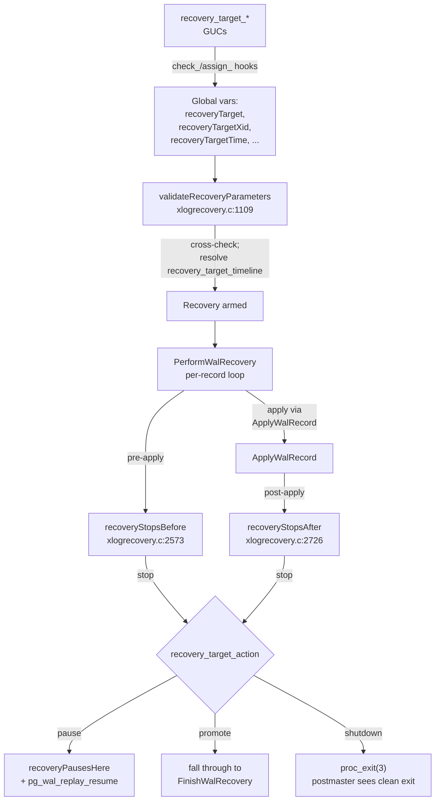

# Recovery Target System (PITR)

The recovery-target system implements **point-in-time recovery**:
PostgreSQL replays WAL until a stop condition is reached, then —
depending on `recovery_target_action` — pauses, promotes, or shuts
down. This document covers the full machinery: GUC validation,
per-record stop predicates, the apply-delay mechanism, and the
pause/resume API.

[Top index for symbol-by-symbol pages](../../README.md)

## Overview diagram



---

## `validateRecoveryParameters` (`xlogrecovery.c:1109`, importance 0.62)

#### Purpose

Cross-checks the recovery-related GUCs at recovery startup. Quoted
verbatim from `xlogrecovery.c:1108-1186`:

```c
static void
validateRecoveryParameters(void)
{
    if (!ArchiveRecoveryRequested)
        return;

    /* Compulsory parameters */
    if (StandbyModeRequested)
    {
        if ((PrimaryConnInfo == NULL || strcmp(PrimaryConnInfo, "") == 0) &&
            (recoveryRestoreCommand == NULL || strcmp(recoveryRestoreCommand, "") == 0))
            ereport(WARNING,
                    (errmsg("specified neither \"primary_conninfo\" nor \"restore_command\""), ...));
    }
    else
    {
        if (recoveryRestoreCommand == NULL || strcmp(recoveryRestoreCommand, "") == 0)
            ereport(FATAL,
                    (errcode(ERRCODE_INVALID_PARAMETER_VALUE),
                     errmsg("must specify \"restore_command\" when standby mode is not enabled")));
    }

    /* Demote PAUSE → SHUTDOWN if hot_standby is off */
    if (recoveryTargetAction == RECOVERY_TARGET_ACTION_PAUSE && !EnableHotStandby)
        recoveryTargetAction = RECOVERY_TARGET_ACTION_SHUTDOWN;

    /* Final timestamp parsing (timezone may have been deferred) */
    if (recoveryTarget == RECOVERY_TARGET_TIME)
        recoveryTargetTime = DatumGetTimestampTz(DirectFunctionCall3(timestamptz_in, ...));

    /* Resolve recovery_target_timeline */
    if (recoveryTargetTimeLineGoal == RECOVERY_TARGET_TIMELINE_NUMERIC)
    {
        if (rtli != 1 && !existsTimeLineHistory(rtli))
            ereport(FATAL, ...);
        recoveryTargetTLI = rtli;
    }
    else if (recoveryTargetTimeLineGoal == RECOVERY_TARGET_TIMELINE_LATEST)
        recoveryTargetTLI = findNewestTimeLine(recoveryTargetTLI);
    /* else CONTROLFILE: keep value already loaded */
}
```

#### Mutual exclusion of `recovery_target_*` parsers

Each `recovery_target_*` GUC has a `check_*` hook (e.g.,
`check_recovery_target_xid` at `xlogrecovery.c:5012`) that consults
the `extra` pointer slot used by other recovery_target_* hooks. If
another target is already armed, the parser rejects the new value
with `ERRCODE_INVALID_PARAMETER_VALUE`. This guarantees at most one
of {xid, time, lsn, name, immediate} is active.

---

## Stop predicates: `recoveryStopsBefore` and `recoveryStopsAfter`

The recovery loop calls these immediately surrounding
`ApplyWalRecord`:

```c
/* xlogrecovery.c:1796 */
if (recoveryStopsBefore(xlogreader)) { reachedRecoveryTarget = true; break; }
...
ApplyWalRecord(xlogreader, record, &replayTLI);
/* xlogrecovery.c:1825 */
if (recoveryStopsAfter(xlogreader))  { reachedRecoveryTarget = true; break; }
```

### `recoveryStopsBefore` decision tree (`xlogrecovery.c:2573`)

```
if !ArchiveRecoveryRequested:        return false   /* crash recovery ignores targets */

if recoveryTarget==IMMEDIATE && reachedConsistency:
    LOG "recovery stopping after reaching consistency"
    return true

if recoveryTarget==LSN && !inclusive && record->ReadRecPtr >= recoveryTargetLSN:
    LOG "recovery stopping before WAL location ..."
    return true

if rmid != RM_XACT_ID:               return false

extract recordXid from XACT_COMMIT/COMMIT_PREPARED/ABORT/ABORT_PREPARED

if recoveryTarget==XID && !inclusive && recordXid == recoveryTargetXid:
    stopsHere = true

if getRecordTimestamp(...) && recoveryTarget==TIME:
    if inclusive: stopsHere = (recordXtime >  recoveryTargetTime)
    else:         stopsHere = (recordXtime >= recoveryTargetTime)

return stopsHere
```

### `recoveryStopsAfter` decision tree (`xlogrecovery.c:2726`)

```
if !ArchiveRecoveryRequested:        return false

if recoveryTarget==NAME && rmid==RM_XLOG_ID && info==XLOG_RESTORE_POINT:
    if rp_name == recoveryTargetName:
        LOG "recovery stopping at restore point ..."
        return true

if recoveryTarget==LSN && inclusive && record->ReadRecPtr >= recoveryTargetLSN:
    LOG "recovery stopping after WAL location ..."
    return true

if rmid != RM_XACT_ID:               return false

if xact_info in {COMMIT, COMMIT_PREPARED, ABORT, ABORT_PREPARED}:
    SetLatestXTime(recordXtime)      /* always update */
    if recoveryTarget==XID && inclusive && recordXid == recoveryTargetXid:
        stopsHere = true
    if recoveryTarget==TIME && inclusive:
        stopsHere = (recordXtime > recoveryTargetTime)

return stopsHere
```

Note: name-based stops are checked at `recoveryStopsAfter` because
`XLOG_RESTORE_POINT` records have no semantically meaningful "before
this record" point — the record itself is the marker.

---

## Recovery target action dispatch

After a stop predicate returns true and the redo loop breaks, the
post-stop dispatch runs (`xlogrecovery.c:1851-1869`):

```c
switch (recoveryTargetAction)
{
    case RECOVERY_TARGET_ACTION_SHUTDOWN:
        proc_exit(3);                /* postmaster sees this exit code */

    case RECOVERY_TARGET_ACTION_PAUSE:
        SetRecoveryPause(true);
        recoveryPausesHere(true);
        /* if user does pg_wal_replay_resume, fall through to PROMOTE */

    case RECOVERY_TARGET_ACTION_PROMOTE:
        break;                       /* drop into FinishWalRecovery */
}
```

Note the deliberate fall-through: pause + resume == promote. The
operator can pause, inspect, then resume to promote.

---

## `recoveryPausesHere` (`xlogrecovery.c:2925`)

Quoted body:

```c
static void
recoveryPausesHere(bool endOfRecovery)
{
    if (!LocalHotStandbyActive)         /* can't pause if no readers */
        return;
    if (LocalPromoteIsTriggered)        /* promotion wins over pause */
        return;

    while (GetRecoveryPauseState() != RECOVERY_NOT_PAUSED)
    {
        HandleStartupProcInterrupts();
        if (CheckForStandbyTrigger())   /* pg_promote / promote file */
            return;
        ConfirmRecoveryPaused();
        ConditionVariableTimedSleep(&XLogRecoveryCtl->recoveryNotPausedCV,
                                     1000, WAIT_EVENT_RECOVERY_PAUSE);
    }
    ConditionVariableCancelSleep();
}
```

The pause is implemented via a condition variable
(`XLogRecoveryCtl->recoveryNotPausedCV`) so a `pg_wal_replay_resume`
call from a backend wakes the startup process within milliseconds.
The 1000ms timeout is a safety net for SIGTERM/promote checks.

### Pause / resume API

* `pg_wal_replay_pause()` — sets
  `XLogRecoveryCtl->recoveryPauseState = RECOVERY_PAUSE_REQUESTED`.
  The next iteration of the redo loop notices and calls
  `recoveryPausesHere(false)`.
* `pg_wal_replay_resume()` — sets `recoveryPauseState =
  RECOVERY_NOT_PAUSED` and broadcasts on the CV.
* `pg_get_wal_replay_pause_state()` — reads the current state, one
  of `not paused` / `pause requested` / `paused`.

The three-state machine matters: a request from a backend ⇒
`PAUSE_REQUESTED`; the startup process confirms by transitioning to
`PAUSED` once it actually reaches `recoveryPausesHere`. Backends
can wait for full pause confirmation before assuming nothing is
being applied.

---

## `recoveryApplyDelay` (`xlogrecovery.c:2982`)

Implements the `recovery_min_apply_delay` GUC. Quoted core:

```c
static bool
recoveryApplyDelay(XLogReaderState *record)
{
    if (recovery_min_apply_delay <= 0) return false;
    if (!reachedConsistency) return false;
    if (!ArchiveRecoveryRequested) return false;
    if (XLogRecGetRmid(record) != RM_XACT_ID) return false;

    xact_info = XLogRecGetInfo(record) & XLOG_XACT_OPMASK;
    if (xact_info != XLOG_XACT_COMMIT && xact_info != XLOG_XACT_COMMIT_PREPARED)
        return false;

    if (!getRecordTimestamp(record, &xtime)) return false;

    delayUntil = TimestampTzPlusMilliseconds(xtime, recovery_min_apply_delay);

    while (msecs > 0)
    {
        ResetLatch(...);
        HandleStartupProcInterrupts();
        if (CheckForStandbyTrigger()) break;     /* promote interrupts delay */
        delayUntil = TimestampTzPlusMilliseconds(xtime, recovery_min_apply_delay);
        msecs = TimestampDifferenceMilliseconds(GetCurrentTimestamp(), delayUntil);
        if (msecs <= 0) break;
        WaitLatch(..., WL_LATCH_SET | WL_TIMEOUT, msecs, ...);
    }
    return true;
}
```

#### Why commit time, not receive time

The delay is measured from the **record's xact_time** (the commit
timestamp on the primary), not from when the standby received the
record. This means:

* The standby is always exactly `recovery_min_apply_delay` behind
  the primary's *transaction order*, regardless of network jitter
  or replay backlog.
* Two standbys with the same delay value will reach the same
  application LSN at the same wall-clock time (modulo clock skew).
* The interaction with `max_standby_*_delay` is independent: that
  GUC controls how long the **startup process** waits for backends
  to clear after a conflict; this GUC controls how long the startup
  process waits before applying a commit at all.

#### Apply-delay only applies to COMMIT records

Aborts are not delayed, because they have no MVCC effect — they
don't release row visibility. Records other than COMMIT/
COMMIT_PREPARED are applied immediately.

---

## Tier 1: stop predicate sources

```c
/* Globals set by the parser/assign hooks */
TransactionId   recoveryTargetXid;
TimestampTz     recoveryTargetTime;
XLogRecPtr      recoveryTargetLSN;
char            recoveryTargetName[MAXFNAMELEN];
bool            recoveryTargetInclusive;     /* default true */

/* Recovery state set when a stop condition fires */
bool            recoveryStopAfter;           /* true = stopped after, false = before */
TransactionId   recoveryStopXid;
TimestampTz     recoveryStopTime;
XLogRecPtr      recoveryStopLSN;
char            recoveryStopName[MAXFNAMELEN];
```

These globals are visible to monitoring queries via
`pg_get_wal_replay_pause_state()` and `pg_last_xact_replay_timestamp()`.

---

## Source references

* `src/backend/access/transam/xlogrecovery.c:1109` — `validateRecoveryParameters`
* `src/backend/access/transam/xlogrecovery.c:2573` — `recoveryStopsBefore`
* `src/backend/access/transam/xlogrecovery.c:2726` — `recoveryStopsAfter`
* `src/backend/access/transam/xlogrecovery.c:2925` — `recoveryPausesHere`
* `src/backend/access/transam/xlogrecovery.c:2982` — `recoveryApplyDelay`
* `src/include/access/xlogrecovery.h:23` — `RecoveryTargetType` enum
* `src/include/access/xlog_internal.h:322` — `RecoveryTargetAction` enum
* GUC table: `src/backend/utils/misc/guc_tables.c:1767`, `:2172`,
  `:3997`, `:4007`, `:4016`, `:4025`, `:4034`, `:4043`, `:4924`

## Related catalogs

* [recovery_target_catalog/xid_lsn_time_targets.md](recovery_target_catalog/xid_lsn_time_targets.md)
* [recovery_target_catalog/name_immediate_targets.md](recovery_target_catalog/name_immediate_targets.md)
* [recovery_target_catalog/timeline_targets.md](recovery_target_catalog/timeline_targets.md)
