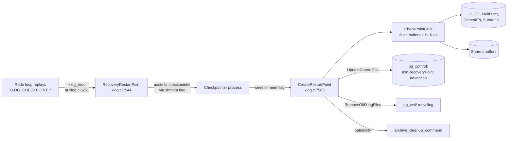

# Restartpoints

A **restartpoint** is the recovery analogue of a checkpoint. It
flushes shared buffers and SLRUs to disk, advances
`minRecoveryPoint`, and recycles `pg_wal/`. It does **not** write a
`CHECKPOINT` WAL record — a standby/recovering cluster cannot write
WAL. Restartpoints exist to bound the redo distance after a future
crash and to allow `pg_wal/` recycling on a long-running standby.

[Top index for symbol-by-symbol pages](../../README.md)

## Why restartpoints

Without restartpoints:

* A standby that runs for a week would accumulate one WAL segment
  per `wal_segment_size` written on the primary, never reclaiming
  any of it.
* If the standby crashes, recovery would have to replay a week's
  worth of WAL even though most of the changes have long been on
  disk.

With restartpoints:

* `pg_wal/` is recycled the same way as on the primary (subject to
  `min_wal_size`/`max_wal_size`).
* On crash, recovery starts from the last restartpoint's redo LSN.
* `minRecoveryPoint` advances so a future crash recovery's
  consistency point is closer to the present.

## Architecture



## Tier 1 APIs

### `RecoveryRestartPoint` (`src/backend/access/transam/xlog.c:7544`, importance 0.74)

#### Signature

```c
void RecoveryRestartPoint(const CheckPoint *checkPoint, XLogReaderState *record);
```

#### Purpose

Invoked from `xlog_redo` whenever a `XLOG_CHECKPOINT_SHUTDOWN` or
`XLOG_CHECKPOINT_ONLINE` record is replayed. Decides whether the
checkpointer should *actually* perform a restartpoint, and if so,
flags it via shared memory.

#### Logic

1. Verify that the redo position has actually advanced past the
   previous restartpoint by at least `checkpoint_timeout` worth of
   work (or another threshold; otherwise we'd restartpoint on every
   tiny CHECKPOINT_ONLINE).
2. Update `XLogCtl->lastCheckPoint` and
   `XLogCtl->lastCheckPointRecPtr` to the just-replayed checkpoint.
3. Set `XLogCtl->lastCheckPointIsRequired = true` — the
   checkpointer's main loop will see this and call
   `CreateRestartPoint`.

`RecoveryRestartPoint` does **not** itself flush anything. The
actual work is delegated to the checkpointer process so the
Startup process can keep replaying.

---

### `CreateRestartPoint` (`src/backend/access/transam/xlog.c:7585`, importance 0.83)

#### Signature

```c
bool CreateRestartPoint(int flags);
```

#### Purpose

Run by the checkpointer process. Flushes shared buffers and SLRUs,
advances `minRecoveryPoint`, recycles old WAL.

#### Step-by-step

1. Verify `RecoveryInProgress()` — refuse if not.
2. Acquire `CheckpointLock` (one restartpoint at a time).
3. Read `lastCheckPoint*` from shmem (set by
   `RecoveryRestartPoint`).
4. `CheckPointGuts(checkPoint.redo, flags)` — the shared
   buffer-and-SLRU flush, see below.
5. Update `pg_control`:
   * `minRecoveryPoint = max(minRecoveryPoint,
     XLogRecoveryCtl->replayEndRecPtr)`.
   * `minRecoveryPointTLI = XLogRecoveryCtl->replayEndTLI`.
   * `state` stays `DB_IN_ARCHIVE_RECOVERY` (or
     `DB_IN_CRASH_RECOVERY`).
6. `UpdateControlFile()` — fsynced.
7. `KeepLogSeg(receivePtr, &endSegNo)` — preserve segments needed
   by replication slots / WAL archiving.
8. `RemoveOldXlogFiles(endSegNo, lastredoptr, RedoRecPtr)` — free
   pg_wal segments older than the new restartpoint's redo position.
9. If `archive_cleanup_command` is set ⇒
   `ExecuteRecoveryCommand(archive_cleanup_command, ...)` with
   `%r = <last restartpoint segment name>`.
10. Release `CheckpointLock`.

#### What `CheckPointGuts` does

Both checkpoints and restartpoints call this. It dispatches to:

```c
CheckPointCLOG();
CheckPointCommitTs();
CheckPointSUBTRANS();
CheckPointMultiXact();
CheckPointPredicate();
CheckPointRelationMap();
CheckPointReplicationSlots(flags);
CheckPointSnapBuild();
CheckPointLogicalRewriteHeap();
CheckPointBuffers(flags);     /* the big one — flushes all dirty buffers */
ProcessSyncRequests();        /* fsync queued files */
CheckPointTwoPhase(checkPointRedo);
```

After this returns, every dirty page modified before the
checkpoint's redo position is durable. This is what makes
`minRecoveryPoint` safe to advance.

#### Recovery invariants

* On return (success), `pg_control->minRecoveryPoint` is fsynced
  with a value ≥ the checkpoint's redo position.
* No dirty buffer with `BM_LSN ≤ minRecoveryPoint` exists.
* `pg_wal/` segments older than the kept range have been deleted
  or recycled.

---

## When restartpoints fire

Triggered by:

* The redo loop replaying a `XLOG_CHECKPOINT_SHUTDOWN` or
  `XLOG_CHECKPOINT_ONLINE` record.
* `RequestCheckpoint(CHECKPOINT_CAUSE_XLOG)` — called from
  `XLogPageRead` when too many segments have been read since the
  last restartpoint (hardcoded
  `XLogCheckpointNeeded(readSegNo)`).

The frequency is therefore bounded by:

* `checkpoint_timeout` on the primary (records appear at this rate
  in the WAL stream).
* `max_wal_size` on the standby (forces a restartpoint when WAL
  approaches the configured ceiling).

## Restartpoint vs checkpoint

| Aspect | Checkpoint | Restartpoint |
|--------|-----------|--------------|
| Where | Primary; runs on checkpointer | Standby; runs on checkpointer |
| Writes WAL | Yes (`XLOG_CHECKPOINT_*`) | No (cluster cannot write WAL) |
| Flushes buffers | Yes | Yes |
| Flushes SLRUs | Yes | Yes |
| Advances `minRecoveryPoint` | N/A | Yes |
| Updates pg_control | Yes (`checkPoint`) | Yes (`minRecoveryPoint`) |
| Recycles `pg_wal/` | Yes | Yes |
| Triggers `archive_cleanup_command` | No | Yes |

The next on-primary checkpoint is what the standby replays as a
restartpoint trigger. The standby does not generate any new
checkpoint records; it just replays the primary's.

---

## GUCs

| GUC | Effect |
|-----|--------|
| `checkpoint_timeout` | Indirectly: the primary's checkpoint cadence becomes the standby's restartpoint cadence |
| `max_wal_size` | Caps `pg_wal/` size; forced restartpoint when approached |
| `min_wal_size` | Floor for recycled segments |
| `checkpoint_warning` | Emits warning if checkpoints occur faster than this |
| `archive_cleanup_command` | Run after each restartpoint with `%r` = last restartpoint segment name |

---

## Source references

* `src/backend/access/transam/xlog.c:7544` — `RecoveryRestartPoint`
* `src/backend/access/transam/xlog.c:7585` — `CreateRestartPoint`
* `src/backend/access/transam/xlog.c` — `CheckPointGuts`,
  `KeepLogSeg`, `RemoveOldXlogFiles`
* `src/backend/access/transam/xlogarchive.c` —
  `ExecuteRecoveryCommand` for `archive_cleanup_command`

## Related

* `xlog_redo` (xlog.c:8251) — the call site that invokes
  `RecoveryRestartPoint` after replaying CHECKPOINT records.
* See [redo_callback_catalog/core_xlog_xact_redo.md](redo_callback_catalog/core_xlog_xact_redo.md).
