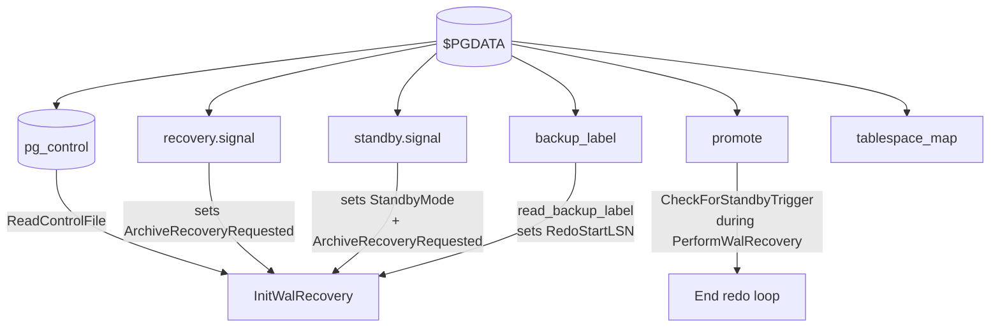
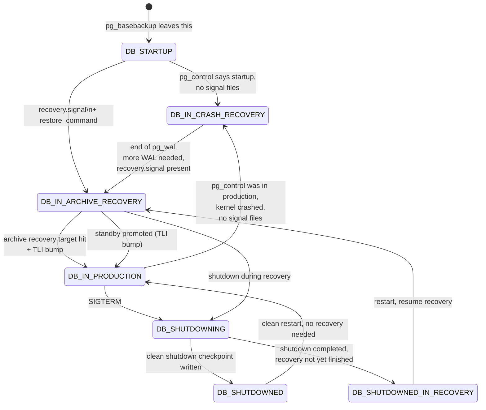

# Signal Files and `pg_control` State Machine

Recovery's three configuration variants — crash, archive, standby —
are selected by the *combination* of two pieces of input that
`InitWalRecovery` examines at startup:

1. The `state` field in `pg_control` (`ControlFileData->state`),
   which records what was happening when the cluster last ran.
2. The presence of three signal files in `$PGDATA`:
   `recovery.signal`, `standby.signal`, and (for promotion)
   `promote`.

A fourth optional file — `backup_label` — overrides the redo start
LSN when the cluster has been started from a base backup.

[Top index for symbol-by-symbol pages](../../README.md)

## Architecture



## File catalog

| File | Defined as | Set by | Effect |
|------|-----------|--------|--------|
| `recovery.signal` | `RECOVERY_SIGNAL_FILE` (xlog.h) | DBA, before start | `ArchiveRecoveryRequested = true`; perform PITR with `restore_command` |
| `standby.signal` | `STANDBY_SIGNAL_FILE` (xlog.h) | DBA / pg_basebackup | `StandbyMode = true; ArchiveRecoveryRequested = true`; continuous recovery, never terminate redo loop unless promoted |
| `promote` | `PROMOTE_SIGNAL_FILE` (xlog.h) | `pg_promote()`, `pg_ctl promote`, manual `touch` | `CheckForStandbyTrigger` returns true ⇒ redo loop ends ⇒ promotion |
| `backup_label` | `BACKUP_LABEL_FILE` (xlog.h) | `pg_basebackup`, `pg_backup_start` | `read_backup_label` overrides REDO start point with backup's checkpoint LSN |
| `tablespace_map` | `TABLESPACE_MAP` (xlog.h) | `pg_basebackup -F p -X stream` | Recreates symlinks under `pg_tblspc/` from backup |

The signal-detection block in `InitWalRecovery` is at
`xlogrecovery.c:1056-1106`. It checks `standby.signal` first; if
both `standby.signal` and `recovery.signal` are present, standby
mode wins.

```c
/* xlogrecovery.c:1083-1096 — quoted */
StandbyModeRequested = false;
ArchiveRecoveryRequested = false;
if (standby_signal_file_found)
{
    StandbyModeRequested = true;
    ArchiveRecoveryRequested = true;
}
else if (recovery_signal_file_found)
{
    StandbyModeRequested = false;
    ArchiveRecoveryRequested = true;
}
else
    return;
```

The signal files are `fsync`'d as soon as they're seen so that a
crash between `recovery.signal` detection and `pg_control`
update can't lose the request.

---

## `read_backup_label` (`xlogrecovery.c:1208`, importance 0.66)

#### Signature

```c
static bool read_backup_label(XLogRecPtr *checkPointLoc,
                              TimeLineID *backupLabelTLI,
                              bool *backupEndRequired,
                              bool *backupFromStandby);
```

#### Purpose

Override the recovery start point. `pg_control` may reflect a
*later* checkpoint than the one captured at backup time, so we must
replay from the LSN written into `backup_label`, not from
`pg_control->checkPoint`.

#### File format

```
START WAL LOCATION: 1/12345678 (file 0000000200000001000000A2)
CHECKPOINT LOCATION: 1/12345780
BACKUP METHOD: streamed
BACKUP FROM: primary
START TIME: 2024-01-15 12:34:56 UTC
LABEL: pg_basebackup base backup
START TIMELINE: 2
```

The function sets four globals:

* `RedoStartLSN = ((uint64) hi) << 32 | lo` from `START WAL LOCATION`.
* `RedoStartTLI = tli_from_walseg`.
* `*checkPointLoc = ...` from `CHECKPOINT LOCATION`.
* `*backupEndRequired = (BACKUP METHOD == "streamed")`.

#### Backup label crash safety

If `BACKUP METHOD` is `streamed`, `backupEndRequired` is true. This
means recovery must replay until `XLOG_BACKUP_END` is encountered,
clearing `backupEndPoint`. Until then, **the database is not
consistent** — `reachedConsistency` cannot become true.

This is the key invariant: a base backup may have been taken on a
running primary while pages were changing in shared buffers. Some
of those pages were captured pre-write, some post-write. Replaying
WAL from the labeled redo LSN forward overwrites every modified
page; only at `XLOG_BACKUP_END` (issued by `pg_backup_stop`) is the
on-disk image guaranteed to be a transactionally consistent
snapshot.

The interaction with `minRecoveryPoint`:

* `minRecoveryPoint` is the LSN we must reach before allowing
  read-only connections — it is the LSN of the latest write that
  has *touched* a buffer up to this point.
* `backupEndPoint` is the LSN of the `XLOG_BACKUP_END` record. Once
  we replay it, the backup's on-disk image is consistent.
* Both must be reached for `reachedConsistency` to flip true.

`minRecoveryPoint` is **not** the redo point. The redo point is
where replay starts; `minRecoveryPoint` is where replay finishes
the post-backup-cleanup work and the cluster is safe to read.

---

## `ReadControlFile` and `UpdateControlFile`

#### `ReadControlFile` (`xlog.c`, importance 0.74)

Reads `$PGDATA/global/pg_control`, verifies CRC32C, and copies the
data into the shared `ControlFile` pointer.

#### `UpdateControlFile` (`xlog.c`)

Writes the current `ControlFile` back to disk. The write is
fsync-protected. Recovery calls this:

* Before redo starts (state ⇒ `DB_IN_CRASH_RECOVERY` /
  `DB_IN_ARCHIVE_RECOVERY`).
* On every restartpoint (state stays the same; `minRecoveryPoint`
  advances).
* At end of recovery (state ⇒ `DB_IN_PRODUCTION`).

---

## `ControlFileData` (`src/include/catalog/pg_control.h`)

```c
typedef struct ControlFileData
{
    uint64       system_identifier;     /* unique cluster ID */
    uint32       pg_control_version;
    uint32       catalog_version_no;

    DBState      state;                 /* see DBState below */
    pg_time_t    time;                  /* time of last update */
    XLogRecPtr   checkPoint;            /* last checkpoint location */

    CheckPoint   checkPointCopy;        /* copy of last checkpoint body */

    XLogRecPtr   unloggedLSN;
    XLogRecPtr   minRecoveryPoint;      /* must reach this for consistency */
    TimeLineID   minRecoveryPointTLI;

    XLogRecPtr   backupStartPoint;      /* set by read_backup_label */
    XLogRecPtr   backupEndPoint;        /* set when XLOG_BACKUP_END seen */
    bool         backupEndRequired;     /* must replay XLOG_BACKUP_END before consistency */

    /* WAL/replication settings on primary at last checkpoint */
    int          wal_level;
    bool         wal_log_hints;
    int          MaxConnections;
    int          max_worker_processes;
    int          max_wal_senders;
    int          max_prepared_xacts;
    int          max_locks_per_xact;
    bool         track_commit_timestamp;

    /* CRC, layout */
    uint32       data_checksum_version;
    char         mock_authentication_nonce[MOCK_AUTH_NONCE_LEN];
    pg_crc32c    crc;
} ControlFileData;
```

## `DBState` enum

```c
typedef enum DBState
{
    DB_STARTUP = 0,
    DB_SHUTDOWNED,
    DB_SHUTDOWNED_IN_RECOVERY,
    DB_SHUTDOWNING,
    DB_IN_CRASH_RECOVERY,
    DB_IN_ARCHIVE_RECOVERY,
    DB_IN_PRODUCTION,
} DBState;
```

## State machine



The transition `DB_IN_CRASH_RECOVERY → DB_IN_ARCHIVE_RECOVERY`
inside a single recovery run is what the comment in `ReadRecord`
describes — once `pg_wal` is exhausted but `recovery.signal` is
present, recovery flips into archive mode without restarting the
process. See `SwitchIntoArchiveRecovery`.

## Key fields used at recovery time

| Field | Purpose |
|-------|---------|
| `state` | Drives crash vs archive vs production decision |
| `checkPoint` | LSN of last completed checkpoint record |
| `checkPointCopy` | Body of last checkpoint (for redo if backup_label is absent) |
| `minRecoveryPoint` | LSN at/past which the cluster is safe to read |
| `minRecoveryPointTLI` | TLI of `minRecoveryPoint` |
| `backupStartPoint` | Set from backup_label; cleared at consistency |
| `backupEndPoint` | Set when XLOG_BACKUP_END replayed; gated on backupStartPoint |
| `backupEndRequired` | true if backup was streamed; consistency requires XLOG_BACKUP_END |
| `system_identifier` | Mismatch ⇒ "could not connect", protects against mixing data dirs |
| `wal_level` etc. | Replayed `XLOG_PARAMETER_CHANGE` updates these |
| `data_checksum_version` | 0=off, ≥1=on; standby must agree |

## `recovery.conf` → signal-file migration (PG12+)

PG ≤ 11 used a single `recovery.conf` file containing all
recovery-related GUCs (`restore_command`, `recovery_target_*`,
`primary_conninfo`, `primary_slot_name`, `recovery_min_apply_delay`,
…) plus the implicit "I want to recover" signal (the file's
existence). PG ≥ 12 split this into two parts:

* All GUCs moved into the regular `postgresql.conf` /
  `postgresql.auto.conf`.
* The "recovery requested" signal moved to `recovery.signal` (PITR)
  and `standby.signal` (replication standby).

Compatibility notes:

* If `recovery.conf` is found in `$PGDATA`, the server *refuses to
  start* with a hint to move parameters into `postgresql.conf`. This
  is intentional — silently ignoring it would leave the operator
  thinking their old config is still in effect.
* `pg_basebackup -R` writes `standby.signal` plus
  `postgresql.auto.conf` containing `primary_conninfo` and
  `primary_slot_name`.
* `recovery_target_*` are now `PGC_POSTMASTER` GUCs; they cannot be
  changed without restart, just like before.

---

## Source references

* `src/include/access/xlog.h` — `RECOVERY_SIGNAL_FILE`,
  `STANDBY_SIGNAL_FILE`, `PROMOTE_SIGNAL_FILE`,
  `BACKUP_LABEL_FILE`, `BACKUP_LABEL_OLD`, `TABLESPACE_MAP`
* `src/include/catalog/pg_control.h` — `ControlFileData`, `DBState`
* `src/backend/access/transam/xlog.c` — `ReadControlFile`,
  `UpdateControlFile`, `LocalProcessControlFile`,
  `SwitchIntoArchiveRecovery`
* `src/backend/access/transam/xlogrecovery.c:1056-1106` — signal
  file detection
* `src/backend/access/transam/xlogrecovery.c:1208` —
  `read_backup_label`
* `src/backend/access/transam/xlogrecovery.c` — `read_tablespace_map`
