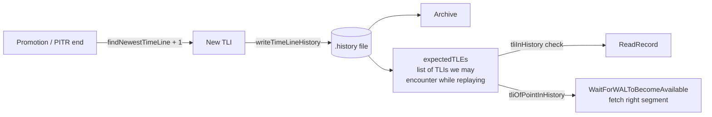

# Timelines

A **timeline** is PostgreSQL's lightweight version-control mechanism
for the WAL stream. Whenever a recovery diverges from the primary
(promotion, PITR ending in production, archive recovery target
hit), a new timeline ID is allocated, and a `<TLI>.history` file
records the switchpoint. This lets a single archive hold WAL from
multiple post-divergence histories without ambiguity.

[Top index for symbol-by-symbol pages](../../README.md)

## Architecture



## File format and naming

| File | Format | Source |
|------|--------|--------|
| `<TLI>.history` (`MAXFNAMELEN`-bounded, e.g., `00000002.history`) | Lines of `<parentTLI>\t<switchpointLSN>\t<reason>` | Built by `writeTimeLineHistoryFile` |
| WAL segment | `<TLI><logSegNo>` (e.g., `00000002000000010000003F`) | Standard WAL naming |

The TLI starts at 1 (no `00000001.history` file exists; timeline 1
is implicit). Every subsequent TLI has a history file listing all
prior switchpoints.

Example `00000003.history`:

```
1   0/3000000   no recovery target specified
2   0/4000FFE0  before 2024-01-15 12:34:56+00
```

This says: TLI 3 was branched from TLI 2 at LSN `0/4000FFE0` because
PITR was performed against TLI 2; TLI 2 was branched from TLI 1 at
`0/3000000`.

---

## `readTimeLineHistory` (`src/backend/access/transam/timeline.c`, importance 0.66)

#### Signature

```c
List *readTimeLineHistory(TimeLineID targetTLI);
```

#### Purpose

Read a timeline's history file, parse it, and return a list of
`TimeLineHistoryEntry` structs (one per ancestor TLI). For
`targetTLI=N`, returns N entries: TLIs 1..N with their switchpoint
LSNs.

If the history file is not in `pg_wal/`, tries to fetch it from the
archive (when `ArchiveRecoveryRequested`).

#### `TimeLineHistoryEntry` (`src/include/access/timeline.h`)

```c
typedef struct TimeLineHistoryEntry
{
    TimeLineID  tli;        /* the TLI this entry describes */
    XLogRecPtr  begin;      /* inclusive: where this TLI starts */
    XLogRecPtr  end;        /* exclusive: switchpoint to next TLI;
                             * InvalidXLogRecPtr for the latest */
} TimeLineHistoryEntry;
```

The list is stored in `expectedTLEs` (file-static in
`xlogrecovery.c`) and consulted by:

* `tliInHistory(targetTLI, expectedTLEs)` — true iff `targetTLI`
  appears in the list. Called by `ReadRecord` to validate that the
  page TLI is one we expect.
* `tliOfPointInHistory(lsn, expectedTLEs)` — finds the TLI that
  was active at `lsn`. Called by `WaitForWALToBecomeAvailable` to
  pick the right `<TLI><segno>` segment file.

---

## `findNewestTimeLine` (`timeline.c`, importance ~0.6)

#### Signature

```c
TimeLineID findNewestTimeLine(TimeLineID startTLI);
```

#### Purpose

Walks `pg_wal/` (or the archive, via `restore_command` for
`<TLI>.history` files) and finds the highest-numbered timeline whose
history file traces back through `startTLI`. Used by:

* `validateRecoveryParameters` when `recovery_target_timeline =
  'latest'`.
* `StartupXLOG` after a promotion to allocate the next available
  TLI.

The search probes successive numeric TLIs from `startTLI` upward;
the first non-existent file ends the search. Cost: O(latest_tli -
startTLI) restore_command invocations in the worst case.

---

## `writeTimeLineHistory` (`timeline.c`, importance 0.62)

#### Signature

```c
void writeTimeLineHistory(TimeLineID newTLI, TimeLineID parentTLI,
                          XLogRecPtr switchpoint, char *reason);
```

#### Purpose

Composes the new `<newTLI>.history` file. Reads the parent's
history (`readTimeLineHistory(parentTLI)`), appends a new line
`<parentTLI>\t<switchpoint>\t<reason>`, fsyncs the result, and
optionally archives it (via `XLogArchiveNotify`).

Called from `StartupXLOG` after `FinishWalRecovery` and before the
end-of-recovery checkpoint.

---

## `tliOfPointInHistory` and `tliSwitchPoint`

Both are inverses of each other:

* `tliOfPointInHistory(lsn, list)` — given an LSN, find which TLI
  was active at that point. Used to construct the right segment
  filename when reading WAL.
* `tliSwitchPoint(tli, list)` — given a TLI, return the LSN at
  which it switched to its successor.

---

## Post-promotion timeline bump sequence

Sequence inside `StartupXLOG` after `FinishWalRecovery`:

```mermaid
sequenceDiagram
    participant SX as StartupXLOG
    participant FN as findNewestTimeLine
    participant WTL as writeTimeLineHistory
    participant CP as CreateCheckPoint
    participant CF as pg_control

    SX->>SX: oldTLI = ThisTimeLineID<br/>switchpoint = endOfLog
    SX->>FN: search for highest TLI past oldTLI
    FN-->>SX: nextTLI = oldTLI + 1 (typically)
    SX->>WTL: writeTimeLineHistory(nextTLI, oldTLI, switchpoint, "after recovery")
    WTL-->>SX: pg_wal/<nextTLI>.history fsynced + archived
    SX->>SX: ThisTimeLineID = nextTLI
    SX->>SX: write XLOG_END_OF_RECOVERY (carries oldTLI -> nextTLI)
    SX->>SX: RemoveNonParentXlogFiles<br/>(removes future segments on oldTLI)
    SX->>CP: CreateCheckPoint(CHECKPOINT_END_OF_RECOVERY|CHECKPOINT_IMMEDIATE)
    SX->>CF: state = DB_IN_PRODUCTION;<br/>checkPoint = LSN of new checkpoint;<br/>UpdateControlFile
```

The `XLOG_END_OF_RECOVERY` record contains both the old and new TLI
so a downstream replica can detect the switch via
`ApplyWalRecord`'s TLI-switch detection.

---

## `recoveryTargetTimeLineGoal` enum

```c
typedef enum RecoveryTargetTimeLineGoal
{
    RECOVERY_TARGET_TIMELINE_CONTROLFILE,   /* recovery_target_timeline unset; use pg_control */
    RECOVERY_TARGET_TIMELINE_LATEST,        /* recovery_target_timeline = 'latest' */
    RECOVERY_TARGET_TIMELINE_NUMERIC,       /* recovery_target_timeline = '5' */
} RecoveryTargetTimeLineGoal;
```

Resolved in `validateRecoveryParameters`:

* `CONTROLFILE` ⇒ `recoveryTargetTLI` keeps the value loaded from
  pg_control (the TLI of the latest checkpoint).
* `LATEST` ⇒ `recoveryTargetTLI = findNewestTimeLine(...)` —
  follows the *latest* known TLI in the archive.
* `NUMERIC` ⇒ verify the requested TLI's history file exists; set
  `recoveryTargetTLI` to it.

`current` is parsed in `check_recovery_target_timeline` and is an
alias for CONTROLFILE.

---

## Mid-recovery TLI follow

In standby mode, the primary may itself be promoted onto a new TLI.
The standby periodically calls `rescanLatestTimeLine` to refresh
its `expectedTLEs` and follow the new TLI:

```c
if (recoveryTargetTimeLineGoal == RECOVERY_TARGET_TIMELINE_LATEST)
    rescanLatestTimeLine(replayTLI, replayLSN);
```

This is the mechanism that lets a standby track a primary across
the primary's own promotions (e.g., during failover testing).

---

## Source references

* `src/backend/access/transam/timeline.c` — entire file (~592 lines)
  * `readTimeLineHistory` — line ~75
  * `findNewestTimeLine` — line ~210
  * `writeTimeLineHistory` — line ~296
  * `writeTimeLineHistoryFile` — line ~458
  * `tliInHistory` — line ~510
  * `tliOfPointInHistory` — line ~530
  * `tliSwitchPoint` — line ~553
* `src/include/access/timeline.h` — `TimeLineHistoryEntry`
* `src/include/access/xlogrecovery.h` — `RecoveryTargetTimeLineGoal`

## Helper functions in `xlogrecovery.c`

* `checkTimeLineSwitch` — invoked from `ApplyWalRecord` whenever
  `XLOG_CHECKPOINT_SHUTDOWN` or `XLOG_END_OF_RECOVERY` indicates a
  TLI change. Verifies the new TLI is consistent with
  `expectedTLEs`.
* `RemoveNonParentXlogFiles` — removes WAL segments on the *old*
  TLI that lie *after* the switchpoint.

## See also

* `component_promotion_and_end_of_recovery.md` for the promotion
  sequence
* [recovery_target_catalog/timeline_targets.md](recovery_target_catalog/timeline_targets.md) for
  `recovery_target_timeline` GUC details
