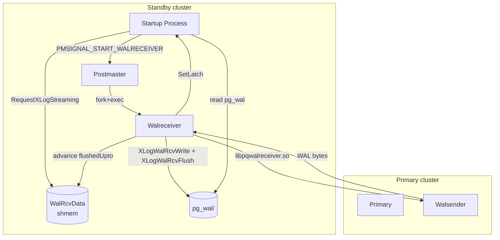

# WAL Receiver and Streaming Handshake

The walreceiver is a separate auxiliary process spawned by the
postmaster on standbys. Its job is to maintain a libpq connection
to the primary, ask for the WAL stream starting at a particular
LSN, write the received bytes into local `pg_wal/`, and
periodically send keepalive/feedback messages.

The startup process and the walreceiver communicate via a small
shared-memory struct `WalRcvData` plus a latch. The handshake is:
startup writes `WalRcv->receiveStart`, sends
`PMSIGNAL_START_WALRECEIVER` to the postmaster, then blocks on a
latch waiting for `WalRcv->flushedUpto` to advance.

[Top index for symbol-by-symbol pages](../../README.md)

## Architecture



## `WalRcvData` (`src/include/replication/walreceiver.h`)

The shared-memory struct (one per cluster):

```c
typedef struct WalRcvData
{
    /* lifecycle */
    WalRcvState         walRcvState;            /* STOPPED/STARTING/STREAMING/STOPPING/WAITING/RESTARTING */
    pg_atomic_uint64    writtenUpto;            /* highest LSN received (lock-free) */

    /* request / status (under mutex) */
    XLogRecPtr          receiveStart;           /* startup tells walreceiver: start here */
    TimeLineID          receiveStartTLI;
    XLogRecPtr          flushedUpto;            /* walreceiver tells startup: through here on disk */
    TimeLineID          receivedTLI;
    XLogRecPtr          latestChunkStart;       /* latest contiguous batch begin */

    pid_t               pid;                    /* walreceiver pid, 0 if none */
    bool                ready_to_display;
    XLogRecPtr          startptr;
    char                conninfo[MAXCONNINFO];
    char                slotname[NAMEDATALEN];
    char                sender_host[NI_MAXHOST];
    int                 sender_port;
    Latch               latch;                  /* startup -> walreceiver wakeup */
    sig_atomic_t        force_reply;            /* startup asks walreceiver: send reply now */
    pg_atomic_uint64    writtenUpto;
    slock_t             mutex;
} WalRcvData;
```

The mutex covers everything **except** `walRcvState`, `writtenUpto`,
and `latch`. Atomics and the latch use lock-free protocols.

---

## Tier 1/2 APIs

### `WalReceiverMain` (`src/backend/replication/walreceiver.c`, importance 0.86)

#### Signature

```c
NORETURN void WalReceiverMain(const void *startup_data, size_t startup_data_len);
```

#### Purpose

Walreceiver auxiliary process entry. Called once per process. The
flow:

1. **Init**: Mark `walRcvState = STREAMING` after a small dance
   through `STARTING`.
2. **Read shared state**: Snapshot `WalRcv->conninfo`,
   `WalRcv->receiveStart`, `WalRcv->slotname`. The startup process
   has already written these via `RequestXLogStreaming`.
3. **Load libpq**: `load_file("libpqwalreceiver", false)` — pulls
   in `libpqwalreceiver.so`, which registers
   `WalReceiverFunctionsType` callbacks: `walrcv_connect`,
   `walrcv_startstreaming`, `walrcv_receive`, `walrcv_send`,
   `walrcv_endstreaming`, `walrcv_identify_system`,
   `walrcv_disconnect`.
4. **Connect**: `walrcv_connect(conninfo)` opens a libpq
   connection.
5. **Identify**: `walrcv_identify_system` returns the primary's
   system_identifier and current timeline. Verify match.
6. **Start streaming**: `walrcv_startstreaming(receiveStart,
   primary_slot_name?)` issues the `START_REPLICATION` command.
7. **Inner loop**: For each received message:
   * `'w'` (WAL bytes) → `XLogWalRcvWrite` → `XLogWalRcvFlush`
     advances `flushedUpto` and sets startup's latch.
   * `'k'` (keepalive) → maybe send reply
     (`XLogWalRcvSendReply`).
   * Periodically send `XLogWalRcvSendHSFeedback` if
     `hot_standby_feedback=on`.
8. **End conditions**: Connection error, end-of-WAL on a TLI bump,
   shutdown signal — `walrcv_endstreaming`, mark
   `walRcvState=STOPPING`, exit.

#### `WalRcvWaitForStartPosition`

Internal helper: walreceiver may have to wait for the startup
process to publish a sane `receiveStart`. This is the
`STARTING → STREAMING` transition.

---

### `RequestXLogStreaming` (`src/backend/replication/walreceiverfuncs.c`, importance 0.78)

#### Signature

```c
void RequestXLogStreaming(TimeLineID tli, XLogRecPtr recptr,
                          const char *conninfo, const char *slotname,
                          bool create_temp_slot);
```

#### Purpose

Called by `WaitForWALToBecomeAvailable` when the startup process
needs streaming. Atomically:

1. Lock `WalRcv->mutex`.
2. Write `WalRcv->receiveStart = recptr`,
   `WalRcv->receiveStartTLI = tli`,
   `WalRcv->conninfo = ...`, `WalRcv->slotname = ...`.
3. Set `walRcvState = WALRCV_STARTING`.
4. Unlock.
5. `SendPostmasterSignal(PMSIGNAL_START_WALRECEIVER)`.

The postmaster catches the signal and forks the walreceiver if one
isn't already running.

---

## Sequence: startup ↔ walreceiver IPC

```mermaid
sequenceDiagram
    participant SP as Startup
    participant WRC as WalRcv (shmem)
    participant PM as Postmaster
    participant WR as Walreceiver
    participant Pri as Primary walsender

    SP->>WRC: lock; receiveStart = LSN; state = STARTING
    SP->>PM: PMSIGNAL_START_WALRECEIVER
    PM->>WR: fork+exec WalReceiverMain
    WR->>WRC: load receiveStart, conninfo
    WR->>Pri: walrcv_connect + walrcv_identify_system
    WR->>Pri: START_REPLICATION receiveStart
    Pri-->>WR: 'w' WAL bytes (continuous)
    WR->>WRC: writtenUpto = ...; XLogWalRcvFlush
    WR->>WRC: flushedUpto = fsynced LSN
    WR->>SP: SetLatch(&WalRcv->latch)
    SP->>SP: WaitLatch wakes; ReadRecord retries
    SP->>WRC: read flushedUpto >= request? yes
    SP->>SP: continue redo loop

    Note over SP,WR: At promotion / connection drop:
    SP->>WRC: ShutdownWalRcv (sets STOPPING)
    WR->>Pri: walrcv_endstreaming + walrcv_disconnect
    WR->>WR: proc_exit(0)
```

---

## `WaitForWALToBecomeAvailable` integration

When `WaitForWALToBecomeAvailable` decides to use `XLOG_FROM_STREAM`,
the inner sequence is:

1. If walreceiver is not running ⇒ `RequestXLogStreaming(...)`.
2. `WaitLatch(WalRcv->latch, WL_LATCH_SET | WL_TIMEOUT |
    WL_POSTMASTER_DEATH, wal_retrieve_retry_interval, ...)`.
3. On wakeup, check `WalRcv->flushedUpto`. If `>= RecPtr`, return
   to caller (which will read from `pg_wal/` on disk — the
   walreceiver has already written the segment).
4. Otherwise, check for promote signal; if present, fall out of
   streaming mode.

The startup process **never** reads bytes from the libpq
connection directly. The walreceiver writes WAL into `pg_wal/`,
and the startup process reads `pg_wal/` like any other source.

---

## GUCs

| GUC | Effect |
|-----|--------|
| `primary_conninfo` | libpq conninfo string (passed to `walrcv_connect`) |
| `primary_slot_name` | Replication slot name on primary |
| `wal_receiver_status_interval` | Default 10s; how often walreceiver sends reply |
| `wal_receiver_timeout` | Default 60s; idle timeout |
| `wal_receiver_create_temp_slot` | If true, create a temporary slot for this stream |
| `hot_standby_feedback` | If on, send xmin in feedback so primary can defer vacuum |

---

## Cascading replication

A standby running its own walsenders is a cascade. The mechanism:

1. `WalSndWakeup(switchedTLI, true)` is called from
   `ApplyWalRecord` after each redo step (when
   `AllowCascadeReplication()` is true).
2. The walsender notices `lastReplayedEndRecPtr` advanced and
   pushes WAL to its downstream replica.
3. The cascade is therefore **bounded by** the standby's apply
   speed — apply must complete before the bytes are visible to
   downstream standbys.

For logical decoding on a standby, replay must complete (not just
flush) before logical walsenders can emit changes — this is why
`WalSndWakeup` is invoked after `ApplyWalRecord` not after
`XLogWalRcvFlush`.

---

## Tier 3 supporting symbols

* `XLogWalRcvWrite` — writes a chunk of received WAL into
  `pg_wal/<seg>`.
* `XLogWalRcvFlush` — fsync's the just-written segment, advances
  `WalRcv->flushedUpto`, sets startup's latch.
* `XLogWalRcvSendReply` — sends `XLogRecPtr writtenUpto;
  flushedUpto; applyUpto; sendTime; replyRequested` to primary.
* `XLogWalRcvSendHSFeedback` — sends current `xmin` and
  `catalog_xmin` for hot-standby feedback.
* `WalRcvWaitForStartPosition` — walreceiver-side wait for
  `WalRcv->receiveStart` to be set.
* `ProcessWalRcvInterrupts` — SIGTERM/SIGUSR1 handler hook called
  from inside the receive loop.
* `ShutdownWalRcv` — startup-process call to cleanly stop the
  walreceiver before promotion or shutdown. Sets
  `walRcvState=STOPPING` and waits.
* `WalRcvForceReply` — startup process sets `force_reply=1` so
  walreceiver immediately sends a feedback message (used after
  `apply_delay` ends).
* `GetWalRcvFlushRecPtr` — returns `WalRcv->flushedUpto` under the
  mutex.
* `WalRcvStreaming` — true iff `walRcvState == STREAMING`.

---

## Source references

* `src/backend/replication/walreceiver.c` — `WalReceiverMain`,
  `XLogWalRcvWrite/Flush`, `WalRcvSendReply`, `SendHSFeedback`
* `src/backend/replication/walreceiverfuncs.c` —
  `RequestXLogStreaming`, `ShutdownWalRcv`, `WalRcvForceReply`,
  `GetWalRcvFlushRecPtr`, `WalRcvStreaming`
* `src/backend/replication/libpqwalreceiver/libpqwalreceiver.c` —
  the libpq protocol implementation
* `src/include/replication/walreceiver.h` — `WalRcvData`,
  `WalReceiverFunctionsType`, `WalRcvState` enum
