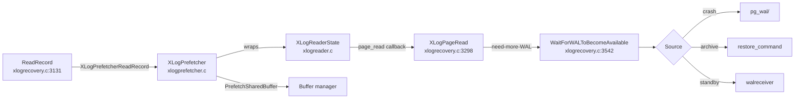

# XLog Reader and Recovery Prefetch

The WAL reader is the abstraction shared by `recovery`, `walsender`,
`pg_waldump`, and `pg_rewind` to walk the WAL stream record by
record. The reader is **stateless about source**; the caller plugs
in `XLogReaderRoutine` callbacks for `page_read`, `segment_open`,
and `segment_close`. During recovery these are filled by
`xlogrecovery.c`'s `XLogPageRead` / `wal_segment_open` /
`wal_segment_close`.

A second layer — `XLogPrefetcher` — sits between the redo loop and
the reader. When `recovery_prefetch` is `on` or `try`, it walks
upcoming records, extracts referenced blocks, and issues
`PrefetchSharedBuffer` so the redo callback sees a warm buffer when
it asks `XLogReadBufferForRedo`.

[Top index for symbol-by-symbol pages](../../README.md)

## Architecture



## Tier 1 APIs

### `XLogReadRecord` (`src/backend/access/transam/xlogreader.c:230`, importance 0.80)

#### Signature

```c
XLogRecord *XLogReadRecord(XLogReaderState *state, char **errormsg);
```

#### Purpose

Read, validate, decode the next record from the position previously
set by `XLogBeginRead`. Handles continuation records that span
pages by repeatedly invoking `state->routine.page_read` until the
header and full record body are available, then validates the
record CRC, then decodes block references via
`DecodeXLogRecord`.

#### Step-by-step

1. If the read pointer is at a page boundary, ask `page_read` for
   the page; otherwise reuse `state->readBuf`.
2. Read `XLogRecord` header (`SizeOfXLogRecord` = 24 bytes), validate
   `xl_tot_len ≥ SizeOfXLogRecord` and `xl_tot_len < MAX_RECORDLEN`.
3. Continuation: if the record overflows the page, switch pages,
   skip the page header (`SizeOfXLogShortPHD`/`SizeOfXLogLongPHD`),
   and continue reading.
4. CRC: `XLogRecordValidate` recomputes CRC32C over header+body and
   compares against `xl_crc`. Mismatch ⇒ failure.
5. Decode: `DecodeXLogRecord` walks the block-data stream and
   populates `state->record->blocks[]`.

#### Recovery invariants

* On success, `state->ReadRecPtr` = LSN where the record starts,
  `state->EndRecPtr` = LSN of the byte after the record (8-byte
  aligned).
* On failure, `*errormsg` holds a human-readable description; the
  caller logs at `emode_for_corrupt_record(emode, ...)` log level
  (DEBUG2 in standby mode, where retries are normal).

#### Performance

The reader buffers one page (`state->readBuf`, `XLOG_BLCKSZ` = 8 KB)
plus the decoded-record area (`state->main_data`, dynamically
grown). It performs **at most one** `page_read` callback per page,
not per record.

---

### `WaitForWALToBecomeAvailable` (`src/backend/access/transam/xlogrecovery.c:3542`, importance 0.92)

#### Signature

```c
static bool WaitForWALToBecomeAvailable(XLogRecPtr RecPtr, bool randAccess,
                                        bool fetching_ckpt, XLogRecPtr tliRecPtr,
                                        TimeLineID replayTLI, XLogRecPtr replayLSN,
                                        bool nonblocking);
```

#### Purpose

The source state machine. Picks the next WAL source from
`{XLOG_FROM_PG_WAL, XLOG_FROM_ARCHIVE, XLOG_FROM_STREAM}`,
opens/closes segment files, applies retry backoffs, and triggers
walreceiver startup if streaming is needed.

#### Decision tree

```
currentSource:
  XLOG_FROM_ANY:
    if standby_mode:
      try archive next, then pg_wal, then stream
    else if archive_recovery:
      try archive, then pg_wal
    else (crash):
      try pg_wal only
  XLOG_FROM_ARCHIVE:
    RestoreArchivedFile(RECOVERYXLOG, fname, ...) via restore_command
    success -> XLogFileRead -> success
    failure -> next: XLOG_FROM_PG_WAL
  XLOG_FROM_PG_WAL:
    XLogFileRead from $PGDATA/pg_wal/<seg>
    success -> success
    failure (in standby) -> next: XLOG_FROM_STREAM
    failure (else) -> EOF
  XLOG_FROM_STREAM:
    if walreceiver not running: RequestXLogStreaming(replayLSN, ...)
    block on WaitLatch until WalRcv->flushedUpto >= RecPtr OR promote
    success -> drop to XLOG_FROM_PG_WAL (read what walreceiver wrote)
    timeout/promote -> back to XLOG_FROM_ANY (full retry)
```

The retry backoff between source switches is
`wal_retrieve_retry_interval` (default 5s).

#### Recovery invariants

* When `currentSource` flips to `XLOG_FROM_STREAM`, the walreceiver
  is requested to start at `replayLSN` (its `receiveStart`).
* The function must not return until either a page is readable at
  `RecPtr` OR the loop is asked to give up (promote signal, EOF in
  crash recovery).
* In `nonblocking` mode (called from prefetcher), returns false
  rather than blocking.

#### Performance

* Each source switch costs one `restore_command` invocation
  (archive) or one walreceiver startup (stream).
* The walreceiver runs in parallel; the startup process only blocks
  on `WaitLatch` waiting for `WalRcv->flushedUpto`.

---

### `ReadRecord` (`xlogrecovery.c:3131`, importance 0.90)

#### Signature

```c
static XLogRecord *ReadRecord(XLogPrefetcher *xlogprefetcher, int emode,
                              bool fetching_ckpt, TimeLineID replayTLI);
```

#### Purpose

Recovery-side wrapper around `XLogPrefetcherReadRecord`. On
read-failure, retries by switching sources (delegating to
`WaitForWALToBecomeAvailable` via `XLogPageRead`).

#### Annotated body (`xlogrecovery.c:3131-3267`)

```c
for (;;)
{
    record = XLogPrefetcherReadRecord(xlogprefetcher, &errormsg);
    if (record == NULL) {
        /* page_read returned XLREAD_FAIL — record is missing/corrupt */
        if (errormsg)
            ereport(emode_for_corrupt_record(emode, ...), ...);
    }
    else if (!tliInHistory(xlogreader->latestPageTLI, expectedTLEs)) {
        /* page TLI not part of recovery_target_timeline's history */
        ereport(emode_for_corrupt_record(emode, ...), ...);
        record = NULL;
    }

    if (record) return record;        /* success */

    lastSourceFailed = true;
    /* (1) crash → archive transition: still bootstrap, switch on EOF */
    if (!InArchiveRecovery && ArchiveRecoveryRequested && !fetching_ckpt) {
        InArchiveRecovery = true;
        if (StandbyModeRequested) EnableStandbyMode();
        SwitchIntoArchiveRecovery(xlogreader->EndRecPtr, replayTLI);
        minRecoveryPoint = xlogreader->EndRecPtr;
        minRecoveryPointTLI = replayTLI;
        CheckRecoveryConsistency();
        lastSourceFailed = false;
        currentSource = XLOG_FROM_ANY;   /* try archive next */
        continue;
    }

    /* (2) in standby, retry forever unless promote-trigger */
    if (StandbyMode && !CheckForStandbyTrigger()) continue;
    else return NULL;
}
```

The two key state transitions are (1) the *implicit* crash → archive
flip when `pg_wal` is exhausted but recovery.signal/standby.signal
asks for more, and (2) the standby retry loop that turns EOF into a
"wait for more WAL" rather than terminating.

---

### `XLogPageRead` (`xlogrecovery.c:3298`, importance 0.78)

#### Signature

```c
static int XLogPageRead(XLogReaderState *xlogreader,
                        XLogRecPtr targetPagePtr, int reqLen,
                        XLogRecPtr targetRecPtr, char *readBuf);
```

#### Purpose

`XLogReaderRoutine.page_read` callback registered into the reader by
`InitWalRecovery`. Opens the segment file (via
`WaitForWALToBecomeAvailable`), reads `XLOG_BLCKSZ` bytes into
`readBuf`, and validates the page header.

#### Side effects

* Caches an open file descriptor in `readFile` (file-static) across
  calls within the same segment.
* Triggers a checkpoint request via `RequestCheckpoint` when
  `XLogCheckpointNeeded(readSegNo)` is true and segment boundary is
  crossed (i.e., a restartpoint is overdue).

---

### `XLogPrefetcherReadRecord` (`xlogprefetcher.c:983`, importance 0.71)

#### Signature

```c
XLogRecord *XLogPrefetcherReadRecord(XLogPrefetcher *prefetcher,
                                      char **errmsg);
```

#### Purpose

When `recovery_prefetch != off`, advances a separate "read-ahead"
position by inspecting blocks referenced by upcoming records and
queuing `PrefetchSharedBuffer` for those blocks. Then returns the
*next* record (catching up to the prefetch position via the
underlying `XLogReadRecord`).

#### LSN-window machinery

The prefetcher maintains two positions on the same WAL stream:

* `prefetcher->reader` — points at the record being returned to the
  caller (the redo position).
* `prefetcher->next_record_lsn` — points at the next record being
  scanned for prefetch decisions, ahead of the redo position.

The maximum gap is bounded by `maintenance_io_concurrency` (in-flight
prefetch I/Os) and `LRQ_DEPTH` (logical request queue).

#### Drop/truncate filter

A hash table `prefetcher->filter_table` records relations seen in
`smgr_redo XLOG_SMGR_TRUNCATE` and similar — the prefetcher must
suppress prefetches for blocks past the truncation LSN, because by
the time redo gets there the relation is gone.

---

## Tier 2/3 supporting symbols

### `XLogReaderAllocate` (`xlogreader.c:106`, importance 0.74)

```c
XLogReaderState *XLogReaderAllocate(int wal_segment_size,
                                    const char *waldir,
                                    XLogReaderRoutine *routine,
                                    void *private_data);
```

Allocates the reader. The `routine` is copied by value (struct
copy), so a stack-local `XL_ROUTINE(...)` macro is fine. Caller-side
pattern:

```c
XLogReaderRoutine xrr = XL_ROUTINE(.page_read = XLogPageRead,
                                   .segment_open = wal_segment_open,
                                   .segment_close = wal_segment_close);
xlogreader = XLogReaderAllocate(wal_segment_size, NULL, &xrr, &priv);
```

### `XLogReaderFree` (`xlogreader.c:161`, importance 0.42)

Frees the reader and decode-record buffers. Called from
`FinishWalRecovery` and `ShutdownWalRecovery`.

### `XLogFindNextRecord` (`xlogreader.c`, importance ~0.5)

Used when starting recovery from a non-record-boundary LSN (rare;
`pg_waldump` and replication slot setup use it). Skips forward until
a valid record header is found.

### `XLogReaderRoutine` (`src/include/access/xlogreader.h:72`, importance 0.66)

```c
typedef struct XLogReaderRoutine
{
    XLogPageReadCB page_read;          /* required */
    WALSegmentOpenCB segment_open;     /* may be NULL */
    WALSegmentCloseCB segment_close;   /* may be NULL */
} XLogReaderRoutine;
```

This is the abstraction that allows recovery, walsender, pg_waldump,
and pg_rewind to share the reader code.

### `XLogReaderState` (`src/include/access/xlogreader.h`)

The reader's state struct. Key fields:

| Field | Meaning |
|------|---------|
| `routine` | The callback table (page_read/segment_open/segment_close) |
| `private_data` | Caller-defined pointer, passed to callbacks |
| `ReadRecPtr` | Start LSN of the most recently returned record |
| `EndRecPtr` | End LSN of the most recently returned record |
| `readBuf` | One-page buffer (`XLOG_BLCKSZ`) |
| `readPagePtr` | LSN at start of `readBuf` |
| `seg` | Currently open segment (`ws_file`, `ws_segno`, `ws_tli`) |
| `record` | Decoded record (header + block_data) |
| `decode_queue_head/tail` | Decoded-record queue (used by prefetcher) |
| `latestPagePtr` | LSN of the last page actually read |
| `latestPageTLI` | TLI of that page |
| `nonblocking` | Set by prefetcher to fail rather than block |
| `abortedRecPtr` | Set when WAL ends mid-record |
| `missingContrecPtr` | Set when continuation record is missing |

### `XLogPrefetcherAllocate/Free/BeginRead/NextBlock`

Wrap the reader. The interesting member is `XLogPrefetcherNextBlock`
(`xlogprefetcher.c`, importance 0.62) — the per-block decision logic.

#### Buffer-prefetch decision logic in `XLogPrefetcherNextBlock`

For each block referenced by an upcoming record:

1. Skip if the relation is in the drop/truncate filter table.
2. Skip if the block is already in shared buffers
   (`PrefetchBuffer` returns "already cached" sentinel).
3. Skip if the block is past the relation's known size.
4. Else, issue `PrefetchSharedBuffer(rnode, forknum, blocknum)`
   via `smgrprefetch` → kernel `posix_fadvise(WILLNEED)` (or
   io_uring on Linux with io_method=io_uring).

#### `recovery_prefetch` GUC (off / on / try)

* `off`: prefetcher is bypassed (`XLogPrefetcherReadRecord` calls
  `XLogReadRecord` directly).
* `on`: prefetcher is mandatory; PostgreSQL refuses to start if the
  platform doesn't support prefetch.
* `try` (default): prefetcher runs if supported; silently degrades
  to `off` otherwise.

`maintenance_io_concurrency` caps the number of in-flight prefetch
I/Os. The prefetcher's LSN window is approximately
`maintenance_io_concurrency * average_record_size`.

---

## Source references

* `src/backend/access/transam/xlogreader.c:106` — `XLogReaderAllocate`
* `src/backend/access/transam/xlogreader.c:161` — `XLogReaderFree`
* `src/backend/access/transam/xlogreader.c:230` — `XLogReadRecord`
* `src/backend/access/transam/xlogreader.c` — `XLogReadRecordAlloc` (decode-buffer growth), `XLogFindNextRecord`
* `src/include/access/xlogreader.h:72` — `XLogReaderRoutine`
* `src/backend/access/transam/xlogrecovery.c:3131` — `ReadRecord`
* `src/backend/access/transam/xlogrecovery.c:3298` — `XLogPageRead`
* `src/backend/access/transam/xlogrecovery.c:3542` — `WaitForWALToBecomeAvailable`
* `src/backend/access/transam/xlogprefetcher.c:362` — `XLogPrefetcherAllocate`
* `src/backend/access/transam/xlogprefetcher.c:983` — `XLogPrefetcherReadRecord`
* `src/backend/access/transam/xlogprefetcher.c` — `XLogPrefetcherNextBlock`

## #define constants

```c
#define XLOG_FROM_ANY      0
#define XLOG_FROM_ARCHIVE  1
#define XLOG_FROM_PG_WAL   2
#define XLOG_FROM_STREAM   3

#define XLOG_BLCKSZ        8192
#define MAX_SEND_SIZE      (XLOG_BLCKSZ * 16)  /* used by walsender */
```
