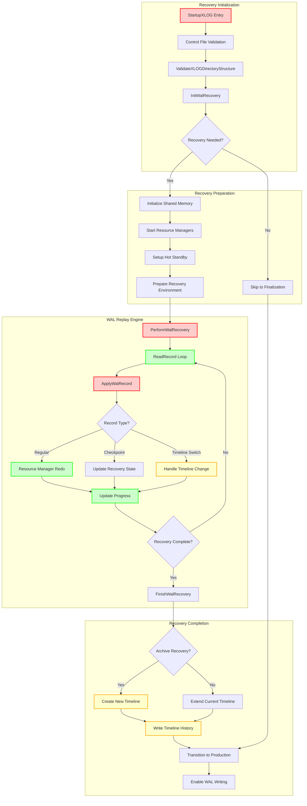

# WAL Recovery Component

## Overview

The WAL Recovery component is responsible for bringing the PostgreSQL database to a consistent state during startup by replaying WAL records. This component handles crash recovery, archive recovery (PITR), and standby initialization, ensuring data integrity and consistency across different recovery scenarios. It serves as the foundation for PostgreSQL's durability guarantees and high availability features.

## Key Concepts

- **Crash Recovery**: Replaying uncommitted WAL records after an unclean shutdown
- **Archive Recovery**: Point-in-time recovery from archived WAL and base backups
- **Timeline Management**: Handling timeline switches and history during recovery
- **Hot Standby**: Enabling read-only queries during recovery on standby servers
- **Consistency Points**: Ensuring database reaches a consistent state before accepting connections
- **Resource Manager Integration**: Coordinating with different subsystems for record replay

## Architecture



## Core APIs

### StartupXLOG

#### Purpose
StartupXLOG is the main recovery function that must be called ONCE during postmaster or standalone-backend startup to perform WAL recovery and bring the database system to a consistent state. It orchestrates the entire recovery process from initialization to production readiness.

#### Signature
```c
void StartupXLOG(void)
```

#### Detailed Description
StartupXLOG serves as the central coordinator for all database recovery activities. The function operates through multiple distinct phases, each handling specific aspects of recovery:

**Control File Analysis Phase:**
```c
switch (ControlFile->state)
{
    case DB_SHUTDOWNED:
        // Clean shutdown - minimal recovery needed
        break;
    case DB_IN_CRASH_RECOVERY:
        // Previous crash during recovery
        break;
    case DB_IN_ARCHIVE_RECOVERY:
        // Previous archive recovery interruption
        break;
    case DB_IN_PRODUCTION:
        // Unclean shutdown during normal operation
        break;
}
```

**Recovery Execution Phases:**
1. **Environment Setup**: Validates directory structure, removes temporary files
2. **State Initialization**: Sets up shared memory, resource managers, transaction systems
3. **WAL Replay**: Performs actual recovery through PerformWalRecovery if needed
4. **Timeline Management**: Handles timeline switches for archive recovery scenarios
5. **Production Transition**: Enables WAL writing and updates control file state

**Critical State Transitions:**
- `InRecovery = true` → WAL replay and recovery mode
- `InRecovery = false` → Normal production mode
- Control file state: `DB_IN_CRASH_RECOVERY` → `DB_IN_PRODUCTION`

#### Parameters
No parameters - operates on global system state and control file information.

#### Return Value
Void function that completes database startup preparation. Success indicated by transition to production state.

#### Error Handling
- **FATAL Errors**: Invalid control file, corrupted WAL, insufficient recovery data
- **Control File Validation**: Strict validation of checkpoint locations and database state
- **WAL Consistency**: Ensures sufficient WAL available for recovery to consistency point
- **Resource Cleanup**: Proper cleanup on any failure to prevent corruption

#### Integration Points
- **Called by**: StartupProcessMain (startup process), InitPostgres (single-user mode)
- **Calls**: ValidateXLOGDirectoryStructure, InitWalRecovery, PerformWalRecovery, FinishWalRecovery
- **Shared state**: Updates ControlFile, XLogCtl, TransamVariables, recovery state
- **Coordination**: Manages resource managers, Hot Standby, prepared transactions

### PerformWalRecovery

#### Purpose
PerformWalRecovery performs WAL recovery by replaying WAL records from the REDO start location to either the end of available WAL or a configured recovery target. It implements the core WAL replay loop.

#### Signature
```c
void PerformWalRecovery(void)
```

#### Detailed Description
PerformWalRecovery executes the heart of PostgreSQL's recovery mechanism. The function implements a sophisticated replay loop that handles various recovery scenarios:

**Recovery Loop Architecture:**
```c
for (;;)
{
    record = ReadRecord(xlogreader, LOG);
    if (record == NULL)
        break;  // End of WAL reached

    ApplyWalRecord(xlogreader, record, &replayTLI);

    // Check for recovery targets, pauses, delays
    if (recoveryStopsBefore(record) || recoveryStopsAfter(record))
        break;

    if (recoveryPausesHere())
        HandleRecoveryPause();
}
```

**Key Recovery Features:**
1. **Progress Tracking**: Updates XLogRecoveryCtl for monitoring and coordination
2. **Recovery Targets**: Supports time, LSN, transaction ID, and named restore points
3. **Recovery Pause**: Allows pausing recovery for inspection or coordination
4. **Consistency Checking**: Validates recovery reaches required consistency points
5. **Resource Manager Integration**: Coordinates with all PostgreSQL subsystems

**Performance Optimizations:**
- **WAL Prefetching**: Improves I/O performance during recovery
- **Batch Processing**: Efficient handling of multiple records
- **Memory Management**: Optimized memory usage for large recovery operations

#### Parameters
No parameters - operates on global recovery state and configuration.

#### Return Value
Void function that completes WAL replay. Recovery progress tracked via shared memory.

#### Error Handling
- **WAL Read Errors**: Handles corrupted or missing WAL gracefully
- **Replay Errors**: Resource manager specific error handling
- **Recovery Targets**: Validation of recovery target parameters
- **Consistency Validation**: Ensures recovery reaches safe consistency points

#### Integration Points
- **Called by**: StartupXLOG during recovery phase
- **Calls**: ReadRecord, ApplyWalRecord, CheckRecoveryConsistency, recovery control functions
- **Shared state**: Updates recovery progress, coordinates with Hot Standby
- **Signals**: Responds to recovery pause/resume requests

### ApplyWalRecord

#### Purpose
ApplyWalRecord is a subroutine of PerformWalRecovery that applies a single WAL record during recovery, handling timeline switches, transaction ID advancement, and various recovery-specific operations.

#### Signature
```c
static void ApplyWalRecord(XLogReaderState *xlogreader, XLogRecord *record, TimeLineID *replayTLI)
```

#### Detailed Description
ApplyWalRecord processes individual WAL records during recovery, implementing the detailed logic needed for each record type:

**Record Processing Pipeline:**
1. **Error Context Setup**: Establishes detailed error reporting for replay failures
2. **Transaction ID Management**: Advances transaction ID counters past record's XID
3. **Resource Manager Dispatch**: Routes record to appropriate RM for actual replay
4. **Timeline Switch Detection**: Identifies and processes timeline changes
5. **Progress Updates**: Maintains recovery progress tracking
6. **Consistency Checks**: Validates backup page consistency when enabled

**Special Record Handling:**
```c
// Timeline switch detection
if (record->xl_rmid == RM_XLOG_ID)
{
    uint8 info = record->xl_info & ~XLR_INFO_MASK;
    if (info == XLOG_CHECKPOINT_SHUTDOWN ||
        info == XLOG_END_OF_RECOVERY)
    {
        checkTimeLineSwitch(record, replayTLI);
    }
}
```

**Hot Standby Integration:**
- Records known assigned transaction IDs for query consistency
- Coordinates with Hot Standby query processing
- Manages transaction visibility during recovery

**Replication Coordination:**
- Wakes up physical replication senders when WAL flushed
- Wakes up logical replication senders when WAL applied
- Coordinates cascading replication scenarios

#### Parameters
| Parameter | Type | Description | Constraints |
|-----------|------|-------------|-------------|
| xlogreader | XLogReaderState* | WAL reader containing current record | Must be positioned at valid record |
| record | XLogRecord* | Current WAL record to apply | Must be valid WAL record |
| replayTLI | TimeLineID* | Current replay timeline (may be updated) | Valid timeline ID |

#### Return Value
Void function that applies record and updates replay state. Timeline changes reflected in replayTLI parameter.

#### Error Handling
- **Replay Errors**: Detailed error context for debugging
- **Timeline Validation**: Ensures timeline switches are valid
- **Consistency Failures**: Handles backup page consistency check failures
- **Resource Manager Errors**: Delegates error handling to appropriate RM

#### Integration Points
- **Called by**: PerformWalRecovery for each WAL record
- **Calls**: Resource manager redo functions, timeline management, replication coordination
- **Shared state**: Updates recovery progress, known assigned XIDs, timeline state
- **Coordination**: Walsender wakeup, Hot Standby integration, consistency tracking

## Data Structures

### EndOfWalRecoveryInfo
Information about recovery completion:

```c
typedef struct EndOfWalRecoveryInfo
{
    XLogRecPtr  endOfLog;                /* End of WAL position */
    TimeLineID  endOfLogTLI;             /* Timeline of end position */
    XLogRecPtr  lastRec;                 /* Last record LSN */
    TimeLineID  lastRecTLI;              /* Last record timeline */
    XLogRecPtr  abortedRecPtr;           /* Incomplete record start */
    XLogRecPtr  missingContrecPtr;       /* Missing continuation */
    bool        standby_signal_file_found;
    bool        recovery_signal_file_found;
    char       *recoveryStopReason;      /* Reason for stopping */
    /* ... additional completion info ... */
} EndOfWalRecoveryInfo;
```

### XLogRecoveryCtl
Shared memory structure for recovery coordination:

```c
typedef struct XLogRecoveryCtl
{
    XLogRecPtr  lastReplayedReadRecPtr;  /* Last record read */
    XLogRecPtr  lastReplayedEndRecPtr;   /* Last record end */
    TimeLineID  lastReplayedTLI;         /* Last timeline */
    TimestampTz recoveryLastXTime;       /* Recovery progress time */
    bool        recoveryPaused;          /* Pause state */
    /* ... additional coordination fields ... */
} XLogRecoveryCtl;
```

## Processing Flow

```mermaid
sequenceDiagram
    participant Startup as Startup Process
    participant StartupXLOG
    participant PerformWalRecovery
    participant ApplyWalRecord
    participant ResourceMgr as Resource Managers

    Startup->>StartupXLOG: Begin recovery
    StartupXLOG->>StartupXLOG: Analyze control file state

    alt Clean shutdown
        StartupXLOG->>StartupXLOG: Skip WAL recovery
    else Unclean shutdown or archive recovery
        StartupXLOG->>StartupXLOG: Initialize recovery environment
        StartupXLOG->>PerformWalRecovery: Begin WAL replay

        loop For each WAL record
            PerformWalRecovery->>PerformWalRecovery: ReadRecord()
            PerformWalRecovery->>ApplyWalRecord: Process record

            ApplyWalRecord->>ApplyWalRecord: Setup error context
            ApplyWalRecord->>ApplyWalRecord: Advance transaction IDs
            ApplyWalRecord->>ResourceMgr: Delegate to appropriate RM
            ResourceMgr-->>ApplyWalRecord: Record applied

            alt Timeline switch record
                ApplyWalRecord->>ApplyWalRecord: Handle timeline change
                ApplyWalRecord->>ApplyWalRecord: Update replayTLI
            end

            ApplyWalRecord->>ApplyWalRecord: Update recovery progress
            ApplyWalRecord-->>PerformWalRecovery: Record processed

            alt Recovery target reached
                PerformWalRecovery->>PerformWalRecovery: Stop recovery
                break Exit replay loop
            end
        end

        PerformWalRecovery-->>StartupXLOG: Recovery complete
    end

    StartupXLOG->>StartupXLOG: FinishWalRecovery()

    alt Archive recovery
        StartupXLOG->>StartupXLOG: Create new timeline
        StartupXLOG->>StartupXLOG: Write timeline history
    else Crash recovery
        StartupXLOG->>StartupXLOG: Extend current timeline
    end

    StartupXLOG->>StartupXLOG: Transition to production mode
    StartupXLOG-->>Startup: Database ready
```

## Implementation Notes

### Control File State Management
StartupXLOG handles multiple database states:

```c
// State transition examples
switch (ControlFile->state)
{
    case DB_SHUTDOWNED:
        // Normal startup, no recovery needed
        performedWalRecovery = false;
        break;

    case DB_IN_PRODUCTION:
        // Crash recovery needed
        InRecovery = true;
        performedWalRecovery = true;
        break;

    case DB_IN_ARCHIVE_RECOVERY:
        // Continue archive recovery
        ArchiveRecoveryRequested = true;
        InRecovery = true;
        break;
}
```

**State Validation:**
- Validates checkpoint locations in control file
- Ensures database state consistency
- Handles corrupted control file scenarios
- Manages backup label and tablespace map files

### Timeline Management and History
Complex timeline handling for PITR scenarios:

```c
// Timeline decision logic
if (ArchiveRecoveryRequested)
{
    newTLI = findNewestTimeLine(recoveryTargetTLI) + 1;
    ereport(LOG, (errmsg("selected new timeline ID: %u", newTLI)));

    // Create writable copy of last WAL segment
    XLogInitNewTimeline(EndOfLogTLI, EndOfLog, newTLI);

    // Write timeline history file
    writeTimeLineHistory(newTLI, recoveryTargetTLI, EndOfLog, reason);
}
```

**Timeline Features:**
- Automatic timeline history file creation
- Handling of timeline switches during recovery
- Prevention of timeline conflicts
- Cascading standby timeline coordination

### Resource Manager Integration
Coordination with all PostgreSQL subsystems:

```c
// Resource manager startup sequence
StartupCLOG();              // Transaction status
StartupMultiXact();         // Multi-transaction IDs
StartupCommitTs();          // Commit timestamps
StartupReplicationSlots();  // Replication slots
StartupReorderBuffer();     // Logical replication
StartupReplicationOrigin(); // Replication origins
```

**Integration Benefits:**
- Ensures all subsystems ready for recovery
- Proper ordering of subsystem initialization
- Cleanup coordination during recovery completion
- Error handling across all subsystems

### Hot Standby Coordination
Special handling for standby servers:

```c
if (ArchiveRecoveryRequested && EnableHotStandby)
{
    ereport(DEBUG1, (errmsg_internal("initializing for hot standby")));

    InitRecoveryTransactionEnvironment();
    ProcArrayInitRecovery(XidFromFullTransactionId(TransamVariables->nextXid));
    StartupSUBTRANS(oldestActiveXID);

    // Handle prepared transactions for standby
    if (wasShutdown)
        StandbyRecoverPreparedTransactions();
}
```

### Performance Characteristics

#### Recovery Speed Optimization
- **WAL Prefetching**: Reduces I/O wait times during sequential replay
- **Resource Manager Efficiency**: Optimized redo functions for each subsystem
- **Memory Management**: Efficient buffer management during replay
- **Parallel Processing**: Some resource managers support parallel replay

#### Consistency Guarantees
- **ACID Compliance**: Ensures all committed transactions are replayed
- **Isolation**: Proper transaction visibility during Hot Standby
- **Durability**: Validates recovery reaches required consistency points
- **Atomicity**: Proper handling of incomplete transactions

#### Scalability Factors
- **Large WAL Volumes**: Efficient processing of high-volume WAL streams
- **Long Recovery Times**: Progress tracking and pause/resume capabilities
- **Complex Topologies**: Support for cascading replication scenarios
- **Resource Usage**: Bounded memory usage regardless of recovery duration

### Error Recovery and Robustness
Comprehensive error handling throughout recovery:

- **Corrupted WAL**: Graceful handling of partial or corrupted records
- **Missing Files**: Proper error messages for incomplete backups
- **Timeline Conflicts**: Prevention of invalid timeline progressions
- **Resource Failures**: Cleanup and retry mechanisms for subsystem failures