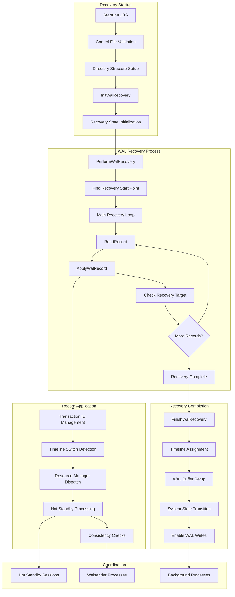
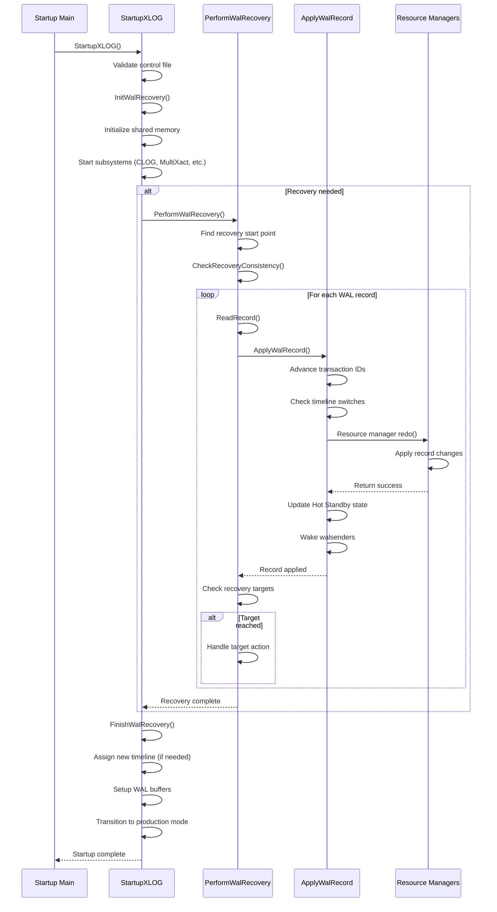

# Recovery Component

## Overview
The Recovery component orchestrates PostgreSQL's database recovery process, responsible for bringing a database system from an inconsistent state (after crash or shutdown) to a consistent, operational state. This component handles crash recovery, point-in-time recovery (PITR), and Hot Standby initialization through sophisticated WAL replay mechanisms that ensure ACID compliance and data consistency.

The component consists of three primary functions working in sequence: `StartupXLOG` (overall recovery coordination), `PerformWalRecovery` (WAL replay execution), and `ApplyWalRecord` (individual record processing). Together, they implement PostgreSQL's comprehensive recovery strategy that handles various failure scenarios while maintaining transactional consistency.

## Key Concepts
- **Recovery Types**: Crash recovery, archive recovery, and Hot Standby initialization
- **WAL Replay**: Sequential application of Write-Ahead Log records to restore consistency
- **Timeline Management**: Handling database timeline switches during recovery
- **Consistency Points**: Ensuring database reaches a consistent state before accepting connections
- **Resource Manager Integration**: Coordinating with various PostgreSQL subsystems during recovery

## Architecture



## Core APIs

### StartupXLOG

#### Purpose
StartupXLOG serves as the main recovery coordinator that must be called exactly once during database startup to perform WAL recovery and bring the database system to a consistent, operational state. This function orchestrates the entire recovery process across all recovery types.

#### Signature
```c
void StartupXLOG(void)
```

#### Detailed Description
StartupXLOG implements comprehensive recovery coordination through several distinct phases:

1. **Control File Analysis**: Examines the control file to determine the previous shutdown state and validates checkpoint locations
2. **Environment Setup**: Ensures WAL directory structure exists and removes temporary files from previous crashes
3. **Recovery Initialization**: Calls `InitWalRecovery` to analyze backup labels and set recovery parameters
4. **Shared Memory Setup**: Initializes transaction state, multixact state, and other shared memory structures from checkpoint data
5. **Subsystem Startup**: Starts CLOG, MultiXact, replication slots, and other required subsystems
6. **WAL Recovery Execution**: Calls `PerformWalRecovery` if recovery is needed
7. **Timeline Management**: Handles timeline switches for archive recovery scenarios
8. **System Transition**: Transitions from recovery mode to production mode
9. **Final Cleanup**: Enables WAL writes and performs post-recovery housekeeping

The function handles various database states (DB_SHUTDOWNED, DB_IN_CRASH_RECOVERY, DB_IN_ARCHIVE_RECOVERY) with appropriate recovery strategies for each scenario.

#### Parameters
This function takes no parameters as it operates on global system state and control file information.

#### Return Value
Returns void. Success is indicated by successful completion without fatal errors.

#### Error Handling
- **Control File Corruption**: Reports FATAL error for invalid checkpoint locations
- **Inconsistent State**: Handles various database states with appropriate error reporting
- **Recovery Failures**: Coordinates error handling across all recovery phases
- **Resource Allocation**: Manages resource owner context for auxiliary processes

#### Integration Points
- **Called by**: `StartupProcessMain` (startup process), `InitPostgres` (single-user mode)
- **Calls**: `InitWalRecovery`, `PerformWalRecovery`, `FinishWalRecovery`, various subsystem startup functions
- **Shared state**: Updates control file, shared memory structures, and global recovery state

### PerformWalRecovery

#### Purpose
PerformWalRecovery executes the main WAL replay loop, reading and applying WAL records from the recovery start point to either the end of available WAL or a configured recovery target. This function implements the core logic of database consistency restoration.

#### Signature
```c
void PerformWalRecovery(void)
```

#### Detailed Description
PerformWalRecovery implements the central WAL replay mechanism:

1. **Recovery Initialization**: Sets up shared memory tracking for WAL replay progress and signals postmaster that recovery has started
2. **Consistency Checking**: Calls `CheckRecoveryConsistency` to determine if the database has reached a consistent state
3. **Start Point Location**: Finds the first WAL record to replay, either at the REDO start LSN or after the checkpoint location
4. **Main Recovery Loop**: Iterates through WAL records using `ReadRecord` and applies each one via `ApplyWalRecord`
5. **Target Evaluation**: Checks recovery targets (time, LSN, transaction ID, named restore points) after each record
6. **Progress Reporting**: Provides progress updates for monitoring and debugging purposes
7. **Recovery Completion**: Handles different recovery target actions (shutdown, pause, promote) based on configuration

The function supports various recovery scenarios including immediate consistency checking, recovery delays for lagging behind primary, and pause/resume functionality for Hot Standby sessions.

#### Parameters
This function takes no parameters and operates on global recovery state maintained in shared memory.

#### Return Value
Returns void. Effects are visible through applied WAL records and updated recovery state.

#### Error Handling
- **WAL Reading Errors**: Handles EOF and corrupted record scenarios gracefully
- **Recovery Target Validation**: Ensures recovery targets are achievable
- **Resource Manager Errors**: Coordinates error handling during record application
- **Interrupt Handling**: Processes startup process interrupts and pause requests

#### Integration Points
- **Called by**: `StartupXLOG` when recovery is required
- **Calls**: `ReadRecord`, `ApplyWalRecord`, `CheckRecoveryConsistency`, recovery target functions
- **Shared state**: Updates `XLogRecoveryCtl` progress tracking, coordinates with Hot Standby

### ApplyWalRecord

#### Purpose
ApplyWalRecord processes and applies a single WAL record during recovery, handling transaction ID advancement, timeline switches, resource manager dispatch, and various recovery-specific operations. This function ensures each WAL record is properly integrated into the recovering system.

#### Signature
```c
static void ApplyWalRecord(XLogReaderState *xlogreader, XLogRecord *record, TimeLineID *replayTLI)
```

#### Detailed Description
ApplyWalRecord implements comprehensive single-record processing:

1. **Error Context Setup**: Establishes error callbacks for detailed error reporting during record application
2. **Transaction ID Management**: Advances the global transaction ID counter beyond the record's XID to maintain consistency
3. **Timeline Switch Detection**: Examines checkpoint and end-of-recovery records for timeline changes
4. **Resource Manager Dispatch**: Delegates record processing to appropriate resource managers based on record type
5. **Hot Standby Processing**: Records known assigned transaction IDs when Hot Standby is enabled
6. **Consistency Verification**: Performs backup page consistency checks when enabled
7. **Coordination Signaling**: Wakes up walsender processes and coordinates with cascading replication
8. **Timeline Cleanup**: Removes obsolete WAL files when switching timelines
9. **Progress Updates**: Updates shared memory structures to reflect replay progress

The function handles special XLOG records (checkpoints, end-of-recovery) with specific processing logic and coordinates with various PostgreSQL subsystems.

#### Parameters
| Parameter | Type | Description | Constraints |
|-----------|------|-------------|-------------|
| xlogreader | XLogReaderState* | WAL reader state containing current record | Valid reader with loaded record |
| record | XLogRecord* | Pointer to the WAL record being applied | Valid record structure |
| replayTLI | TimeLineID* | Current replay timeline (may be updated) | Pointer to valid timeline ID |

#### Return Value
Returns void. Effects are visible through applied changes and updated timeline information.

#### Error Handling
- **Resource Manager Errors**: Provides detailed error context for debugging
- **Timeline Validation**: Ensures timeline switches are valid and consistent
- **Consistency Check Failures**: Reports backup page inconsistencies when detected
- **Transaction State Errors**: Handles transaction ID advancement failures

#### Integration Points
- **Called by**: `PerformWalRecovery` main recovery loop
- **Calls**: Resource manager redo functions, `checkTimeLineSwitch`, `WalSndWakeup`
- **Shared state**: Updates transaction state, timeline information, and recovery progress

## Data Structures

### XLogRecoveryCtl
The main shared memory structure for recovery coordination:

```c
typedef struct XLogRecoveryCtl
{
    XLogRecPtr      lastReplayedReadRecPtr;  /* Last record read */
    XLogRecPtr      lastReplayedEndRecPtr;   /* Last record applied */
    TimeLineID      lastReplayedTLI;         /* Timeline of last record */
    XLogRecPtr      replayEndRecPtr;         /* End of last record replayed */
    TimeLineID      replayEndTLI;            /* Timeline of replay end */
    XLogRecPtr      recoveryTargetLSN;       /* Target LSN for recovery */
    bool            recoveryTargetInclusive; /* Include target record? */
    int             recoveryTargetAction;    /* Action at target */
} XLogRecoveryCtl;
```

**Key Fields**:
- `lastReplayedEndRecPtr`: Tracks progress of WAL replay
- `replayEndTLI`: Current timeline being replayed
- `recoveryTargetLSN`: Configured recovery target position

### EndOfWalRecoveryInfo
Structure containing information about recovery completion:

```c
typedef struct EndOfWalRecoveryInfo
{
    XLogRecPtr      endOfLog;               /* End position of WAL */
    TimeLineID      endOfLogTLI;            /* Timeline at end of WAL */
    XLogRecPtr      lastRec;                /* Last complete record */
    TimeLineID      lastRecTLI;             /* Timeline of last record */
    XLogRecPtr      abortedRecPtr;          /* Aborted record position */
    bool            standby_signal_file_found; /* Standby signal present */
    bool            recovery_signal_file_found; /* Recovery signal present */
    char           *recoveryStopReason;     /* Reason for recovery stop */
} EndOfWalRecoveryInfo;
```

## Processing Flow



## Implementation Notes

### Recovery Types
The component handles multiple recovery scenarios:

1. **Crash Recovery**: Replays WAL from last checkpoint after unclean shutdown
2. **Archive Recovery**: Point-in-time recovery from backup with archived WAL
3. **Hot Standby Recovery**: Continuous recovery with read-only query support
4. **Streaming Recovery**: Real-time recovery from streaming replication

### Timeline Management
Sophisticated timeline handling ensures consistency:

1. **Timeline Detection**: Automatic detection of timeline switches from checkpoint records
2. **History Files**: Management of timeline history for cascading scenarios
3. **Timeline Assignment**: New timeline creation for archive recovery
4. **WAL Cleanup**: Removal of obsolete future WAL segments

### Hot Standby Integration
Close coordination with Hot Standby functionality:

1. **Transaction Tracking**: Maintenance of known assigned transaction IDs
2. **Consistency Points**: Determination of when queries can start
3. **Conflict Resolution**: Handling conflicts between recovery and queries
4. **State Communication**: Coordination with Hot Standby sessions

### Performance Optimizations
Several optimizations improve recovery performance:

1. **WAL Prefetching**: Prefetching WAL records to improve I/O performance
2. **Batch Processing**: Grouping related operations for efficiency
3. **Progress Tracking**: Detailed progress monitoring for large recoveries
4. **Resource Management**: Efficient resource allocation during recovery

### Error Handling and Robustness
Comprehensive error handling ensures system reliability:

1. **Corruption Detection**: Detection and handling of WAL corruption
2. **Incomplete Records**: Graceful handling of incomplete WAL records
3. **Resource Cleanup**: Proper cleanup on recovery failures
4. **State Consistency**: Maintenance of consistent state during errors

### Monitoring and Observability
Built-in instrumentation supports operational monitoring:

1. **Progress Reporting**: Detailed tracking of recovery progress
2. **State Visibility**: Clear indication of current recovery state
3. **Performance Metrics**: Timing and throughput measurements
4. **Error Reporting**: Comprehensive error context and debugging information