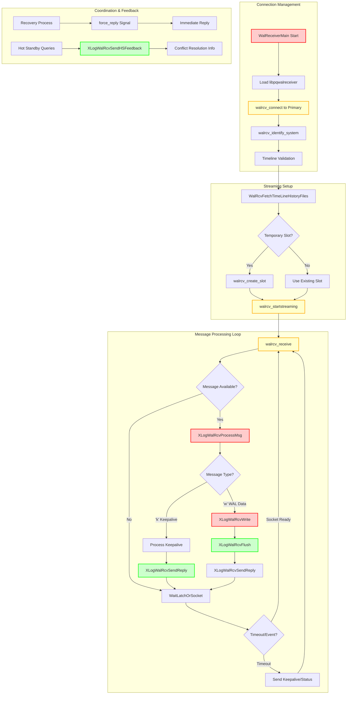
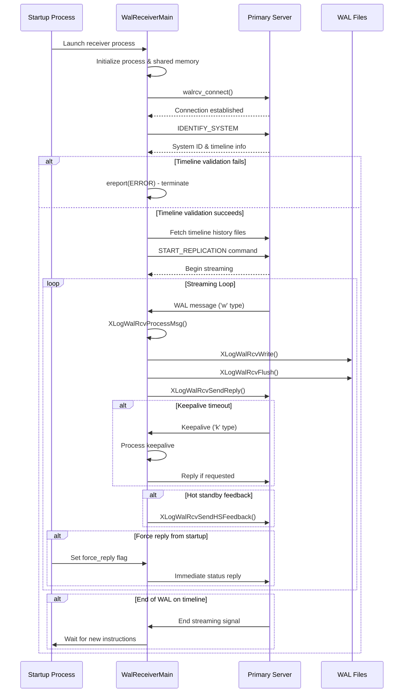

# WAL Replication Receiver Component

## Overview

The WAL Replication Receiver component implements the standby side of PostgreSQL's streaming replication system. It establishes connections to primary servers, receives WAL data over the network, and writes it to local storage for subsequent processing by the recovery system. This component is essential for creating and maintaining standby databases in PostgreSQL's high availability infrastructure.

## Key Concepts

- **Streaming Protocol**: Network-based WAL transmission using PostgreSQL's replication protocol
- **Timeline Management**: Handles timeline transitions and history file synchronization
- **Connection Management**: Manages persistent connections with reconnection and error handling
- **Replication Slots**: Optional mechanism for preventing WAL removal on primary
- **Hot Standby Feedback**: Communication channel for standby query conflicts back to primary
- **Message Processing**: Handles different message types (WAL data, keepalives, timeline switches)

## Architecture



## Core APIs

### WalReceiverMain

#### Purpose
WalReceiverMain is the main entry point for the WAL receiver process that handles streaming replication from a primary PostgreSQL server to a standby server. It manages the complete lifecycle of WAL reception including connection establishment, streaming, and error recovery.

#### Signature
```c
void WalReceiverMain(char *startup_data, size_t startup_data_len)
```

#### Detailed Description
WalReceiverMain orchestrates all aspects of WAL reception on standby servers. The function operates through several distinct phases:

**Initialization Phase:**
1. **Process Setup**: Configures process type, signal handlers, and shared memory access
2. **State Management**: Updates shared memory to indicate receiver is active
3. **Library Loading**: Dynamically loads libpqwalreceiver for network communication
4. **Connection Establishment**: Connects to primary using provided connection string

**Validation Phase:**
1. **System Identification**: Verifies database system identifiers match between primary and standby
2. **Timeline Validation**: Ensures timeline consistency and fetches missing history files
3. **Slot Management**: Creates temporary replication slots when requested

**Streaming Phase:**
1. **Protocol Initialization**: Starts streaming from specified LSN and timeline
2. **Message Processing**: Continuously receives and processes WAL data and control messages
3. **Progress Reporting**: Sends periodic status updates to primary
4. **Timeout Handling**: Manages connection timeouts and keepalive mechanisms

**Recovery and Restart:**
The function includes sophisticated restart logic that allows it to resume streaming after timeline switches, configuration changes, or temporary connection failures.

#### Parameters
| Parameter | Type | Description | Constraints |
|-----------|------|-------------|-------------|
| startup_data | char* | Reserved for future use | Currently expected to be NULL |
| startup_data_len | size_t | Length of startup data | Currently expected to be 0 |

#### Return Value
Void function that runs until process termination. Does not return under normal operation, exits via proc_exit() or ereport(FATAL).

#### Error Handling
- **Connection Failures**: Reports ERROR and terminates, allowing restart by startup process
- **Protocol Violations**: FATAL errors for system identifier mismatches or timeline inconsistencies
- **Timeout Handling**: Graceful termination on wal_receiver_timeout expiration
- **Configuration Errors**: Dynamic config reload with validation

#### Integration Points
- **Called by**: Postmaster via auxiliary process launcher
- **Calls**: walrcv_* functions (libpqwalreceiver), XLogWalRcvProcessMsg, XLogWalRcvFlush
- **Shared state**: WalRcv shared memory structure, coordinates with startup process
- **Signals**: Handles SIGHUP (config reload), SIGTERM (shutdown), SIGUSR1 (latch wakeup)

### XLogWalRcvProcessMsg

#### Purpose
XLogWalRcvProcessMsg processes incoming replication messages from the XLOG stream, handling WAL records and keepalive messages from the primary server during streaming replication.

#### Signature
```c
static void XLogWalRcvProcessMsg(unsigned char type, char *buf, Size len, TimeLineID tli)
```

#### Detailed Description
This function serves as the message dispatcher for the replication protocol. It implements the core message processing logic that distinguishes between different message types and routes them to appropriate handlers:

**WAL Record Messages ('w' type):**
- Extracts LSN information (dataStart, walEnd, sendTime)
- Validates message format and content
- Delegates to XLogWalRcvWrite for actual data writing
- Updates progress tracking and statistics

**Keepalive Messages ('k' type):**
- Processes connection health information
- Handles immediate reply requests from primary
- Updates timeout calculations
- Manages flow control between primary and standby

**Protocol Validation:**
The function performs strict protocol validation to ensure data integrity:
- Message type validation
- Buffer length verification
- LSN consistency checking
- Timeline validation

#### Parameters
| Parameter | Type | Description | Constraints |
|-----------|------|-------------|-------------|
| type | unsigned char | Message type identifier | 'w' for WAL data, 'k' for keepalive |
| buf | char* | Message payload buffer | Must contain valid protocol data |
| len | Size | Buffer length in bytes | Must match actual message size |
| tli | TimeLineID | Timeline ID for WAL data | Must match expected timeline |

#### Return Value
Void function that processes message and updates receiver state. Errors reported via ereport() for invalid messages.

#### Error Handling
- **Invalid Message Types**: ereport(ERROR) for unknown message types
- **Malformed Messages**: Buffer validation prevents crashes from corrupt data
- **Protocol Violations**: Strict validation ensures replication integrity
- **Timeline Mismatches**: Validates timeline consistency

#### Integration Points
- **Called by**: WalReceiverMain in main streaming loop
- **Calls**: XLogWalRcvWrite, XLogWalRcvSendReply, ProcessWalSndrMessage
- **Shared state**: Updates LogstreamResult, manages message buffers
- **Protocol**: Implements PostgreSQL replication protocol specification

## Data Structures

### WalRcvData
Shared memory structure for receiver coordination:

```c
typedef struct WalRcvData
{
    pid_t       pid;                    /* PID of walreceiver process */
    WalRcvState walRcvState;            /* Current receiver state */
    XLogRecPtr  receiveStart;           /* Start LSN for streaming */
    TimeLineID  receiveStartTLI;        /* Timeline for start position */

    char        conninfo[MAXCONNINFO];  /* Connection string */
    char        slotname[NAMEDATALEN];  /* Replication slot name */
    bool        is_temp_slot;           /* Whether slot is temporary */

    TimestampTz lastMsgSendTime;        /* Last message send time */
    TimestampTz lastMsgReceiptTime;     /* Last message receipt time */
    XLogRecPtr  latestChunkStart;       /* Start of latest chunk */

    bool        force_reply;            /* Force immediate reply */
    slock_t     mutex;                  /* Protects shared fields */
    pg_atomic_uint64 writtenUpto;       /* Last LSN written to disk */
    /* ... additional coordination fields ... */
} WalRcvData;
```

### WalRcvStreamOptions
Configuration for streaming initiation:

```c
typedef struct WalRcvStreamOptions
{
    bool        logical;                /* Logical vs physical replication */
    XLogRecPtr  startpoint;             /* Starting LSN */
    char       *slotname;               /* Replication slot name */
    union
    {
        struct { TimeLineID startpointTLI; } physical;
        struct { uint32 proto_version; char *publication_names; } logical;
    } proto;
} WalRcvStreamOptions;
```

## Processing Flow



## Implementation Notes

### Connection and Reconnection Logic
WalReceiverMain implements robust connection management:

```c
// Connection establishment with error handling
wrconn = walrcv_connect(conninfo, true, false, false,
                       cluster_name[0] ? cluster_name : "walreceiver",
                       &err);
if (!wrconn)
    ereport(ERROR,
           (errcode(ERRCODE_CONNECTION_FAILURE),
            errmsg("could not connect to the primary server: %s", err)));
```

**Key Features:**
- Automatic retry logic for temporary connection failures
- Dynamic connection string updates via shared memory
- Support for multiple connection libraries through function pointers
- Graceful handling of network interruptions

### Timeline Management and Validation
Critical timeline consistency checks:

```c
// System identifier validation
if (strcmp(primary_sysid, standby_sysid) != 0)
{
    ereport(ERROR,
           (errcode(ERRCODE_OBJECT_NOT_IN_PREREQUISITE_STATE),
            errmsg("database system identifier differs between primary and standby")));
}

// Timeline consistency validation
if (primaryTLI < startpointTLI)
    ereport(ERROR,
           (errcode(ERRCODE_OBJECT_NOT_IN_PREREQUISITE_STATE),
            errmsg("highest timeline %u of the primary is behind recovery timeline %u",
                   primaryTLI, startpointTLI)));
```

**Timeline Features:**
- Automatic fetching of missing timeline history files
- Support for timeline switches during streaming
- Prevention of timeline conflicts in failover scenarios
- Validation of timeline progression consistency

### Message Processing and Protocol Handling
Efficient message processing pipeline:

```c
// Main message processing dispatch
switch (type)
{
    case 'w':  // WAL data
        // Extract header information
        dataStart = pq_getmsgint64(&incoming_message);
        walEnd = pq_getmsgint64(&incoming_message);
        sendTime = pq_getmsgint64(&incoming_message);

        // Process WAL data
        XLogWalRcvWrite(buf, len, dataStart, walEnd, tli);
        break;

    case 'k':  // Keepalive
        // Process keepalive and send reply if requested
        ProcessWalSndrMessage(walEnd, sendTime, replyRequested);
        if (replyRequested)
            XLogWalRcvSendReply(false, false);
        break;

    default:
        ereport(ERROR,
               (errcode(ERRCODE_PROTOCOL_VIOLATION),
                errmsg("invalid replication message type %d", type)));
}
```

### Timeout and Keepalive Management
Sophisticated timeout handling prevents connection loss:

```c
// Timeout calculation and management
for (int i = 0; i < NUM_WALRCV_WAKEUPS; ++i)
    nextWakeup = Min(wakeup[i], nextWakeup);

nap = TimestampDifferenceMilliseconds(now, nextWakeup);

// Different timeout types:
// WALRCV_WAKEUP_TERMINATE: wal_receiver_timeout
// WALRCV_WAKEUP_PING: wal_receiver_timeout / 2
// WALRCV_WAKEUP_HSFEEDBACK: hot_standby_feedback interval
```

**Timeout Benefits:**
- Prevents silent connection failures
- Enables proactive keepalive transmission
- Supports hot standby feedback scheduling
- Provides configurable timeout behavior

### Performance Characteristics

#### Network Efficiency
- **Batch Processing**: Multiple messages processed per receive call
- **Non-blocking I/O**: WaitLatchOrSocket prevents blocking on network
- **Buffer Management**: Efficient memory usage for message processing
- **Protocol Optimization**: Minimal overhead binary protocol

#### Write Performance
- **Sequential Writes**: WAL data written sequentially to minimize disk seeks
- **Batch Flushing**: Multiple WAL records flushed together when possible
- **File Management**: Efficient segment file creation and management
- **Sync Coordination**: Optimal fsync scheduling with recovery process

#### Memory Usage
- **Shared Memory Integration**: Minimal memory footprint through shared structures
- **Message Buffering**: Efficient buffer reuse for protocol messages
- **State Tracking**: Compact state representation for multiple timelines
- **Resource Cleanup**: Proper cleanup on connection termination

### Hot Standby Integration
WalReceiver coordinates with Hot Standby queries:

- **Feedback Mechanism**: Reports query conflicts back to primary
- **Progress Tracking**: Coordinates apply progress with query processing
- **Conflict Resolution**: Supports query cancellation coordination
- **Status Reporting**: Provides detailed lag and progress information