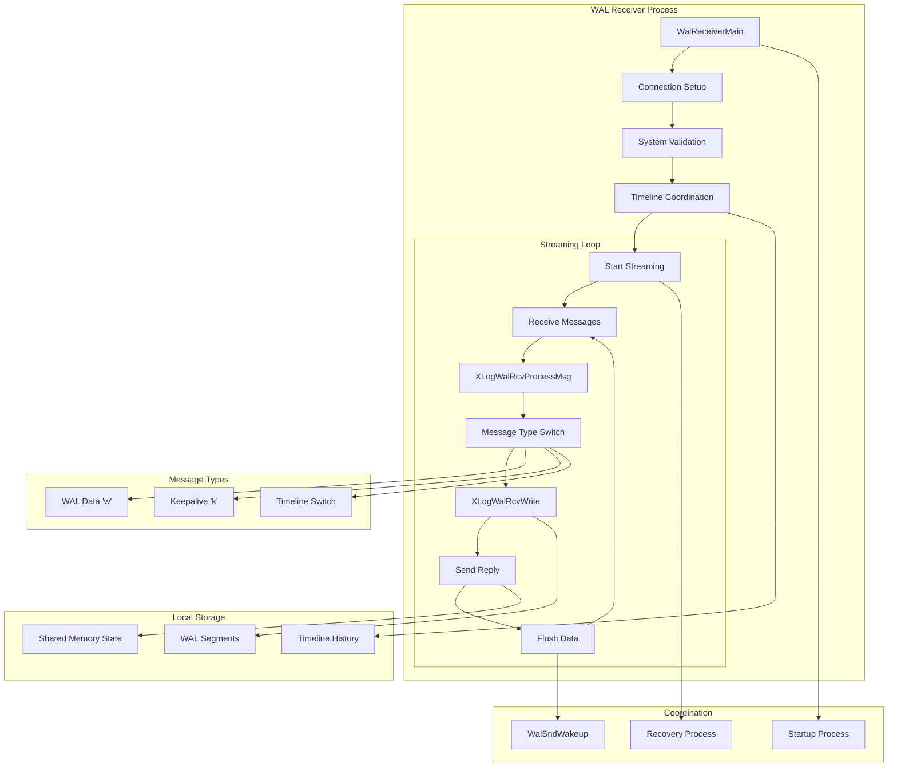
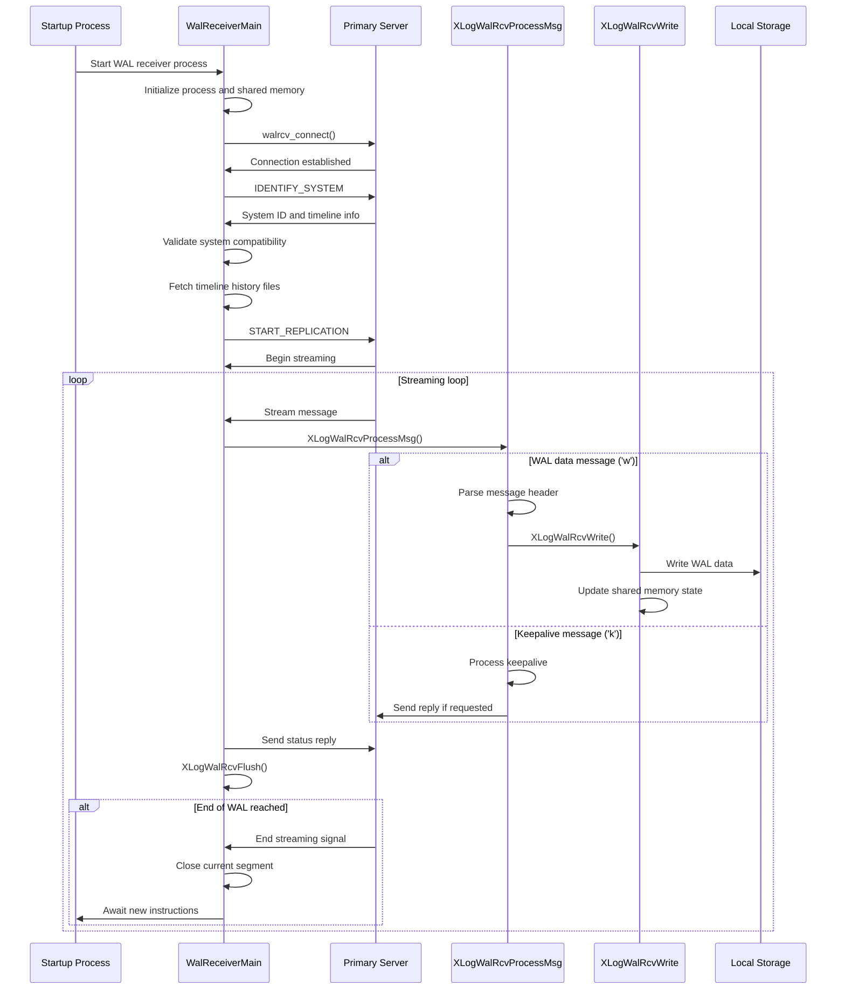

# Replication Receiver Component

## Overview
The Replication Receiver component implements the standby side of PostgreSQL's streaming replication, responsible for receiving WAL data from a primary server and writing it to local storage. This component establishes and maintains replication connections, processes incoming WAL streams, manages timeline consistency, and coordinates with the local recovery process to ensure data integrity.

The component centers around `WalReceiverMain`, which manages the entire lifecycle of a WAL receiver process, from connection establishment through continuous streaming. Supporting functions like `XLogWalRcvProcessMsg` handle protocol-level message processing, while `XLogWalRcvWrite` manages the physical writing of received WAL data to disk.

## Key Concepts
- **Streaming Connection**: Persistent connection to primary server using replication protocol
- **Timeline Coordination**: Ensuring consistency across database timeline switches
- **Message Protocol**: Processing different types of replication messages (WAL data, keepalives)
- **Flow Control**: Managing receive buffers and acknowledgment of data receipt
- **Restart Capability**: Graceful handling of connection interruptions and restart requests

## Architecture



## Core APIs

### WalReceiverMain

#### Purpose
WalReceiverMain serves as the main entry point and control loop for the WAL receiver process, managing the entire lifecycle of streaming replication from connection establishment through continuous data reception and coordination with local recovery processes.

#### Signature
```c
void WalReceiverMain(char *startup_data, size_t startup_data_len)
```

#### Detailed Description
WalReceiverMain implements the complete WAL receiver process lifecycle through several distinct phases:

1. **Process Initialization**: Sets up process type, shared memory state, signal handlers, and loads required libraries
2. **Connection Establishment**: Connects to the primary server using configured connection information
3. **System Validation**: Verifies system identifiers and timeline compatibility between primary and standby
4. **Timeline Management**: Fetches missing timeline history files to maintain consistency
5. **Streaming Coordination**: Manages replication slot creation and streaming startup
6. **Main Streaming Loop**: Continuously receives and processes WAL data until instructed otherwise
7. **Error Recovery**: Handles connection failures, timeouts, and restart requests

The function operates in an infinite outer loop that allows for restart scenarios when the startup process requests new streaming parameters. The inner streaming loop handles continuous data reception until end-of-WAL or connection failure.

#### Parameters
| Parameter | Type | Description | Constraints |
|-----------|------|-------------|-------------|
| startup_data | char* | Startup data passed to the process | Currently unused, expected to be NULL |
| startup_data_len | size_t | Length of startup data | Expected to be 0 |

#### Return Value
This function does not return under normal circumstances. It runs until the process is terminated or encounters a fatal error.

#### Error Handling
- **Connection Failures**: Reports errors and terminates if unable to connect to primary
- **System ID Mismatches**: Fatal error if primary and standby system identifiers differ
- **Timeline Inconsistencies**: Prevents streaming if primary timeline is behind standby
- **Protocol Violations**: Handles malformed messages and connection interruptions

#### Integration Points
- **Called by**: Postmaster process as auxiliary process entry point
- **Calls**: `walrcv_connect`, `XLogWalRcvProcessMsg`, `XLogWalRcvWrite`, `WalRcvWaitForStartPosition`
- **Shared state**: Updates `WalRcv` shared memory structure, coordinates with startup process

### XLogWalRcvProcessMsg

#### Purpose
XLogWalRcvProcessMsg processes incoming replication messages from the XLOG stream, handling WAL records and keepalive messages from the primary server during streaming replication. This function serves as the protocol message dispatcher for the replication stream.

#### Signature
```c
static void XLogWalRcvProcessMsg(unsigned char type, char *buf, Size len, TimeLineID tli)
```

#### Detailed Description
This function implements the core message processing logic for the WAL receiver:

1. **Message Type Dispatch**: Handles two primary message types:
   - **WAL Records ('w' type)**: Contains actual WAL data that needs to be written locally
   - **Keepalive Messages ('k' type)**: Heartbeat messages for connection monitoring
2. **Protocol Parsing**: Extracts header information including LSN positions and timestamps
3. **Data Delegation**: Delegates actual WAL writing to `XLogWalRcvWrite` for data messages
4. **Flow Control**: Processes acknowledgment requests and coordinates reply messages
5. **Error Validation**: Ensures message format compliance and handles protocol violations

The function maintains strict protocol adherence and includes comprehensive validation to ensure data integrity during replication.

#### Parameters
| Parameter | Type | Description | Constraints |
|-----------|------|-------------|-------------|
| type | unsigned char | Message type identifier | 'w' for WAL data, 'k' for keepalive |
| buf | char* | Raw message buffer containing payload | Non-null, valid message data |
| len | Size | Length of the message buffer | Must match actual message size |
| tli | TimeLineID | Timeline ID for the WAL data | Current valid timeline |

#### Return Value
Returns void. Effects are visible through written WAL data and updated shared state.

#### Error Handling
- **Invalid Message Types**: Reports protocol violation errors for unknown message types
- **Malformed Messages**: Validates message structure and content
- **Buffer Overflow**: Ensures message length consistency
- **Timeline Mismatches**: Handles timeline validation during processing

#### Integration Points
- **Called by**: `WalReceiverMain` main streaming loop
- **Calls**: `XLogWalRcvWrite`, `XLogWalRcvSendReply`, `ProcessWalSndrMessage`
- **Shared state**: Updates streaming state and coordinates with reply mechanisms

### XLogWalRcvWrite

#### Purpose
XLogWalRcvWrite handles the physical writing of WAL data received from the primary server to local disk storage, managing segment boundaries, file operations, and coordination with shared memory state updates.

#### Signature
```c
static void XLogWalRcvWrite(char *buf, Size nbytes, XLogRecPtr recptr, TimeLineID tli)
```

#### Detailed Description
This function implements the core data persistence logic for received WAL data:

1. **Segment Management**: Handles WAL segment file lifecycle including opening, writing, and closing files as needed
2. **Offset Calculation**: Computes proper file offsets within segments based on LSN positions
3. **Atomic Writing**: Uses `pg_pwrite` for atomic write operations to prevent partial writes
4. **Boundary Handling**: Manages cases where data spans multiple WAL segments
5. **State Updates**: Updates shared memory to reflect write progress for coordination with other processes
6. **Error Recovery**: Handles write failures and file system errors gracefully

The function operates in a loop to handle data that spans segment boundaries, ensuring all data is written to the correct files with proper offsets.

#### Parameters
| Parameter | Type | Description | Constraints |
|-----------|------|-------------|-------------|
| buf | char* | Buffer containing WAL data to write | Non-null, contains valid WAL data |
| nbytes | Size | Number of bytes to write | Must not exceed available buffer |
| recptr | XLogRecPtr | WAL record pointer for positioning | Valid LSN within current WAL stream |
| tli | TimeLineID | Timeline ID for the data | Current valid timeline |

#### Return Value
Returns void. Success is indicated by successful completion without errors.

#### Error Handling
- **Write Failures**: Reports PANIC on disk write failures to ensure consistency
- **File Creation**: Handles segment file creation and initialization
- **Space Management**: Ensures adequate disk space for WAL data
- **Atomic Operations**: Prevents partial writes through proper error handling

#### Integration Points
- **Called by**: `XLogWalRcvProcessMsg` for WAL data messages
- **Calls**: `XLogFileInit`, `pg_pwrite`, `pg_atomic_write_u64`
- **Shared state**: Updates write progress in shared memory for visibility to other processes

## Data Structures

### WalRcvData
The main shared memory structure representing WAL receiver state:

```c
typedef struct WalRcvData
{
    pid_t           pid;                /* WAL receiver process ID */
    WalRcvState     walRcvState;       /* Current receiver state */
    XLogRecPtr      receiveStart;      /* Start position for streaming */
    TimeLineID      receiveStartTLI;   /* Timeline for start position */
    XLogRecPtr      flushedUpto;       /* Last position flushed */
    char            conninfo[MAXCONNINFO]; /* Connection string */
    char            slotname[NAMEDATALEN]; /* Replication slot name */
    bool            is_temp_slot;      /* Whether using temporary slot */
    TimestampTz     lastMsgSendTime;   /* Last message send time */
    TimestampTz     lastMsgReceiptTime; /* Last message receipt time */
    pg_atomic_uint64 writtenUpto;      /* Last position written */
    Latch          *latch;             /* Process latch for signaling */
} WalRcvData;
```

**Key Fields**:
- `walRcvState`: Current state (STARTING, STREAMING, WAITING, STOPPING, STOPPED)
- `receiveStart`/`receiveStartTLI`: Streaming start position and timeline
- `writtenUpto`/`flushedUpto`: Progress tracking for coordination
- `conninfo`: Connection information for primary server

### WalRcvStreamOptions
Structure for configuring streaming options:

```c
typedef struct WalRcvStreamOptions
{
    bool        logical;              /* Logical vs physical replication */
    XLogRecPtr  startpoint;          /* Starting LSN */
    char       *slotname;            /* Replication slot name */
    union {
        struct {
            TimeLineID startpointTLI; /* Starting timeline */
        } physical;
    } proto;
} WalRcvStreamOptions;
```

## Processing Flow



## Implementation Notes

### Connection Management
The component implements sophisticated connection handling:

1. **Retry Logic**: Automatic reconnection attempts with exponential backoff
2. **Authentication**: Proper credential handling for secure connections
3. **Configuration**: Dynamic connection string management and updates
4. **Monitoring**: Connection health tracking through keepalive mechanisms

### Timeline Coordination
Critical timeline management ensures consistency:

1. **History Files**: Automatic fetching of missing timeline history files
2. **Validation**: Strict timeline compatibility checking
3. **Switches**: Graceful handling of timeline changes during streaming
4. **Recovery**: Proper coordination with local recovery timeline

### Message Protocol Handling
Comprehensive protocol implementation:

1. **Message Types**: Support for WAL data, keepalive, and control messages
2. **Flow Control**: Proper acknowledgment and feedback mechanisms
3. **Error Detection**: Checksum validation and protocol compliance
4. **Buffering**: Efficient message buffering and processing

### Performance Optimizations
Several optimizations maximize replication performance:

1. **Batched Writes**: Grouping multiple writes for efficiency
2. **Async I/O**: Non-blocking network operations where possible
3. **Buffer Management**: Efficient memory usage for streaming buffers
4. **Connection Pooling**: Reuse of connection resources

### Error Recovery Strategies
Robust error handling ensures system resilience:

1. **Connection Failures**: Automatic reconnection with appropriate delays
2. **Protocol Errors**: Clear error reporting and recovery procedures
3. **Disk Failures**: Proper handling of storage-related errors
4. **Timeline Issues**: Graceful recovery from timeline inconsistencies

### Monitoring and Observability
Built-in instrumentation supports operational monitoring:

1. **Progress Tracking**: Detailed tracking of received, written, and flushed positions
2. **Timing Information**: Latency measurements for network and disk operations
3. **State Visibility**: Clear indication of current receiver state
4. **Statistics**: Integration with PostgreSQL's replication monitoring views

### Integration with Recovery
Close coordination with the recovery process:

1. **Startup Coordination**: Proper handshake with startup process
2. **Position Synchronization**: Coordinated tracking of replay progress
3. **Restart Handling**: Graceful restart when parameters change
4. **Shutdown Coordination**: Clean termination during server shutdown