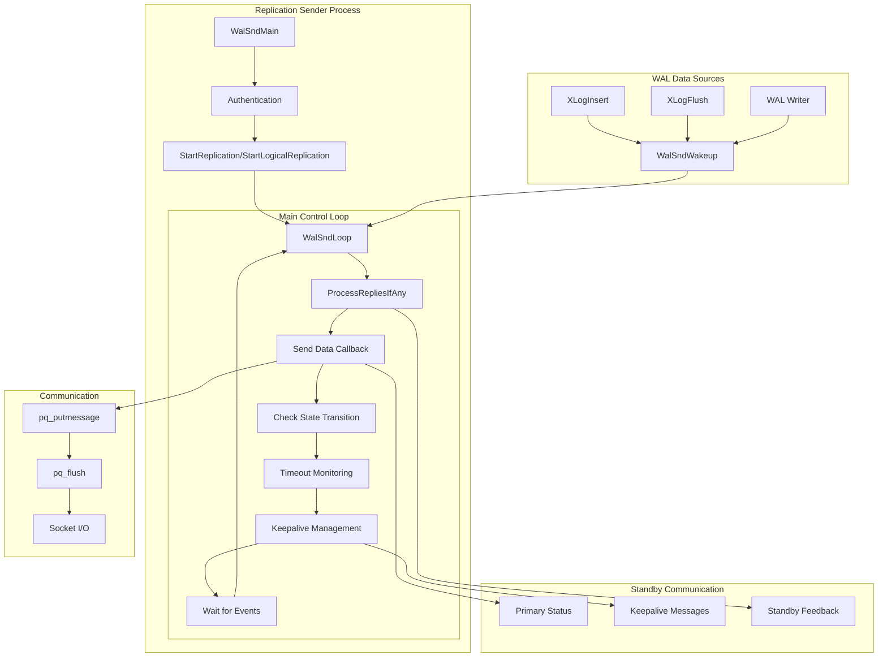
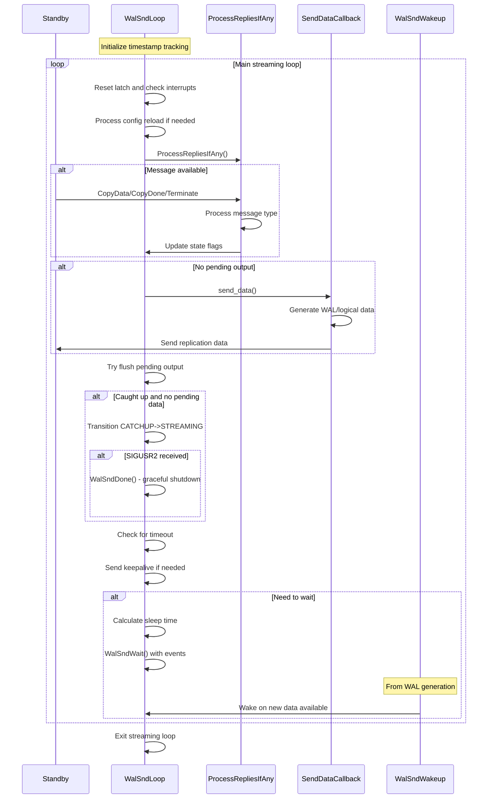

# Replication Sender Component

## Overview
The Replication Sender component manages the streaming of WAL data from a primary PostgreSQL server to one or more standby servers. This component implements the primary side of PostgreSQL's streaming replication, handling both physical WAL streaming and logical replication through a sophisticated event-driven architecture that balances throughput, latency, and reliability.

The component centers around the `WalSndLoop` main control loop, which coordinates data transmission, client communication, state management, and error handling. Supporting functions like `ProcessRepliesIfAny` handle bidirectional communication, while `WalSndWakeup` provides the notification mechanism that enables efficient coordination between WAL generation and replication streaming.

## Key Concepts
- **Streaming States**: Catchup vs streaming modes with different performance characteristics
- **Copy Protocol**: PostgreSQL's COPY protocol adapted for replication data transfer
- **Synchronous Replication**: Coordinated commit processing for data consistency guarantees
- **Keepalive Management**: Bidirectional heartbeat mechanism for connection monitoring
- **Wakeup Coordination**: Event-driven notification system for efficient resource utilization

## Architecture



## Core APIs

### WalSndLoop

#### Purpose
WalSndLoop implements the main control loop for WAL sender processes, managing all aspects of streaming WAL data to replicas via Copy protocol messages. This function serves as the central coordinator for replication streaming, handling data transmission, state transitions, client communication, and connection lifecycle management.

#### Signature
```c
static void WalSndLoop(WalSndSendDataCallback send_data)
```

#### Detailed Description
WalSndLoop implements a sophisticated event-driven loop that coordinates multiple aspects of replication streaming:

1. **State Machine Management**: Handles transitions between WALSNDSTATE_CATCHUP and WALSNDSTATE_STREAMING states, which have different performance and consistency implications
2. **Data Transmission Control**: Uses callback functions to handle both physical and logical replication data transmission
3. **Bidirectional Communication**: Processes incoming messages from standby servers while sending outgoing WAL data
4. **Connection Lifecycle**: Manages graceful connection establishment, maintenance, and termination
5. **Configuration Management**: Handles dynamic configuration reloads without requiring process restart
6. **Performance Optimization**: Implements output buffering and batching strategies to optimize network utilization

The loop continues until replication ends due to client request, network failure, or system shutdown. It includes comprehensive error handling and cleanup mechanisms to ensure system stability.

#### Parameters
| Parameter | Type | Description | Constraints |
|-----------|------|-------------|-------------|
| send_data | WalSndSendDataCallback | Function pointer for sending WAL data | Must be valid callback (physical or logical) |

#### Return Value
This function does not return under normal circumstances. It exits the process when streaming terminates or encounters fatal errors.

#### Error Handling
- **Network Failures**: Terminates process on communication errors
- **Timeout Detection**: Monitors client response times and terminates unresponsive connections
- **Signal Handling**: Responds to SIGUSR2 for graceful shutdown during server stop
- **Configuration Errors**: Handles invalid configuration changes gracefully

#### Integration Points
- **Called by**: `StartReplication` (physical), `StartLogicalReplication` (logical)
- **Calls**: `ProcessRepliesIfAny`, send_data callback, `WalSndCheckTimeOut`, `WalSndKeepaliveIfNecessary`
- **Shared state**: Manages `MyWalSnd` process state, coordinates with synchronous replication

### ProcessRepliesIfAny

#### Purpose
ProcessRepliesIfAny handles incoming messages from standby connections during WAL streaming, processing client replies and managing connection state in a non-blocking manner. This function enables bidirectional communication essential for feedback-based replication features.

#### Signature
```c
static void ProcessRepliesIfAny(void)
```

#### Detailed Description
This function implements the standby communication protocol handling on the primary side:

1. **Non-blocking Message Reading**: Uses PostgreSQL's non-blocking I/O infrastructure to check for available messages without interrupting streaming
2. **Protocol Message Validation**: Ensures message format compliance with replication protocol specifications
3. **Message Type Dispatch**: Handles three core message types:
   - **CopyData**: Contains standby status messages processed by `ProcessStandbyMessage`
   - **CopyDone**: Indicates standby wants to terminate streaming gracefully
   - **Terminate**: Signals immediate connection closure
4. **State Coordination**: Updates streaming state flags to coordinate proper session termination
5. **Timestamp Tracking**: Maintains timing information for keepalive and timeout mechanisms

The function processes all available messages in a single call, ensuring responsive communication while maintaining streaming performance.

#### Parameters
This function takes no parameters and operates on global WAL sender state.

#### Return Value
Returns void. State changes are reflected in global variables like `streamingDoneReceiving` and `last_reply_timestamp`.

#### Error Handling
- **Protocol Violations**: Reports errors and terminates connection for invalid messages
- **Message Size Limits**: Enforces size restrictions to prevent resource exhaustion
- **EOF Conditions**: Handles unexpected connection closures gracefully
- **Processing Errors**: Delegates to `ProcessStandbyMessage` for detailed error handling

#### Integration Points
- **Called by**: `WalSndLoop`, `WalSndWaitForWal`, `ProcessPendingWrites`
- **Calls**: `ProcessStandbyMessage`, PostgreSQL message I/O functions
- **Shared state**: Updates reply timestamps, streaming state flags

### WalSndWakeup

#### Purpose
WalSndWakeup provides the notification mechanism that wakes up WAL sender processes waiting for new WAL data, with separate control for physical and logical replication types. This function enables efficient coordination between WAL generation and replication streaming.

#### Signature
```c
void WalSndWakeup(bool physical, bool logical)
```

#### Detailed Description
WalSndWakeup implements the core notification system for WAL sender coordination:

1. **Replication Type Differentiation**: Handles physical and logical replication with different triggering conditions:
   - **Physical Replication**: Triggered when WAL data is flushed to disk
   - **Logical Replication**: Triggered when WAL data is replayed (on standby servers)
2. **Condition Variable Broadcasting**: Uses efficient condition variables to wake multiple waiting processes
3. **Critical Section Safety**: Designed to be safe for calls from within critical sections
4. **Performance Optimization**: Avoids unnecessary wake operations when no processes are waiting

The function is called from various points in the WAL lifecycle to ensure timely notification of data availability.

#### Parameters
| Parameter | Type | Description | Constraints |
|-----------|------|-------------|-------------|
| physical | bool | Whether to wake physical WAL senders | Boolean flag |
| logical | bool | Whether to wake logical WAL senders | Boolean flag |

#### Return Value
Returns void. Effects are visible through woken WAL sender processes resuming operation.

#### Error Handling
- **Critical Section Safety**: Avoids operations that could throw errors
- **Condition Variable Management**: Handles cases where no processes are waiting
- **Memory Safety**: Operates only on pre-initialized shared memory structures

#### Integration Points
- **Called by**: `StartupXLOG`, `ApplyWalRecord`, `XLogWalRcvFlush`, `WalSndWakeupProcessRequests`
- **Calls**: `ConditionVariableBroadcast` on shared condition variables
- **Shared state**: Coordinates with waiting WAL senders via condition variables

## Data Structures

### WalSnd
The main structure representing a WAL sender process:

```c
typedef struct WalSnd
{
    pid_t           pid;                /* Process ID */
    WalSndState     state;             /* Current state */
    XLogRecPtr      sentPtr;           /* Last WAL position sent */
    XLogRecPtr      flush;             /* Last position flushed by standby */
    XLogRecPtr      apply;             /* Last position applied by standby */
    TimestampTz     replyTime;         /* Last reply timestamp */
    bool            is_for_gss;        /* Using GSSAPI encryption */
    char            sync_standby_priority; /* Synchronous standby priority */
} WalSnd;
```

**Key Fields**:
- `state`: Current streaming state (STARTUP, CATCHUP, STREAMING, STOPPING)
- `sentPtr`: Tracks progress of data transmission
- `flush`/`apply`: Tracks standby acknowledgment progress
- `sync_standby_priority`: Synchronous replication coordination

### WalSndSendDataCallback
Function pointer type for send data callbacks:

```c
typedef void (*WalSndSendDataCallback)(void);
```

**Purpose**: Abstracts physical vs logical replication data transmission, allowing the same control loop to handle both replication types.

### Replication Protocol Messages
Key message types handled in the replication protocol:

- **Primary Keepalive**: Sent from primary to standby for connection monitoring
- **Standby Status**: Sent from standby to primary with progress information
- **Hot Standby Feedback**: Sent from standby with transaction visibility information

## Processing Flow



## Implementation Notes

### State Machine Management
The replication sender implements a clear state machine:

1. **WALSNDSTATE_STARTUP**: Initial state during connection establishment
2. **WALSNDSTATE_CATCHUP**: Sending historical WAL data to bring standby current
3. **WALSNDSTATE_STREAMING**: Real-time streaming of new WAL data
4. **WALSNDSTATE_STOPPING**: Graceful shutdown in progress

The transition from CATCHUP to STREAMING is critical as it represents the point where data loss risk ends if primary fails.

### Performance Optimizations
Several optimizations maximize replication throughput:

1. **Output Buffering**: Batches multiple messages to reduce network overhead
2. **Non-blocking I/O**: Prevents blocking on standby communication
3. **Event-driven Wake**: Efficient notification system minimizes polling
4. **Flexible Timing**: Adaptive timeout and keepalive intervals

### Synchronous Replication Integration
The component integrates closely with synchronous replication:

1. **Priority Management**: Tracks standby priorities for synchronous commit decisions
2. **State Coordination**: State transitions affect synchronous replication behavior
3. **Feedback Processing**: Standby acknowledgments drive synchronous commit completion
4. **Configuration Updates**: Dynamic reconfiguration of synchronous settings

### Error Handling Strategies
Comprehensive error handling ensures system robustness:

1. **Network Failures**: Graceful handling of connection interruptions
2. **Protocol Violations**: Clear error reporting for debugging
3. **Resource Exhaustion**: Message size limits and buffer management
4. **Signal Handling**: Proper response to shutdown and configuration signals

### Connection Lifecycle Management
Sophisticated connection management handles various scenarios:

1. **Authentication**: Proper credential verification before streaming
2. **Timeline Coordination**: Ensuring consistency across timeline changes
3. **Graceful Shutdown**: Coordinated termination with standby acknowledgment
4. **Resource Cleanup**: Proper cleanup of shared memory and file descriptors

### Monitoring and Observability
Built-in instrumentation supports operational monitoring:

1. **Progress Tracking**: Detailed tracking of sent, flushed, and applied positions
2. **Timing Information**: Latency and throughput measurements
3. **State Visibility**: Clear indication of current replication state
4. **Statistics Reporting**: Integration with PostgreSQL's statistics framework