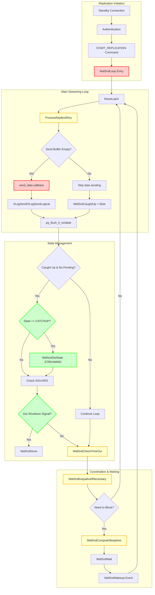

# WAL Replication Sender Component

## Overview

The WAL Replication Sender component implements PostgreSQL's streaming replication mechanism, enabling real-time transmission of WAL data from primary servers to standby replicas. This component serves as the cornerstone of PostgreSQL's high availability infrastructure, supporting both physical and logical replication modes.

## Key Concepts

- **Streaming Replication**: Real-time WAL transmission over network connections
- **Copy Protocol**: PostgreSQL's binary protocol used for efficient data transfer
- **Physical vs Logical Replication**: Raw WAL streaming vs decoded logical changes
- **Synchronous Replication**: Coordination with standby confirmation for durability guarantees
- **Replication States**: CATCHUP and STREAMING states representing different operational modes
- **Keepalive Mechanism**: Heartbeat system to maintain connection health and track progress

## Architecture



## Core APIs

### WalSndLoop

#### Purpose
WalSndLoop is the main control loop for WAL sender processes that manages streaming WAL data to replicas via Copy protocol messages. It coordinates all aspects of replication including data transmission, client communication, and state management.

#### Signature
```c
static void WalSndLoop(WalSndSendDataCallback send_data)
```

#### Detailed Description
WalSndLoop implements the core streaming protocol for PostgreSQL replication. The function operates as an event-driven loop that coordinates multiple concurrent activities:

**Primary Responsibilities:**
1. **Data Transmission Management**: Controls when and how WAL data is sent to replicas
2. **Client Communication**: Processes replies, keepalives, and control messages from standby
3. **State Transitions**: Manages progression from CATCHUP to STREAMING state
4. **Timeout Monitoring**: Implements replication timeout detection and handling
5. **Resource Management**: Handles configuration reloads and graceful shutdown

**Event-Driven Architecture:**
The loop uses a sophisticated waiting mechanism that responds to multiple event types:
- Socket readability (client messages)
- Socket writability (flush completion)
- Latch signals (WAL data availability)
- Timer expiration (keepalive, timeout)

**State Machine Implementation:**
```
CATCHUP State:
- Sending historical WAL data to bring standby up to date
- Data loss possible if primary fails before reaching STREAMING
- No synchronous replication guarantees

STREAMING State:
- Real-time WAL transmission
- Synchronous replication commitments honored
- Standby is considered caught up
```

#### Parameters
| Parameter | Type | Description | Constraints |
|-----------|------|-------------|-------------|
| send_data | WalSndSendDataCallback | Function pointer for WAL data transmission | XLogSend for physical, XLogSendLogical for logical |

#### Return Value
Void function that runs until replication termination. Loop exits when client disconnects or shutdown signal received.

#### Error Handling
- **Network Failures**: Handled via pq_flush_if_writable error checking
- **Timeout Detection**: WalSndCheckTimeOut monitors connection health
- **Graceful Shutdown**: SIGUSR2 signal triggers orderly termination via WalSndDone
- **Configuration Errors**: Dynamic config reload with validation

#### Integration Points
- **Called by**: StartReplication (physical), StartLogicalReplication (logical)
- **Calls**: ProcessRepliesIfAny, send_data callback, WalSndCheckTimeOut, WalSndKeepaliveIfNecessary
- **Shared state**: MyWalSnd global structure, replication slot state
- **Synchronization**: Latch-based coordination with WAL generation/writing

### WalSndWakeup

#### Purpose
WalSndWakeup wakes up WAL sender processes waiting for new WAL data, providing the coordination mechanism between WAL availability and replication transmission.

#### Signature
```c
void WalSndWakeup(bool physical, bool logical)
```

#### Detailed Description
This function implements the notification system that coordinates WAL data availability with replication streaming. It distinguishes between different replication types and their data availability requirements:

**Physical Replication Coordination:**
- Triggered when WAL data is flushed to disk
- Ensures physical senders only stream durable WAL data
- Critical for crash recovery consistency on standby

**Logical Replication Coordination:**
- Triggered when WAL data is applied/replayed
- Ensures logical senders only stream after WAL application on standby
- Important for cascading logical replication scenarios

**Condition Variable Broadcasting:**
Uses PostgreSQL's condition variable system for efficient coordination:
- Avoids busy-waiting and polling overhead
- Provides immediate notification when data becomes available
- Supports multiple waiters with single broadcast operation

#### Parameters
| Parameter | Type | Description | Constraints |
|-----------|------|-------------|-------------|
| physical | bool | Wake physical WAL senders waiting for WAL flush | Independent of logical parameter |
| logical | bool | Wake logical WAL senders waiting for WAL replay | Independent of physical parameter |

#### Return Value
Void function providing notification-only semantics. Success indicated by awakening of waiting processes.

#### Error Handling
- **Critical Section Safe**: Designed to avoid error-throwing operations
- **Graceful Degradation**: Missing waiters silently ignored (no error)
- **Memory Safety**: Uses PostgreSQL's shared memory condition variables

#### Integration Points
- **Called by**: StartupXLOG, ApplyWalRecord, XLogWrite, WAL application processes
- **Calls**: ConditionVariableBroadcast for coordination primitives
- **Shared state**: wal_flush_cv and wal_replay_cv condition variables
- **Synchronization**: Works with WalSndWait for complete coordination cycle

## Data Structures

### WalSnd
Per-sender state structure in shared memory:

```c
typedef struct WalSnd
{
    pid_t       pid;                /* Process ID of sender */
    WalSndState state;              /* Current sender state */
    XLogRecPtr  sentPtr;            /* Last WAL position sent */
    XLogRecPtr  flush;              /* Last position flushed by standby */
    XLogRecPtr  apply;              /* Last position applied by standby */
    XLogRecPtr  writeLag;           /* Lag measurements */
    XLogRecPtr  flushLag;
    XLogRecPtr  applyLag;
    SyncRepStandbyData *sync_standby_name;
    /* ... additional fields ... */
} WalSnd;
```

### WalSndSendDataCallback
Function pointer type for data transmission:

```c
typedef void (*WalSndSendDataCallback)(void);

// Implementation examples:
// - XLogSend: Physical replication callback
// - XLogSendLogical: Logical replication callback
```

## Processing Flow

```mermaid
sequenceDiagram
    participant Standby
    participant WalSndLoop
    participant WALSystem
    participant NetworkLayer

    Standby->>WalSndLoop: START_REPLICATION command
    WalSndLoop->>WalSndLoop: Initialize state (CATCHUP)

    loop Main Streaming Loop
        WalSndLoop->>WalSndLoop: ResetLatch()
        WalSndLoop->>Standby: ProcessRepliesIfAny()

        alt Send buffer empty
            WalSndLoop->>WALSystem: send_data() callback
            WALSystem->>NetworkLayer: Prepare WAL data
            NetworkLayer->>Standby: Stream WAL records
        else Send buffer pending
            WalSndLoop->>WalSndLoop: Set WalSndCaughtUp = false
        end

        WalSndLoop->>NetworkLayer: pq_flush_if_writable()

        alt Caught up and no pending data
            alt State is CATCHUP
                WalSndLoop->>WalSndLoop: WalSndSetState(STREAMING)
                Note over WalSndLoop: Critical state transition!
            end

            alt Got SIGUSR2 (shutdown)
                WalSndLoop->>WalSndLoop: WalSndDone()
                break Exit loop
            end
        end

        WalSndLoop->>WalSndLoop: WalSndCheckTimeOut()
        WalSndLoop->>Standby: WalSndKeepaliveIfNecessary()

        alt Need to block
            WalSndLoop->>WalSndLoop: WalSndComputeSleeptime()
            WalSndLoop->>WalSndLoop: WalSndWait()
            WALSystem->>WalSndLoop: WalSndWakeup() signal
        end
    end
```

## Implementation Notes

### State Transition Semantics
The CATCHUP to STREAMING transition is critically important:

```c
if (MyWalSnd->state == WALSNDSTATE_CATCHUP)
{
    ereport(DEBUG1,
        (errmsg_internal("\"%s\" has now caught up with upstream server",
                        application_name)));
    WalSndSetState(WALSNDSTATE_STREAMING);
}
```

**Before STREAMING State:**
- Data loss risk exists if primary fails
- Synchronous replication commits may not wait
- Standby not considered fully synchronized

**After STREAMING State:**
- Synchronous replication commitments honored
- Standby eligible for failover scenarios
- Real-time replication guarantees active

### Timeout and Keepalive Management
Sophisticated timing control prevents connection loss:

- **wal_sender_timeout**: Maximum silence period before connection termination
- **Keepalive Intervals**: Proactive heartbeat transmission
- **Reply Processing**: Monitors standby health and progress
- **Lag Calculation**: Tracks replication delay for monitoring

### I/O and Network Optimization
Efficient data transmission strategies:

```c
// Batching strategy
if (!pq_is_send_pending())
    send_data();  // Send more data
else
    WalSndCaughtUp = false;  // Assume not caught up

// Non-blocking flush
if (pq_flush_if_writable() != 0)
    WalSndShutdown();  // Handle errors
```

**Benefits:**
- Reduces system call overhead through batching
- Avoids blocking on network I/O
- Maintains send buffer efficiency
- Provides immediate error detection

### Configuration Reload Handling
Dynamic configuration updates without restart:

```c
if (ConfigReloadPending)
{
    ConfigReloadPending = false;
    ProcessConfigFile(PGC_SIGHUP);
    SyncRepInitConfig();  // Update synchronous replication
}
```

**Supported Updates:**
- Synchronous replication configuration
- Timeout and keepalive parameters
- Logging and monitoring settings
- Network and buffer tuning

### Performance Characteristics

#### Throughput Optimization
- **Callback Architecture**: Pluggable send_data functions for different replication types
- **Buffer Management**: Efficient queue handling with pq_is_send_pending checks
- **Event-Driven Design**: Eliminates polling overhead through condition variables
- **Batch Transmission**: Groups multiple WAL records for network efficiency

#### Latency Minimization
- **Immediate Wakeup**: WalSndWakeup provides instant notification of data availability
- **Non-blocking Operations**: Prevents sender blocking on receiver state
- **Keepalive Optimization**: Proactive heartbeat prevents timeout-induced delays
- **State Machine Efficiency**: Minimal overhead state transitions

#### Scalability Factors
- **Multiple Senders**: Each standby has dedicated sender process
- **Condition Variable Efficiency**: O(1) wakeup complexity regardless of sender count
- **Resource Isolation**: Per-sender state prevents cross-contamination
- **Timeline Support**: Handles complex replication topologies with timeline switching

### Synchronous Replication Integration
WalSndLoop coordinates with synchronous replication:

- **State Awareness**: Only STREAMING senders participate in synchronous waits
- **Progress Tracking**: Monitors standby acknowledgment for commit coordination
- **Configuration Integration**: Respects synchronous_standby_names settings
- **Failure Handling**: Graceful degradation when synchronous standbys disconnect