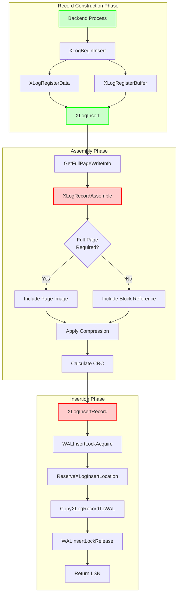

# WAL Generation Component

## Overview

The WAL Generation component is responsible for constructing, assembling, and inserting Write-Ahead Log records into the WAL buffer. This is the entry point for all database operations that need to be logged for durability and replication. The component implements PostgreSQL's fundamental WAL principle: "write the log before the data".

## Key Concepts

- **WAL Record Construction**: Multi-phase process of building complete WAL records from registered data and buffer references
- **Full-Page Writes (FPW)**: Complete page images included in WAL records to ensure crash consistency
- **Resource Managers**: Subsystem-specific handlers that define WAL record formats and replay logic
- **LSN (Log Sequence Number)**: Unique identifier for each WAL record position, used for ordering and durability guarantees

## Architecture



## Core APIs

### XLogInsert

#### Purpose
XLogInsert is the primary function that finalizes and inserts a constructed WAL record into the Write-Ahead Log, returning the LSN for the inserted record. It serves as the culmination of the WAL record construction process.

#### Signature
```c
XLogRecPtr XLogInsert(RmgrId rmid, uint8 info)
```

#### Detailed Description
XLogInsert coordinates the final phases of WAL record insertion. The function operates in a retry loop to handle race conditions with full-page write decisions. It validates prerequisites (XLogBeginInsert called, valid info byte), handles bootstrap mode specially, determines full-page write requirements dynamically, assembles the complete record, and inserts it atomically.

The function implements the core WAL guarantee by returning an LSN that represents the durability checkpoint - data pages affected by this operation cannot be written to disk until WAL is flushed through this LSN.

**Implementation Flow:**
1. Validate insertion prerequisites and info byte constraints
2. Handle bootstrap mode with dummy LSN for non-XLOG records
3. Enter retry loop for full-page write race condition handling
4. Get current full-page write requirements (RedoRecPtr, doPageWrites)
5. Assemble complete record via XLogRecordAssemble
6. Insert record via XLogInsertRecord
7. Retry if insertion failed due to timing issues
8. Clean up insertion state and return final LSN

#### Parameters
| Parameter | Type | Description | Constraints |
|-----------|------|-------------|-------------|
| rmid | RmgrId | Resource Manager ID identifying which subsystem owns this record type | Must be valid RM_* constant (0-255) |
| info | uint8 | Operation-specific flags and information byte | Only XLR_RMGR_INFO_MASK, XLR_SPECIAL_REL_UPDATE, XLR_CHECK_CONSISTENCY bits allowed |

#### Return Value
Returns XLogRecPtr (LSN) pointing to the end of the inserted record (beginning of next record). This LSN serves as the durability guarantee point. Returns InvalidXLogRecPtr only in bootstrap mode for non-XLOG records.

#### Error Handling
- **ERROR**: "XLogBeginInsert was not called" - Prerequisites not met
- **PANIC**: "invalid xlog info mask" - Invalid info byte flags
- **Retry Logic**: Automatically retries if XLogInsertRecord returns InvalidXLogRecPtr due to full-page write timing changes

#### Integration Points
- **Called by**: heap_insert, _bt_insertonpg, XactLogCommitRecord, CreateCheckPoint, all logged database operations
- **Calls**: GetFullPageWriteInfo, XLogRecordAssemble, XLogInsertRecord, XLogResetInsertion
- **Shared state**: Uses global insertion state managed by XLogBeginInsert/XLogResetInsertion

### XLogInsertRecord

#### Purpose
XLogInsertRecord is the core low-level function that physically inserts pre-constructed XLOG records into the WAL buffer, implementing the fundamental WAL insertion mechanism with proper locking and space reservation.

#### Signature
```c
XLogRecPtr XLogInsertRecord(XLogRecData *rdata, XLogRecPtr fpw_lsn,
                           uint8 flags, int num_fpi, bool topxid_included)
```

#### Detailed Description
This function implements the critical section of WAL insertion. It handles three different insertion classes with varying locking requirements:

1. **Normal Records**: Uses shared WAL insertion locks, allows concurrent insertions
2. **XLOG_SWITCH Records**: Requires exclusive access, forces WAL segment switch
3. **Checkpoint Records**: Updates RedoRecPtr atomically under exclusive lock

The function performs sophisticated validation of full-page write requirements and may return InvalidXLogRecPtr if conditions changed, requiring the caller to recalculate and retry.

**Internal Process:**
1. Acquire appropriate WAL insertion locks based on record type
2. Validate full-page write consistency against current state
3. Reserve space in WAL buffer (handles segment switches)
4. Copy record data to reserved space
5. Update global state variables and statistics
6. Release locks and return insertion LSN

#### Parameters
| Parameter | Type | Description | Constraints |
|-----------|------|-------------|-------------|
| rdata | XLogRecData* | Chain of data chunks forming the complete record | First chunk must contain XLogRecord header |
| fpw_lsn | XLogRecPtr | Oldest LSN among affected pages not included as full-page images | Used for validation, can be InvalidXLogRecPtr |
| flags | uint8 | Control flags for insertion behavior | Combination of XLOG_* flag constants |
| num_fpi | int | Number of full-page images in the record | Must match actual FPI count in rdata |
| topxid_included | bool | Whether top-transaction ID is included in record | Affects transaction state tracking |

#### Return Value
Returns XLogRecPtr to end of inserted record on success. Returns InvalidXLogRecPtr if full-page write validation fails, requiring caller retry with updated information.

#### Error Handling
- **Full-Page Write Validation Failure**: Returns InvalidXLogRecPtr for retry
- **Critical Section Protection**: Uses PANIC for any failures within critical section
- **Lock Acquisition**: Handles lock timeouts and concurrent access appropriately

#### Integration Points
- **Called by**: XLogInsert exclusively
- **Calls**: WALInsertLockAcquire/Release, ReserveXLogInsertLocation, CopyXLogRecordToWAL
- **Shared state**: Updates ProcLastRecPtr, XactLastRecEnd, WAL statistics, potentially RedoRecPtr

### XLogRecordAssemble

#### Purpose
XLogRecordAssemble constructs a complete WAL record from all registered data and buffer references, handling full-page image decisions, compression, and record formatting.

#### Signature
```c
static XLogRecData *XLogRecordAssemble(RmgrId rmid, uint8 info,
                                       XLogRecPtr RedoRecPtr, bool doPageWrites,
                                       XLogRecPtr *fpw_lsn, int *num_fpi,
                                       bool *topxid_included)
```

#### Detailed Description
This static function orchestrates the complex process of assembling a complete WAL record from all components registered via XLogRegister* calls. It makes decisions about full-page images, applies compression when enabled, optimizes page hole handling, and ensures proper record structure.

**Assembly Process:**
1. Process registered buffers to determine full-page image requirements
2. Apply compression to full-page images when enabled (PGLZ, LZ4, ZSTD)
3. Handle page hole optimization for standard page layouts
4. Include replication origin and transaction ID information when needed
5. Calculate and embed CRC32C checksums
6. Enforce maximum record size limits
7. Build final XLogRecData chain for insertion

The function can be called multiple times for the same record (e.g., during retry scenarios) and handles this correctly.

#### Parameters
| Parameter | Type | Description | Constraints |
|-----------|------|-------------|-------------|
| rmid | RmgrId | Resource Manager ID for record type validation | Must match registered components |
| info | uint8 | Info byte for record header | Combined with consistency flags |
| RedoRecPtr | XLogRecPtr | Current redo pointer for FPW decisions | Used to determine if FPW needed |
| doPageWrites | bool | Whether full-page writes are currently enabled | System-wide FPW setting |
| fpw_lsn | XLogRecPtr* | Output: lowest LSN requiring full-page image | Set to track FPW requirements |
| num_fpi | int* | Output: count of full-page images included | Must match actual images |
| topxid_included | bool* | Output: whether top-level XID was logged | Affects transaction tracking |

#### Return Value
Returns pointer to XLogRecData chain representing the complete assembled record, ready for insertion. The chain follows PostgreSQL's linked data chunk format.

#### Error Handling
- **Size Validation**: Enforces XLogRecordMaxSize limits, PANICs if exceeded
- **Compression Failures**: Falls back to uncompressed images if compression fails
- **Memory Allocation**: Uses insertion memory context, cleaned up automatically

#### Integration Points
- **Called by**: XLogInsert exclusively during record assembly
- **Calls**: PageGetLSN, compression functions, CRC calculation routines
- **Shared state**: Accesses registered data/buffers, modifies global compression statistics

## Data Structures

### XLogRecord
The fundamental WAL record header structure:

```c
typedef struct XLogRecord
{
    uint32      xl_tot_len;     /* Total length of record */
    TransactionId xl_xid;       /* Transaction ID */
    XLogRecPtr  xl_prev;        /* Previous record LSN */
    uint8       xl_info;        /* Flag/operation info */
    RmgrId      xl_rmid;        /* Resource manager ID */
    /* 2 bytes of padding */
    uint32      xl_crc;         /* CRC for remainder of record */
    /* More data follows */
} XLogRecord;
```

### XLogRecData
Data chunk chain for record assembly:

```c
typedef struct XLogRecData
{
    char       *data;           /* Data pointer */
    uint32      len;            /* Data length */
    struct XLogRecData *next;   /* Next chunk */
} XLogRecData;
```

## Processing Flow

```mermaid
sequenceDiagram
    participant Backend
    participant XLogInsert
    participant XLogRecordAssemble
    participant XLogInsertRecord
    participant WALBuffer

    Backend->>XLogInsert: rmid, info
    Note over Backend,XLogInsert: Prerequisites validated

    loop Retry if needed
        XLogInsert->>XLogInsert: GetFullPageWriteInfo()
        XLogInsert->>XLogRecordAssemble: Assemble record

        XLogRecordAssemble->>XLogRecordAssemble: Process buffers
        XLogRecordAssemble->>XLogRecordAssemble: Apply compression
        XLogRecordAssemble->>XLogRecordAssemble: Calculate CRC
        XLogRecordAssemble-->>XLogInsert: XLogRecData chain

        XLogInsert->>XLogInsertRecord: Insert assembled record
        XLogInsertRecord->>XLogInsertRecord: Acquire WAL locks
        XLogInsertRecord->>WALBuffer: Reserve space
        XLogInsertRecord->>WALBuffer: Copy record data
        XLogInsertRecord->>XLogInsertRecord: Update global state
        XLogInsertRecord-->>XLogInsert: LSN or retry signal
    end

    XLogInsert->>XLogInsert: XLogResetInsertion()
    XLogInsert-->>Backend: Final LSN
```



## Implementation Notes

### Full-Page Write Optimization
The WAL generation component implements sophisticated full-page write logic:

- **Dynamic Decision Making**: Full-page write requirements are determined at assembly time based on current RedoRecPtr
- **Race Condition Handling**: XLogInsert implements retry logic to handle changes in FPW requirements
- **Compression Support**: Multiple compression algorithms (PGLZ, LZ4, ZSTD) reduce FPW storage overhead
- **Page Hole Optimization**: Standard pages have unused space excluded from full-page images

### Performance Characteristics
- **Insertion Scalability**: Multiple concurrent insertions supported via shared locks
- **Memory Efficiency**: Uses insertion-specific memory context, automatically cleaned up
- **CPU Optimization**: CRC calculation and compression optimized for common cases
- **Lock Contention**: Minimized through careful lock scoping and shared access patterns

### Bootstrap Mode Handling
Special processing for database initialization:
- Non-XLOG records return dummy LSNs during bootstrap
- Allows system catalog initialization without full WAL infrastructure
- Seamlessly transitions to normal operation after bootstrap completion

### Transaction Integration
- **Transaction ID Logging**: Optionally includes top-level transaction ID in records
- **Subtransaction Support**: Handles nested transaction scenarios correctly
- **Commit Coordination**: Integrates with transaction commit/abort logging