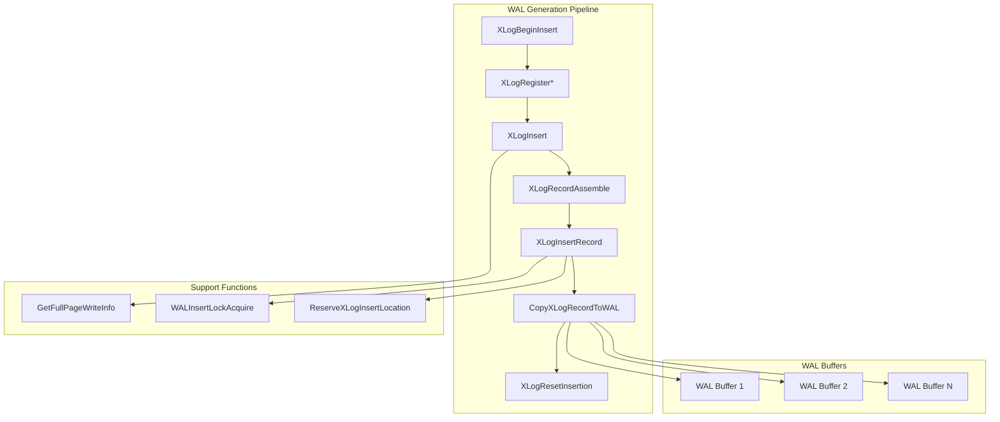
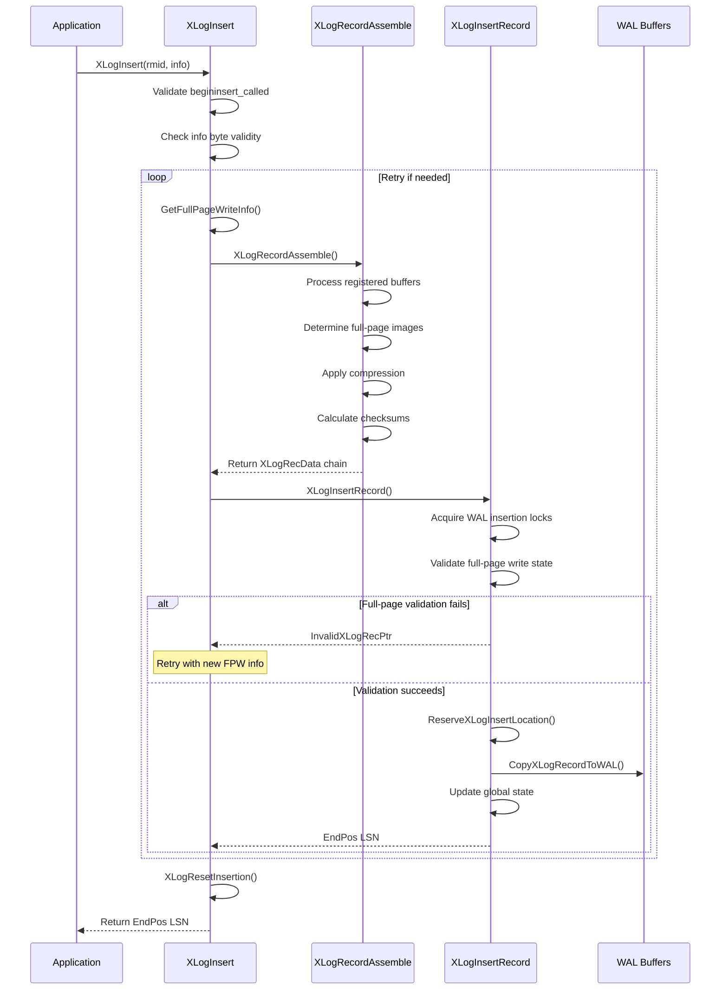

# WAL Generation Component

## Overview
The WAL Generation component is responsible for constructing and inserting Write-Ahead Log records into PostgreSQL's transaction log. This component ensures that all database modifications are logged before the actual data changes are written to disk, implementing the fundamental WAL principle: "write the log before the data."

The component consists of three primary functions that work together in a pipeline: `XLogInsert` (high-level interface), `XLogInsertRecord` (core insertion logic), and `XLogRecordAssemble` (record construction). This design provides a clear separation between record preparation and physical insertion into the WAL buffers.

## Key Concepts
- **WAL Record Construction**: Building complete records from registered data and buffer references
- **Full-Page Writes**: Including complete page images when necessary for crash recovery
- **Transaction Integration**: Coordinating with PostgreSQL's transaction system
- **Concurrency Control**: Managing concurrent WAL insertions through insertion locks
- **Space Reservation**: Allocating space in WAL buffers before copying data

## Architecture



## Core APIs

### XLogInsert

#### Purpose
XLogInsert is the primary function that finalizes and inserts a constructed WAL record into the Write-Ahead Log, returning the LSN for the inserted record. This function serves as the main entry point for WAL record insertion across the entire PostgreSQL system.

#### Signature
```c
XLogRecPtr XLogInsert(RmgrId rmid, uint8 info)
```

#### Detailed Description
XLogInsert coordinates the final stages of WAL record insertion by taking all data and buffer references registered through previous `XLogRegister*` calls and creating a complete WAL record. The function performs critical validation, handles bootstrap mode specially, determines full-page write requirements, assembles the complete record, and manages the insertion process including retries if conditions change.

The function implements a retry mechanism for cases where full-page write requirements change between record assembly and insertion. This can occur when checkpoints advance the RedoRecPtr or when backup processes modify the full-page write state.

#### Parameters
| Parameter | Type | Description | Constraints |
|-----------|------|-------------|-------------|
| rmid | RmgrId | Resource Manager ID identifying the subsystem | Valid resource manager (e.g., RM_HEAP_ID, RM_BTREE_ID) |
| info | uint8 | Operation-specific flags and information | Limited to XLR_RMGR_INFO_MASK, XLR_SPECIAL_REL_UPDATE, XLR_CHECK_CONSISTENCY |

#### Return Value
Returns an `XLogRecPtr` representing the end position of the inserted record (beginning of the next record). This LSN serves as the durability guarantee - it must be flushed to disk before any affected data pages can be written. Returns `InvalidXLogRecPtr` on failure (handled internally via retry).

#### Error Handling
- **Validation Error**: If `XLogBeginInsert()` was not called
- **Invalid Info Mask**: If reserved info bits are set by caller
- **Bootstrap Handling**: Returns dummy LSN for non-XLOG records in bootstrap mode
- **Retry Logic**: Automatically retries if insertion fails due to changing conditions

#### Integration Points
- **Called by**: All subsystems performing logged operations (heap_insert, btree operations, transaction commits)
- **Calls**: `GetFullPageWriteInfo`, `XLogRecordAssemble`, `XLogInsertRecord`, `XLogResetInsertion`
- **Shared state**: Modifies WAL insertion state, updates global LSN tracking

### XLogInsertRecord

#### Purpose
XLogInsertRecord is the core low-level function responsible for physically inserting pre-constructed XLOG records into the WAL, implementing the fundamental insertion mechanism with proper locking and space reservation.

#### Signature
```c
XLogRecPtr XLogInsertRecord(XLogRecData *rdata, XLogRecPtr fpw_lsn,
                           uint8 flags, int num_fpi, bool topxid_included)
```

#### Detailed Description
This function implements the sophisticated two-phase WAL insertion process: space reservation followed by data copying. It handles three distinct insertion classes with different locking requirements:

1. **Normal Records**: Standard single-lock insertion for most WAL records
2. **XLOG_SWITCH Records**: Exclusive locking to claim remaining segment space
3. **Checkpoint Records**: Exclusive locking with RedoRecPtr updates

The function includes critical validation for full-page writes and may return `InvalidXLogRecPtr` to signal that the caller must recalculate full-page write requirements and retry.

#### Parameters
| Parameter | Type | Description | Constraints |
|-----------|------|-------------|-------------|
| rdata | XLogRecData* | Chain of data chunks forming the complete record | First chunk must contain properly formatted record header |
| fpw_lsn | XLogRecPtr | Oldest LSN among affected pages without full-page images | Used for full-page write validation |
| flags | uint8 | Control flags for record insertion | See XLogSetRecordFlags for valid values |
| num_fpi | int | Number of full-page images in the record | Non-negative integer |
| topxid_included | bool | Whether top-transaction ID is logged | Boolean flag |

#### Return Value
Returns `XLogRecPtr` to the end of the inserted record, usable as LSN for affected data pages. Returns `InvalidXLogRecPtr` if full-page write requirements changed and caller must retry.

#### Error Handling
- **Recovery Mode Check**: Prevents WAL insertion during recovery
- **Full-Page Write Validation**: Returns InvalidXLogRecPtr if fpw_lsn validation fails
- **Space Reservation**: Handles segment boundary crossings and space exhaustion
- **Critical Section**: Ensures atomicity of the insertion process

#### Integration Points
- **Called by**: `XLogInsert` (primary pathway)
- **Calls**: `WALInsertLockAcquire`, `ReserveXLogInsertLocation`, `CopyXLogRecordToWAL`
- **Shared state**: Updates `ProcLastRecPtr`, `XactLastRecEnd`, WAL usage statistics

### XLogRecordAssemble

#### Purpose
XLogRecordAssemble constructs a complete WAL record from all registered data and buffer references, preparing it for insertion into the WAL. This function handles the complex process of combining record headers, full-page images, metadata, and main data into a coherent WAL record structure.

#### Signature
```c
static XLogRecData *XLogRecordAssemble(RmgrId rmid, uint8 info,
                                       XLogRecPtr RedoRecPtr, bool doPageWrites,
                                       XLogRecPtr *fpw_lsn, int *num_fpi,
                                       bool *topxid_included)
```

#### Detailed Description
This internal function assembles all components of a WAL record into a linked list of `XLogRecData` structures. The assembly process includes:

1. **Header Construction**: Creates the basic WAL record header with rmid and info
2. **Buffer Processing**: Determines which registered buffers need full-page images
3. **Compression**: Applies WAL compression (PGLZ, LZ4, or ZSTD) when enabled
4. **Metadata Inclusion**: Adds replication origin and transaction ID when needed
5. **Checksum Calculation**: Computes CRC32C for data integrity
6. **Size Validation**: Enforces record size limits

The function supports being called multiple times for the same record and handles this scenario correctly by maintaining appropriate state.

#### Parameters
| Parameter | Type | Description | Constraints |
|-----------|------|-------------|-------------|
| rmid | RmgrId | Resource Manager ID for the record | Valid resource manager identifier |
| info | uint8 | Info byte with operation flags | Operation-specific flags and consistency bits |
| RedoRecPtr | XLogRecPtr | Current redo pointer for FPW decisions | Valid LSN for comparison |
| doPageWrites | bool | Whether full-page writes are enabled | Boolean flag |
| fpw_lsn | XLogRecPtr* | Output: lowest LSN needing full-page images | Pointer to output variable |
| num_fpi | int* | Output: count of full-page images included | Pointer to output variable |
| topxid_included | bool* | Output: whether top-level XID was logged | Pointer to output variable |

#### Return Value
Returns a pointer to the head of an `XLogRecData` chain representing the complete WAL record, ready for insertion. The chain includes properly ordered header, block references, metadata, and data chunks.

#### Error Handling
- **Size Validation**: Enforces `XLogRecordMaxSize` limits
- **Compression Errors**: Handles compression failures gracefully
- **Memory Allocation**: Uses appropriate memory contexts for temporary allocations

#### Integration Points
- **Called by**: `XLogInsert` (during record finalization)
- **Calls**: `PageGetLSN`, `XLogCompressBackupBlock`, `GetTopTransactionIdIfAny`
- **Shared state**: Reads from registered buffer and data state

## Data Structures

### XLogRecData
The `XLogRecData` structure represents a single chunk of data in a WAL record chain:

```c
typedef struct XLogRecData
{
    char       *data;    /* Start of data chunk */
    uint32      len;     /* Length of data chunk */
    Buffer      buffer;  /* Buffer reference (if applicable) */
    struct XLogRecData *next; /* Next chunk in chain */
} XLogRecData;
```

**Key Fields**:
- `data`: Pointer to the actual data bytes
- `len`: Length of this data chunk
- `buffer`: Buffer reference for buffer-backed data
- `next`: Linked list pointer to next chunk

### XLogRecord Header
The WAL record header structure defines the format of every WAL record:

```c
typedef struct XLogRecord
{
    uint32      xl_tot_len;    /* Total length of record */
    TransactionId xl_xid;      /* Transaction ID */
    XLogRecPtr  xl_prev;       /* Previous record's end position */
    uint8       xl_info;       /* Info flags */
    RmgrId      xl_rmid;       /* Resource manager ID */
    pg_crc32c   xl_crc;        /* CRC32C checksum */
} XLogRecord;
```

## Processing Flow



## Implementation Notes

### Concurrency Considerations
The WAL generation component uses a sophisticated locking scheme to ensure safe concurrent access:

- **WAL Insertion Locks**: Limited number of locks (NUM_XLOGINSERT_LOCKS) that protect concurrent insertions
- **Critical Sections**: Used during the insertion process to ensure atomicity
- **Lock Progression**: Insertion locks track progress to allow buffer flushing
- **Exclusive Modes**: Special records (XLOG_SWITCH, checkpoint) require exclusive access

### Performance Optimizations
Several optimizations are implemented to maximize WAL insertion throughput:

1. **Group Commit**: Multiple transactions can share WAL flushes
2. **Lock Partitioning**: Multiple insertion locks allow parallel insertions
3. **Buffer Pre-allocation**: WAL writer pre-initializes buffers
4. **Compression**: Reduces WAL volume when enabled
5. **Page Hole Optimization**: Skips unused portions of pages in full-page images

### Error Recovery
The component includes robust error handling:

- **Retry Mechanism**: Automatic retry when full-page write conditions change
- **Validation Checks**: Extensive validation of record structure and state
- **Bootstrap Mode**: Special handling during database initialization
- **Critical Section Protection**: Ensures consistent state during failures

### Memory Management
Careful memory management ensures efficient operation:

- **Temporary Allocations**: Uses appropriate memory contexts
- **State Cleanup**: `XLogResetInsertion()` cleans up after each record
- **Buffer Management**: Efficient handling of registered buffer references
- **Compression Buffers**: Managed allocation for compression operations