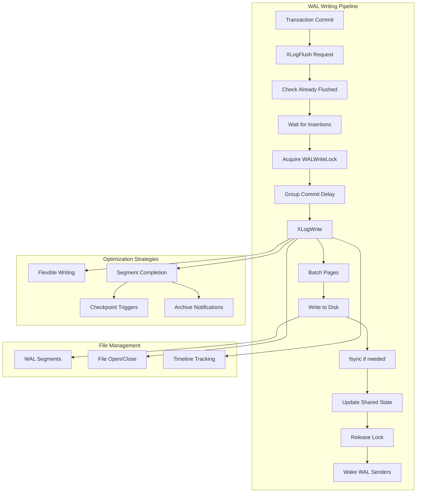
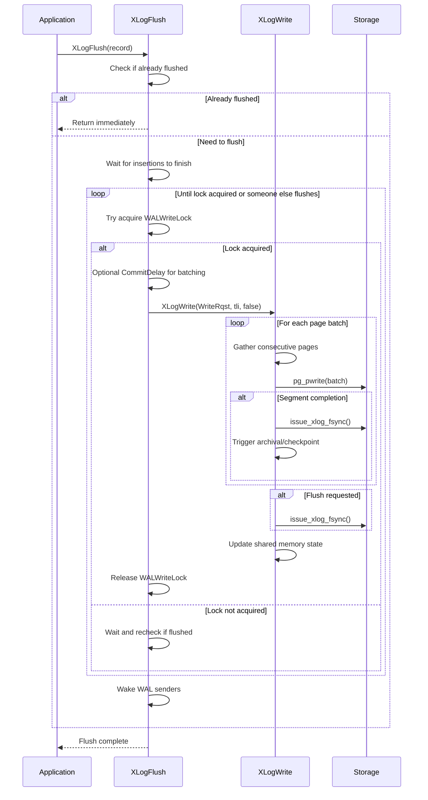

# WAL Writing Component

## Overview
The WAL Writing component is responsible for efficiently transferring Write-Ahead Log data from shared memory buffers to persistent disk storage. This component ensures data durability by implementing sophisticated flushing strategies, optimized I/O patterns, and group commit mechanisms that balance performance with ACID compliance requirements.

The component consists of two primary functions: `XLogWrite` (low-level disk writing) and `XLogFlush` (durability guarantee interface). Together, they implement PostgreSQL's fundamental durability principle while providing optimizations that maximize throughput under high transaction loads.

## Key Concepts
- **Write vs Flush**: Writing moves data to OS buffers; flushing ensures data reaches persistent storage
- **Group Commit**: Batching multiple transaction commits to amortize fsync costs
- **Page Batching**: Combining consecutive WAL pages to minimize system calls
- **Timeline Management**: Handling WAL data across different database timelines
- **Critical Sections**: Ensuring atomicity during write operations

## Architecture



## Core APIs

### XLogFlush

#### Purpose
XLogFlush ensures that all WAL data through a specified LSN position is flushed to disk, implementing group commit optimization and handling both normal operation and recovery scenarios. This function provides the durability guarantee required for ACID compliance.

#### Signature
```c
void XLogFlush(XLogRecPtr record)
```

#### Detailed Description
XLogFlush is the primary interface for ensuring WAL durability. It implements several sophisticated strategies to balance performance and correctness:

1. **Recovery Mode Handling**: During recovery, updates minimum recovery point instead of attempting actual flush operations
2. **Quick Exit Optimization**: Returns immediately if the requested LSN is already flushed
3. **Group Commit Implementation**: Uses CommitDelay to batch multiple transactions together
4. **Opportunistic Batching**: Attempts to flush additional data beyond the requested position
5. **Lock Contention Management**: Uses LWLockAcquireOrWait to avoid blocking when others are flushing
6. **Corruption Resilience**: Handles corrupted LSNs gracefully rather than causing system panic

The function includes a retry loop that checks if other processes have already completed the required flush, reducing redundant work and improving concurrency.

#### Parameters
| Parameter | Type | Description | Constraints |
|-----------|------|-------------|-------------|
| record | XLogRecPtr | LSN position that must be flushed to disk | Valid LSN within current WAL |

#### Return Value
This function returns void but ensures that all WAL data through the specified LSN is durably committed to disk before returning.

#### Error Handling
- **Recovery Mode**: Updates minimum recovery point instead of flushing
- **Corrupted LSN**: Reports ERROR rather than PANIC for robustness
- **Flush Validation**: Verifies that the requested position was actually flushed
- **Critical Section**: Protects against concurrent modifications during flush

#### Integration Points
- **Called by**: Transaction commit (`RecordTransactionCommit`), checkpoint (`CreateCheckPoint`), buffer manager (`FlushBuffer`)
- **Calls**: `XLogWrite`, `WaitXLogInsertionsToFinish`, `UpdateMinRecoveryPoint`
- **Shared state**: Updates `LogwrtResult`, coordinates with WAL insertion processes

### XLogWrite

#### Purpose
XLogWrite is the core function responsible for writing WAL data from memory buffers to disk files, with optional fsync operations, segment management, and checkpoint triggering. This function implements the low-level mechanics of WAL persistence.

#### Signature
```c
static void XLogWrite(XLogwrtRqst WriteRqst, TimeLineID tli, bool flexible)
```

#### Detailed Description
XLogWrite implements sophisticated buffering and batching strategies to maximize I/O efficiency:

1. **Page Batching**: Gathers consecutive WAL pages to minimize system calls
2. **Segment Management**: Handles WAL file transitions and creation automatically
3. **Flexible Writing**: Can stop at convenient boundaries to reduce redundant work
4. **I/O Timing**: Tracks write performance for monitoring and optimization
5. **Error Handling**: PANICs on write failures to ensure data consistency
6. **Housekeeping**: Triggers archival, checkpoints, and WAL sender notifications

The function must be called with WALWriteLock held and operates within critical sections to ensure atomicity. It includes extensive validation to prevent writing beyond initialized buffer areas.

#### Parameters
| Parameter | Type | Description | Constraints |
|-----------|------|-------------|-------------|
| WriteRqst | XLogwrtRqst | Specifies Write and Flush positions to achieve | Valid LSN positions within WAL |
| tli | TimeLineID | Timeline ID for the WAL data being written | Current valid timeline |
| flexible | bool | Allows stopping at convenient boundaries | Performance optimization flag |

#### Return Value
This function returns void but updates global `LogwrtResult` to reflect the actual positions written and flushed.

#### Error Handling
- **Write Failures**: PANICs to ensure database consistency
- **Boundary Validation**: Prevents writing beyond initialized areas
- **Interrupt Handling**: Retries on EINTR from system calls
- **File Management**: Handles segment transitions and file creation errors

#### Integration Points
- **Called by**: `XLogFlush`, `XLogBackgroundFlush`, WAL writer process
- **Calls**: `pg_pwrite`, `issue_xlog_fsync`, `XLogFileInit`, `XLogArchiveNotifySeg`
- **Shared state**: Updates `LogwrtResult`, `XLogCtl` shared memory structures

## Data Structures

### XLogwrtRqst
Structure defining write and flush request positions:

```c
typedef struct XLogwrtRqst
{
    XLogRecPtr  Write;    /* Last byte written to disk */
    XLogRecPtr  Flush;    /* Last byte flushed to disk */
} XLogwrtRqst;
```

**Key Fields**:
- `Write`: Position up to which data should be written to OS buffers
- `Flush`: Position up to which data should be flushed to disk

### XLogwrtResult
Structure tracking actual write and flush completion:

```c
typedef struct XLogwrtResult
{
    XLogRecPtr  Write;    /* Last byte written */
    XLogRecPtr  Flush;    /* Last byte flushed */
} XLogwrtResult;
```

**Key Fields**:
- `Write`: Actual position written to OS buffers
- `Flush`: Actual position flushed to persistent storage

## Processing Flow



## Implementation Notes

### Group Commit Optimization
The component implements sophisticated group commit to improve throughput:

1. **CommitDelay**: Configurable delay allowing more transactions to join the group
2. **CommitSiblings**: Minimum number of active backends required for delay
3. **Opportunistic Batching**: Flushes additional data beyond minimum requirements
4. **Lock Coordination**: Uses LWLockAcquireOrWait to avoid unnecessary blocking

### I/O Efficiency Strategies
Several optimizations minimize disk I/O overhead:

1. **Page Batching**: Combines consecutive pages into single write operations
2. **Flexible Writing**: Stops at convenient boundaries to avoid redundant partial writes
3. **Segment Completion**: Immediate fsync when completing WAL segments
4. **Write Coalescing**: Gathers multiple page writes before issuing system calls

### File Management
Sophisticated file management handles WAL segment lifecycle:

1. **Automatic Transitions**: Seamless handling of segment boundaries
2. **File Pre-creation**: WAL writer pre-creates segments to avoid delays
3. **Timeline Tracking**: Proper handling of multiple database timelines
4. **Error Recovery**: Robust error handling during file operations

### Concurrency Control
The component carefully manages concurrent access:

1. **WALWriteLock**: Serializes write operations while allowing concurrent insertions
2. **Critical Sections**: Ensures atomicity during state updates
3. **Memory Barriers**: Proper ordering of shared memory updates
4. **Lock Progression**: Insertion locks track progress for buffer management

### Performance Monitoring
Built-in instrumentation supports performance analysis:

1. **I/O Timing**: Tracks time spent in write and fsync operations
2. **Wait Events**: Reports specific wait conditions for monitoring
3. **Statistics**: Counts of write operations and bytes transferred
4. **Checkpoint Triggers**: Monitors WAL consumption for checkpoint decisions

### Error Handling Strategies
Robust error handling ensures system reliability:

1. **Write Failure PANICs**: Ensures consistency by stopping on I/O errors
2. **Corrupted LSN Handling**: Reports errors rather than crashing for robustness
3. **Interrupt Resilience**: Retries operations interrupted by signals
4. **Recovery Mode Support**: Different behavior during database recovery

### Archive Integration
The component coordinates with WAL archiving:

1. **Segment Notifications**: Alerts archiver when segments are complete
2. **Timeline Coordination**: Proper archival across timeline switches
3. **Timing Updates**: Tracks segment switch timing for archive_timeout
4. **Checkpoint Integration**: Coordinates with checkpoint requests based on WAL volume