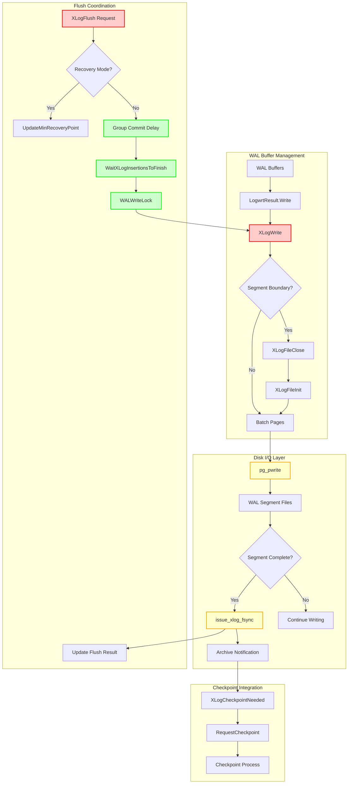
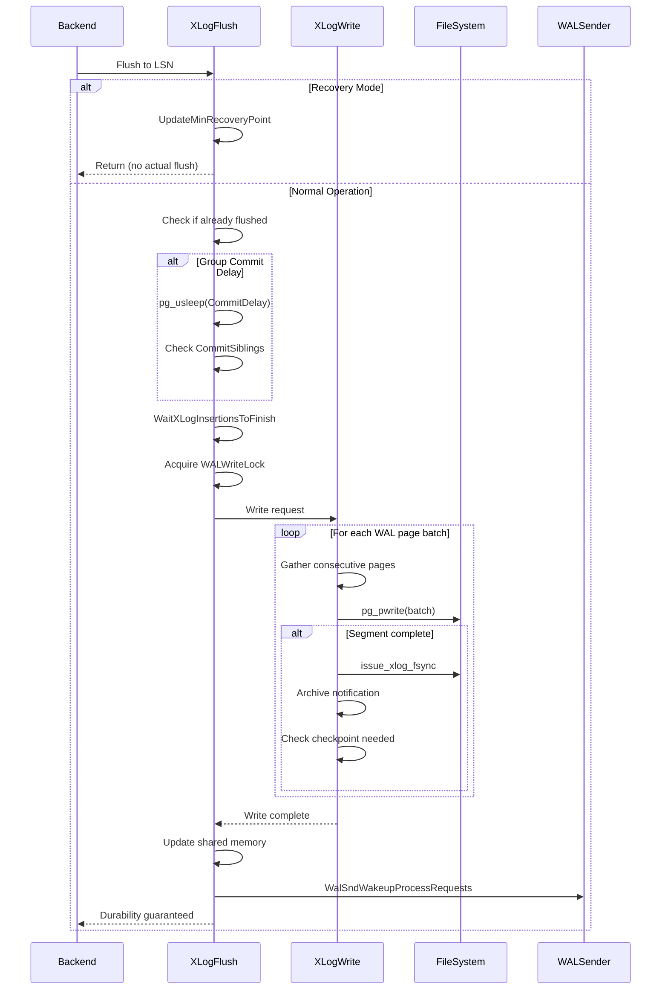

# WAL Writing Component

## Overview

The WAL Writing component is responsible for persisting WAL data from shared memory buffers to disk storage, ensuring data durability and implementing PostgreSQL's core ACID guarantees. This component bridges the gap between in-memory WAL generation and permanent storage, providing the foundation for crash recovery and replication.

## Key Concepts

- **Write-Ahead Logging**: Ensures log records reach disk before corresponding data pages
- **Group Commit**: Batches multiple transaction flush requests to improve throughput
- **WAL Segments**: Fixed-size files (typically 16MB) that store sequential WAL records
- **Durability Guarantees**: LSN-based coordination ensures proper ordering of writes and flushes
- **Timeline Management**: Handles WAL writing across different database timelines

## Architecture



## Core APIs

### XLogWrite

#### Purpose
XLogWrite is the core function responsible for writing WAL data from memory buffers to disk files, with optional fsync operations, segment management, and checkpoint triggering. It serves as the central mechanism for persisting WAL data.

#### Signature
```c
static void XLogWrite(XLogwrtRqst WriteRqst, TimeLineID tli, bool flexible)
```

#### Detailed Description
XLogWrite implements sophisticated batching logic to efficiently transfer WAL data from shared memory buffers to persistent storage. The function operates under strict concurrency control and handles multiple complex scenarios including segment boundaries, file management, and system coordination.

**Core Processing Flow:**
1. **Buffer Analysis**: Examines WAL buffers to identify consecutive pages for batch writing
2. **Segment Management**: Handles transitions between WAL segment files, creating new segments as needed
3. **Batch Writing**: Groups consecutive pages to minimize system calls and improve I/O efficiency
4. **Synchronization**: Performs immediate fsync for completed segments to optimize performance
5. **Housekeeping**: Triggers archive notifications, checkpoint requests, and replication coordination

**Optimization Strategies:**
- **Page Batching**: Consecutive WAL pages are gathered and written in single system calls
- **Flexible Writing**: Optional early termination to avoid unnecessary partial writes
- **Segment Completion**: Immediate fsync of completed segments reduces future sync overhead
- **Memory Barriers**: Proper ordering of shared memory updates for concurrent readers

#### Parameters
| Parameter | Type | Description | Constraints |
|-----------|------|-------------|-------------|
| WriteRqst | XLogwrtRqst | Specifies Write and Flush positions to achieve | Must be validated by caller |
| tli | TimeLineID | Timeline for WAL writing operations | Must match current timeline |
| flexible | bool | Allows stopping at convenient boundaries | Optimization for reducing multiple writes |

#### Return Value
Void function that updates global LogwrtResult state. Modifies shared memory atomically to reflect write and flush progress.

#### Error Handling
- **Write Failures**: PANIC on any write errors (system integrity critical)
- **Segment Boundary Validation**: Ensures proper segment file transitions
- **Critical Section Protection**: Must be called within critical section with proper locks
- **Buffer Validation**: PANICs if write requests exceed initialized buffer boundaries

#### Integration Points
- **Called by**: XLogFlush, XLogBackgroundFlush, AdvanceXLInsertBuffer
- **Calls**: XLogFileOpen/Close/Init, pg_pwrite, issue_xlog_fsync, RequestCheckpoint
- **Shared state**: Updates LogwrtResult, XLogCtl shared memory, file descriptors
- **Prerequisites**: Must hold WALWriteLock, WaitXLogInsertionsToFinish called

### XLogFlush

#### Purpose
XLogFlush ensures that all WAL data through a specified LSN is flushed to disk, implementing group commit optimization and handling both normal operation and recovery scenarios. It provides the durability guarantee for database transactions.

#### Signature
```c
void XLogFlush(XLogRecPtr record)
```

#### Detailed Description
XLogFlush is a sophisticated function that coordinates WAL durability across the entire system. It implements several critical optimizations while maintaining strict durability guarantees:

**Group Commit Implementation:**
- Uses CommitDelay parameter to batch multiple flush requests
- Checks CommitSiblings to determine if batching is beneficial
- Implements opportunistic flushing beyond requested LSN
- Reduces overall I/O load through intelligent batching

**Concurrency Optimization:**
- Uses LWLockAcquireOrWait to avoid blocking when other processes are already flushing
- Implements wait-free fast path when flush is already complete
- Coordinates with ongoing WAL insertions through WaitXLogInsertionsToFinish

**Recovery Mode Handling:**
- During recovery, updates minimum recovery point instead of flushing
- Ensures proper crash recovery semantics in standby configurations
- Handles timeline transitions correctly

#### Parameters
| Parameter | Type | Description | Constraints |
|-----------|------|-------------|-------------|
| record | XLogRecPtr | LSN that must be flushed to disk | Must be valid LSN, handles corruption gracefully |

#### Return Value
Void function that guarantees specified LSN is durable on function return. No return value needed as durability is the contract.

#### Error Handling
- **Corrupted LSNs**: Handles gracefully rather than panicking (data page corruption scenarios)
- **Recovery Mode**: Different behavior during recovery vs normal operation
- **Lock Contention**: Uses timeout-based lock acquisition to avoid indefinite blocking
- **Timeline Validation**: Ensures flush operations target correct timeline

#### Integration Points
- **Called by**: RecordTransactionCommit, CreateCheckPoint, FlushBuffer, replication functions
- **Calls**: UpdateMinRecoveryPoint, XLogWrite, WaitXLogInsertionsToFinish, WalSndWakeupProcessRequests
- **Shared state**: Reads/updates LogwrtResult, coordinates with insertion processes
- **Synchronization**: Critical section protection, lock coordination, memory barriers

## Data Structures

### XLogwrtRqst
Request structure for write operations:

```c
typedef struct XLogwrtRqst
{
    XLogRecPtr  Write;      /* last byte + 1 to write out */
    XLogRecPtr  Flush;      /* last byte + 1 to flush */
} XLogwrtRqst;
```

### XLogwrtResult
Result tracking for write operations:

```c
typedef struct XLogwrtResult
{
    XLogRecPtr  Write;      /* last byte + 1 written out */
    XLogRecPtr  Flush;      /* last byte + 1 flushed */
} XLogwrtResult;
```

## Processing Flow



## Implementation Notes

### Page Batching Strategy
XLogWrite implements sophisticated batching to optimize I/O performance:

- **Consecutive Page Detection**: Analyzes WAL buffer layout to identify sequential pages
- **Single System Call**: Multiple pages written in one pg_pwrite operation
- **Segment Boundary Handling**: Batches are split at segment boundaries for proper file management
- **Flexible Mode**: Optional early termination to avoid inefficient partial writes

### Group Commit Optimization
XLogFlush provides configurable group commit behavior:

```c
// Example configuration impact
if (CommitDelay > 0 && CountActiveBackends() >= CommitSiblings)
{
    pg_usleep(CommitDelay);
    // Allow more transactions to join the group
}
```

- **CommitDelay**: Microsecond delay to allow batching (0-100000)
- **CommitSiblings**: Minimum active backends to trigger delay (1-1000)
- **Throughput vs Latency**: Tunable tradeoff between response time and system throughput

### File Management
WAL segment file handling includes:

- **Segment Creation**: Automatic creation of new 16MB segment files
- **File Descriptor Management**: Proper cleanup and reservation
- **Timeline Handling**: Correct file naming across timeline switches
- **Archive Coordination**: Notifications when segments are ready for archival

### Memory Barriers and Atomicity
Critical synchronization requirements:

```c
// Write ordering for concurrent readers
pg_atomic_write_u64(&XLogCtl->logWriteResult, LogwrtResult.Write);
pg_write_barrier();
pg_atomic_write_u64(&XLogCtl->logFlushResult, LogwrtResult.Flush);
```

- **Write-before-Flush**: Ensures write position never trails flush position
- **Atomic Updates**: Prevents intermediate states visible to concurrent readers
- **Memory Barriers**: Proper ordering for multi-core visibility

### Performance Characteristics

#### Throughput Optimizations
- **Batch Writing**: Reduces system call overhead by 10-100x in high-throughput scenarios
- **Group Commit**: Can improve transaction throughput by 2-5x under load
- **Segment Fsync**: Proactive syncing reduces checkpoint overhead
- **Lock Minimization**: Careful lock scoping reduces contention

#### I/O Patterns
- **Sequential Writes**: WAL structure ensures optimal disk utilization
- **Fsync Coordination**: Strategic sync points minimize total I/O wait time
- **Archive Integration**: Overlaps archival with ongoing operations

#### Scalability Factors
- **Multiple WAL Buffers**: Supports concurrent insertion while writing
- **Timeline Support**: Handles complex replication topologies
- **Background Writing**: Can operate independently of backend processes