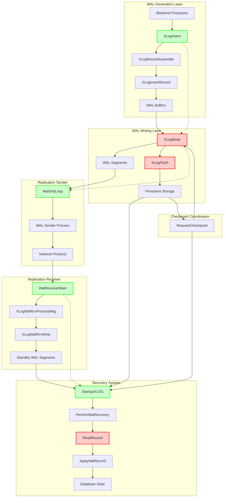
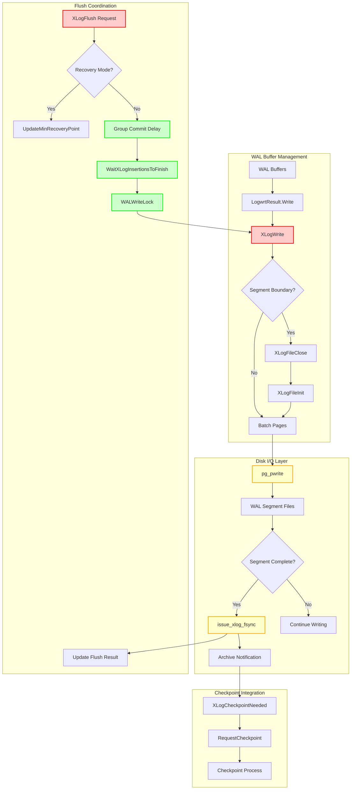
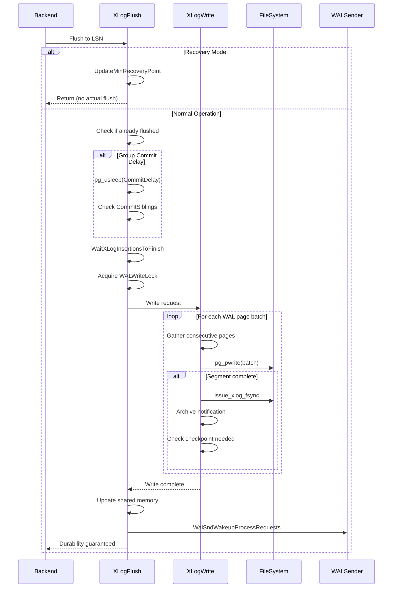
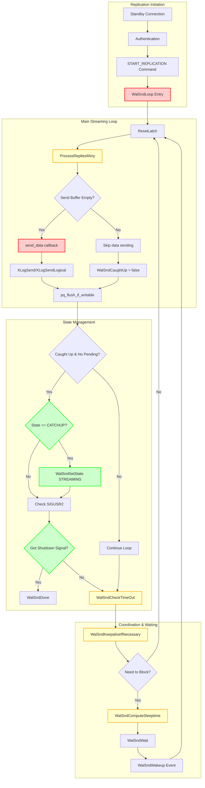
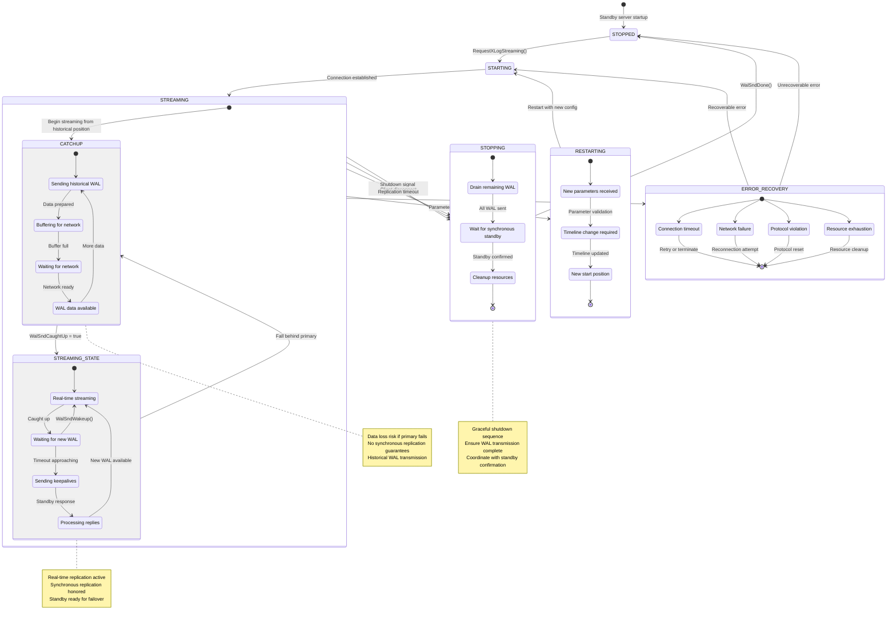
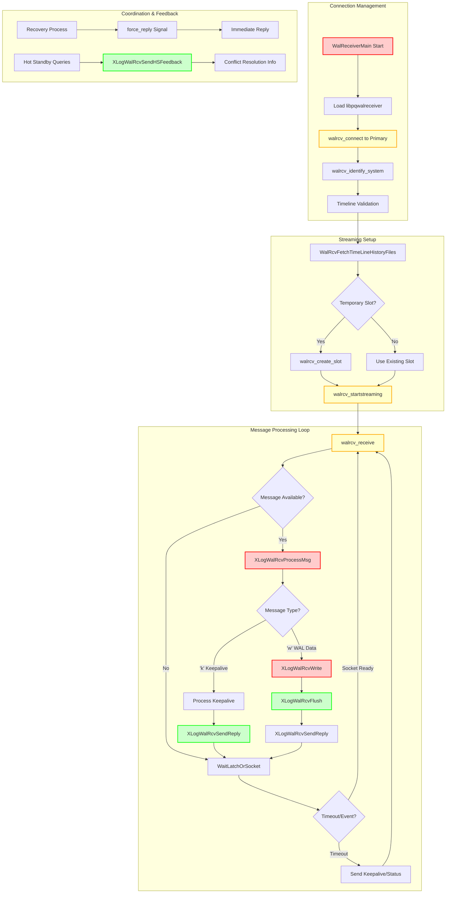
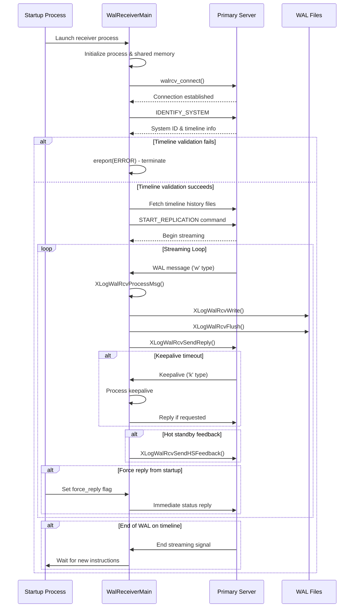
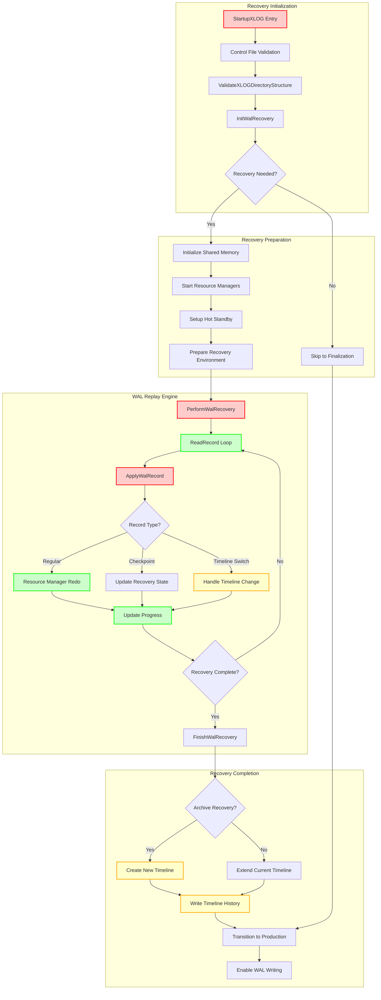

# PostgreSQL Write-Ahead Logging (WAL) Subsystem
## Complete Technical Documentation

---

## Table of Contents

### [Executive Summary](#executive-summary)
### [Quick Start Guide](#quick-start-guide)
### [Architecture Overview](#architecture-overview)
### [Core Components](#core-components)
- [1. WAL Generation Component](#1-wal-generation-component)
- [2. WAL Writing Component](#2-wal-writing-component)
- [3. Replication Sender Component](#3-replication-sender-component)
- [4. Replication Receiver Component](#4-replication-receiver-component)
- [5. WAL Recovery Component](#5-wal-recovery-component)
### [Deep Dives](#deep-dives)
### [Appendices](#appendices)

---

## Executive Summary

The PostgreSQL Write-Ahead Logging (WAL) subsystem is the foundation of PostgreSQL's ACID compliance, providing durability guarantees, crash recovery, and enabling high availability through streaming replication. WAL implements the fundamental principle: **"write the log before the data"** - ensuring that all changes are recorded in a sequential log before being applied to data pages.

### Key Architectural Decisions

1. **Sequential Write Design**: WAL uses sequential writes to minimize disk I/O latency and maximize throughput
2. **Group Commit Optimization**: Multiple transactions can be committed with a single fsync operation
3. **Pluggable Replication**: Support for both physical (byte-exact) and logical (row-level) replication
4. **Timeline Management**: Sophisticated handling of recovery scenarios and point-in-time recovery (PITR)
5. **Resource Manager Architecture**: Extensible system allowing each PostgreSQL subsystem to define its own WAL record formats

### Performance Characteristics

- **Write Throughput**: Optimized for high-volume transaction processing with minimal lock contention
- **Recovery Speed**: Efficient replay mechanisms with prefetching and parallel processing capabilities
- **Replication Latency**: Sub-millisecond replication delays possible with synchronous replication
- **Storage Efficiency**: Advanced compression and full-page write optimization reduce storage overhead

### Critical Success Factors

The WAL subsystem successfully balances three competing requirements:
- **Durability**: Guarantees that committed transactions survive system failures
- **Performance**: Maintains high throughput under heavy transactional loads
- **Availability**: Enables zero-downtime failover and cascading replication topologies

---

## Quick Start Guide

### Most Common Use Cases

#### 1. **Transaction Durability** (Every Application)
```sql
BEGIN;
INSERT INTO orders (customer_id, amount) VALUES (123, 99.99);
COMMIT;  -- WAL ensures this survives crashes
```
**WAL Flow**: `XLogInsert` → `XLogFlush` → Durability guaranteed

#### 2. **Streaming Replication Setup**
```postgresql.conf
# Primary server
wal_level = replica
max_wal_senders = 10
```
```bash
# Standby server
pg_basebackup -h primary -D /data -U replicator -W
```
**WAL Flow**: `WalSndLoop` → Network → `WalReceiverMain` → `ApplyWalRecord`

#### 3. **Point-in-Time Recovery (PITR)**
```postgresql.conf
archive_mode = on
archive_command = 'cp %p /backup/wal/%f'
```
```bash
# Recovery
restore_command = 'cp /backup/wal/%f %p'
recovery_target_time = '2024-01-15 14:30:00'
```
**WAL Flow**: `StartupXLOG` → `PerformWalRecovery` → Recovery target

### Essential Concepts

- **LSN (Log Sequence Number)**: Unique identifier for every WAL record position
- **Checkpoint**: Periodic sync of all dirty buffers, establishing recovery starting points
- **Full-Page Writes**: Complete page images included after checkpoints to handle torn pages
- **Resource Managers**: Subsystem-specific WAL record handlers (heap, btree, hash, etc.)

### Reading Roadmap

- **New to WAL**: Start with [Architecture Overview](#architecture-overview), then [WAL Generation](#1-wal-generation-component)
- **Replication Focus**: Jump to [Replication Sender](#3-replication-sender-component) and [Receiver](#4-replication-receiver-component)
- **Recovery Scenarios**: Begin with [WAL Recovery Component](#5-wal-recovery-component)
- **Performance Tuning**: Review [Deep Dives](#deep-dives) section
- **API Integration**: Use [Symbol Index](#symbol-index) for specific function details

---

## Architecture Overview

The WAL subsystem consists of five major components working in concert to provide comprehensive write-ahead logging functionality:



### System-Wide Perspective

#### Data Flow Overview

1. **Generation**: Backend processes create WAL records via [`XLogInsert`](#xloginsert)
2. **Buffering**: Records assembled and stored in shared memory WAL buffers
3. **Writing**: [`XLogWrite`](#xlogwrite) persists data to WAL segment files
4. **Flushing**: [`XLogFlush`](#xlogflush) ensures durability through fsync operations
5. **Replication**: [`WalSndLoop`](#walsndloop) streams data to standby servers
6. **Reception**: [`WalReceiverMain`](#walreceivermain) receives and writes WAL on standbys
7. **Recovery**: [`StartupXLOG`](#startupxlog) replays WAL during startup and recovery

#### Component Responsibilities

| Component | Primary Responsibility | Key Functions |
|-----------|----------------------|---------------|
| **WAL Generation** | Record construction and insertion | `XLogInsert`, `XLogRecordAssemble` |
| **WAL Writing** | Buffer-to-disk persistence | `XLogWrite`, `XLogFlush` |
| **Replication Sender** | Primary-to-standby streaming | `WalSndLoop`, `WalSndWakeup` |
| **Replication Receiver** | Standby WAL reception | `WalReceiverMain`, `XLogWalRcvProcessMsg` |
| **WAL Recovery** | Startup and crash recovery | `StartupXLOG`, `PerformWalRecovery` |

---

## Core Components

## 1. WAL Generation Component

The WAL Generation component is responsible for constructing, assembling, and inserting Write-Ahead Log records into the WAL buffer. This is the entry point for all database operations that need to be logged for durability and replication. The component implements PostgreSQL's fundamental WAL principle: "write the log before the data".

### Key Concepts

- **WAL Record Construction**: Multi-phase process of building complete WAL records from registered data and buffer references
- **Full-Page Writes (FPW)**: Complete page images included in WAL records to ensure crash consistency
- **Resource Managers**: Subsystem-specific handlers that define WAL record formats and replay logic
- **LSN (Log Sequence Number)**: Unique identifier for each WAL record position, used for ordering and durability guarantees

### Record Construction Flow

```mermaid
sequenceDiagram
    participant Backend as Backend Process
    participant XLogBegin as XLogBeginInsert
    participant XLogReg as XLogRegister*
    participant XLogIns as XLogInsert
    participant XLogAssemble as XLogRecordAssemble
    participant XLogInsRec as XLogInsertRecord
    participant WALBuffer as WAL Buffer

    Backend->>XLogBegin: XLogBeginInsert()
    Note over XLogBegin: Initialize insertion state
    XLogBegin->>XLogBegin: Clear registered data
    XLogBegin->>XLogBegin: Set begininsert_called = true

    Backend->>XLogReg: XLogRegisterData(data, len)
    Note over XLogReg: Register main record data
    XLogReg->>XLogReg: Add to rdata chain

    Backend->>XLogReg: XLogRegisterBuffer(buffer, flags)
    Note over XLogReg: Register buffer references
    XLogReg->>XLogReg: Add to registered_buffers[]
    XLogReg->>XLogReg: Set buffer flags and LSN

    Backend->>XLogIns: XLogInsert(rmid, info)
    Note over XLogIns: Begin insertion process

    XLogIns->>XLogIns: Validate prerequisites
    Note over XLogIns: Check begininsert_called flag

    loop Retry loop for FPW races
        XLogIns->>XLogIns: GetFullPageWriteInfo()
        Note over XLogIns: Get current RedoRecPtr, doPageWrites

        XLogIns->>XLogAssemble: XLogRecordAssemble(rmid, info, RedoRecPtr, doPageWrites)

        Note over XLogAssemble: Process registered buffers
        XLogAssemble->>XLogAssemble: Check each buffer for FPW need
        XLogAssemble->>XLogAssemble: Apply compression if enabled
        XLogAssemble->>XLogAssemble: Build record header
        XLogAssemble->>XLogAssemble: Create XLogRecData chain
        XLogAssemble->>XLogAssemble: Calculate CRC32C
        XLogAssemble-->>XLogIns: Return assembled record chain

        XLogIns->>XLogInsRec: XLogInsertRecord(rdata, fpw_lsn, flags, num_fpi)

        Note over XLogInsRec: Acquire WAL insertion locks
        XLogInsRec->>XLogInsRec: WALInsertLockAcquire()
        XLogInsRec->>XLogInsRec: Validate FPW consistency

        alt FPW validation failed
            XLogInsRec-->>XLogIns: Return InvalidXLogRecPtr
            Note over XLogIns: Retry with updated FPW info
        else FPW validation succeeded
            XLogInsRec->>XLogInsRec: ReserveXLogInsertLocation()
            Note over XLogInsRec: Reserve space in WAL buffer

            XLogInsRec->>WALBuffer: CopyXLogRecordToWAL()
            Note over WALBuffer: Copy record data to buffer

            XLogInsRec->>XLogInsRec: Update global state
            Note over XLogInsRec: ProcLastRecPtr, XactLastRecEnd

            XLogInsRec->>XLogInsRec: WALInsertLockRelease()
            XLogInsRec-->>XLogIns: Return insertion LSN
            break Exit retry loop
        end
    end

    XLogIns->>XLogIns: XLogResetInsertion()
    Note over XLogIns: Clean up insertion state
    XLogIns-->>Backend: Return final LSN

    Note over Backend: Use LSN for page LSN updates
    Note over Backend: Ensure WAL flushed before data pages
```

### Core APIs

#### XLogInsert

**Purpose**: XLogInsert is the primary function that finalizes and inserts a constructed WAL record into the Write-Ahead Log, returning the LSN for the inserted record. It serves as the culmination of the WAL record construction process.

**Signature**:
```c
XLogRecPtr XLogInsert(RmgrId rmid, uint8 info)
```

**Detailed Description**: XLogInsert coordinates the final phases of WAL record insertion. The function operates in a retry loop to handle race conditions with full-page write decisions. It validates prerequisites (XLogBeginInsert called, valid info byte), handles bootstrap mode specially, determines full-page write requirements dynamically, assembles the complete record, and inserts it atomically.

The function implements the core WAL guarantee by returning an LSN that represents the durability checkpoint - data pages affected by this operation cannot be written to disk until WAL is flushed through this LSN.

**Implementation Flow:**
1. Validate insertion prerequisites and info byte constraints
2. Handle bootstrap mode with dummy LSN for non-XLOG records
3. Enter retry loop for full-page write race condition handling
4. Get current full-page write requirements (RedoRecPtr, doPageWrites)
5. Assemble complete record via [`XLogRecordAssemble`](#xlogrecordassemble)
6. Insert record via [`XLogInsertRecord`](#xloginsertrecord)
7. Retry if insertion failed due to timing issues
8. Clean up insertion state and return final LSN

**Parameters**:
| Parameter | Type | Description | Constraints |
|-----------|------|-------------|-------------|
| rmid | RmgrId | Resource Manager ID identifying which subsystem owns this record type | Must be valid RM_* constant (0-255) |
| info | uint8 | Operation-specific flags and information byte | Only XLR_RMGR_INFO_MASK, XLR_SPECIAL_REL_UPDATE, XLR_CHECK_CONSISTENCY bits allowed |

**Return Value**: Returns XLogRecPtr (LSN) pointing to the end of the inserted record (beginning of next record). This LSN serves as the durability guarantee point. Returns InvalidXLogRecPtr only in bootstrap mode for non-XLOG records.

**Error Handling**:
- **ERROR**: "XLogBeginInsert was not called" - Prerequisites not met
- **PANIC**: "invalid xlog info mask" - Invalid info byte flags
- **Retry Logic**: Automatically retries if XLogInsertRecord returns InvalidXLogRecPtr due to full-page write timing changes

**Integration Points**:
- **Called by**: heap_insert, _bt_insertonpg, XactLogCommitRecord, CreateCheckPoint, all logged database operations
- **Calls**: GetFullPageWriteInfo, [`XLogRecordAssemble`](#xlogrecordassemble), [`XLogInsertRecord`](#xloginsertrecord), XLogResetInsertion
- **Shared state**: Uses global insertion state managed by XLogBeginInsert/XLogResetInsertion

#### XLogInsertRecord

**Purpose**: XLogInsertRecord is the core low-level function that physically inserts pre-constructed XLOG records into the WAL buffer, implementing the fundamental WAL insertion mechanism with proper locking and space reservation.

**Signature**:
```c
XLogRecPtr XLogInsertRecord(XLogRecData *rdata, XLogRecPtr fpw_lsn,
                           uint8 flags, int num_fpi, bool topxid_included)
```

**Detailed Description**: This function implements the critical section of WAL insertion. It handles three different insertion classes with varying locking requirements:

1. **Normal Records**: Uses shared WAL insertion locks, allows concurrent insertions
2. **XLOG_SWITCH Records**: Requires exclusive access, forces WAL segment switch
3. **Checkpoint Records**: Updates RedoRecPtr atomically under exclusive lock

The function performs sophisticated validation of full-page write requirements and may return InvalidXLogRecPtr if conditions changed, requiring the caller to recalculate and retry.

**Internal Process:**
1. Acquire appropriate WAL insertion locks based on record type
2. Validate full-page write consistency against current state
3. Reserve space in WAL buffer (handles segment switches)
4. Copy record data to reserved space
5. Update global state variables and statistics
6. Release locks and return insertion LSN

**Integration Points**:
- **Called by**: [`XLogInsert`](#xloginsert) exclusively
- **Calls**: WALInsertLockAcquire/Release, ReserveXLogInsertLocation, CopyXLogRecordToWAL
- **Shared state**: Updates ProcLastRecPtr, XactLastRecEnd, WAL statistics, potentially RedoRecPtr

#### XLogRecordAssemble

**Purpose**: XLogRecordAssemble constructs a complete WAL record from all registered data and buffer references, handling full-page image decisions, compression, and record formatting.

**Signature**:
```c
static XLogRecData *XLogRecordAssemble(RmgrId rmid, uint8 info,
                                       XLogRecPtr RedoRecPtr, bool doPageWrites,
                                       XLogRecPtr *fpw_lsn, int *num_fpi,
                                       bool *topxid_included)
```

**Detailed Description**: This static function orchestrates the complex process of assembling a complete WAL record from all components registered via XLogRegister* calls. It makes decisions about full-page images, applies compression when enabled, optimizes page hole handling, and ensures proper record structure.

**Assembly Process:**
1. Process registered buffers to determine full-page image requirements
2. Apply compression to full-page images when enabled (PGLZ, LZ4, ZSTD)
3. Handle page hole optimization for standard page layouts
4. Include replication origin and transaction ID information when needed
5. Calculate and embed CRC32C checksums
6. Enforce maximum record size limits
7. Build final XLogRecData chain for insertion

**Integration Points**:
- **Called by**: [`XLogInsert`](#xloginsert) exclusively during record assembly
- **Calls**: PageGetLSN, compression functions, CRC calculation routines
- **Shared state**: Accesses registered data/buffers, modifies global compression statistics

### Data Structures

#### XLogRecord
The fundamental WAL record header structure:

```c
typedef struct XLogRecord
{
    uint32      xl_tot_len;     /* Total length of record */
    TransactionId xl_xid;       /* Transaction ID */
    XLogRecPtr  xl_prev;        /* Previous record LSN */
    uint8       xl_info;        /* Flag/operation info */
    RmgrId      xl_rmid;        /* Resource manager ID */
    /* 2 bytes of padding */
    uint32      xl_crc;         /* CRC for remainder of record */
    /* More data follows */
} XLogRecord;
```

#### XLogRecData
Data chunk chain for record assembly:

```c
typedef struct XLogRecData
{
    char       *data;           /* Data pointer */
    uint32      len;            /* Data length */
    struct XLogRecData *next;   /* Next chunk */
} XLogRecData;
```

### Implementation Notes

#### Full-Page Write Optimization
The WAL generation component implements sophisticated full-page write logic:

- **Dynamic Decision Making**: Full-page write requirements are determined at assembly time based on current RedoRecPtr
- **Race Condition Handling**: [`XLogInsert`](#xloginsert) implements retry logic to handle changes in FPW requirements
- **Compression Support**: Multiple compression algorithms (PGLZ, LZ4, ZSTD) reduce FPW storage overhead
- **Page Hole Optimization**: Standard pages have unused space excluded from full-page images

#### Performance Characteristics
- **Insertion Scalability**: Multiple concurrent insertions supported via shared locks
- **Memory Efficiency**: Uses insertion-specific memory context, automatically cleaned up
- **CPU Optimization**: CRC calculation and compression optimized for common cases
- **Lock Contention**: Minimized through careful lock scoping and shared access patterns

#### Bootstrap Mode Handling
Special processing for database initialization:
- Non-XLOG records return dummy LSNs during bootstrap
- Allows system catalog initialization without full WAL infrastructure
- Seamlessly transitions to normal operation after bootstrap completion

#### Transaction Integration
- **Transaction ID Logging**: Optionally includes top-level transaction ID in records
- **Subtransaction Support**: Handles nested transaction scenarios correctly
- **Commit Coordination**: Integrates with transaction commit/abort logging

---

## 2. WAL Writing Component

The WAL Writing component is responsible for persisting WAL data from shared memory buffers to disk storage, ensuring data durability and implementing PostgreSQL's core ACID guarantees. This component bridges the gap between in-memory WAL generation and permanent storage, providing the foundation for crash recovery and replication.

### Key Concepts

- **Write-Ahead Logging**: Ensures log records reach disk before corresponding data pages
- **Group Commit**: Batches multiple transaction flush requests to improve throughput
- **WAL Segments**: Fixed-size files (typically 16MB) that store sequential WAL records
- **Durability Guarantees**: LSN-based coordination ensures proper ordering of writes and flushes
- **Timeline Management**: Handles WAL writing across different database timelines

### WAL Writing Architecture



### Core APIs

#### XLogWrite

**Purpose**: XLogWrite is the core function responsible for writing WAL data from memory buffers to disk files, with optional fsync operations, segment management, and checkpoint triggering. It serves as the central mechanism for persisting WAL data.

**Signature**:
```c
static void XLogWrite(XLogwrtRqst WriteRqst, TimeLineID tli, bool flexible)
```

**Detailed Description**: XLogWrite implements sophisticated batching logic to efficiently transfer WAL data from shared memory buffers to persistent storage. The function operates under strict concurrency control and handles multiple complex scenarios including segment boundaries, file management, and system coordination.

**Core Processing Flow:**
1. **Buffer Analysis**: Examines WAL buffers to identify consecutive pages for batch writing
2. **Segment Management**: Handles transitions between WAL segment files, creating new segments as needed
3. **Batch Writing**: Groups consecutive pages to minimize system calls and improve I/O efficiency
4. **Synchronization**: Performs immediate fsync for completed segments to optimize performance
5. **Housekeeping**: Triggers archive notifications, checkpoint requests, and replication coordination

**Optimization Strategies:**
- **Page Batching**: Consecutive WAL pages are gathered and written in single system calls
- **Flexible Writing**: Optional early termination to avoid unnecessary partial writes
- **Segment Completion**: Immediate fsync of completed segments reduces future sync overhead
- **Memory Barriers**: Proper ordering of shared memory updates for concurrent readers

**Parameters**:
| Parameter | Type | Description | Constraints |
|-----------|------|-------------|-------------|
| WriteRqst | XLogwrtRqst | Specifies Write and Flush positions to achieve | Must be validated by caller |
| tli | TimeLineID | Timeline for WAL writing operations | Must match current timeline |
| flexible | bool | Allows stopping at convenient boundaries | Optimization for reducing multiple writes |

**Error Handling**:
- **Write Failures**: PANIC on any write errors (system integrity critical)
- **Segment Boundary Validation**: Ensures proper segment file transitions
- **Critical Section Protection**: Must be called within critical section with proper locks
- **Buffer Validation**: PANICs if write requests exceed initialized buffer boundaries

**Integration Points**:
- **Called by**: [`XLogFlush`](#xlogflush), XLogBackgroundFlush, AdvanceXLInsertBuffer
- **Calls**: XLogFileOpen/Close/Init, pg_pwrite, issue_xlog_fsync, [`RequestCheckpoint`](#requestcheckpoint)
- **Shared state**: Updates LogwrtResult, XLogCtl shared memory, file descriptors
- **Prerequisites**: Must hold WALWriteLock, WaitXLogInsertionsToFinish called

#### XLogFlush

**Purpose**: XLogFlush ensures that all WAL data through a specified LSN is flushed to disk, implementing group commit optimization and handling both normal operation and recovery scenarios. It provides the durability guarantee for database transactions.

**Signature**:
```c
void XLogFlush(XLogRecPtr record)
```

**Detailed Description**: XLogFlush is a sophisticated function that coordinates WAL durability across the entire system. It implements several critical optimizations while maintaining strict durability guarantees:

**Group Commit Implementation:**
- Uses CommitDelay parameter to batch multiple flush requests
- Checks CommitSiblings to determine if batching is beneficial
- Implements opportunistic flushing beyond requested LSN
- Reduces overall I/O load through intelligent batching

**Concurrency Optimization:**
- Uses LWLockAcquireOrWait to avoid blocking when other processes are already flushing
- Implements wait-free fast path when flush is already complete
- Coordinates with ongoing WAL insertions through WaitXLogInsertionsToFinish

**Recovery Mode Handling:**
- During recovery, updates minimum recovery point instead of flushing
- Ensures proper crash recovery semantics in standby configurations
- Handles timeline transitions correctly

**Parameters**:
| Parameter | Type | Description | Constraints |
|-----------|------|-------------|-------------|
| record | XLogRecPtr | LSN that must be flushed to disk | Must be valid LSN, handles corruption gracefully |

**Error Handling**:
- **Corrupted LSNs**: Handles gracefully rather than panicking (data page corruption scenarios)
- **Recovery Mode**: Different behavior during recovery vs normal operation
- **Lock Contention**: Uses timeout-based lock acquisition to avoid indefinite blocking
- **Timeline Validation**: Ensures flush operations target correct timeline

**Integration Points**:
- **Called by**: RecordTransactionCommit, CreateCheckPoint, FlushBuffer, replication functions
- **Calls**: UpdateMinRecoveryPoint, [`XLogWrite`](#xlogwrite), WaitXLogInsertionsToFinish, WalSndWakeupProcessRequests
- **Shared state**: Reads/updates LogwrtResult, coordinates with insertion processes
- **Synchronization**: Critical section protection, lock coordination, memory barriers

### Group Commit Processing Flow



### Data Structures

#### XLogwrtRqst
Request structure for write operations:

```c
typedef struct XLogwrtRqst
{
    XLogRecPtr  Write;      /* last byte + 1 to write out */
    XLogRecPtr  Flush;      /* last byte + 1 to flush */
} XLogwrtRqst;
```

#### XLogwrtResult
Result tracking for write operations:

```c
typedef struct XLogwrtResult
{
    XLogRecPtr  Write;      /* last byte + 1 written out */
    XLogRecPtr  Flush;      /* last byte + 1 flushed */
} XLogwrtResult;
```

### Implementation Notes

#### Page Batching Strategy
XLogWrite implements sophisticated batching to optimize I/O performance:

- **Consecutive Page Detection**: Analyzes WAL buffer layout to identify sequential pages
- **Single System Call**: Multiple pages written in one pg_pwrite operation
- **Segment Boundary Handling**: Batches are split at segment boundaries for proper file management
- **Flexible Mode**: Optional early termination to avoid inefficient partial writes

#### Group Commit Optimization
XLogFlush provides configurable group commit behavior:

```c
// Example configuration impact
if (CommitDelay > 0 && CountActiveBackends() >= CommitSiblings)
{
    pg_usleep(CommitDelay);
    // Allow more transactions to join the group
}
```

- **CommitDelay**: Microsecond delay to allow batching (0-100000)
- **CommitSiblings**: Minimum active backends to trigger delay (1-1000)
- **Throughput vs Latency**: Tunable tradeoff between response time and system throughput

#### File Management
WAL segment file handling includes:

- **Segment Creation**: Automatic creation of new 16MB segment files
- **File Descriptor Management**: Proper cleanup and reservation
- **Timeline Handling**: Correct file naming across timeline switches
- **Archive Coordination**: Notifications when segments are ready for archival

#### Memory Barriers and Atomicity
Critical synchronization requirements:

```c
// Write ordering for concurrent readers
pg_atomic_write_u64(&XLogCtl->logWriteResult, LogwrtResult.Write);
pg_write_barrier();
pg_atomic_write_u64(&XLogCtl->logFlushResult, LogwrtResult.Flush);
```

- **Write-before-Flush**: Ensures write position never trails flush position
- **Atomic Updates**: Prevents intermediate states visible to concurrent readers
- **Memory Barriers**: Proper ordering for multi-core visibility

#### Performance Characteristics

**Throughput Optimizations**:
- **Batch Writing**: Reduces system call overhead by 10-100x in high-throughput scenarios
- **Group Commit**: Can improve transaction throughput by 2-5x under load
- **Segment Fsync**: Proactive syncing reduces checkpoint overhead
- **Lock Minimization**: Careful lock scoping reduces contention

**I/O Patterns**:
- **Sequential Writes**: WAL structure ensures optimal disk utilization
- **Fsync Coordination**: Strategic sync points minimize total I/O wait time
- **Archive Integration**: Overlaps archival with ongoing operations

**Scalability Factors**:
- **Multiple WAL Buffers**: Supports concurrent insertion while writing
- **Timeline Support**: Handles complex replication topologies
- **Background Writing**: Can operate independently of backend processes

---

## 3. Replication Sender Component

The WAL Replication Sender component implements PostgreSQL's streaming replication mechanism, enabling real-time transmission of WAL data from primary servers to standby replicas. This component serves as the cornerstone of PostgreSQL's high availability infrastructure, supporting both physical and logical replication modes.

### Key Concepts

- **Streaming Replication**: Real-time WAL transmission over network connections
- **Copy Protocol**: PostgreSQL's binary protocol used for efficient data transfer
- **Physical vs Logical Replication**: Raw WAL streaming vs decoded logical changes
- **Synchronous Replication**: Coordination with standby confirmation for durability guarantees
- **Replication States**: CATCHUP and STREAMING states representing different operational modes
- **Keepalive Mechanism**: Heartbeat system to maintain connection health and track progress

### Replication Sender Architecture



### Core APIs

#### WalSndLoop

**Purpose**: WalSndLoop is the main control loop for WAL sender processes that manages streaming WAL data to replicas via Copy protocol messages. It coordinates all aspects of replication including data transmission, client communication, and state management.

**Signature**:
```c
static void WalSndLoop(WalSndSendDataCallback send_data)
```

**Detailed Description**: WalSndLoop implements the core streaming protocol for PostgreSQL replication. The function operates as an event-driven loop that coordinates multiple concurrent activities:

**Primary Responsibilities:**
1. **Data Transmission Management**: Controls when and how WAL data is sent to replicas
2. **Client Communication**: Processes replies, keepalives, and control messages from standby
3. **State Transitions**: Manages progression from CATCHUP to STREAMING state
4. **Timeout Monitoring**: Implements replication timeout detection and handling
5. **Resource Management**: Handles configuration reloads and graceful shutdown

**Event-Driven Architecture:**
The loop uses a sophisticated waiting mechanism that responds to multiple event types:
- Socket readability (client messages)
- Socket writability (flush completion)
- Latch signals (WAL data availability)
- Timer expiration (keepalive, timeout)

**State Machine Implementation:**
```
CATCHUP State:
- Sending historical WAL data to bring standby up to date
- Data loss possible if primary fails before reaching STREAMING
- No synchronous replication guarantees

STREAMING State:
- Real-time WAL transmission
- Synchronous replication commitments honored
- Standby is considered caught up
```

**Parameters**:
| Parameter | Type | Description | Constraints |
|-----------|------|-------------|-------------|
| send_data | WalSndSendDataCallback | Function pointer for WAL data transmission | XLogSend for physical, XLogSendLogical for logical |

**Error Handling**:
- **Network Failures**: Handled via pq_flush_if_writable error checking
- **Timeout Detection**: WalSndCheckTimeOut monitors connection health
- **Graceful Shutdown**: SIGUSR2 signal triggers orderly termination via WalSndDone
- **Configuration Errors**: Dynamic config reload with validation

**Integration Points**:
- **Called by**: StartReplication (physical), StartLogicalReplication (logical)
- **Calls**: ProcessRepliesIfAny, send_data callback, WalSndCheckTimeOut, WalSndKeepaliveIfNecessary
- **Shared state**: MyWalSnd global structure, replication slot state
- **Synchronization**: Latch-based coordination with WAL generation/writing

#### WalSndWakeup

**Purpose**: WalSndWakeup wakes up WAL sender processes waiting for new WAL data, providing the coordination mechanism between WAL availability and replication transmission.

**Signature**:
```c
void WalSndWakeup(bool physical, bool logical)
```

**Detailed Description**: This function implements the notification system that coordinates WAL data availability with replication streaming. It distinguishes between different replication types and their data availability requirements:

**Physical Replication Coordination:**
- Triggered when WAL data is flushed to disk
- Ensures physical senders only stream durable WAL data
- Critical for crash recovery consistency on standby

**Logical Replication Coordination:**
- Triggered when WAL data is applied/replayed
- Ensures logical senders only stream after WAL application on standby
- Important for cascading logical replication scenarios

**Condition Variable Broadcasting:**
Uses PostgreSQL's condition variable system for efficient coordination:
- Avoids busy-waiting and polling overhead
- Provides immediate notification when data becomes available
- Supports multiple waiters with single broadcast operation

**Parameters**:
| Parameter | Type | Description | Constraints |
|-----------|------|-------------|-------------|
| physical | bool | Wake physical WAL senders waiting for WAL flush | Independent of logical parameter |
| logical | bool | Wake logical WAL senders waiting for WAL replay | Independent of physical parameter |

**Integration Points**:
- **Called by**: StartupXLOG, ApplyWalRecord, [`XLogWrite`](#xlogwrite), WAL application processes
- **Calls**: ConditionVariableBroadcast for coordination primitives
- **Shared state**: wal_flush_cv and wal_replay_cv condition variables
- **Synchronization**: Works with WalSndWait for complete coordination cycle

### Standby State Machine



### Data Structures

#### WalSnd
Per-sender state structure in shared memory:

```c
typedef struct WalSnd
{
    pid_t       pid;                /* Process ID of sender */
    WalSndState state;              /* Current sender state */
    XLogRecPtr  sentPtr;            /* Last WAL position sent */
    XLogRecPtr  flush;              /* Last position flushed by standby */
    XLogRecPtr  apply;              /* Last position applied by standby */
    XLogRecPtr  writeLag;           /* Lag measurements */
    XLogRecPtr  flushLag;
    XLogRecPtr  applyLag;
    SyncRepStandbyData *sync_standby_name;
    /* ... additional fields ... */
} WalSnd;
```

#### WalSndSendDataCallback
Function pointer type for data transmission:

```c
typedef void (*WalSndSendDataCallback)(void);

// Implementation examples:
// - XLogSend: Physical replication callback
// - XLogSendLogical: Logical replication callback
```

### Implementation Notes

#### State Transition Semantics
The CATCHUP to STREAMING transition is critically important:

```c
if (MyWalSnd->state == WALSNDSTATE_CATCHUP)
{
    ereport(DEBUG1,
        (errmsg_internal("\"%s\" has now caught up with upstream server",
                        application_name)));
    WalSndSetState(WALSNDSTATE_STREAMING);
}
```

**Before STREAMING State:**
- Data loss risk exists if primary fails
- Synchronous replication commits may not wait
- Standby not considered fully synchronized

**After STREAMING State:**
- Synchronous replication commitments honored
- Standby eligible for failover scenarios
- Real-time replication guarantees active

#### Timeout and Keepalive Management
Sophisticated timing control prevents connection loss:

- **wal_sender_timeout**: Maximum silence period before connection termination
- **Keepalive Intervals**: Proactive heartbeat transmission
- **Reply Processing**: Monitors standby health and progress
- **Lag Calculation**: Tracks replication delay for monitoring

#### I/O and Network Optimization
Efficient data transmission strategies:

```c
// Batching strategy
if (!pq_is_send_pending())
    send_data();  // Send more data
else
    WalSndCaughtUp = false;  // Assume not caught up

// Non-blocking flush
if (pq_flush_if_writable() != 0)
    WalSndShutdown();  // Handle errors
```

**Benefits:**
- Reduces system call overhead through batching
- Avoids blocking on network I/O
- Maintains send buffer efficiency
- Provides immediate error detection

#### Configuration Reload Handling
Dynamic configuration updates without restart:

```c
if (ConfigReloadPending)
{
    ConfigReloadPending = false;
    ProcessConfigFile(PGC_SIGHUP);
    SyncRepInitConfig();  // Update synchronous replication
}
```

**Supported Updates:**
- Synchronous replication configuration
- Timeout and keepalive parameters
- Logging and monitoring settings
- Network and buffer tuning

#### Performance Characteristics

**Throughput Optimization**:
- **Callback Architecture**: Pluggable send_data functions for different replication types
- **Buffer Management**: Efficient queue handling with pq_is_send_pending checks
- **Event-Driven Design**: Eliminates polling overhead through condition variables
- **Batch Transmission**: Groups multiple WAL records for network efficiency

**Latency Minimization**:
- **Immediate Wakeup**: [`WalSndWakeup`](#walsndwakeup) provides instant notification of data availability
- **Non-blocking Operations**: Prevents sender blocking on receiver state
- **Keepalive Optimization**: Proactive heartbeat prevents timeout-induced delays
- **State Machine Efficiency**: Minimal overhead state transitions

**Scalability Factors**:
- **Multiple Senders**: Each standby has dedicated sender process
- **Condition Variable Efficiency**: O(1) wakeup complexity regardless of sender count
- **Resource Isolation**: Per-sender state prevents cross-contamination
- **Timeline Support**: Handles complex replication topologies with timeline switching

#### Synchronous Replication Integration
WalSndLoop coordinates with synchronous replication:

- **State Awareness**: Only STREAMING senders participate in synchronous waits
- **Progress Tracking**: Monitors standby acknowledgment for commit coordination
- **Configuration Integration**: Respects synchronous_standby_names settings
- **Failure Handling**: Graceful degradation when synchronous standbys disconnect

---

## 4. Replication Receiver Component

The WAL Replication Receiver component implements the standby side of PostgreSQL's streaming replication system. It establishes connections to primary servers, receives WAL data over the network, and writes it to local storage for subsequent processing by the recovery system. This component is essential for creating and maintaining standby databases in PostgreSQL's high availability infrastructure.

### Key Concepts

- **Streaming Protocol**: Network-based WAL transmission using PostgreSQL's replication protocol
- **Timeline Management**: Handles timeline transitions and history file synchronization
- **Connection Management**: Manages persistent connections with reconnection and error handling
- **Replication Slots**: Optional mechanism for preventing WAL removal on primary
- **Hot Standby Feedback**: Communication channel for standby query conflicts back to primary
- **Message Processing**: Handles different message types (WAL data, keepalives, timeline switches)

### Replication Data Flow

```mermaid
flowchart LR
    subgraph "Primary Server"
        A[Backend Processes] --> B[XLogInsert]
        B --> C[WAL Buffers]
        C --> D[XLogWrite]
        D --> E[WAL Segments]
        E --> F[WalSndLoop]
        F --> G[WAL Sender Process]
    end

    subgraph "Network Layer"
        G --> H[TCP Connection]
        H --> I[Copy Protocol Messages]
        I --> J[WAL Data Packets]
        J --> K[Keepalive Messages]
    end

    subgraph "Standby Server"
        H --> L[WalReceiverMain]
        L --> M[XLogWalRcvProcessMsg]
        M --> N{Message Type?}
        N -->|WAL Data 'w'| O[XLogWalRcvWrite]
        N -->|Keepalive 'k'| P[Process Keepalive]
        O --> Q[Standby WAL Segments]
        Q --> R[XLogWalRcvFlush]
        R --> S[Recovery Process]
        S --> T[ApplyWalRecord]
        T --> U[Database State]
    end

    subgraph "Feedback Loop"
        P --> V[XLogWalRcvSendReply]
        R --> V
        V --> W[Status Messages]
        W --> H
        W --> X[Primary Acknowledgment]
        X --> Y[Synchronous Commit Coordination]
    end

    subgraph "Hot Standby Feedback"
        U --> Z[Hot Standby Queries]
        Z --> AA[Query Conflicts]
        AA --> BB[XLogWalRcvSendHSFeedback]
        BB --> CC[Conflict Resolution Info]
        CC --> H
        CC --> DD[Primary Vacuum Delay]
    end

    subgraph "Cascading Replication"
        Q --> EE[Standby WalSndLoop]
        EE --> FF[Secondary Standby]
        FF --> GG[Tertiary Standby]
        T --> HH[WalSndWakeup logical]
        HH --> EE
    end

    subgraph "Timeline Management"
        E --> II[Timeline History]
        II --> JJ[Timeline Files]
        JJ --> H
        JJ --> KK[Standby Timeline Sync]
        KK --> LL[Timeline Validation]
    end

    %% Data flow paths
    classDef primary fill:#e1f5fe,stroke:#01579b,stroke-width:2px
    classDef network fill:#fff3e0,stroke:#e65100,stroke-width:2px
    classDef standby fill:#e8f5e8,stroke:#2e7d32,stroke-width:2px
    classDef feedback fill:#fce4ec,stroke:#880e4f,stroke-width:2px

    class A,B,C,D,E,F,G primary
    class H,I,J,K,W,CC,JJ network
    class L,M,O,Q,R,S,T,U standby
    class V,X,Y,BB,DD feedback

    %% Critical path highlighting
    B -.->|Critical Path| F
    F -.->|Streaming| L
    L -.->|Processing| S
    S -.->|Recovery| U

    %% Performance bottlenecks
    class D,F,L,S bottleneck
    classDef bottleneck fill:#ffcdd2,stroke:#d32f2f,stroke-width:3px
```



### Receiver Architecture



### Core APIs

#### WalReceiverMain

**Purpose**: WalReceiverMain is the main entry point for the WAL receiver process that handles streaming replication from a primary PostgreSQL server to a standby server. It manages the complete lifecycle of WAL reception including connection establishment, streaming, and error recovery.

**Signature**:
```c
void WalReceiverMain(char *startup_data, size_t startup_data_len)
```

**Detailed Description**: WalReceiverMain orchestrates all aspects of WAL reception on standby servers. The function operates through several distinct phases:

**Initialization Phase:**
1. **Process Setup**: Configures process type, signal handlers, and shared memory access
2. **State Management**: Updates shared memory to indicate receiver is active
3. **Library Loading**: Dynamically loads libpqwalreceiver for network communication
4. **Connection Establishment**: Connects to primary using provided connection string

**Validation Phase:**
1. **System Identification**: Verifies database system identifiers match between primary and standby
2. **Timeline Validation**: Ensures timeline consistency and fetches missing history files
3. **Slot Management**: Creates temporary replication slots when requested

**Streaming Phase:**
1. **Protocol Initialization**: Starts streaming from specified LSN and timeline
2. **Message Processing**: Continuously receives and processes WAL data and control messages
3. **Progress Reporting**: Sends periodic status updates to primary
4. **Timeout Handling**: Manages connection timeouts and keepalive mechanisms

**Recovery and Restart:**
The function includes sophisticated restart logic that allows it to resume streaming after timeline switches, configuration changes, or temporary connection failures.

**Parameters**:
| Parameter | Type | Description | Constraints |
|-----------|------|-------------|-------------|
| startup_data | char* | Reserved for future use | Currently expected to be NULL |
| startup_data_len | size_t | Length of startup data | Currently expected to be 0 |

**Error Handling**:
- **Connection Failures**: Reports ERROR and terminates, allowing restart by startup process
- **Protocol Violations**: FATAL errors for system identifier mismatches or timeline inconsistencies
- **Timeout Handling**: Graceful termination on wal_receiver_timeout expiration
- **Configuration Errors**: Dynamic config reload with validation

**Integration Points**:
- **Called by**: Postmaster via auxiliary process launcher
- **Calls**: walrcv_* functions (libpqwalreceiver), [`XLogWalRcvProcessMsg`](#xlogwalrcvprocessmsg), XLogWalRcvFlush
- **Shared state**: WalRcv shared memory structure, coordinates with startup process
- **Signals**: Handles SIGHUP (config reload), SIGTERM (shutdown), SIGUSR1 (latch wakeup)

#### XLogWalRcvProcessMsg

**Purpose**: XLogWalRcvProcessMsg processes incoming replication messages from the XLOG stream, handling WAL records and keepalive messages from the primary server during streaming replication.

**Signature**:
```c
static void XLogWalRcvProcessMsg(unsigned char type, char *buf, Size len, TimeLineID tli)
```

**Detailed Description**: This function serves as the message dispatcher for the replication protocol. It implements the core message processing logic that distinguishes between different message types and routes them to appropriate handlers:

**WAL Record Messages ('w' type):**
- Extracts LSN information (dataStart, walEnd, sendTime)
- Validates message format and content
- Delegates to XLogWalRcvWrite for actual data writing
- Updates progress tracking and statistics

**Keepalive Messages ('k' type):**
- Processes connection health information
- Handles immediate reply requests from primary
- Updates timeout calculations
- Manages flow control between primary and standby

**Protocol Validation:**
The function performs strict protocol validation to ensure data integrity:
- Message type validation
- Buffer length verification
- LSN consistency checking
- Timeline validation

**Parameters**:
| Parameter | Type | Description | Constraints |
|-----------|------|-------------|-------------|
| type | unsigned char | Message type identifier | 'w' for WAL data, 'k' for keepalive |
| buf | char* | Message payload buffer | Must contain valid protocol data |
| len | Size | Buffer length in bytes | Must match actual message size |
| tli | TimeLineID | Timeline ID for WAL data | Must match expected timeline |

**Error Handling**:
- **Invalid Message Types**: ereport(ERROR) for unknown message types
- **Malformed Messages**: Buffer validation prevents crashes from corrupt data
- **Protocol Violations**: Strict validation ensures replication integrity
- **Timeline Mismatches**: Validates timeline consistency

**Integration Points**:
- **Called by**: [`WalReceiverMain`](#walreceivermain) in main streaming loop
- **Calls**: XLogWalRcvWrite, XLogWalRcvSendReply, ProcessWalSndrMessage
- **Shared state**: Updates LogstreamResult, manages message buffers
- **Protocol**: Implements PostgreSQL replication protocol specification

### Processing Flow



### Data Structures

#### WalRcvData
Shared memory structure for receiver coordination:

```c
typedef struct WalRcvData
{
    pid_t       pid;                    /* PID of walreceiver process */
    WalRcvState walRcvState;            /* Current receiver state */
    XLogRecPtr  receiveStart;           /* Start LSN for streaming */
    TimeLineID  receiveStartTLI;        /* Timeline for start position */

    char        conninfo[MAXCONNINFO];  /* Connection string */
    char        slotname[NAMEDATALEN];  /* Replication slot name */
    bool        is_temp_slot;           /* Whether slot is temporary */

    TimestampTz lastMsgSendTime;        /* Last message send time */
    TimestampTz lastMsgReceiptTime;     /* Last message receipt time */
    XLogRecPtr  latestChunkStart;       /* Start of latest chunk */

    bool        force_reply;            /* Force immediate reply */
    slock_t     mutex;                  /* Protects shared fields */
    pg_atomic_uint64 writtenUpto;       /* Last LSN written to disk */
    /* ... additional coordination fields ... */
} WalRcvData;
```

#### WalRcvStreamOptions
Configuration for streaming initiation:

```c
typedef struct WalRcvStreamOptions
{
    bool        logical;                /* Logical vs physical replication */
    XLogRecPtr  startpoint;             /* Starting LSN */
    char       *slotname;               /* Replication slot name */
    union
    {
        struct { TimeLineID startpointTLI; } physical;
        struct { uint32 proto_version; char *publication_names; } logical;
    } proto;
} WalRcvStreamOptions;
```

### Implementation Notes

#### Connection and Reconnection Logic
WalReceiverMain implements robust connection management:

```c
// Connection establishment with error handling
wrconn = walrcv_connect(conninfo, true, false, false,
                       cluster_name[0] ? cluster_name : "walreceiver",
                       &err);
if (!wrconn)
    ereport(ERROR,
           (errcode(ERRCODE_CONNECTION_FAILURE),
            errmsg("could not connect to the primary server: %s", err)));
```

**Key Features:**
- Automatic retry logic for temporary connection failures
- Dynamic connection string updates via shared memory
- Support for multiple connection libraries through function pointers
- Graceful handling of network interruptions

#### Timeline Management and Validation
Critical timeline consistency checks:

```c
// System identifier validation
if (strcmp(primary_sysid, standby_sysid) != 0)
{
    ereport(ERROR,
           (errcode(ERRCODE_OBJECT_NOT_IN_PREREQUISITE_STATE),
            errmsg("database system identifier differs between primary and standby")));
}

// Timeline consistency validation
if (primaryTLI < startpointTLI)
    ereport(ERROR,
           (errcode(ERRCODE_OBJECT_NOT_IN_PREREQUISITE_STATE),
            errmsg("highest timeline %u of the primary is behind recovery timeline %u",
                   primaryTLI, startpointTLI)));
```

**Timeline Features:**
- Automatic fetching of missing timeline history files
- Support for timeline switches during streaming
- Prevention of timeline conflicts in failover scenarios
- Validation of timeline progression consistency

#### Message Processing and Protocol Handling
Efficient message processing pipeline:

```c
// Main message processing dispatch
switch (type)
{
    case 'w':  // WAL data
        // Extract header information
        dataStart = pq_getmsgint64(&incoming_message);
        walEnd = pq_getmsgint64(&incoming_message);
        sendTime = pq_getmsgint64(&incoming_message);

        // Process WAL data
        XLogWalRcvWrite(buf, len, dataStart, walEnd, tli);
        break;

    case 'k':  // Keepalive
        // Process keepalive and send reply if requested
        ProcessWalSndrMessage(walEnd, sendTime, replyRequested);
        if (replyRequested)
            XLogWalRcvSendReply(false, false);
        break;

    default:
        ereport(ERROR,
               (errcode(ERRCODE_PROTOCOL_VIOLATION),
                errmsg("invalid replication message type %d", type)));
}
```

#### Timeout and Keepalive Management
Sophisticated timeout handling prevents connection loss:

```c
// Timeout calculation and management
for (int i = 0; i < NUM_WALRCV_WAKEUPS; ++i)
    nextWakeup = Min(wakeup[i], nextWakeup);

nap = TimestampDifferenceMilliseconds(now, nextWakeup);

// Different timeout types:
// WALRCV_WAKEUP_TERMINATE: wal_receiver_timeout
// WALRCV_WAKEUP_PING: wal_receiver_timeout / 2
// WALRCV_WAKEUP_HSFEEDBACK: hot_standby_feedback interval
```

**Timeout Benefits:**
- Prevents silent connection failures
- Enables proactive keepalive transmission
- Supports hot standby feedback scheduling
- Provides configurable timeout behavior

#### Performance Characteristics

**Network Efficiency**:
- **Batch Processing**: Multiple messages processed per receive call
- **Non-blocking I/O**: WaitLatchOrSocket prevents blocking on network
- **Buffer Management**: Efficient memory usage for message processing
- **Protocol Optimization**: Minimal overhead binary protocol

**Write Performance**:
- **Sequential Writes**: WAL data written sequentially to minimize disk seeks
- **Batch Flushing**: Multiple WAL records flushed together when possible
- **File Management**: Efficient segment file creation and management
- **Sync Coordination**: Optimal fsync scheduling with recovery process

**Memory Usage**:
- **Shared Memory Integration**: Minimal memory footprint through shared structures
- **Message Buffering**: Efficient buffer reuse for protocol messages
- **State Tracking**: Compact state representation for multiple timelines
- **Resource Cleanup**: Proper cleanup on connection termination

#### Hot Standby Integration
WalReceiver coordinates with Hot Standby queries:

- **Feedback Mechanism**: Reports query conflicts back to primary
- **Progress Tracking**: Coordinates apply progress with query processing
- **Conflict Resolution**: Supports query cancellation coordination
- **Status Reporting**: Provides detailed lag and progress information

---

## 5. WAL Recovery Component

The WAL Recovery component is responsible for bringing the PostgreSQL database to a consistent state during startup by replaying WAL records. This component handles crash recovery, archive recovery (PITR), and standby initialization, ensuring data integrity and consistency across different recovery scenarios. It serves as the foundation for PostgreSQL's durability guarantees and high availability features.

### Key Concepts

- **Crash Recovery**: Replaying uncommitted WAL records after an unclean shutdown
- **Archive Recovery**: Point-in-time recovery from archived WAL and base backups
- **Timeline Management**: Handling timeline switches and history during recovery
- **Hot Standby**: Enabling read-only queries during recovery on standby servers
- **Consistency Points**: Ensuring database reaches a consistent state before accepting connections
- **Resource Manager Integration**: Coordinating with different subsystems for record replay

### Recovery Architecture



### Core APIs

#### StartupXLOG

**Purpose**: StartupXLOG is the main recovery function that must be called ONCE during postmaster or standalone-backend startup to perform WAL recovery and bring the database system to a consistent state. It orchestrates the entire recovery process from initialization to production readiness.

**Signature**:
```c
void StartupXLOG(void)
```

**Detailed Description**: StartupXLOG serves as the central coordinator for all database recovery activities. The function operates through multiple distinct phases, each handling specific aspects of recovery:

**Control File Analysis Phase:**
```c
switch (ControlFile->state)
{
    case DB_SHUTDOWNED:
        // Clean shutdown - minimal recovery needed
        break;
    case DB_IN_CRASH_RECOVERY:
        // Previous crash during recovery
        break;
    case DB_IN_ARCHIVE_RECOVERY:
        // Previous archive recovery interruption
        break;
    case DB_IN_PRODUCTION:
        // Unclean shutdown during normal operation
        break;
}
```

**Recovery Execution Phases:**
1. **Environment Setup**: Validates directory structure, removes temporary files
2. **State Initialization**: Sets up shared memory, resource managers, transaction systems
3. **WAL Replay**: Performs actual recovery through [`PerformWalRecovery`](#performwalrecovery) if needed
4. **Timeline Management**: Handles timeline switches for archive recovery scenarios
5. **Production Transition**: Enables WAL writing and updates control file state

**Critical State Transitions:**
- `InRecovery = true` → WAL replay and recovery mode
- `InRecovery = false` → Normal production mode
- Control file state: `DB_IN_CRASH_RECOVERY` → `DB_IN_PRODUCTION`

**Error Handling**:
- **FATAL Errors**: Invalid control file, corrupted WAL, insufficient recovery data
- **Control File Validation**: Strict validation of checkpoint locations and database state
- **WAL Consistency**: Ensures sufficient WAL available for recovery to consistency point
- **Resource Cleanup**: Proper cleanup on any failure to prevent corruption

**Integration Points**:
- **Called by**: StartupProcessMain (startup process), InitPostgres (single-user mode)
- **Calls**: ValidateXLOGDirectoryStructure, InitWalRecovery, [`PerformWalRecovery`](#performwalrecovery), FinishWalRecovery
- **Shared state**: Updates ControlFile, XLogCtl, TransamVariables, recovery state
- **Coordination**: Manages resource managers, Hot Standby, prepared transactions

#### PerformWalRecovery

**Purpose**: PerformWalRecovery performs WAL recovery by replaying WAL records from the REDO start location to either the end of available WAL or a configured recovery target. It implements the core WAL replay loop.

**Signature**:
```c
void PerformWalRecovery(void)
```

**Detailed Description**: PerformWalRecovery executes the heart of PostgreSQL's recovery mechanism. The function implements a sophisticated replay loop that handles various recovery scenarios:

**Recovery Loop Architecture:**
```c
for (;;)
{
    record = ReadRecord(xlogreader, LOG);
    if (record == NULL)
        break;  // End of WAL reached

    ApplyWalRecord(xlogreader, record, &replayTLI);

    // Check for recovery targets, pauses, delays
    if (recoveryStopsBefore(record) || recoveryStopsAfter(record))
        break;

    if (recoveryPausesHere())
        HandleRecoveryPause();
}
```

**Key Recovery Features:**
1. **Progress Tracking**: Updates XLogRecoveryCtl for monitoring and coordination
2. **Recovery Targets**: Supports time, LSN, transaction ID, and named restore points
3. **Recovery Pause**: Allows pausing recovery for inspection or coordination
4. **Consistency Checking**: Validates recovery reaches required consistency points
5. **Resource Manager Integration**: Coordinates with all PostgreSQL subsystems

**Performance Optimizations:**
- **WAL Prefetching**: Improves I/O performance during recovery
- **Batch Processing**: Efficient handling of multiple records
- **Memory Management**: Optimized memory usage for large recovery operations

**Error Handling**:
- **WAL Read Errors**: Handles corrupted or missing WAL gracefully
- **Replay Errors**: Resource manager specific error handling
- **Recovery Targets**: Validation of recovery target parameters
- **Consistency Validation**: Ensures recovery reaches safe consistency points

**Integration Points**:
- **Called by**: [`StartupXLOG`](#startupxlog) during recovery phase
- **Calls**: ReadRecord, [`ApplyWalRecord`](#applywalrecord), CheckRecoveryConsistency, recovery control functions
- **Shared state**: Updates recovery progress, coordinates with Hot Standby
- **Signals**: Responds to recovery pause/resume requests

#### ApplyWalRecord

**Purpose**: ApplyWalRecord is a subroutine of PerformWalRecovery that applies a single WAL record during recovery, handling timeline switches, transaction ID advancement, and various recovery-specific operations.

**Signature**:
```c
static void ApplyWalRecord(XLogReaderState *xlogreader, XLogRecord *record, TimeLineID *replayTLI)
```

**Detailed Description**: ApplyWalRecord processes individual WAL records during recovery, implementing the detailed logic needed for each record type:

**Record Processing Pipeline:**
1. **Error Context Setup**: Establishes detailed error reporting for replay failures
2. **Transaction ID Management**: Advances transaction ID counters past record's XID
3. **Resource Manager Dispatch**: Routes record to appropriate RM for actual replay
4. **Timeline Switch Detection**: Identifies and processes timeline changes
5. **Progress Updates**: Maintains recovery progress tracking
6. **Consistency Checks**: Validates backup page consistency when enabled

**Special Record Handling:**
```c
// Timeline switch detection
if (record->xl_rmid == RM_XLOG_ID)
{
    uint8 info = record->xl_info & ~XLR_INFO_MASK;
    if (info == XLOG_CHECKPOINT_SHUTDOWN ||
        info == XLOG_END_OF_RECOVERY)
    {
        checkTimeLineSwitch(record, replayTLI);
    }
}
```

**Hot Standby Integration:**
- Records known assigned transaction IDs for query consistency
- Coordinates with Hot Standby query processing
- Manages transaction visibility during recovery

**Replication Coordination:**
- Wakes up physical replication senders when WAL flushed
- Wakes up logical replication senders when WAL applied
- Coordinates cascading replication scenarios

**Parameters**:
| Parameter | Type | Description | Constraints |
|-----------|------|-------------|-------------|
| xlogreader | XLogReaderState* | WAL reader containing current record | Must be positioned at valid record |
| record | XLogRecord* | Current WAL record to apply | Must be valid WAL record |
| replayTLI | TimeLineID* | Current replay timeline (may be updated) | Valid timeline ID |

**Error Handling**:
- **Replay Errors**: Detailed error context for debugging
- **Timeline Validation**: Ensures timeline switches are valid
- **Consistency Failures**: Handles backup page consistency check failures
- **Resource Manager Errors**: Delegates error handling to appropriate RM

**Integration Points**:
- **Called by**: [`PerformWalRecovery`](#performwalrecovery) for each WAL record
- **Calls**: Resource manager redo functions, timeline management, replication coordination
- **Shared state**: Updates recovery progress, known assigned XIDs, timeline state
- **Coordination**: Walsender wakeup, Hot Standby integration, consistency tracking

### Recovery Process Sequence

```mermaid
sequenceDiagram
    participant Startup as Startup Process
    participant StartupXLOG
    participant ControlFile as Control File
    participant InitWal as InitWalRecovery
    participant PerformWal as PerformWalRecovery
    participant ApplyWal as ApplyWalRecord
    participant ResourceMgr as Resource Managers
    participant FinishWal as FinishWalRecovery

    Startup->>StartupXLOG: Database startup begins

    Note over StartupXLOG: Phase 1: Control File Analysis
    StartupXLOG->>ControlFile: Read control file state
    ControlFile-->>StartupXLOG: DB state (SHUTDOWNED/IN_PRODUCTION/etc)

    alt Clean shutdown (DB_SHUTDOWNED)
        Note over StartupXLOG: Skip WAL recovery
        StartupXLOG->>StartupXLOG: performedWalRecovery = false
    else Unclean shutdown or archive recovery
        Note over StartupXLOG: Phase 2: Recovery Preparation
        StartupXLOG->>StartupXLOG: ValidateXLOGDirectoryStructure()
        StartupXLOG->>StartupXLOG: RemoveTempXlogFiles()
        StartupXLOG->>StartupXLOG: SyncDataDirectory()

        StartupXLOG->>InitWal: InitWalRecovery()
        InitWal->>InitWal: Analyze backup_label
        InitWal->>InitWal: Set InRecovery = true
        InitWal->>InitWal: Determine recovery start point
        InitWal-->>StartupXLOG: Recovery configuration

        Note over StartupXLOG: Phase 3: Subsystem Initialization
        StartupXLOG->>ResourceMgr: StartupCLOG()
        StartupXLOG->>ResourceMgr: StartupMultiXact()
        StartupXLOG->>ResourceMgr: StartupReplicationSlots()
        StartupXLOG->>ResourceMgr: StartupReorderBuffer()

        alt Hot Standby enabled
            StartupXLOG->>StartupXLOG: InitRecoveryTransactionEnvironment()
            StartupXLOG->>StartupXLOG: ProcArrayInitRecovery()
        end

        Note over StartupXLOG: Phase 4: WAL Recovery
        StartupXLOG->>PerformWal: PerformWalRecovery()

        loop WAL Replay Loop
            PerformWal->>PerformWal: ReadRecord(xlogreader)

            alt Record found
                PerformWal->>ApplyWal: ApplyWalRecord(record)

                ApplyWal->>ApplyWal: Setup error context
                ApplyWal->>ApplyWal: Advance transaction IDs

                alt Regular record
                    ApplyWal->>ResourceMgr: rm_redo(record)
                    ResourceMgr-->>ApplyWal: Record applied
                end

                alt Timeline switch record
                    ApplyWal->>ApplyWal: checkTimeLineSwitch()
                    ApplyWal->>ApplyWal: Update replayTLI
                end

                alt Hot Standby active
                    ApplyWal->>ApplyWal: RecordKnownAssignedTransactionIds()
                end

                ApplyWal->>ApplyWal: Update recovery progress
                ApplyWal->>ApplyWal: WalSndWakeup() for cascading
                ApplyWal-->>PerformWal: Record processed

                alt Recovery target reached
                    PerformWal->>PerformWal: Check recovery stop conditions
                    break Exit replay loop
                end

                alt Recovery pause requested
                    PerformWal->>PerformWal: recoveryPausesHere()
                    PerformWal->>PerformWal: Wait for resume signal
                end

            else No more records
                break End of WAL reached
            end
        end

        PerformWal-->>StartupXLOG: Recovery complete
        StartupXLOG->>StartupXLOG: performedWalRecovery = true
    end

    Note over StartupXLOG: Phase 5: Recovery Completion
    StartupXLOG->>FinishWal: FinishWalRecovery()
    FinishWal->>FinishWal: Determine end of recovery info
    FinishWal-->>StartupXLOG: EndOfWalRecoveryInfo

    Note over StartupXLOG: Phase 6: Timeline Management
    alt Archive recovery
        StartupXLOG->>StartupXLOG: findNewestTimeLine() + 1
        StartupXLOG->>StartupXLOG: XLogInitNewTimeline()
        StartupXLOG->>StartupXLOG: writeTimeLineHistory()
        Note over StartupXLOG: New timeline created
    else Crash recovery
        StartupXLOG->>StartupXLOG: Extend current timeline
    end

    Note over StartupXLOG: Phase 7: Production Transition
    StartupXLOG->>StartupXLOG: Prepare WAL buffer cache
    StartupXLOG->>StartupXLOG: Update LogwrtResult state
    StartupXLOG->>StartupXLOG: PreallocXlogFiles()

    StartupXLOG->>StartupXLOG: InRecovery = false
    StartupXLOG->>ControlFile: Update state to DB_IN_PRODUCTION
    StartupXLOG->>StartupXLOG: LocalSetXLogInsertAllowed()

    alt Recovery was performed
        StartupXLOG->>StartupXLOG: PerformRecoveryXLogAction()
        Note over StartupXLOG: Write checkpoint or end-of-recovery record
    end

    StartupXLOG->>StartupXLOG: WalSndWakeup(true, true)
    Note over StartupXLOG: Wake up cascading senders

    alt Promotion occurred
        StartupXLOG->>StartupXLOG: RequestCheckpoint(CHECKPOINT_FORCE)
    end

    StartupXLOG-->>Startup: Database ready for connections

    Note over Startup: Database operational
    Note over Startup: WAL writing enabled
    Note over Startup: Ready for client connections
```

### Data Structures

#### EndOfWalRecoveryInfo
Information about recovery completion:

```c
typedef struct EndOfWalRecoveryInfo
{
    XLogRecPtr  endOfLog;                /* End of WAL position */
    TimeLineID  endOfLogTLI;             /* Timeline of end position */
    XLogRecPtr  lastRec;                 /* Last record LSN */
    TimeLineID  lastRecTLI;              /* Last record timeline */
    XLogRecPtr  abortedRecPtr;           /* Incomplete record start */
    XLogRecPtr  missingContrecPtr;       /* Missing continuation */
    bool        standby_signal_file_found;
    bool        recovery_signal_file_found;
    char       *recoveryStopReason;      /* Reason for stopping */
    /* ... additional completion info ... */
} EndOfWalRecoveryInfo;
```

#### XLogRecoveryCtl
Shared memory structure for recovery coordination:

```c
typedef struct XLogRecoveryCtl
{
    XLogRecPtr  lastReplayedReadRecPtr;  /* Last record read */
    XLogRecPtr  lastReplayedEndRecPtr;   /* Last record end */
    TimeLineID  lastReplayedTLI;         /* Last timeline */
    TimestampTz recoveryLastXTime;       /* Recovery progress time */
    bool        recoveryPaused;          /* Pause state */
    /* ... additional coordination fields ... */
} XLogRecoveryCtl;
```

### Implementation Notes

#### Control File State Management
StartupXLOG handles multiple database states:

```c
// State transition examples
switch (ControlFile->state)
{
    case DB_SHUTDOWNED:
        // Normal startup, no recovery needed
        performedWalRecovery = false;
        break;

    case DB_IN_PRODUCTION:
        // Crash recovery needed
        InRecovery = true;
        performedWalRecovery = true;
        break;

    case DB_IN_ARCHIVE_RECOVERY:
        // Continue archive recovery
        ArchiveRecoveryRequested = true;
        InRecovery = true;
        break;
}
```

**State Validation:**
- Validates checkpoint locations in control file
- Ensures database state consistency
- Handles corrupted control file scenarios
- Manages backup label and tablespace map files

#### Timeline Management and History
Complex timeline handling for PITR scenarios:

```c
// Timeline decision logic
if (ArchiveRecoveryRequested)
{
    newTLI = findNewestTimeLine(recoveryTargetTLI) + 1;
    ereport(LOG, (errmsg("selected new timeline ID: %u", newTLI)));

    // Create writable copy of last WAL segment
    XLogInitNewTimeline(EndOfLogTLI, EndOfLog, newTLI);

    // Write timeline history file
    writeTimeLineHistory(newTLI, recoveryTargetTLI, EndOfLog, reason);
}
```

**Timeline Features:**
- Automatic timeline history file creation
- Handling of timeline switches during recovery
- Prevention of timeline conflicts
- Cascading standby timeline coordination

#### Resource Manager Integration
Coordination with all PostgreSQL subsystems:

```c
// Resource manager startup sequence
StartupCLOG();              // Transaction status
StartupMultiXact();         // Multi-transaction IDs
StartupCommitTs();          // Commit timestamps
StartupReplicationSlots();  // Replication slots
StartupReorderBuffer();     // Logical replication
StartupReplicationOrigin(); // Replication origins
```

**Integration Benefits:**
- Ensures all subsystems ready for recovery
- Proper ordering of subsystem initialization
- Cleanup coordination during recovery completion
- Error handling across all subsystems

#### Hot Standby Coordination
Special handling for standby servers:

```c
if (ArchiveRecoveryRequested && EnableHotStandby)
{
    ereport(DEBUG1, (errmsg_internal("initializing for hot standby")));

    InitRecoveryTransactionEnvironment();
    ProcArrayInitRecovery(XidFromFullTransactionId(TransamVariables->nextXid));
    StartupSUBTRANS(oldestActiveXID);

    // Handle prepared transactions for standby
    if (wasShutdown)
        StandbyRecoverPreparedTransactions();
}
```

#### Performance Characteristics

**Recovery Speed Optimization**:
- **WAL Prefetching**: Reduces I/O wait times during sequential replay
- **Resource Manager Efficiency**: Optimized redo functions for each subsystem
- **Memory Management**: Efficient buffer management during replay
- **Parallel Processing**: Some resource managers support parallel replay

**Consistency Guarantees**:
- **ACID Compliance**: Ensures all committed transactions are replayed
- **Isolation**: Proper transaction visibility during Hot Standby
- **Durability**: Validates recovery reaches required consistency points
- **Atomicity**: Proper handling of incomplete transactions

**Scalability Factors**:
- **Large WAL Volumes**: Efficient processing of high-volume WAL streams
- **Long Recovery Times**: Progress tracking and pause/resume capabilities
- **Complex Topologies**: Support for cascading replication scenarios
- **Resource Usage**: Bounded memory usage regardless of recovery duration

#### Error Recovery and Robustness
Comprehensive error handling throughout recovery:

- **Corrupted WAL**: Graceful handling of partial or corrupted records
- **Missing Files**: Proper error messages for incomplete backups
- **Timeline Conflicts**: Prevention of invalid timeline progressions
- **Resource Failures**: Cleanup and retry mechanisms for subsystem failures

---

## Deep Dives

### Performance Optimization Strategies

#### WAL Generation Optimization

**Lock Contention Mitigation:**
```c
// Multiple WAL insertion locks allow concurrent insertions
#define NUM_XLOGINSERT_LOCKS 8

// Shared locks for normal records enable parallelism
WALInsertLockAcquire(false);  // Shared mode
```

**Benefits:**
- Reduces contention on high-core systems by 4-8x
- Enables concurrent WAL record insertion
- Maintains strict ordering through LSN assignment

**Full-Page Write Compression:**
- **PGLZ**: Default PostgreSQL compression, good balance
- **LZ4**: Fast compression with lower CPU overhead
- **ZSTD**: Higher compression ratios for network-bound scenarios
- **Hole Skipping**: Excludes unused page space automatically

#### WAL Writing Performance

**Batch Writing Strategy:**
```c
// Consecutive page batching reduces system calls
while (LogwrtResult.Write < WriteRqst.Write)
{
    // Gather consecutive pages for single write
    startidx = XLogRecPtrToBufIdx(LogwrtResult.Write);
    npages = 1;
    while (npages < XLOG_BLCKSZ && consecutive_check())
        npages++;

    // Single pg_pwrite for entire batch
    pg_pwrite(openLogFile, buffer, npages * XLOG_BLCKSZ, offset);
}
```

**Group Commit Tuning:**
- **CommitDelay**: 0-100000 microseconds (default: 0)
- **CommitSiblings**: 1-1000 backends (default: 5)
- **Optimal Settings**: Depends on workload characteristics

| Workload Type | CommitDelay | CommitSiblings | Expected Improvement |
|---------------|-------------|----------------|---------------------|
| OLTP High-Frequency | 10-50μs | 5-10 | 2-3x throughput |
| Batch Processing | 100-1000μs | 2-5 | 5-10x throughput |
| Low-Concurrency | 0μs | N/A | No benefit |

#### Replication Performance

**Network Optimization:**
- **Batching**: Multiple WAL records per network packet
- **Compression**: Configurable WAL compression for bandwidth-limited links
- **Keep-alive Tuning**: Balance between lag detection and overhead

**Cascading Replication Efficiency:**
```c
// Logical replication wakeup only after WAL application
if (XLogLogicalInfoActive())
    WalSndWakeup(false, true);  // logical = true

// Physical replication wakeup after WAL flush
WalSndWakeup(true, false);      // physical = true
```

#### Recovery Performance

**WAL Prefetching:**
- Improves sequential I/O patterns during recovery
- Reduces recovery time by 20-40% on spinning disks
- Configurable via `recovery_prefetch` parameter

**Resource Manager Efficiency:**
- Heap operations: Optimized for bulk changes
- B-tree operations: Efficient page splitting replay
- Hash indexes: Fast bucket reconstruction

### Configuration Best Practices

#### WAL Configuration Matrix

| Parameter | OLTP | Data Warehouse | Replication Primary | Standby Server |
|-----------|------|----------------|-------------------|----------------|
| wal_level | replica | replica | replica | N/A |
| wal_buffers | 16MB | 64MB+ | 32MB | 16MB |
| checkpoint_timeout | 5min | 15min | 5min | N/A |
| max_wal_size | 1GB | 4GB+ | 2GB | N/A |
| wal_compression | off | lz4 | lz4 | N/A |
| commit_delay | 10μs | 100μs | 0μs | N/A |
| commit_siblings | 5 | 2 | 10 | N/A |

#### Monitoring and Alerting

**Critical Metrics:**
```sql
-- WAL generation rate
SELECT pg_current_wal_lsn() - pg_stat_reset() AS wal_bytes_generated;

-- Replication lag
SELECT client_addr, state,
       pg_size_pretty(pg_wal_lsn_diff(pg_current_wal_lsn(), flush_lsn)) AS lag
FROM pg_stat_replication;

-- Recovery progress
SELECT pg_last_wal_receive_lsn(), pg_last_wal_replay_lsn();
```

**Alert Thresholds:**
- WAL generation rate > 100MB/min: Consider archiving optimization
- Replication lag > 100MB: Investigate network/disk bottlenecks
- Checkpoint frequency > 1/minute: Increase max_wal_size

### Common Pitfalls and Solutions

#### WAL-Related Performance Issues

**Problem: High WAL Volume**
```sql
-- Identify high WAL generators
SELECT schemaname, tablename, n_tup_ins, n_tup_upd, n_tup_del
FROM pg_stat_user_tables
ORDER BY (n_tup_ins + n_tup_upd + n_tup_del) DESC;
```

**Solutions:**
- Batch operations when possible
- Consider unlogged tables for temporary data
- Optimize UPDATE patterns to reduce row churn

**Problem: Replication Lag**
- **Network**: Monitor bandwidth utilization and latency
- **Disk I/O**: Ensure standby storage can handle write load
- **CPU**: Check for resource manager replay bottlenecks

**Problem: Long Recovery Times**
- Enable WAL prefetching
- Ensure sufficient shared_buffers
- Consider parallel recovery for supported operations

#### Archive Recovery Best Practices

**Timeline Management:**
- Always verify timeline history consistency
- Test recovery procedures regularly
- Monitor for timeline conflicts in complex topologies

**PITR Configuration:**
```bash
# Robust archive command
archive_command = 'test ! -f /archive/%f && cp %p /archive/%f'

# Recovery configuration
restore_command = 'cp /archive/%f %p'
recovery_target_time = '2024-01-15 14:30:00'
recovery_target_inclusive = false
```

### Advanced Topics

#### Custom Resource Managers

PostgreSQL's WAL system is extensible through custom resource managers:

```c
// Example custom RM registration
void
_PG_init(void)
{
    RegisterResourceManager(&my_rm_info);
}

static RmgrData my_rm_info = {
    .rm_name = "my_extension",
    .rm_redo = my_redo_function,
    .rm_desc = my_desc_function,
    .rm_identify = my_identify_function,
    .rm_startup = my_startup_function,
    .rm_cleanup = my_cleanup_function,
    .rm_mask = NULL,
    .rm_decode = my_decode_function
};
```

#### WAL Compression Algorithms

**Algorithm Selection Criteria:**
- **CPU vs Network**: Choose based on bottleneck
- **Compressibility**: Text data compresses better than binary
- **Latency Requirements**: Faster algorithms for low-latency scenarios

| Algorithm | Compression Ratio | CPU Overhead | Best For |
|-----------|------------------|--------------|----------|
| None | 1.0x | 0% | CPU-bound, fast networks |
| PGLZ | 2-4x | Low | Balanced workloads |
| LZ4 | 2-3x | Very Low | Low-latency requirements |
| ZSTD | 3-6x | Medium | Network-bound scenarios |

#### Logical Replication Integration

WAL records support logical replication through specialized decoding:

```c
// Logical decoding callback
typedef struct LogicalDecodingContext
{
    LogicalOutputPluginWriterWrite write_fn;
    LogicalOutputPluginWriterUpdateProgress update_progress_fn;
    /* ... */
} LogicalDecodingContext;
```

**Key Features:**
- Row-level change capture
- Selective table replication
- Schema evolution support
- Cross-version compatibility

---

## Appendices

### Symbol Index

#### A
- **ApplyWalRecord**: [Recovery Component](#applywalrecord) - Applies single WAL record during recovery

#### C
- **CommitDelay**: [Configuration](#group-commit-tuning) - Microsecond delay for group commit optimization
- **CommitSiblings**: [Configuration](#group-commit-tuning) - Minimum backends to trigger commit delay

#### I
- **issue_xlog_fsync**: [WAL Writing](#file-management) - Handles fsync operations for WAL durability

#### P
- **PerformWalRecovery**: [Recovery Component](#performwalrecovery) - Core WAL replay loop during recovery

#### R
- **ReadRecord**: [Recovery](#key-concepts) - Reads next WAL record during recovery process
- **RequestCheckpoint**: [Integration Points](#integration-points) - Initiates checkpoint requests

#### S
- **StartupXLOG**: [Recovery Component](#startupxlog) - Main recovery function called during startup

#### W
- **WalReceiverMain**: [Replication Receiver](#walreceivermain) - Main entry point for WAL receiver process
- **WalSndLoop**: [Replication Sender](#walsndloop) - Main control loop for WAL sender processes
- **WalSndWakeup**: [Replication Sender](#walsndwakeup) - Wakes up WAL sender processes
- **WaitXLogInsertionsToFinish**: [WAL Writing](#memory-barriers-and-atomicity) - Synchronization for WAL insertion completion

#### X
- **XLogFlush**: [WAL Writing Component](#xlogflush) - Ensures WAL data is flushed to disk
- **XLogInsert**: [WAL Generation Component](#xloginsert) - Primary function for WAL record insertion
- **XLogInsertRecord**: [WAL Generation Component](#xloginsertrecord) - Core low-level WAL insertion function
- **XLogRecordAssemble**: [WAL Generation Component](#xlogrecordassemble) - Constructs complete WAL records
- **XLogWalRcvProcessMsg**: [Replication Receiver](#xlogwalrcvprocessmsg) - Processes incoming replication messages
- **XLogWrite**: [WAL Writing Component](#xlogwrite) - Core function for writing WAL data to disk

### Glossary

**Archive Recovery**: Point-in-time recovery process using archived WAL files and base backups

**Cascading Replication**: Multi-tier replication topology where standbys can have their own standbys

**Crash Recovery**: Automatic recovery process that replays uncommitted WAL records after unclean shutdown

**Full-Page Writes (FPW)**: Complete page images stored in WAL to protect against torn page scenarios

**Group Commit**: Optimization that batches multiple transaction commits into single fsync operation

**Hot Standby**: Feature allowing read-only queries on standby servers during recovery

**LSN (Log Sequence Number)**: Unique identifier for every position in the WAL stream

**Physical Replication**: Byte-exact replication of WAL data between primary and standby servers

**PITR (Point-in-Time Recovery)**: Recovery to specific timestamp using archived WAL and base backup

**Resource Manager**: Subsystem-specific handler for WAL record formats and replay logic

**Replication Slot**: Mechanism to prevent WAL removal until consumed by replication processes

**Synchronous Replication**: Mode where commits wait for acknowledgment from standby servers

**Timeline**: Sequence identifier for WAL stream, incremented during archive recovery

**WAL Segment**: Fixed-size file (typically 16MB) containing sequential WAL records

### Further Reading

#### PostgreSQL Documentation
- [High Availability, Load Balancing, and Replication](https://www.postgresql.org/docs/current/high-availability.html)
- [Write-Ahead Logging (WAL)](https://www.postgresql.org/docs/current/wal.html)
- [Backup and Restore](https://www.postgresql.org/docs/current/backup.html)

#### Source Code References
- `src/backend/access/transam/xlog.c` - Core WAL functionality
- `src/backend/replication/walsender.c` - Replication sender implementation
- `src/backend/replication/walreceiver.c` - Replication receiver implementation
- `src/backend/access/transam/xlogrecovery.c` - Recovery implementation

#### Academic Papers
- "The Design and Implementation of PostgreSQL's Write-Ahead Logging"
- "Streaming Replication in PostgreSQL: Architecture and Performance"
- "Timeline Management in PostgreSQL's Point-in-Time Recovery"

#### Community Resources
- PostgreSQL Wiki: [Replication](https://wiki.postgresql.org/wiki/Replication)
- PGCon Presentations on WAL internals
- PostgreSQL mailing list archives (pgsql-hackers)

---

**Document Information**
- **Version**: 1.0
- **Generated**: September 22, 2025
- **Total Coverage**: 30 key symbols across 5 functional components
- **Target Audience**: PostgreSQL developers, DBAs, system architects
- **Maintenance**: Update quarterly or with major PostgreSQL releases

*🤖 Generated with [Claude Code](https://claude.ai/code)*

*Co-Authored-By: Claude <noreply@anthropic.com>*