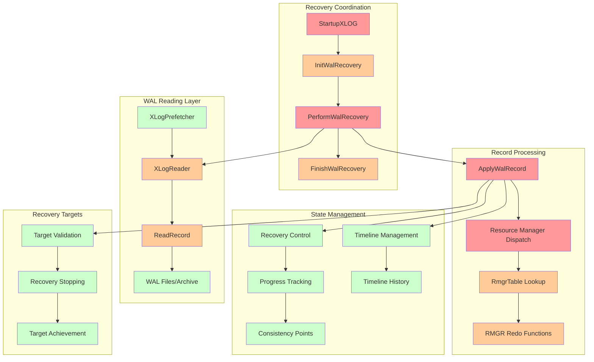
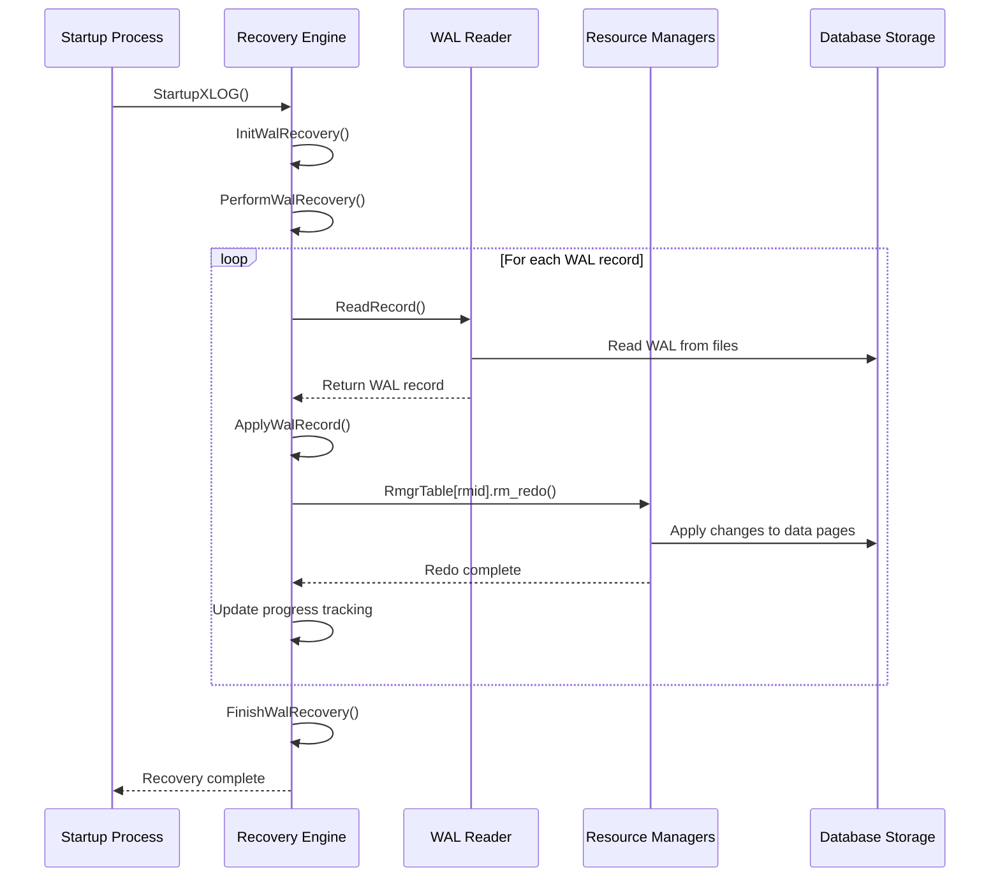
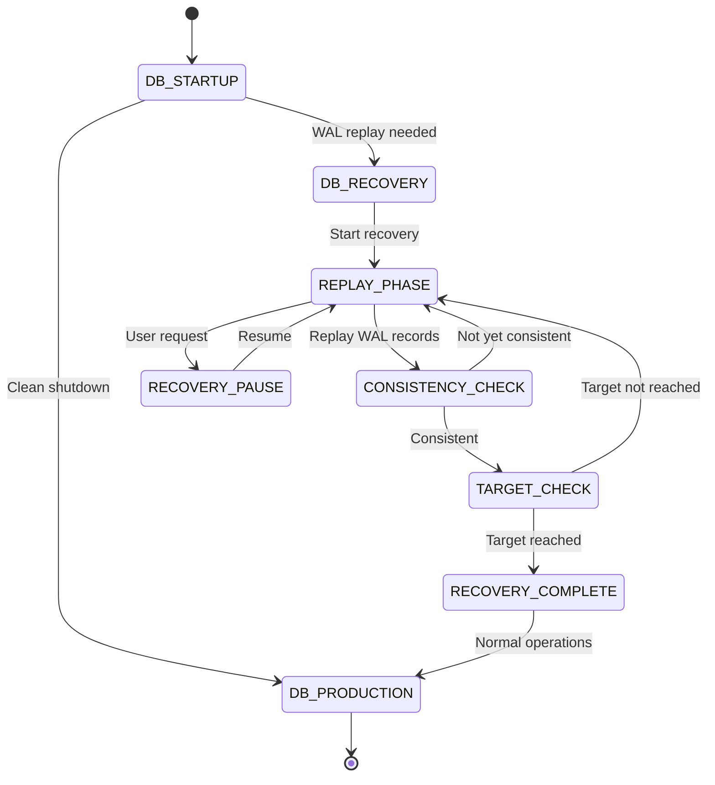

# WAL Recovery Component

## Overview
The WAL Recovery component is responsible for database crash recovery and continuous recovery operations. It reads WAL records from storage, coordinates their replay through resource managers, and manages the transition from recovery mode to normal operations. This component ensures database consistency after crashes and enables point-in-time recovery scenarios.

## Key Concepts

### Recovery Modes
PostgreSQL supports multiple recovery scenarios:
- **Crash Recovery**: Automatic recovery after unexpected shutdown
- **Archive Recovery**: Recovery from backup + archived WAL files
- **Standby Mode**: Continuous recovery for hot standby servers
- **Point-in-Time Recovery**: Recovery to specific time or transaction

### Resource Managers (RMGRs)
Specialized modules that handle specific types of database changes:
- **HEAP**: Table data modifications
- **BTREE**: B-tree index operations
- **HASH**: Hash index operations
- **GIN/GiST/SP-GiST**: Specialized index types
- **XLOG**: WAL system metadata
- **XACT**: Transaction commit/abort records

### Recovery Timeline Management
Handles database timeline changes during recovery:
- **Timeline Switching**: Moving between different recovery timelines
- **Timeline History**: Tracking timeline changes and branch points
- **Promotion**: Converting standby to primary with new timeline

## Architecture



## Core APIs

### StartupXLOG

#### Purpose
Main entry point for the startup process. Coordinates the complete database startup sequence including crash recovery, archive recovery, and the transition to normal operations.

#### Signature
```c
void StartupXLOG(void);
```

#### Detailed Description
StartupXLOG orchestrates the complete startup sequence:

1. **Initialization Phase**:
   - Reads control file to determine database state
   - Initializes shared memory structures
   - Determines recovery mode (crash, archive, standby)

2. **Recovery Setup**:
   - Calls InitWalRecovery() to prepare recovery infrastructure
   - Sets up WAL reading and prefetching mechanisms
   - Configures recovery targets and parameters

3. **Recovery Execution**:
   - Invokes PerformWalRecovery() for actual WAL replay
   - Monitors recovery progress and consistency
   - Handles recovery pausing and target achievement

4. **Recovery Completion**:
   - Calls FinishWalRecovery() for cleanup and validation
   - Transitions database to normal operation mode
   - Initializes WAL writing infrastructure

#### Parameters
None - operates on global state and configuration.

#### Return Value
Void - function completes database startup or exits on failure.

#### Error Handling
- **Corruption Detection**: PANIC on irrecoverable WAL corruption
- **Missing WAL**: Handles gaps in WAL sequence appropriately
- **Target Validation**: Ensures recovery targets are achievable

#### Integration Points
- **Called by**: Postmaster during database startup
- **Calls**: InitWalRecovery, PerformWalRecovery, FinishWalRecovery
- **Shared state**: Initializes global recovery control structures

### PerformWalRecovery

#### Purpose
Executes the main WAL replay loop. Reads WAL records sequentially and applies them through resource managers until recovery target is reached or WAL is exhausted.

#### Signature
```c
void PerformWalRecovery(void);
```

#### Detailed Description
PerformWalRecovery implements the core recovery algorithm:

1. **Recovery Loop Initialization**:
   - Sets up progress tracking variables
   - Configures replay timeline
   - Initializes consistency checking

2. **Main Recovery Loop**:
   ```c
   do {
       record = ReadRecord(xlogprefetcher, LOG, false, replayTLI);
       if (record != NULL) {
           ApplyWalRecord(xlogreader, record, &replayTLI);
           // Check for recovery targets and consistency
       }
   } while (record != NULL && !reachedRecoveryTarget);
   ```

3. **Progress Management**:
   - Updates replay positions atomically
   - Checks consistency achievement
   - Handles recovery target evaluation

4. **Loop Termination**:
   - Detects end of available WAL
   - Validates recovery target achievement
   - Prepares for recovery completion

#### Parameters
None - uses global recovery state and configuration.

#### Return Value
Void - completes when recovery target reached or WAL exhausted.

#### Error Handling
- **Record Corruption**: Handles corrupted WAL records appropriately
- **Resource Manager Errors**: Propagates RMGR-specific errors
- **Timeline Issues**: Manages timeline change scenarios

#### Integration Points
- **Called by**: StartupXLOG during recovery phase
- **Calls**: ReadRecord, ApplyWalRecord, consistency checking
- **Shared state**: Updates recovery progress tracking

### ApplyWalRecord

#### Purpose
Applies a single WAL record by dispatching it to the appropriate resource manager. Handles timeline changes, transaction ID advancement, and error context management.

#### Signature
```c
static void ApplyWalRecord(XLogReaderState *xlogreader, XLogRecord *record, TimeLineID *replayTLI);
```

#### Detailed Description
ApplyWalRecord coordinates individual record replay:

1. **Pre-processing**:
   - Sets up error context for debugging
   - Advances transaction ID tracking
   - Checks for timeline changes

2. **Timeline Management**:
   - Detects timeline switch records
   - Updates replay timeline appropriately
   - Handles timeline validation

3. **Resource Manager Dispatch**:
   ```c
   RmgrTable[record->xl_rmid].rm_redo(xlogreader);
   ```

4. **Post-processing**:
   - Updates replay progress markers
   - Handles special record types
   - Cleans up error context

#### Parameters
| Parameter | Type | Description | Constraints |
|-----------|------|-------------|-------------|
| xlogreader | XLogReaderState* | WAL reader state | Must contain valid record |
| record | XLogRecord* | Record to apply | Valid WAL record pointer |
| replayTLI | TimeLineID* | Current replay timeline | Updated by function |

#### Return Value
Void - applies record and updates state.

#### Error Handling
- **Resource Manager Errors**: Provides detailed error context
- **Timeline Mismatches**: Validates timeline consistency
- **Corruption Detection**: Reports record-level corruption

#### Integration Points
- **Called by**: PerformWalRecovery for each record
- **Calls**: Resource manager redo functions via RmgrTable
- **Shared state**: Updates progress tracking and timeline state

### RmgrTable

#### Purpose
Dispatch table that maps resource manager IDs to their corresponding function implementations. Provides the interface between WAL recovery and specialized resource managers.

#### Signature
```c
extern RmgrData RmgrTable[RM_MAX_ID + 1];
```

#### Detailed Description
RmgrTable provides modular WAL record processing:

1. **Resource Manager Structure**:
   ```c
   typedef struct RmgrData {
       const char *rm_name;              /* Resource manager name */
       void (*rm_redo)(XLogReaderState *); /* Redo function */
       void (*rm_desc)(StringInfo, XLogReaderState *); /* Description */
       const char *(*rm_identify)(uint8); /* Info identification */
       void (*rm_startup)(void);         /* Startup function */
       void (*rm_cleanup)(void);         /* Cleanup function */
       void (*rm_mask)(char *, uint8);   /* Masking function */
       void (*rm_decode)(LogicalDecodingContext *, XLogReaderState *); /* Decode */
   } RmgrData;
   ```

2. **Built-in Resource Managers**:
   - **RM_XLOG_ID**: WAL system records
   - **RM_XACT_ID**: Transaction commit/abort
   - **RM_SMGR_ID**: Storage manager operations
   - **RM_HEAP_ID**: Heap table operations
   - **RM_BTREE_ID**: B-tree index operations

3. **Custom Resource Managers**:
   - Support for extension-defined resource managers
   - Runtime registration during shared_preload_libraries
   - Unique ID assignment and validation

#### Parameters
Accessed by resource manager ID as array index.

#### Return Value
Returns RmgrData structure for specified resource manager.

#### Error Handling
- **Invalid RMGR ID**: Reports unregistered resource manager errors
- **Missing Functions**: Validates required function pointers

#### Integration Points
- **Called by**: ApplyWalRecord for record dispatch
- **Calls**: Individual resource manager functions
- **Shared state**: Provides global RMGR function registry

## Data Structures

### XLogReaderState
WAL reading state structure:

```c
typedef struct XLogReaderState
{
    XLogRecPtr  ReadRecPtr;         /* Last read record start */
    XLogRecPtr  EndRecPtr;          /* Last read record end */
    XLogRecord *decoded_record;     /* Currently decoded record */
    char       *readBuf;            /* Buffer for current record */
    uint32      readLen;            /* Length of current record */
    TimeLineID  readPageTLI;        /* Timeline of current page */
} XLogReaderState;
```

### XLogRecoveryCtl
Recovery control structure:

```c
typedef struct XLogRecoveryCtlData
{
    XLogRecPtr  lastReplayedReadRecPtr;  /* Last replayed record start */
    XLogRecPtr  lastReplayedEndRecPtr;   /* Last replayed record end */
    TimeLineID  lastReplayedTLI;         /* Timeline of last replay */
    XLogRecPtr  replayEndRecPtr;         /* Current replay position */
    TimestampTz recoveryLastXTime;       /* Timestamp of last record */
    bool        recoveryPauseState;      /* Recovery pause state */
} XLogRecoveryCtlData;
```

### RmgrData
Resource manager interface structure:

```c
typedef struct RmgrData
{
    const char *rm_name;                        /* Human-readable name */
    void (*rm_redo)(XLogReaderState *record);   /* Redo function */
    void (*rm_desc)(StringInfo buf, XLogReaderState *record); /* Description */
    const char *(*rm_identify)(uint8 info);     /* Info string */
    void (*rm_startup)(void);                   /* Startup callback */
    void (*rm_cleanup)(void);                   /* Cleanup callback */
    void (*rm_mask)(char *page, uint8 info);    /* Page masking */
    void (*rm_decode)(LogicalDecodingContext *ctx, XLogReaderState *record); /* Logical decode */
} RmgrData;
```

## Processing Flow



## Recovery State Machine



## Implementation Notes

### Performance Optimizations
- **WAL Prefetching**: Asynchronous reading of upcoming WAL records
- **Record Caching**: Efficient memory management for large records
- **Parallel Processing**: Future support for parallel recovery operations

### Consistency Management
- **Consistency Points**: Tracks when database reaches consistent state
- **Backup Block Validation**: Ensures full-page writes maintain consistency
- **Timeline Validation**: Prevents replay of incompatible timelines

### Error Recovery Strategies
- **Graceful Degradation**: Continues recovery despite minor errors
- **Corruption Handling**: Isolates and reports corrupted records
- **Timeline Recovery**: Handles timeline mismatches and switches

### Recovery Targets
- **Time-based**: Recovery to specific timestamp
- **Transaction-based**: Recovery to specific transaction ID
- **LSN-based**: Recovery to specific WAL position
- **Named**: Recovery to named restore points

### Integration with Standby Mode
- **Continuous Recovery**: Seamless integration with streaming replication
- **Hot Standby**: Enables read-only queries during recovery
- **Promotion**: Smooth transition from standby to primary

The WAL Recovery component ensures PostgreSQL's durability guarantees by providing reliable, efficient replay of transaction logs. It enables not only crash recovery but also sophisticated backup and recovery scenarios essential for production database management.