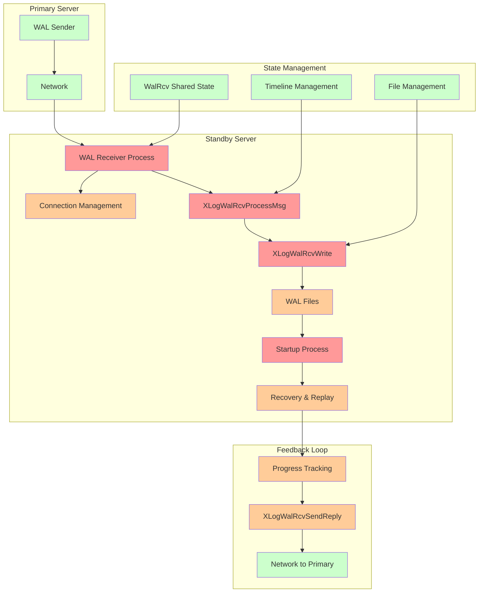
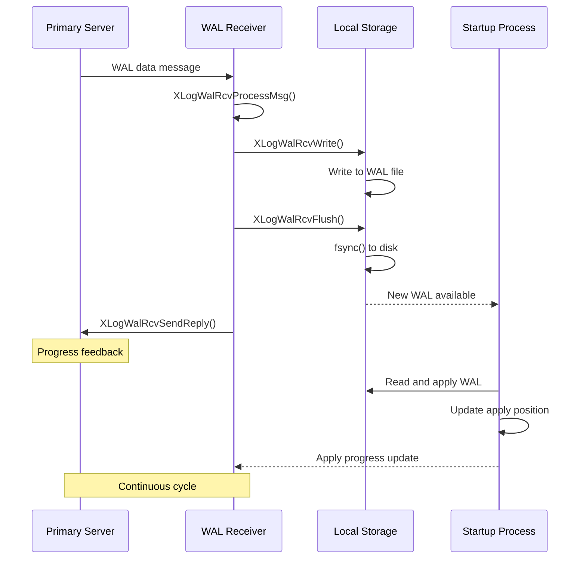
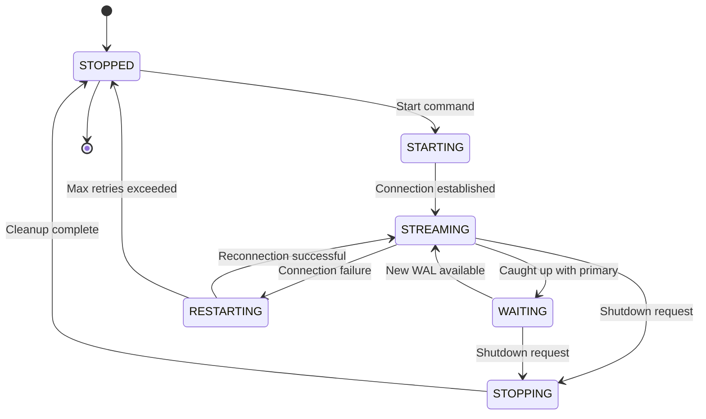

# WAL Replication Receiver Component

## Overview
The WAL Replication Receiver component implements the standby side of PostgreSQL's streaming replication protocol. It establishes connections to primary servers, receives and writes WAL data to local storage, and coordinates with the recovery process to maintain an up-to-date replica of the primary database.

## Key Concepts

### Standby Server Architecture
Standby servers operate in continuous recovery mode:
- **WAL Receiver Process**: Dedicated process for receiving WAL from primary
- **Startup Process**: Applies received WAL records to maintain database state
- **Archive Recovery**: Falls back to archive when streaming unavailable

### Connection Management
WAL receivers manage persistent connections to primary servers:
- **Automatic Reconnection**: Handles connection failures and network partitions
- **Timeline Synchronization**: Manages timeline changes during primary failover
- **Authentication**: Supports all PostgreSQL authentication mechanisms

### Flow Control and Feedback
Implements bidirectional communication with primary:
- **Progress Reporting**: Sends write/flush/apply positions to primary
- **Hot Standby Feedback**: Communicates transaction ID information
- **Keepalive Protocol**: Maintains connection health through heartbeats

## Architecture



## Core APIs

### WalReceiverMain

#### Purpose
Main entry point for WAL receiver processes. Establishes connection to primary server, coordinates WAL streaming, and manages the complete lifecycle of replication receiver operations.

#### Signature
```c
void WalReceiverMain(char *startup_data, size_t startup_data_len);
```

#### Detailed Description
WalReceiverMain implements the complete receiver workflow:

1. **Initialization**: Sets up process state and shared memory structures
2. **Connection Establishment**: Connects to primary server using libpq
3. **Timeline Coordination**: Fetches timeline history and determines start position
4. **Streaming Loop**: Continuously receives and processes WAL data
5. **Error Handling**: Manages connection failures and recovery scenarios
6. **Cleanup**: Handles graceful shutdown and resource cleanup

The main loop processes incoming messages, writes WAL data, and sends feedback to the primary.

#### Parameters
| Parameter | Type | Description | Constraints |
|-----------|------|-------------|-------------|
| startup_data | char* | Process startup information | Currently unused (NULL) |
| startup_data_len | size_t | Length of startup data | Currently 0 |

#### Return Value
Void - function runs until process termination.

#### Error Handling
- **Connection Failures**: Automatic retry with exponential backoff
- **Timeline Mismatches**: Fetches new timeline history and restarts
- **WAL Gaps**: Requests missing WAL from primary or archive

#### Integration Points
- **Called by**: Postmaster when starting WAL receiver process
- **Calls**: libpq connection functions, XLogWalRcvProcessMsg
- **Shared state**: Updates WalRcv shared memory structure

### XLogWalRcvProcessMsg

#### Purpose
Processes incoming protocol messages from the primary server. Dispatches different message types to appropriate handlers and maintains protocol state.

#### Signature
```c
static void XLogWalRcvProcessMsg(unsigned char type, char *buf, Size len, TimeLineID tli);
```

#### Detailed Description
Handles the streaming replication protocol message types:

1. **WAL Data Messages ('w')**: Extracts WAL records and metadata
2. **Keepalive Messages ('k')**: Processes heartbeat and position updates
3. **Message Validation**: Ensures protocol compliance and data integrity
4. **Timeline Coordination**: Manages timeline-specific processing
5. **Progress Tracking**: Updates received position tracking

#### Parameters
| Parameter | Type | Description | Constraints |
|-----------|------|-------------|-------------|
| type | unsigned char | Protocol message type | 'w' for WAL, 'k' for keepalive |
| buf | char* | Message payload buffer | Contains protocol-specific data |
| len | Size | Message length | Must match expected format |
| tli | TimeLineID | Timeline ID for processing | Current timeline |

#### Return Value
Void - processes message and updates state.

#### Error Handling
- **Protocol Violations**: Reports errors for malformed messages
- **Timeline Mismatches**: Handles timeline change scenarios
- **Buffer Overflows**: Validates message sizes

#### Integration Points
- **Called by**: WalReceiverMain message processing loop
- **Calls**: XLogWalRcvWrite, ProcessWalSndrMessage
- **Shared state**: Updates LogstreamResult tracking

### XLogWalRcvWrite

#### Purpose
Writes received WAL data to local WAL files. Manages WAL segment files, handles file creation and switching, and ensures proper data persistence.

#### Signature
```c
static void XLogWalRcvWrite(char *buf, Size nbytes, XLogRecPtr recptr, TimeLineID tli);
```

#### Detailed Description
Implements efficient WAL file writing:

1. **Segment Management**: Creates and switches WAL segment files as needed
2. **Write Coordination**: Ensures proper file positioning and alignment
3. **Data Validation**: Verifies received data integrity
4. **Timeline Handling**: Manages timeline-specific file naming
5. **Progress Tracking**: Updates write position markers

#### Parameters
| Parameter | Type | Description | Constraints |
|-----------|------|-------------|-------------|
| buf | char* | WAL data buffer | Contains raw WAL records |
| nbytes | Size | Number of bytes to write | Must be > 0 |
| recptr | XLogRecPtr | Starting LSN for data | Valid LSN position |
| tli | TimeLineID | Timeline ID | Current timeline |

#### Return Value
Void - writes data and updates tracking.

#### Error Handling
- **Disk Space**: Handles disk full conditions
- **I/O Errors**: Reports file system errors
- **Corruption Detection**: Validates WAL record integrity

#### Integration Points
- **Called by**: XLogWalRcvProcessMsg for WAL data
- **Calls**: XLogFileInit, file I/O operations
- **Shared state**: Updates LogstreamResult.Write position

### XLogWalRcvFlush

#### Purpose
Forces received WAL data to persistent storage and coordinates with the startup process. Implements the durability guarantee for received WAL records.

#### Signature
```c
static void XLogWalRcvFlush(bool dying, TimeLineID tli);
```

#### Detailed Description
Ensures WAL data durability:

1. **File Synchronization**: Forces data to disk using fsync
2. **Position Updates**: Updates flushed position markers
3. **Startup Coordination**: Notifies startup process of new data
4. **Timeline Management**: Handles timeline-specific flushing
5. **Shutdown Handling**: Special processing during receiver shutdown

#### Parameters
| Parameter | Type | Description | Constraints |
|-----------|------|-------------|-------------|
| dying | bool | Whether receiver is shutting down | Affects flush behavior |
| tli | TimeLineID | Timeline ID | Current timeline |

#### Return Value
Void - ensures data persistence.

#### Error Handling
- **Fsync Failures**: Treats as PANIC for data integrity
- **Timeline Issues**: Handles timeline change scenarios

#### Integration Points
- **Called by**: WalReceiverMain after writing batches
- **Calls**: File system sync operations
- **Shared state**: Updates LogstreamResult.Flush position

### XLogWalRcvSendReply

#### Purpose
Sends progress feedback to the primary server including write, flush, and apply positions. Implements the feedback mechanism for flow control and synchronous replication.

#### Signature
```c
static void XLogWalRcvSendReply(bool force, bool requestReply);
```

#### Detailed Description
Manages bidirectional communication:

1. **Progress Collection**: Gathers current write/flush/apply positions
2. **Message Construction**: Builds protocol-compliant reply message
3. **Transmission**: Sends feedback using connection protocol
4. **Timing Control**: Implements efficient feedback frequency
5. **Reply Requests**: Handles immediate reply requirements

#### Parameters
| Parameter | Type | Description | Constraints |
|-----------|------|-------------|-------------|
| force | bool | Force immediate send | Overrides timing optimizations |
| requestReply | bool | Request reply from primary | For keepalive coordination |

#### Return Value
Void - sends feedback message.

#### Error Handling
- **Connection Failures**: Handles network errors gracefully
- **Protocol Errors**: Manages send buffer issues

#### Integration Points
- **Called by**: WalReceiverMain periodically
- **Calls**: Connection send functions
- **Shared state**: Reads recovery progress positions

## Data Structures

### WalRcvData
Main shared state structure for WAL receiver:

```c
typedef struct WalRcvData
{
    pid_t           pid;                /* Receiver process PID */
    WalRcvState     walRcvState;        /* Current state */
    XLogRecPtr      receivedUpto;       /* Last received LSN */
    TimeLineID      receivedTLI;        /* Timeline of received data */
    XLogRecPtr      flushedUpto;        /* Last flushed LSN */
    TimestampTz     startTime;          /* Start time */
    bool            is_temp_slot;       /* Using temporary slot */
    char            slotname[NAMEDATALEN]; /* Replication slot */
    char            conninfo[MAXCONNINFO]; /* Connection string */
} WalRcvData;
```

### WalRcvState
Receiver state enumeration:

```c
typedef enum
{
    WALRCV_STOPPED,         /* Not running */
    WALRCV_STARTING,        /* Starting up */
    WALRCV_STREAMING,       /* Receiving WAL */
    WALRCV_WAITING,         /* Waiting for WAL */
    WALRCV_RESTARTING,      /* Restarting connection */
    WALRCV_STOPPING        /* Shutting down */
} WalRcvState;
```

### LogstreamResult
Tracking structure for received data:

```c
typedef struct LogstreamResult
{
    XLogRecPtr      Write;              /* Last written position */
    XLogRecPtr      Flush;              /* Last flushed position */
    TimeLineID      tli;                /* Timeline ID */
} LogstreamResult;
```

## Processing Flow



## Connection State Machine



## Implementation Notes

### Connection Management
- **Libpq Integration**: Uses PostgreSQL's standard connection library
- **Automatic Retry**: Implements exponential backoff for failed connections
- **Timeline Synchronization**: Handles timeline changes during failover scenarios

### Performance Optimizations
- **Batched Writing**: Accumulates WAL data before writing to reduce I/O
- **Asynchronous Processing**: Overlaps network reception with disk writing
- **Efficient Feedback**: Optimizes reply frequency to balance overhead and responsiveness

### Error Recovery
- **Connection Resilience**: Automatically recovers from network partitions
- **Data Integrity**: Validates received data and handles corruption
- **Timeline Management**: Adapts to primary server timeline changes

### Integration with Recovery
- **Startup Coordination**: Works closely with startup process for WAL application
- **Hot Standby Support**: Enables read-only queries during streaming
- **Promotion Handling**: Supports promotion from standby to primary

### Monitoring and Diagnostics
- **State Tracking**: Provides detailed state information for monitoring
- **Progress Metrics**: Reports replication lag and throughput statistics
- **Error Reporting**: Comprehensive error logging for troubleshooting

The WAL Replication Receiver component enables PostgreSQL's streaming replication capabilities, providing the foundation for high availability, load balancing, and disaster recovery solutions. It ensures reliable, efficient transfer of WAL data while maintaining strong consistency guarantees and handling various failure scenarios gracefully.