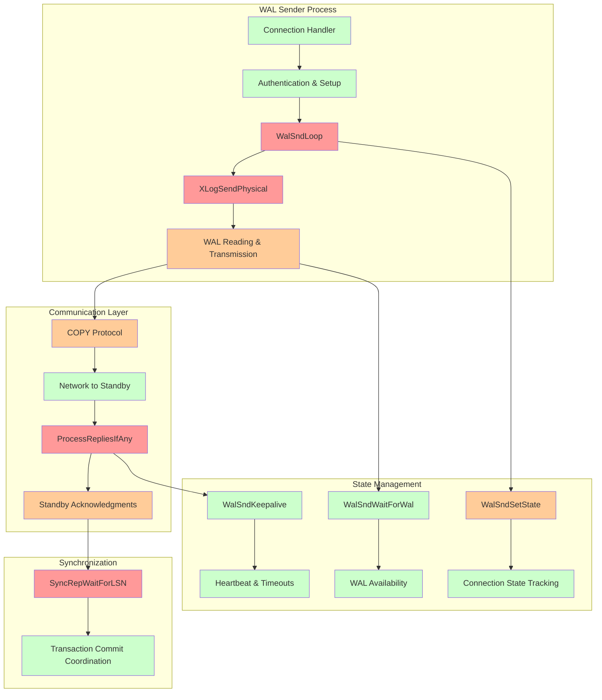
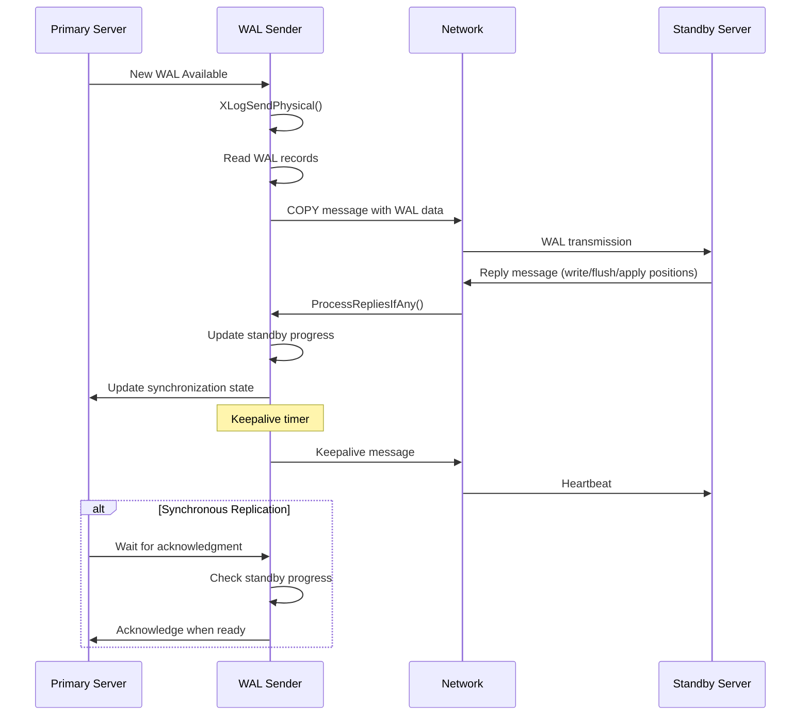
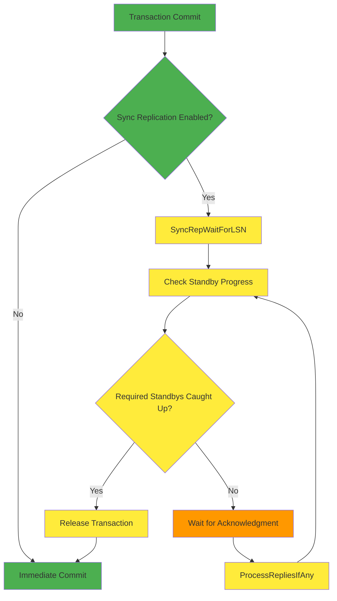

# WAL Replication Sender Component

## Overview
The WAL Replication Sender component implements PostgreSQL's streaming replication protocol, responsible for transmitting WAL records from a primary server to standby servers. It manages the continuous streaming of transaction logs, handles client communication, and coordinates synchronous replication acknowledgments.

## Key Concepts

### Streaming Replication Protocol
PostgreSQL uses a COPY-based protocol for WAL streaming:
- **Physical Replication**: Sends raw WAL records for binary compatibility
- **Logical Replication**: Sends decoded changes for cross-version compatibility
- **Timeline Handling**: Manages timeline switches during recovery scenarios

### WAL Sender States
WAL senders progress through defined states:
- **STARTUP**: Initial connection and authentication
- **BACKUP**: Handling base backup requests
- **CATCHUP**: Sending historical WAL to catch up
- **STREAMING**: Normal streaming operation
- **STOPPING**: Graceful shutdown in progress

### Synchronous Replication
Provides ACID guarantees across multiple servers:
- **synchronous_commit**: Controls when transactions wait for acknowledgment
- **synchronous_standby_names**: Configures which standbys provide sync confirmation
- **Acknowledgment Types**: Write, flush, and apply confirmations

## Architecture



## Core APIs

### WalSndLoop

#### Purpose
Main event loop for WAL sender processes. Coordinates all aspects of streaming replication including WAL transmission, client communication, heartbeat management, and graceful shutdown handling.

#### Signature
```c
static void WalSndLoop(WalSndSendDataCallback send_data);
```

#### Detailed Description
WalSndLoop implements the core streaming protocol:

1. **Initialization**: Sets up timing and state for streaming operation
2. **Main Loop**: Continuously processes until streaming completion:
   - Handles configuration reloads (SIGHUP)
   - Processes client messages and acknowledgments
   - Checks for streaming termination conditions
   - Sends WAL data when output buffer has space
   - Manages keepalive and timeout logic
3. **Cleanup**: Handles graceful shutdown and state transitions

The loop uses a send_data callback to abstract between physical and logical replication modes.

#### Parameters
| Parameter | Type | Description | Constraints |
|-----------|------|-------------|-------------|
| send_data | WalSndSendDataCallback | Function to send WAL data | XLogSendPhysical or XLogSendLogical |

#### Return Value
Void - function runs until streaming completion or termination.

#### Error Handling
- **Interrupts**: Processes CHECK_FOR_INTERRUPTS() for signal handling
- **Client Disconnect**: Detects and handles connection loss
- **Timeout**: Implements wal_sender_timeout for inactive connections

#### Integration Points
- **Called by**: StartReplication after initial setup
- **Calls**: ProcessRepliesIfAny, send_data callback, WalSndKeepalive
- **Shared state**: Updates global streaming state and synchronization

### XLogSendPhysical

#### Purpose
Sends physical WAL records to standby servers. Reads WAL from local storage and transmits it using the COPY protocol, implementing flow control and timeline management.

#### Signature
```c
static void XLogSendPhysical(void);
```

#### Detailed Description
XLogSendPhysical handles the core data transmission logic:

1. **Request Calculation**: Determines how much WAL can be safely sent
2. **Timeline Handling**: Manages historical timelines and current timeline
3. **WAL Reading**: Uses XLogReader to access WAL records from storage
4. **Data Transmission**: Sends WAL data in COPY protocol messages
5. **Flow Control**: Implements rate limiting and buffer management
6. **Progress Tracking**: Updates sent position and lag tracking

#### Parameters
None - accesses global WAL sender state.

#### Return Value
Void - updates global WalSndCaughtUp flag to indicate streaming status.

#### Error Handling
- **WAL Read Errors**: Handles missing or corrupted WAL files
- **Network Errors**: Manages connection failures during transmission
- **Timeline Switches**: Detects and handles timeline changes

#### Integration Points
- **Called by**: WalSndLoop as send_data callback for physical replication
- **Calls**: XLogReader functions, network transmission functions
- **Shared state**: Updates sent position tracking and lag metrics

### ProcessRepliesIfAny

#### Purpose
Processes incoming messages from standby servers including acknowledgments, feedback messages, and control commands. Implements non-blocking message processing to maintain streaming performance.

#### Signature
```c
static void ProcessRepliesIfAny(void);
```

#### Detailed Description
Handles all client communication during streaming:

1. **Message Reading**: Non-blocking read of incoming protocol messages
2. **Message Dispatch**: Routes messages to appropriate handlers:
   - Standby reply messages (write/flush/apply positions)
   - Hot standby feedback (transaction ID feedback)
   - CopyDone termination messages
3. **State Updates**: Updates standby progress tracking
4. **Timeout Management**: Updates last reply timestamp for timeout detection

#### Parameters
None - processes messages from the current client connection.

#### Return Value
Void - updates global state based on received messages.

#### Error Handling
- **Connection Loss**: Detects EOF and network errors
- **Protocol Errors**: Handles malformed messages
- **Buffer Overflow**: Manages large message handling

#### Integration Points
- **Called by**: WalSndLoop in main streaming loop
- **Calls**: ProcessStandbyReplyMessage, ProcessStandbyHSFeedbackMessage
- **Shared state**: Updates standby progress and synchronization state

### WalSndKeepalive

#### Purpose
Sends keepalive messages to standby servers to maintain connection health and request progress updates. Implements the heartbeat mechanism for detecting connection failures.

#### Signature
```c
static void WalSndKeepalive(bool requestReply, XLogRecPtr writePtr);
```

#### Detailed Description
Manages connection health and progress reporting:

1. **Message Construction**: Builds keepalive protocol message
2. **Progress Reporting**: Includes current WAL write position
3. **Reply Requests**: Optionally requests immediate reply from standby
4. **Transmission**: Sends message using COPY protocol
5. **State Tracking**: Updates keepalive timing for timeout management

#### Parameters
| Parameter | Type | Description | Constraints |
|-----------|------|-------------|-------------|
| requestReply | bool | Whether to request immediate reply | Used for timeout detection |
| writePtr | XLogRecPtr | Current WAL write position to report | Valid LSN |

#### Return Value
Void - sends keepalive message to standby.

#### Error Handling
- **Send Failures**: Handles network errors during transmission
- **Buffer Management**: Manages output buffer space

#### Integration Points
- **Called by**: WalSndLoop, timeout management functions
- **Calls**: Network transmission functions
- **Shared state**: Updates keepalive timing and request state

### WalSndWaitForWal

#### Purpose
Waits for new WAL to become available when the sender has caught up to the current insert position. Implements efficient waiting using latches to avoid busy polling.

#### Signature
```c
static XLogRecPtr WalSndWaitForWal(XLogRecPtr loc);
```

#### Detailed Description
Implements efficient WAL availability waiting:

1. **Position Check**: Compares requested position with current insert position
2. **Latch Setup**: Configures latch for WAL availability notification
3. **Timeout Handling**: Implements maximum wait time to maintain responsiveness
4. **Interrupt Processing**: Handles signals during wait
5. **Position Update**: Returns updated available position

#### Parameters
| Parameter | Type | Description | Constraints |
|-----------|------|-------------|-------------|
| loc | XLogRecPtr | Position to wait for | Valid LSN |

#### Return Value
Returns XLogRecPtr indicating new available WAL position.

#### Error Handling
- **Timeout**: Returns current position if wait times out
- **Interrupts**: Processes signals and returns immediately
- **Shutdown**: Handles graceful shutdown during wait

#### Integration Points
- **Called by**: XLogSendPhysical when caught up
- **Calls**: Latch wait functions, interrupt processing
- **Shared state**: Monitors WAL insert position

## Data Structures

### WalSnd
Per-connection state structure:

```c
typedef struct WalSnd
{
    pid_t       pid;                /* Process ID */
    WalSndState state;              /* Current state */
    XLogRecPtr  sentPtr;            /* Last WAL position sent */
    XLogRecPtr  flush;              /* Last position flushed by standby */
    XLogRecPtr  apply;              /* Last position applied by standby */
    TimestampTz replyTime;          /* Last reply timestamp */
    bool        is_for_streaming;   /* Streaming replication? */
    char        slotname[NAMEDATALEN]; /* Replication slot name */
} WalSnd;
```

### WalSndCtlData
Shared control structure:

```c
typedef struct WalSndCtlData
{
    WalSnd      walsnds[FLEXIBLE_ARRAY_MEMBER];
} WalSndCtlData;
```

### Standby Reply Message
Network protocol message structure:

```c
typedef struct StandbyReplyMessage
{
    XLogRecPtr  write;              /* Last written position */
    XLogRecPtr  flush;              /* Last flushed position */
    XLogRecPtr  apply;              /* Last applied position */
    TimestampTz sendTime;           /* Send timestamp */
    bool        replyRequested;     /* Reply requested flag */
} StandbyReplyMessage;
```

## Processing Flow



## Synchronous Replication Flow



## Implementation Notes

### Performance Optimizations
- **Batched Transmission**: Combines multiple WAL records in single messages
- **Non-blocking I/O**: Avoids blocking on network operations
- **Efficient Waiting**: Uses latches instead of polling for WAL availability

### Connection Management
- **Process Per Connection**: Each standby connection runs in separate process
- **State Tracking**: Maintains detailed state for each connection
- **Graceful Shutdown**: Implements clean termination procedures

### Error Recovery
- **Connection Loss**: Automatically detected and handled
- **WAL Gaps**: Standby can reconnect and request missing WAL
- **Timeline Changes**: Handles timeline switches during recovery

### Protocol Evolution
- **Backward Compatibility**: Maintains compatibility with older PostgreSQL versions
- **Feature Negotiation**: Supports different replication capabilities
- **Extension Points**: Allows for future protocol enhancements

### Monitoring and Diagnostics
- **Progress Tracking**: Detailed tracking of sent/acknowledged positions
- **Lag Calculation**: Real-time replication lag measurement
- **Statistics**: Comprehensive replication statistics for monitoring

The WAL Replication Sender component provides the foundation for PostgreSQL's high availability and disaster recovery capabilities, enabling real-time data replication across geographically distributed systems while maintaining strong consistency guarantees.