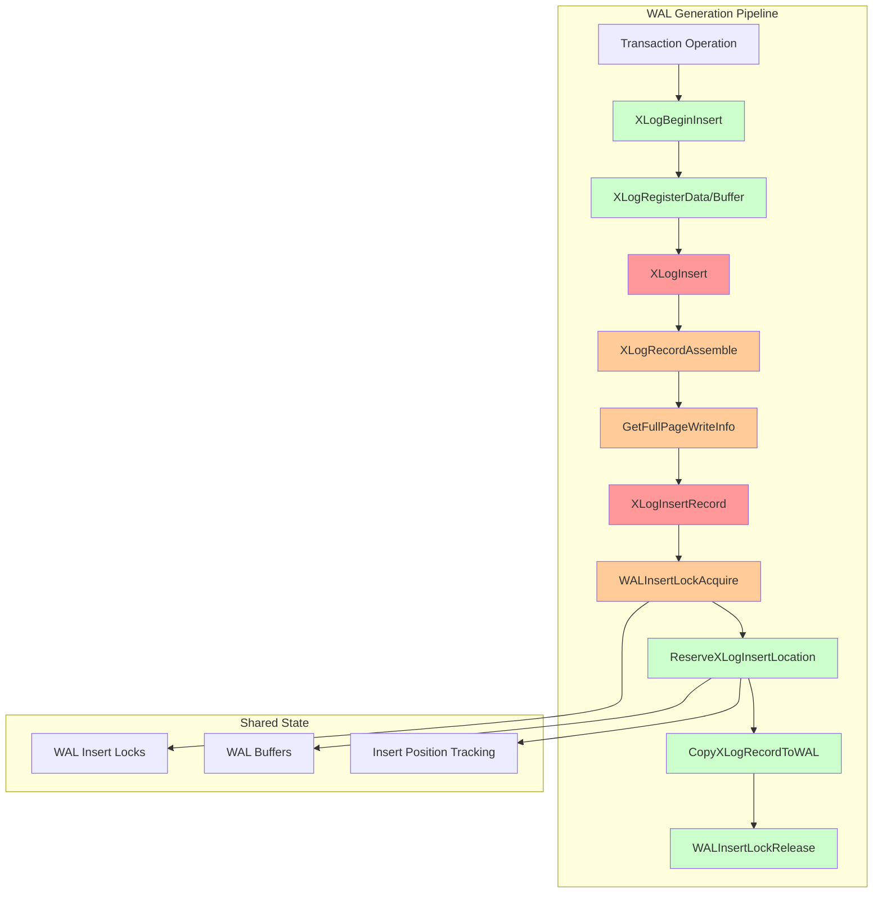
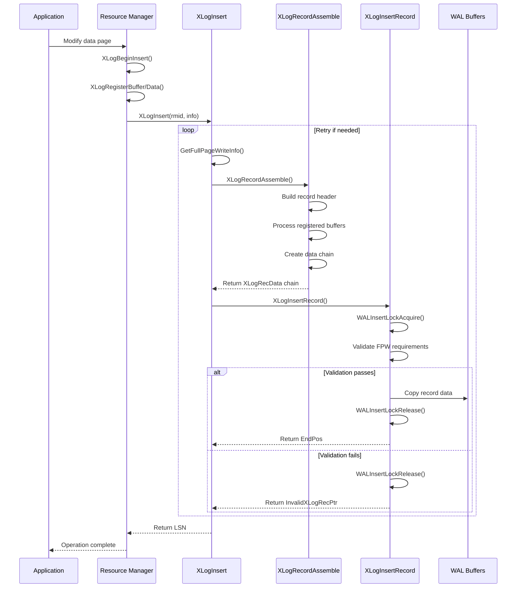

# WAL Generation Component

## Overview
The WAL (Write-Ahead Log) Generation component is the foundational layer of PostgreSQL's transaction logging system. It coordinates the assembly, validation, and insertion of WAL records into shared memory buffers. This component ensures ACID compliance by implementing the fundamental WAL rule: "write the log before the data."

## Key Concepts

### WAL Records
WAL records are self-contained units that describe database changes. Each record contains:
- **Header**: Fixed-size metadata including LSN, transaction ID, and record type
- **Resource Manager Data**: Type-specific payload describing the actual change
- **Backup Blocks**: Full page images when required for consistency

### LSN (Log Sequence Number)
LSNs provide a monotonically increasing identifier for WAL record positions. They serve as:
- Ordering mechanism for recovery replay
- Synchronization points for replication
- Checkpoint coordination markers

### Full Page Writes
When enabled, the first modification to a page after a checkpoint includes the entire page image in the WAL record, protecting against partial page writes during system crashes.

## Architecture



## Core APIs

### XLogInsert

#### Purpose
Main entry point for WAL record insertion. Coordinates the complete process of assembling a WAL record from registered data and buffer references, then inserting it into the WAL stream.

#### Signature
```c
XLogRecPtr XLogInsert(RmgrId rmid, uint8 info);
```

#### Detailed Description
XLogInsert performs these critical operations:

1. **Validation Phase**: Verifies that XLogBeginInsert() was called and validates info flags
2. **Bootstrap Handling**: Returns dummy LSN in bootstrap mode for non-XLOG records
3. **Assembly Loop**: Handles potential retry scenarios for full-page writes:
   - Calls GetFullPageWriteInfo() to determine current redo pointer and FPW settings
   - Invokes XLogRecordAssemble() to build the complete record structure
   - Attempts insertion via XLogInsertRecord()
   - Retries if full-page write requirements change during assembly

#### Parameters
| Parameter | Type | Description | Constraints |
|-----------|------|-------------|-------------|
| rmid | RmgrId | Resource manager identifier | Must be valid RM_* constant |
| info | uint8 | Record type and flags | Lower 4 bits for RM use, upper 4 reserved |

#### Return Value
Returns the LSN (Log Sequence Number) where the record was inserted. This LSN represents the end position of the inserted record and is used for:
- Ordering operations during recovery
- Synchronous replication coordination
- Checkpoint and flush coordination

#### Error Handling
- **PANIC**: Invalid info mask bits set
- **ERROR**: XLogBeginInsert() not called
- **Retry Logic**: Automatically retries if full-page write requirements change

#### Integration Points
- **Called by**: All resource managers when logging changes
- **Calls**: XLogRecordAssemble, XLogInsertRecord, GetFullPageWriteInfo
- **Shared state**: Uses XLogCtl->Insert for coordination

### XLogInsertRecord

#### Purpose
Low-level function that performs the actual insertion of an assembled WAL record into shared buffers. Handles concurrency control, space reservation, and physical data copying.

#### Signature
```c
XLogRecPtr XLogInsertRecord(XLogRecData *rdata, XLogRecPtr fpw_lsn,
                           uint8 flags, int num_fpi, bool topxid_included);
```

#### Detailed Description
This function implements the core insertion algorithm:

1. **Record Classification**: Determines insertion class (normal, switch, checkpoint)
2. **Lock Acquisition**: Acquires appropriate WAL insertion locks based on record type
3. **Validation**: Re-checks redo pointer and full-page write settings under lock
4. **Space Reservation**: Calculates and reserves space in WAL buffers
5. **Data Copy**: Copies record data into reserved buffer space
6. **LSN Assignment**: Updates process-local and global LSN tracking

#### Parameters
| Parameter | Type | Description | Constraints |
|-----------|------|-------------|-------------|
| rdata | XLogRecData* | Linked list of record data chunks | Must contain valid XLogRecord header |
| fpw_lsn | XLogRecPtr | Full-page write validation LSN | InvalidXLogRecPtr if no validation needed |
| flags | uint8 | Control flags for insertion | See XLOG_* flag constants |
| num_fpi | int | Number of full-page images | Non-negative integer |
| topxid_included | bool | Whether top transaction ID is included | Used for subtransaction handling |

#### Return Value
Returns the ending LSN of the inserted record. Returns InvalidXLogRecPtr if insertion was skipped due to full-page write validation failure.

#### Error Handling
- **Skip insertion**: When fpw_lsn validation fails
- **PANIC**: When WAL insertion is not allowed but attempted
- **Automatic retry**: Caller handles retry logic for validation failures

#### Integration Points
- **Called by**: XLogInsert after record assembly
- **Calls**: WALInsertLockAcquire, ReserveXLogInsertLocation
- **Shared state**: Modifies XLogCtl->Insert position tracking

### XLogRecordAssemble

#### Purpose
Assembles a complete WAL record structure from registered data chunks and buffer references. Handles full-page image inclusion, CRC calculation, and record header construction.

#### Signature
```c
static XLogRecData *XLogRecordAssemble(RmgrId rmid, uint8 info,
                                      XLogRecPtr RedoRecPtr, bool doPageWrites,
                                      XLogRecPtr *fpw_lsn, int *num_fpi,
                                      bool *topxid_included);
```

#### Detailed Description
The assembly process involves:

1. **Header Construction**: Builds XLogRecord header with metadata
2. **Buffer Processing**: Examines registered buffers for full-page image requirements
3. **Data Chain Building**: Creates linked list of XLogRecData chunks
4. **CRC Calculation**: Computes checksums for data integrity
5. **Transaction ID Handling**: Includes transaction IDs when required

#### Parameters
| Parameter | Type | Description | Constraints |
|-----------|------|-------------|-------------|
| rmid | RmgrId | Resource manager ID | Valid resource manager |
| info | uint8 | Record info byte | Resource manager specific |
| RedoRecPtr | XLogRecPtr | Current redo pointer | Used for FPW decisions |
| doPageWrites | bool | Whether full-page writes are enabled | Global setting |
| fpw_lsn | XLogRecPtr* | Output: oldest non-FPW page LSN | Set by function |
| num_fpi | int* | Output: number of full-page images | Set by function |
| topxid_included | bool* | Output: top transaction ID included | Set by function |

#### Return Value
Returns pointer to the head of an XLogRecData chain representing the complete record. This chain includes all data chunks, backup blocks, and metadata required for insertion.

#### Error Handling
- **Validation**: Ensures all registered data is consistent
- **Memory Management**: Uses scratch space for header construction
- **CRC Errors**: Detected during later validation phases

#### Integration Points
- **Called by**: XLogInsert during record construction
- **Calls**: Buffer management and CRC calculation functions
- **Shared state**: Accesses registered_data and registered_buffers

### WALInsertLockAcquire

#### Purpose
Acquires WAL insertion locks to coordinate concurrent access to WAL buffers. Implements lock affinity optimization to reduce cache line bouncing between processes.

#### Signature
```c
static void WALInsertLockAcquire(void);
```

#### Detailed Description
The locking strategy uses multiple WAL insertion locks (NUM_XLOGINSERT_LOCKS) to reduce contention:

1. **Lock Selection**: Uses process-local affinity to choose preferred lock
2. **Fallback Strategy**: Attempts other locks if preferred lock is busy
3. **Position Tracking**: Updates insertingAt position for coordination
4. **Critical Section**: Establishes critical section for WAL modification

#### Parameters
None - uses process-local state for lock selection.

#### Return Value
Void - function establishes lock ownership in process-local state.

#### Error Handling
- **Deadlock Prevention**: Uses timeout and retry logic
- **Position Consistency**: Ensures insertingAt tracking remains accurate

#### Integration Points
- **Called by**: XLogInsertRecord during record insertion
- **Calls**: LWLockAcquire for individual lock acquisition
- **Shared state**: Updates WALInsertLocks array position tracking

### WALInsertLockRelease

#### Purpose
Releases previously acquired WAL insertion locks and updates position tracking to allow waiting processes to proceed.

#### Signature
```c
static void WALInsertLockRelease(void);
```

#### Detailed Description
Release process includes:

1. **Position Update**: Sets final insertingAt position
2. **Lock Release**: Releases LWLock with position notification
3. **State Cleanup**: Resets process-local lock tracking
4. **Wakeup Coordination**: Allows blocked processes to proceed

#### Parameters
None - uses process-local lock state.

#### Return Value
Void - releases lock ownership and updates shared state.

#### Error Handling
- **State Validation**: Ensures lock was properly acquired
- **Position Consistency**: Maintains accurate position tracking

#### Integration Points
- **Called by**: XLogInsertRecord after successful insertion
- **Calls**: LWLockRelease with position updates
- **Shared state**: Modifies WALInsertLocks position tracking

## Data Structures

### XLogRecord
The fundamental WAL record header structure:

```c
typedef struct XLogRecord
{
    uint32      xl_tot_len;     /* Total length including header */
    TransactionId xl_xid;       /* Transaction ID */
    XLogRecPtr  xl_prev;        /* Previous record LSN */
    uint8       xl_info;        /* Flag bits and resource manager */
    RmgrId      xl_rmid;        /* Resource manager ID */
    pg_crc32c   xl_crc;         /* CRC for this record */
} XLogRecord;
```

### XLogRecData
Linked list structure for building record data chains:

```c
typedef struct XLogRecData
{
    struct XLogRecData *next;   /* Next data chunk */
    char       *data;           /* Data pointer */
    uint32      len;            /* Data length */
} XLogRecData;
```

### WALInsertLock
Concurrency control structure for WAL insertion:

```c
typedef struct WALInsertLock
{
    LWLock      lock;           /* Lightweight lock */
    XLogRecPtr  insertingAt;    /* Position being inserted */
} WALInsertLock;
```

## Processing Flow



## Implementation Notes

### Performance Considerations
- **Lock Affinity**: WAL insertion locks use process affinity to minimize cache line bouncing
- **Batch Assembly**: Multiple data chunks assembled efficiently into single record
- **FPW Optimization**: Full-page writes only included when necessary for consistency

### Concurrency Design
- **Multiple Insert Locks**: NUM_XLOGINSERT_LOCKS (typically 8) allows parallel insertion
- **Position Tracking**: insertingAt mechanism coordinates space allocation
- **Critical Sections**: Minimize lock hold time during actual data copying

### Error Recovery
- **Retry Logic**: Automatic retry when full-page write requirements change
- **Validation**: Multiple consistency checks prevent corrupt record insertion
- **Memory Management**: Careful handling of scratch space and data chains

### Historical Context
The WAL generation subsystem has evolved significantly:
- **Pre-9.4**: Single WAL insertion lock created bottlenecks
- **9.4+**: Multiple insertion locks improved scalability
- **Recent versions**: Enhanced full-page write optimization and validation