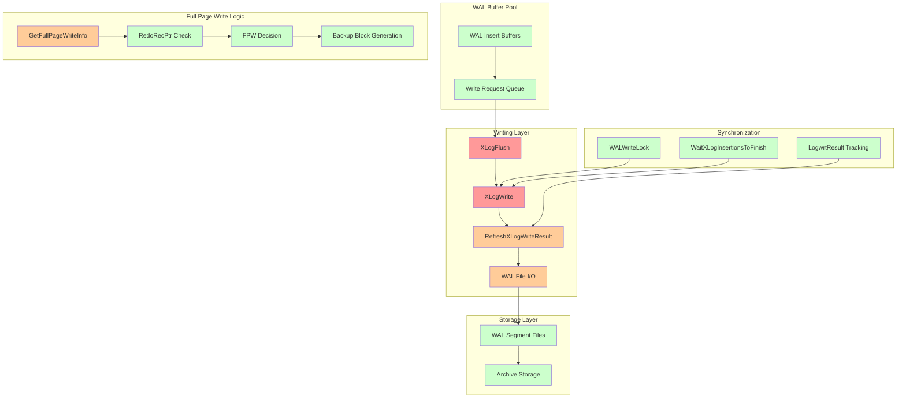
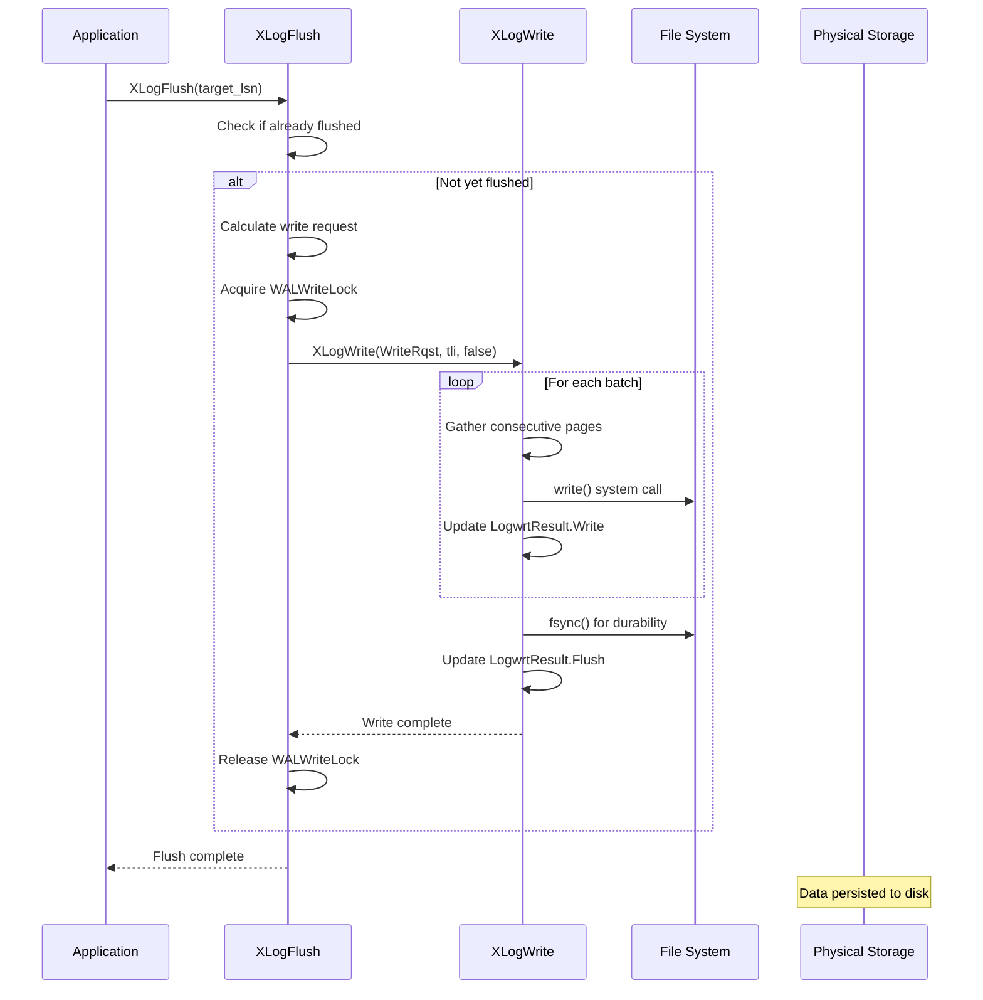
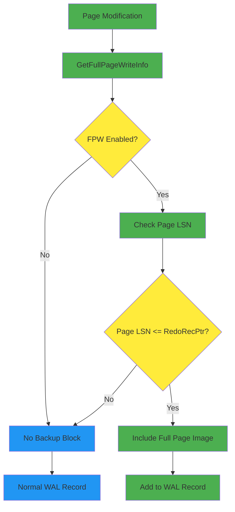

# WAL Writing Component

## Overview
The WAL Writing component is responsible for persisting WAL records from shared memory buffers to disk storage. It implements the critical "write the log before the data" rule through coordinated writing and flushing operations, ensuring durability and crash recovery capability.

## Key Concepts

### WAL Buffer Management
PostgreSQL maintains WAL records in shared memory buffers before writing them to disk. These buffers:
- **Circular Buffer Design**: WAL buffers form a circular buffer pool for efficient space reuse
- **Page Alignment**: Buffers are aligned to WAL page boundaries for optimal I/O
- **Write Coordination**: Multiple processes coordinate access through WALWriteLock

### Write-vs-Flush Distinction
The component distinguishes between two levels of persistence:
- **Write**: Data copied from shared buffers to OS page cache
- **Flush**: Data forced from OS cache to physical storage via fsync

### Full Page Write (FPW) Optimization
Critical for crash safety, FPW ensures page consistency:
- **First Modification**: After checkpoint, first page modification includes full page image
- **Partial Page Protection**: Prevents corruption from partial page writes during crashes
- **Space vs Safety**: Balances WAL volume against consistency guarantees

## Architecture



## Core APIs

### XLogFlush

#### Purpose
Forces WAL records to be written and synced to disk up to a specified LSN. This is the primary interface for ensuring durability before committing transactions or writing data pages.

#### Signature
```c
void XLogFlush(XLogRecPtr record);
```

#### Detailed Description
XLogFlush implements a multi-phase flushing strategy:

1. **Quick Exit Check**: Returns immediately if requested LSN already flushed
2. **Recovery Mode Handling**: Updates minRecoveryPoint instead of flushing during recovery
3. **Write Request Calculation**: Determines what data needs to be written to disk
4. **Lock Acquisition**: Acquires WALWriteLock to coordinate with other writers
5. **Write Execution**: Calls XLogWrite to perform actual I/O operations
6. **Fsync Coordination**: Ensures data reaches persistent storage

#### Parameters
| Parameter | Type | Description | Constraints |
|-----------|------|-------------|-------------|
| record | XLogRecPtr | LSN to flush up to | Must be valid LSN |

#### Return Value
Void - function ensures flushing completion before returning.

#### Error Handling
- **Recovery mode**: Redirects to UpdateMinRecoveryPoint()
- **Invalid LSN**: Handles gracefully with quick exit
- **I/O errors**: Propagated as PANIC to ensure crash recovery

#### Integration Points
- **Called by**: Transaction commit, checkpoint, synchronous replication
- **Calls**: XLogWrite, UpdateMinRecoveryPoint
- **Shared state**: Updates LogwrtResult.Flush position

### XLogWrite

#### Purpose
Low-level function that writes WAL data from shared buffers to disk files. Implements batched I/O for efficiency while maintaining strict ordering requirements.

#### Signature
```c
static void XLogWrite(XLogwrtRqst WriteRqst, TimeLineID tli, bool flexible);
```

#### Detailed Description
XLogWrite performs optimized batch writing:

1. **Buffer Gathering**: Collects consecutive WAL pages for batched I/O
2. **File Management**: Handles WAL segment file creation and switching
3. **Write Batching**: Issues large sequential writes when possible
4. **Page Validation**: Ensures page headers and checksums are correct
5. **Position Tracking**: Updates shared write position atomically

The function implements sophisticated write batching logic:
- **Sequential Page Detection**: Identifies consecutive pages in buffer pool
- **I/O Vector Assembly**: Builds efficient write requests
- **Partial Page Handling**: Manages incomplete pages at buffer boundaries

#### Parameters
| Parameter | Type | Description | Constraints |
|-----------|------|-------------|-------------|
| WriteRqst | XLogwrtRqst | Write request specification | Contains Write/Flush positions |
| tli | TimeLineID | Timeline for write operation | Current timeline ID |
| flexible | bool | Allow partial fulfillment | For optimization scenarios |

#### Return Value
Void - updates global LogwrtResult to reflect completed writes.

#### Error Handling
- **File I/O Errors**: PANIC to force crash recovery
- **Disk Space**: PANIC if unable to extend WAL files
- **Corruption Detection**: PANIC on invalid page headers

#### Integration Points
- **Called by**: XLogFlush, background writer, checkpointer
- **Calls**: File I/O operations, XLogFileInit
- **Shared state**: Updates LogwrtResult.Write position

### GetFullPageWriteInfo

#### Purpose
Retrieves current full-page write settings and redo pointer to determine whether backup blocks are required for modified pages.

#### Signature
```c
void GetFullPageWriteInfo(XLogRecPtr *RedoRecPtr_p, bool *doPageWrites_p);
```

#### Detailed Description
This function provides consistent snapshots of FPW state:

1. **Atomic Read**: Retrieves redo pointer and FPW flag atomically
2. **Consistency Check**: Ensures values are from same checkpoint cycle
3. **Lock-Free Access**: Provides fast access without heavy locking

The values returned may become stale, requiring validation during actual insertion.

#### Parameters
| Parameter | Type | Description | Constraints |
|-----------|------|-------------|-------------|
| RedoRecPtr_p | XLogRecPtr* | Output: current redo pointer | Set by function |
| doPageWrites_p | bool* | Output: FPW currently enabled | Set by function |

#### Return Value
Void - returns values through output parameters.

#### Error Handling
- **Stale Values**: Caller must handle potential staleness
- **Validation Required**: Values must be re-checked under locks

#### Integration Points
- **Called by**: XLogInsert, record assembly logic
- **Calls**: None - reads shared memory directly
- **Shared state**: Reads RedoRecPtr and doPageWrites

### RefreshXLogWriteResult

#### Purpose
Updates process-local copy of WAL write progress from shared memory, ensuring accurate tracking of write completion.

#### Signature
```c
static void RefreshXLogWriteResult(XLogwrtRqst WriteRqst);
```

#### Detailed Description
Maintains cache coherence for write tracking:

1. **Shared Memory Read**: Atomically reads current write positions
2. **Local Update**: Updates process-local LogwrtResult cache
3. **Consistency Check**: Validates position advancement is monotonic

#### Parameters
| Parameter | Type | Description | Constraints |
|-----------|------|-------------|-------------|
| WriteRqst | XLogwrtRqst | Current write request | For validation |

#### Return Value
Void - updates process-local state.

#### Error Handling
- **Consistency Validation**: Ensures monotonic position advancement
- **Shared Memory Access**: Handles potential memory barriers

#### Integration Points
- **Called by**: XLogWrite, flush operations
- **Calls**: Shared memory access functions
- **Shared state**: Reads XLogCtl->LogwrtResult

## Data Structures

### XLogwrtRqst
Write request specification structure:

```c
typedef struct XLogwrtRqst
{
    XLogRecPtr  Write;      /* Last byte + 1 to write out */
    XLogRecPtr  Flush;      /* Last byte + 1 to flush */
} XLogwrtRqst;
```

### XLogwrtResult
Write completion tracking structure:

```c
typedef struct XLogwrtResult
{
    XLogRecPtr  Write;      /* Last byte + 1 written out */
    XLogRecPtr  Flush;      /* Last byte + 1 flushed */
} XLogwrtResult;
```

### WAL Page Header
Structure for WAL page metadata:

```c
typedef struct XLogPageHeader
{
    uint16      xlp_magic;      /* Magic number for validation */
    uint16      xlp_info;       /* Flag bits */
    TimeLineID  xlp_tli;        /* Timeline ID */
    XLogRecPtr  xlp_pageaddr;   /* Page address */
    uint32      xlp_rem_len;    /* Remaining length info */
} XLogPageHeader;
```

## Processing Flow



## Full Page Write Decision Flow



## Implementation Notes

### Performance Optimizations
- **Write Batching**: Consecutive WAL pages written in single I/O operation
- **Page Gathering**: Efficient collection of ready-to-write pages
- **Lock Minimization**: WALWriteLock held only during actual I/O

### Durability Guarantees
- **Fsync Coordination**: Ensures data reaches persistent storage
- **Write Ordering**: Maintains strict LSN ordering in files
- **Crash Recovery**: Enables complete recovery from any crash point

### File Management
- **Segment Rotation**: Automatic creation of new WAL segments
- **Archive Preparation**: Coordinates with archiving mechanisms
- **Space Management**: Handles disk space exhaustion gracefully

### Concurrency Considerations
- **WALWriteLock**: Serializes write operations across processes
- **Position Tracking**: Atomic updates to write completion markers
- **Background Writing**: Coordinates with background writer process

### Error Handling Strategy
- **I/O Failures**: Treated as PANIC to ensure data integrity
- **Space Exhaustion**: Immediate shutdown to prevent corruption
- **Recovery Integration**: Seamless integration with crash recovery mechanisms

The WAL writing component forms the critical bridge between in-memory WAL generation and persistent storage, implementing sophisticated optimizations while maintaining strict durability guarantees essential for PostgreSQL's ACID compliance.