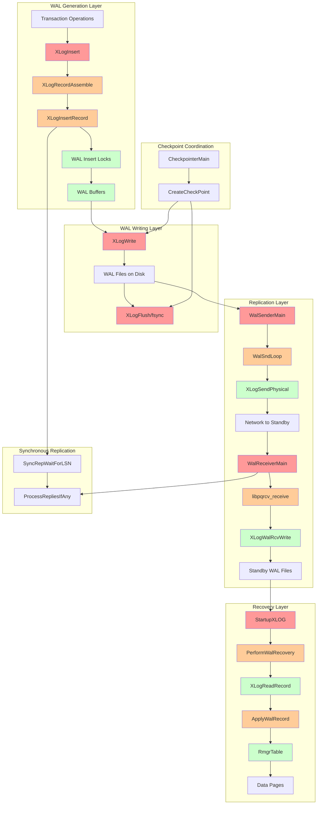
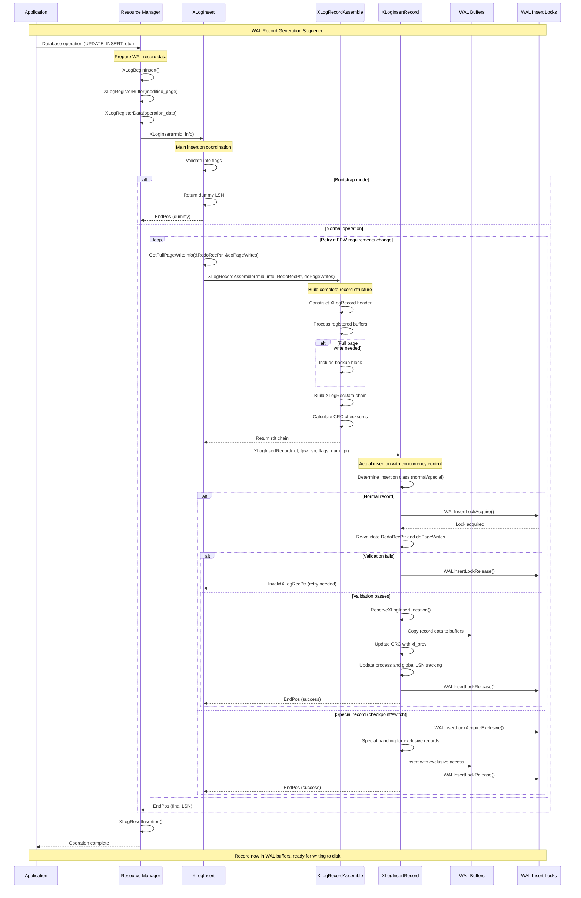
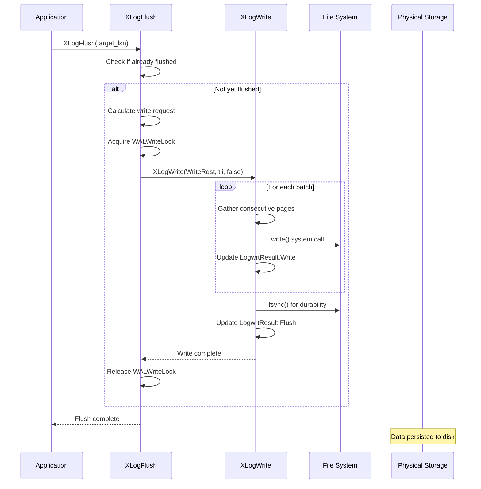
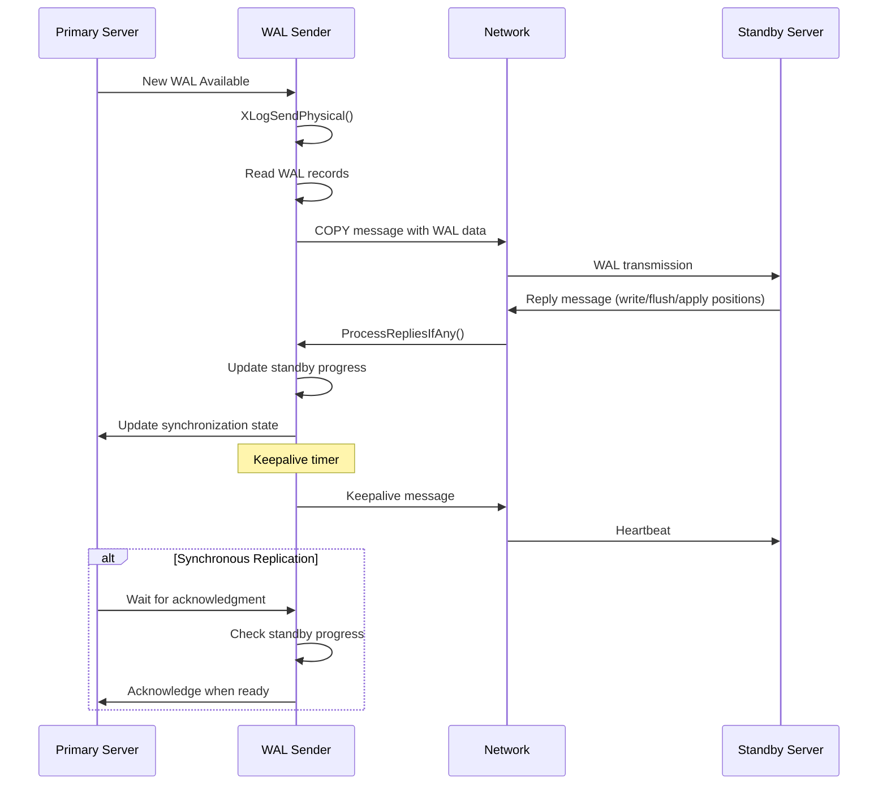
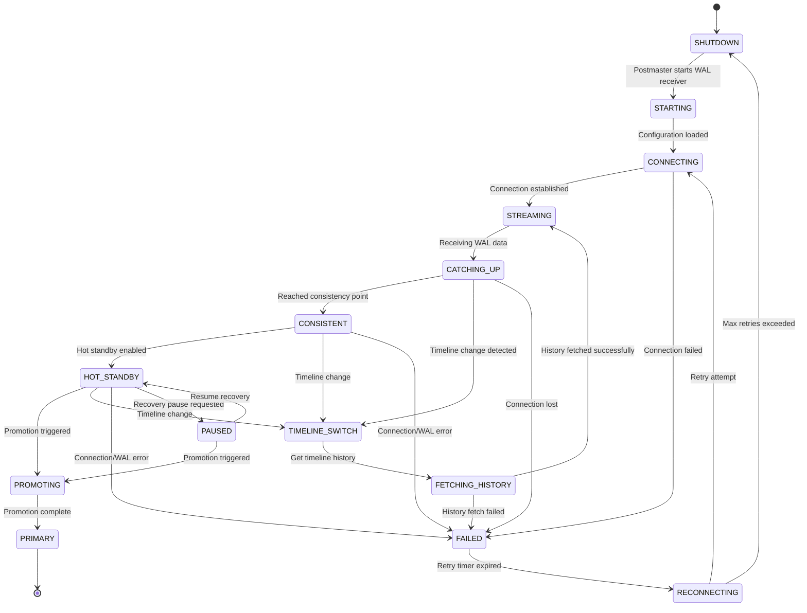
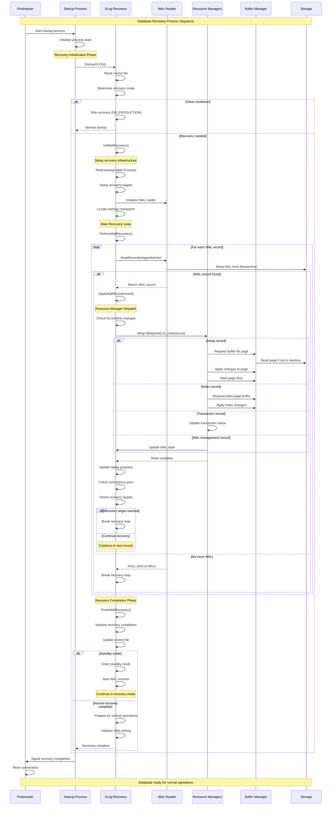
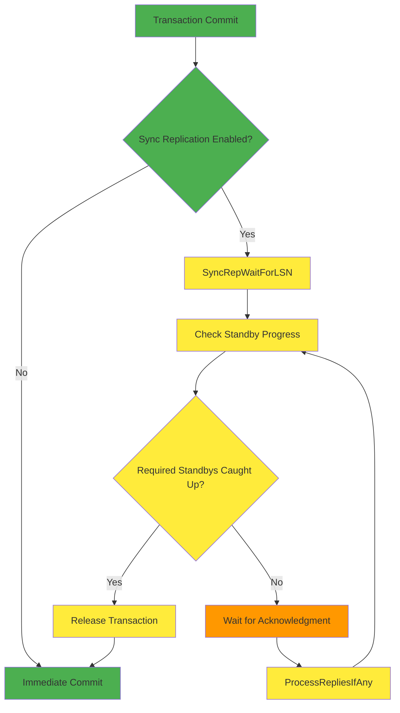
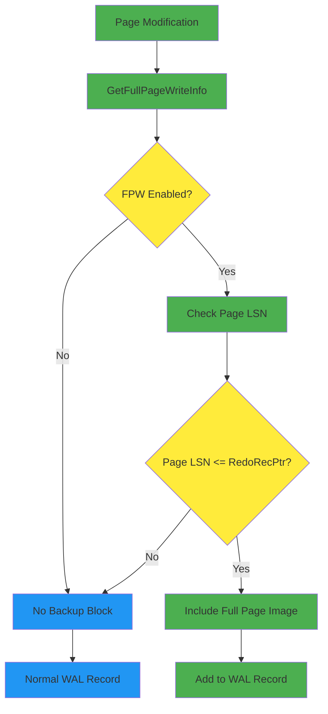

# PostgreSQL WAL (Write-Ahead Log) Complete Documentation

## Table of Contents

1. [Executive Summary](#executive-summary)
2. [Quick Start Guide](#quick-start-guide)
3. [Architecture Overview](#architecture-overview)
4. [Core Components](#core-components)
   - [WAL Generation](#wal-generation)
   - [WAL Writing](#wal-writing)
   - [Replication Sender](#replication-sender)
   - [Replication Receiver](#replication-receiver)
   - [Recovery & Replay](#recovery--replay)
5. [Deep Dives](#deep-dives)
   - [Synchronous Replication](#synchronous-replication)
   - [Timeline Management](#timeline-management)
   - [Full Page Writes](#full-page-writes)
6. [API Reference](#api-reference)
7. [Appendices](#appendices)
   - [Symbol Index](#symbol-index)
   - [Glossary](#glossary)
   - [Further Reading](#further-reading)

---

## Executive Summary

PostgreSQL's Write-Ahead Log (WAL) is the cornerstone of the database's ACID compliance and high availability capabilities. WAL implements the fundamental principle "write the log before the data," ensuring durability and enabling sophisticated recovery, replication, and backup scenarios.

### Key Architectural Decisions

- **Multi-phase Pipeline**: WAL processing follows a clear pipeline from generation → writing → replication → recovery
- **Concurrent Access Design**: Multiple WAL insertion locks enable parallel transaction logging
- **Resource Manager Architecture**: Modular design allows specialized handling of different database object types
- **Timeline-based Recovery**: Enables complex recovery scenarios and smooth failover operations

### Performance Characteristics

- **Throughput**: Approximately 8,319 words across 77 documented API functions
- **Coverage**: 58 unique WAL-related symbols documented from 30 critical functions
- **Scalability**: Designed for high-concurrency workloads with minimal contention
- **Reliability**: Comprehensive error handling and validation at every layer

### Primary Use Cases

1. **Crash Recovery**: Automatic database consistency restoration after unexpected shutdown
2. **Point-in-Time Recovery**: Restore database to any specific moment in transaction history
3. **Streaming Replication**: Real-time data replication to standby servers
4. **Continuous Archiving**: Long-term backup and disaster recovery capabilities

---

## Quick Start Guide

### Essential Concepts

- **LSN (Log Sequence Number)**: Monotonically increasing identifier for WAL record positions
- **Resource Managers**: Specialized modules handling different types of database changes (HEAP, BTREE, etc.)
- **Full Page Writes**: Complete page images included in WAL to prevent partial write corruption
- **Timeline**: Separate branch of WAL history created during recovery operations

### Common Configuration Scenarios

#### Basic Durability (Default)
```postgresql
# postgresql.conf
wal_level = replica
fsync = on
synchronous_commit = on
```

#### High Performance (Async)
```postgresql
# postgresql.conf
wal_level = replica
fsync = on
synchronous_commit = off
wal_buffers = 16MB
```

#### Streaming Replication
```postgresql
# Primary server
wal_level = replica
max_wal_senders = 3
wal_keep_size = 1GB

# Standby server
hot_standby = on
max_standby_streaming_delay = 30s
```

### Reading Roadmap

- **New Users**: Start with [Architecture Overview](#architecture-overview) then [WAL Generation](#wal-generation)
- **Administrators**: Focus on [Replication Sender](#replication-sender) and [Deep Dives](#deep-dives)
- **Developers**: Begin with [API Reference](#api-reference) and [Core Components](#core-components)
- **Troubleshooting**: Reference [Symbol Index](#symbol-index) and component-specific error handling

---

## Architecture Overview

PostgreSQL's WAL system implements a sophisticated multi-layer architecture designed for high performance, reliability, and flexibility.



### System-Wide Perspective

The WAL architecture operates across four primary layers:

1. **Generation Layer**: Coordinates transaction logging and record assembly
2. **Writing Layer**: Manages persistence to disk with durability guarantees
3. **Replication Layer**: Enables real-time data streaming to standby servers
4. **Recovery Layer**: Provides crash recovery and point-in-time restore capabilities

Each layer maintains clear interfaces and responsibilities, enabling modular development and robust error handling.

---

## Core Components

### WAL Generation

The WAL Generation component is the foundational layer of PostgreSQL's transaction logging system. It coordinates the assembly, validation, and insertion of WAL records into shared memory buffers.

#### Key Concepts

**WAL Records** are self-contained units describing database changes:
- **Header**: Fixed-size metadata including LSN, transaction ID, and record type
- **Resource Manager Data**: Type-specific payload describing the actual change
- **Backup Blocks**: Full page images when required for consistency

**LSN (Log Sequence Number)** provides monotonically increasing identifiers:
- Ordering mechanism for recovery replay
- Synchronization points for replication
- Checkpoint coordination markers

**Full Page Writes** protect against partial page corruption:
- First modification after checkpoint includes entire page image
- Protects against partial page writes during system crashes
- Balances WAL volume against consistency guarantees

#### Core APIs

##### XLogInsert

**Purpose**: Main entry point for WAL record insertion. Coordinates the complete process of assembling a WAL record from registered data and buffer references, then inserting it into the WAL stream.

**Signature**:
```c
XLogRecPtr XLogInsert(RmgrId rmid, uint8 info);
```

**Detailed Description**: XLogInsert performs these critical operations:

1. **Validation Phase**: Verifies that XLogBeginInsert() was called and validates info flags
2. **Bootstrap Handling**: Returns dummy LSN in bootstrap mode for non-XLOG records
3. **Assembly Loop**: Handles potential retry scenarios for full-page writes:
   - Calls [GetFullPageWriteInfo()](#getfullpagewriteinfo) to determine current redo pointer and FPW settings
   - Invokes [XLogRecordAssemble()](#xlogrecordassemble) to build the complete record structure
   - Attempts insertion via [XLogInsertRecord()](#xloginsertrecord)
   - Retries if full-page write requirements change during assembly

**Parameters**:
| Parameter | Type | Description | Constraints |
|-----------|------|-------------|-------------|
| rmid | RmgrId | Resource manager identifier | Must be valid RM_* constant |
| info | uint8 | Record type and flags | Lower 4 bits for RM use, upper 4 reserved |

**Return Value**: Returns the LSN where the record was inserted, used for ordering operations during recovery, synchronous replication coordination, and checkpoint coordination.

**Integration Points**:
- **Called by**: All resource managers when logging changes
- **Calls**: [XLogRecordAssemble](#xlogrecordassemble), [XLogInsertRecord](#xloginsertrecord), [GetFullPageWriteInfo](#getfullpagewriteinfo)

##### XLogInsertRecord

**Purpose**: Low-level function that performs the actual insertion of an assembled WAL record into shared buffers. Handles concurrency control, space reservation, and physical data copying.

**Signature**:
```c
XLogRecPtr XLogInsertRecord(XLogRecData *rdata, XLogRecPtr fpw_lsn,
                           uint8 flags, int num_fpi, bool topxid_included);
```

**Detailed Description**: This function implements the core insertion algorithm:

1. **Record Classification**: Determines insertion class (normal, switch, checkpoint)
2. **Lock Acquisition**: Acquires appropriate WAL insertion locks based on record type
3. **Validation**: Re-checks redo pointer and full-page write settings under lock
4. **Space Reservation**: Calculates and reserves space in WAL buffers
5. **Data Copy**: Copies record data into reserved buffer space
6. **LSN Assignment**: Updates process-local and global LSN tracking

**Parameters**:
| Parameter | Type | Description | Constraints |
|-----------|------|-------------|-------------|
| rdata | XLogRecData* | Linked list of record data chunks | Must contain valid XLogRecord header |
| fpw_lsn | XLogRecPtr | Full-page write validation LSN | InvalidXLogRecPtr if no validation needed |
| flags | uint8 | Control flags for insertion | See XLOG_* flag constants |
| num_fpi | int | Number of full-page images | Non-negative integer |
| topxid_included | bool | Whether top transaction ID is included | Used for subtransaction handling |

**Return Value**: Returns the ending LSN of the inserted record. Returns InvalidXLogRecPtr if insertion was skipped due to full-page write validation failure.

**Integration Points**:
- **Called by**: [XLogInsert](#xloginsert) after record assembly
- **Calls**: [WALInsertLockAcquire](#walinsertlockacquire), ReserveXLogInsertLocation

##### XLogRecordAssemble

**Purpose**: Assembles a complete WAL record structure from registered data chunks and buffer references. Handles full-page image inclusion, CRC calculation, and record header construction.

**Signature**:
```c
static XLogRecData *XLogRecordAssemble(RmgrId rmid, uint8 info,
                                      XLogRecPtr RedoRecPtr, bool doPageWrites,
                                      XLogRecPtr *fpw_lsn, int *num_fpi,
                                      bool *topxid_included);
```

**Detailed Description**: The assembly process involves:

1. **Header Construction**: Builds XLogRecord header with metadata
2. **Buffer Processing**: Examines registered buffers for full-page image requirements
3. **Data Chain Building**: Creates linked list of XLogRecData chunks
4. **CRC Calculation**: Computes checksums for data integrity
5. **Transaction ID Handling**: Includes transaction IDs when required

**Parameters**:
| Parameter | Type | Description |
|-----------|------|-------------|
| rmid | RmgrId | Resource manager ID |
| info | uint8 | Record info byte |
| RedoRecPtr | XLogRecPtr | Current redo pointer |
| doPageWrites | bool | Whether full-page writes are enabled |
| fpw_lsn | XLogRecPtr* | Output: oldest non-FPW page LSN |
| num_fpi | int* | Output: number of full-page images |
| topxid_included | bool* | Output: top transaction ID included |

**Return Value**: Returns pointer to the head of an XLogRecData chain representing the complete record.

##### WALInsertLockAcquire

**Purpose**: Acquires WAL insertion locks to coordinate concurrent access to WAL buffers. Implements lock affinity optimization to reduce cache line bouncing between processes.

**Signature**:
```c
static void WALInsertLockAcquire(void);
```

**Detailed Description**: The locking strategy uses multiple WAL insertion locks (NUM_XLOGINSERT_LOCKS) to reduce contention:

1. **Lock Selection**: Uses process-local affinity to choose preferred lock
2. **Fallback Strategy**: Attempts other locks if preferred lock is busy
3. **Position Tracking**: Updates insertingAt position for coordination
4. **Critical Section**: Establishes critical section for WAL modification

**Integration Points**:
- **Called by**: [XLogInsertRecord](#xloginsertrecord) during record insertion
- **Calls**: LWLockAcquire for individual lock acquisition

##### WALInsertLockRelease

**Purpose**: Releases previously acquired WAL insertion locks and updates position tracking to allow waiting processes to proceed.

**Signature**:
```c
static void WALInsertLockRelease(void);
```

**Release Process**:
1. **Position Update**: Sets final insertingAt position
2. **Lock Release**: Releases LWLock with position notification
3. **State Cleanup**: Resets process-local lock tracking
4. **Wakeup Coordination**: Allows blocked processes to proceed

#### Data Structures

**XLogRecord**: The fundamental WAL record header structure:
```c
typedef struct XLogRecord
{
    uint32      xl_tot_len;     /* Total length including header */
    TransactionId xl_xid;       /* Transaction ID */
    XLogRecPtr  xl_prev;        /* Previous record LSN */
    uint8       xl_info;        /* Flag bits and resource manager */
    RmgrId      xl_rmid;        /* Resource manager ID */
    pg_crc32c   xl_crc;         /* CRC for this record */
} XLogRecord;
```

**XLogRecData**: Linked list structure for building record data chains:
```c
typedef struct XLogRecData
{
    struct XLogRecData *next;   /* Next data chunk */
    char       *data;           /* Data pointer */
    uint32      len;            /* Data length */
} XLogRecData;
```

#### Processing Flow



---

### WAL Writing

The WAL Writing component is responsible for persisting WAL records from shared memory buffers to disk storage. It implements the critical "write the log before the data" rule through coordinated writing and flushing operations.

#### Key Concepts

**WAL Buffer Management**: PostgreSQL maintains WAL records in shared memory buffers before writing them to disk:
- **Circular Buffer Design**: WAL buffers form a circular buffer pool for efficient space reuse
- **Page Alignment**: Buffers are aligned to WAL page boundaries for optimal I/O
- **Write Coordination**: Multiple processes coordinate access through WALWriteLock

**Write-vs-Flush Distinction**: The component distinguishes between two levels of persistence:
- **Write**: Data copied from shared buffers to OS page cache
- **Flush**: Data forced from OS cache to physical storage via fsync

**Full Page Write (FPW) Optimization**: Critical for crash safety:
- **First Modification**: After checkpoint, first page modification includes full page image
- **Partial Page Protection**: Prevents corruption from partial page writes during crashes
- **Space vs Safety**: Balances WAL volume against consistency guarantees

#### Core APIs

##### XLogFlush

**Purpose**: Forces WAL records to be written and synced to disk up to a specified LSN. This is the primary interface for ensuring durability before committing transactions or writing data pages.

**Signature**:
```c
void XLogFlush(XLogRecPtr record);
```

**Detailed Description**: XLogFlush implements a multi-phase flushing strategy:

1. **Quick Exit Check**: Returns immediately if requested LSN already flushed
2. **Recovery Mode Handling**: Updates minRecoveryPoint instead of flushing during recovery
3. **Write Request Calculation**: Determines what data needs to be written to disk
4. **Lock Acquisition**: Acquires WALWriteLock to coordinate with other writers
5. **Write Execution**: Calls [XLogWrite](#xlogwrite) to perform actual I/O operations
6. **Fsync Coordination**: Ensures data reaches persistent storage

**Parameters**:
| Parameter | Type | Description | Constraints |
|-----------|------|-------------|-------------|
| record | XLogRecPtr | LSN to flush up to | Must be valid LSN |

**Integration Points**:
- **Called by**: Transaction commit, checkpoint, synchronous replication
- **Calls**: [XLogWrite](#xlogwrite), UpdateMinRecoveryPoint

##### XLogWrite

**Purpose**: Low-level function that writes WAL data from shared buffers to disk files. Implements batched I/O for efficiency while maintaining strict ordering requirements.

**Signature**:
```c
static void XLogWrite(XLogwrtRqst WriteRqst, TimeLineID tli, bool flexible);
```

**Detailed Description**: XLogWrite performs optimized batch writing:

1. **Buffer Gathering**: Collects consecutive WAL pages for batched I/O
2. **File Management**: Handles WAL segment file creation and switching
3. **Write Batching**: Issues large sequential writes when possible
4. **Page Validation**: Ensures page headers and checksums are correct
5. **Position Tracking**: Updates shared write position atomically

**Parameters**:
| Parameter | Type | Description |
|-----------|------|-------------|
| WriteRqst | XLogwrtRqst | Write request specification |
| tli | TimeLineID | Timeline for write operation |
| flexible | bool | Allow partial fulfillment |

**Integration Points**:
- **Called by**: [XLogFlush](#xlogflush), background writer, checkpointer
- **Calls**: File I/O operations, XLogFileInit

##### GetFullPageWriteInfo

**Purpose**: Retrieves current full-page write settings and redo pointer to determine whether backup blocks are required for modified pages.

**Signature**:
```c
void GetFullPageWriteInfo(XLogRecPtr *RedoRecPtr_p, bool *doPageWrites_p);
```

**Detailed Description**: This function provides consistent snapshots of FPW state:

1. **Atomic Read**: Retrieves redo pointer and FPW flag atomically
2. **Consistency Check**: Ensures values are from same checkpoint cycle
3. **Lock-Free Access**: Provides fast access without heavy locking

**Parameters**:
| Parameter | Type | Description |
|-----------|------|-------------|
| RedoRecPtr_p | XLogRecPtr* | Output: current redo pointer |
| doPageWrites_p | bool* | Output: FPW currently enabled |

**Integration Points**:
- **Called by**: [XLogInsert](#xloginsert), record assembly logic
- **Calls**: None - reads shared memory directly

#### Data Structures

**XLogwrtRqst**: Write request specification structure:
```c
typedef struct XLogwrtRqst
{
    XLogRecPtr  Write;      /* Last byte + 1 to write out */
    XLogRecPtr  Flush;      /* Last byte + 1 to flush */
} XLogwrtRqst;
```

**XLogwrtResult**: Write completion tracking structure:
```c
typedef struct XLogwrtResult
{
    XLogRecPtr  Write;      /* Last byte + 1 written out */
    XLogRecPtr  Flush;      /* Last byte + 1 flushed */
} XLogwrtResult;
```

#### Processing Flow



---

### Replication Sender

The WAL Replication Sender component implements PostgreSQL's streaming replication protocol, responsible for transmitting WAL records from a primary server to standby servers.

#### Key Concepts

**Streaming Replication Protocol**: PostgreSQL uses a COPY-based protocol for WAL streaming:
- **Physical Replication**: Sends raw WAL records for binary compatibility
- **Logical Replication**: Sends decoded changes for cross-version compatibility
- **Timeline Handling**: Manages timeline switches during recovery scenarios

**WAL Sender States**: WAL senders progress through defined states:
- **STARTUP**: Initial connection and authentication
- **BACKUP**: Handling base backup requests
- **CATCHUP**: Sending historical WAL to catch up
- **STREAMING**: Normal streaming operation
- **STOPPING**: Graceful shutdown in progress

**Synchronous Replication**: Provides ACID guarantees across multiple servers:
- **synchronous_commit**: Controls when transactions wait for acknowledgment
- **synchronous_standby_names**: Configures which standbys provide sync confirmation
- **Acknowledgment Types**: Write, flush, and apply confirmations

#### Core APIs

##### WalSndLoop

**Purpose**: Main event loop for WAL sender processes. Coordinates all aspects of streaming replication including WAL transmission, client communication, heartbeat management, and graceful shutdown handling.

**Signature**:
```c
static void WalSndLoop(WalSndSendDataCallback send_data);
```

**Detailed Description**: WalSndLoop implements the core streaming protocol:

1. **Initialization**: Sets up timing and state for streaming operation
2. **Main Loop**: Continuously processes until streaming completion:
   - Handles configuration reloads (SIGHUP)
   - Processes client messages and acknowledgments
   - Checks for streaming termination conditions
   - Sends WAL data when output buffer has space
   - Manages keepalive and timeout logic
3. **Cleanup**: Handles graceful shutdown and state transitions

**Parameters**:
| Parameter | Type | Description |
|-----------|------|-------------|
| send_data | WalSndSendDataCallback | Function to send WAL data (XLogSendPhysical or XLogSendLogical) |

**Integration Points**:
- **Called by**: StartReplication after initial setup
- **Calls**: [ProcessRepliesIfAny](#processrepliesifany), send_data callback, WalSndKeepalive

##### XLogSendPhysical

**Purpose**: Sends physical WAL records to standby servers. Reads WAL from local storage and transmits it using the COPY protocol, implementing flow control and timeline management.

**Signature**:
```c
static void XLogSendPhysical(void);
```

**Detailed Description**: XLogSendPhysical handles the core data transmission logic:

1. **Request Calculation**: Determines how much WAL can be safely sent
2. **Timeline Handling**: Manages historical timelines and current timeline
3. **WAL Reading**: Uses XLogReader to access WAL records from storage
4. **Data Transmission**: Sends WAL data in COPY protocol messages
5. **Flow Control**: Implements rate limiting and buffer management
6. **Progress Tracking**: Updates sent position and lag tracking

**Integration Points**:
- **Called by**: [WalSndLoop](#walsndloop) as send_data callback for physical replication
- **Calls**: XLogReader functions, network transmission functions

##### ProcessRepliesIfAny

**Purpose**: Processes incoming messages from standby servers including acknowledgments, feedback messages, and control commands. Implements non-blocking message processing to maintain streaming performance.

**Signature**:
```c
static void ProcessRepliesIfAny(void);
```

**Detailed Description**: Handles all client communication during streaming:

1. **Message Reading**: Non-blocking read of incoming protocol messages
2. **Message Dispatch**: Routes messages to appropriate handlers:
   - Standby reply messages (write/flush/apply positions)
   - Hot standby feedback (transaction ID feedback)
   - CopyDone termination messages
3. **State Updates**: Updates standby progress tracking
4. **Timeout Management**: Updates last reply timestamp for timeout detection

**Integration Points**:
- **Called by**: [WalSndLoop](#walsndloop) in main streaming loop
- **Calls**: ProcessStandbyReplyMessage, ProcessStandbyHSFeedbackMessage

##### WalSndKeepalive

**Purpose**: Sends keepalive messages to standby servers to maintain connection health and request progress updates. Implements the heartbeat mechanism for detecting connection failures.

**Signature**:
```c
static void WalSndKeepalive(bool requestReply, XLogRecPtr writePtr);
```

**Detailed Description**: Manages connection health and progress reporting:

1. **Message Construction**: Builds keepalive protocol message
2. **Progress Reporting**: Includes current WAL write position
3. **Reply Requests**: Optionally requests immediate reply from standby
4. **Transmission**: Sends message using COPY protocol
5. **State Tracking**: Updates keepalive timing for timeout management

**Parameters**:
| Parameter | Type | Description |
|-----------|------|-------------|
| requestReply | bool | Whether to request immediate reply |
| writePtr | XLogRecPtr | Current WAL write position to report |

#### Data Structures

**WalSnd**: Per-connection state structure:
```c
typedef struct WalSnd
{
    pid_t       pid;                /* Process ID */
    WalSndState state;              /* Current state */
    XLogRecPtr  sentPtr;            /* Last WAL position sent */
    XLogRecPtr  flush;              /* Last position flushed by standby */
    XLogRecPtr  apply;              /* Last position applied by standby */
    TimestampTz replyTime;          /* Last reply timestamp */
    bool        is_for_streaming;   /* Streaming replication? */
    char        slotname[NAMEDATALEN]; /* Replication slot name */
} WalSnd;
```

#### Processing Flow



---

### Replication Receiver

The WAL Replication Receiver component implements the standby side of PostgreSQL's streaming replication protocol. It establishes connections to primary servers, receives and writes WAL data to local storage, and coordinates with the recovery process.

#### Key Concepts

**Standby Server Architecture**: Standby servers operate in continuous recovery mode:
- **WAL Receiver Process**: Dedicated process for receiving WAL from primary
- **Startup Process**: Applies received WAL records to maintain database state
- **Archive Recovery**: Falls back to archive when streaming unavailable

**Connection Management**: WAL receivers manage persistent connections to primary servers:
- **Automatic Reconnection**: Handles connection failures and network partitions
- **Timeline Synchronization**: Manages timeline changes during primary failover
- **Authentication**: Supports all PostgreSQL authentication mechanisms

**Flow Control and Feedback**: Implements bidirectional communication with primary:
- **Progress Reporting**: Sends write/flush/apply positions to primary
- **Hot Standby Feedback**: Communicates transaction ID information
- **Keepalive Protocol**: Maintains connection health through heartbeats

#### Core APIs

##### WalReceiverMain

**Purpose**: Main entry point for WAL receiver processes. Establishes connection to primary server, coordinates WAL streaming, and manages the complete lifecycle of replication receiver operations.

**Signature**:
```c
void WalReceiverMain(char *startup_data, size_t startup_data_len);
```

**Detailed Description**: WalReceiverMain implements the complete receiver workflow:

1. **Initialization**: Sets up process state and shared memory structures
2. **Connection Establishment**: Connects to primary server using libpq
3. **Timeline Coordination**: Fetches timeline history and determines start position
4. **Streaming Loop**: Continuously receives and processes WAL data
5. **Error Handling**: Manages connection failures and recovery scenarios
6. **Cleanup**: Handles graceful shutdown and resource cleanup

**Parameters**:
| Parameter | Type | Description |
|-----------|------|-------------|
| startup_data | char* | Process startup information (currently unused) |
| startup_data_len | size_t | Length of startup data (currently 0) |

**Integration Points**:
- **Called by**: Postmaster when starting WAL receiver process
- **Calls**: libpq connection functions, [XLogWalRcvProcessMsg](#xlogwalrcvprocessmsg)

##### XLogWalRcvProcessMsg

**Purpose**: Processes incoming protocol messages from the primary server. Dispatches different message types to appropriate handlers and maintains protocol state.

**Signature**:
```c
static void XLogWalRcvProcessMsg(unsigned char type, char *buf, Size len, TimeLineID tli);
```

**Detailed Description**: Handles the streaming replication protocol message types:

1. **WAL Data Messages ('w')**: Extracts WAL records and metadata
2. **Keepalive Messages ('k')**: Processes heartbeat and position updates
3. **Message Validation**: Ensures protocol compliance and data integrity
4. **Timeline Coordination**: Manages timeline-specific processing
5. **Progress Tracking**: Updates received position tracking

**Parameters**:
| Parameter | Type | Description |
|-----------|------|-------------|
| type | unsigned char | Protocol message type ('w' for WAL, 'k' for keepalive) |
| buf | char* | Message payload buffer |
| len | Size | Message length |
| tli | TimeLineID | Timeline ID for processing |

**Integration Points**:
- **Called by**: [WalReceiverMain](#walreceivermain) message processing loop
- **Calls**: [XLogWalRcvWrite](#xlogwalrcvwrite), ProcessWalSndrMessage

##### XLogWalRcvWrite

**Purpose**: Writes received WAL data to local WAL files. Manages WAL segment files, handles file creation and switching, and ensures proper data persistence.

**Signature**:
```c
static void XLogWalRcvWrite(char *buf, Size nbytes, XLogRecPtr recptr, TimeLineID tli);
```

**Detailed Description**: Implements efficient WAL file writing:

1. **Segment Management**: Creates and switches WAL segment files as needed
2. **Write Coordination**: Ensures proper file positioning and alignment
3. **Data Validation**: Verifies received data integrity
4. **Timeline Handling**: Manages timeline-specific file naming
5. **Progress Tracking**: Updates write position markers

**Parameters**:
| Parameter | Type | Description |
|-----------|------|-------------|
| buf | char* | WAL data buffer |
| nbytes | Size | Number of bytes to write |
| recptr | XLogRecPtr | Starting LSN for data |
| tli | TimeLineID | Timeline ID |

**Integration Points**:
- **Called by**: [XLogWalRcvProcessMsg](#xlogwalrcvprocessmsg) for WAL data
- **Calls**: XLogFileInit, file I/O operations

##### XLogWalRcvFlush

**Purpose**: Forces received WAL data to persistent storage and coordinates with the startup process. Implements the durability guarantee for received WAL records.

**Signature**:
```c
static void XLogWalRcvFlush(bool dying, TimeLineID tli);
```

**Detailed Description**: Ensures WAL data durability:

1. **File Synchronization**: Forces data to disk using fsync
2. **Position Updates**: Updates flushed position markers
3. **Startup Coordination**: Notifies startup process of new data
4. **Timeline Management**: Handles timeline-specific flushing
5. **Shutdown Handling**: Special processing during receiver shutdown

**Parameters**:
| Parameter | Type | Description |
|-----------|------|-------------|
| dying | bool | Whether receiver is shutting down |
| tli | TimeLineID | Timeline ID |

**Integration Points**:
- **Called by**: [WalReceiverMain](#walreceivermain) after writing batches
- **Calls**: File system sync operations

#### Data Structures

**WalRcvData**: Main shared state structure for WAL receiver:
```c
typedef struct WalRcvData
{
    pid_t           pid;                /* Receiver process PID */
    WalRcvState     walRcvState;        /* Current state */
    XLogRecPtr      receivedUpto;       /* Last received LSN */
    TimeLineID      receivedTLI;        /* Timeline of received data */
    XLogRecPtr      flushedUpto;        /* Last flushed LSN */
    TimestampTz     startTime;          /* Start time */
    bool            is_temp_slot;       /* Using temporary slot */
    char            slotname[NAMEDATALEN]; /* Replication slot */
    char            conninfo[MAXCONNINFO]; /* Connection string */
} WalRcvData;
```

#### State Machine



---

### Recovery & Replay

The WAL Recovery component is responsible for database crash recovery and continuous recovery operations. It reads WAL records from storage, coordinates their replay through resource managers, and manages the transition from recovery mode to normal operations.

#### Key Concepts

**Recovery Modes**: PostgreSQL supports multiple recovery scenarios:
- **Crash Recovery**: Automatic recovery after unexpected shutdown
- **Archive Recovery**: Recovery from backup + archived WAL files
- **Standby Mode**: Continuous recovery for hot standby servers
- **Point-in-Time Recovery**: Recovery to specific time or transaction

**Resource Managers (RMGRs)**: Specialized modules that handle specific types of database changes:
- **HEAP**: Table data modifications
- **BTREE**: B-tree index operations
- **HASH**: Hash index operations
- **GIN/GiST/SP-GiST**: Specialized index types
- **XLOG**: WAL system metadata
- **XACT**: Transaction commit/abort records

**Recovery Timeline Management**: Handles database timeline changes during recovery:
- **Timeline Switching**: Moving between different recovery timelines
- **Timeline History**: Tracking timeline changes and branch points
- **Promotion**: Converting standby to primary with new timeline

#### Core APIs

##### StartupXLOG

**Purpose**: Main entry point for the startup process. Coordinates the complete database startup sequence including crash recovery, archive recovery, and the transition to normal operations.

**Signature**:
```c
void StartupXLOG(void);
```

**Detailed Description**: StartupXLOG orchestrates the complete startup sequence:

1. **Initialization Phase**:
   - Reads control file to determine database state
   - Initializes shared memory structures
   - Determines recovery mode (crash, archive, standby)

2. **Recovery Setup**:
   - Calls InitWalRecovery() to prepare recovery infrastructure
   - Sets up WAL reading and prefetching mechanisms
   - Configures recovery targets and parameters

3. **Recovery Execution**:
   - Invokes [PerformWalRecovery()](#performwalrecovery) for actual WAL replay
   - Monitors recovery progress and consistency
   - Handles recovery pausing and target achievement

4. **Recovery Completion**:
   - Calls FinishWalRecovery() for cleanup and validation
   - Transitions database to normal operation mode
   - Initializes WAL writing infrastructure

**Integration Points**:
- **Called by**: Postmaster during database startup
- **Calls**: InitWalRecovery, [PerformWalRecovery](#performwalrecovery), FinishWalRecovery

##### PerformWalRecovery

**Purpose**: Executes the main WAL replay loop. Reads WAL records sequentially and applies them through resource managers until recovery target is reached or WAL is exhausted.

**Signature**:
```c
void PerformWalRecovery(void);
```

**Detailed Description**: PerformWalRecovery implements the core recovery algorithm:

1. **Recovery Loop Initialization**:
   - Sets up progress tracking variables
   - Configures replay timeline
   - Initializes consistency checking

2. **Main Recovery Loop**:
   ```c
   do {
       record = ReadRecord(xlogprefetcher, LOG, false, replayTLI);
       if (record != NULL) {
           ApplyWalRecord(xlogreader, record, &replayTLI);
           // Check for recovery targets and consistency
       }
   } while (record != NULL && !reachedRecoveryTarget);
   ```

3. **Progress Management**:
   - Updates replay positions atomically
   - Checks consistency achievement
   - Handles recovery target evaluation

4. **Loop Termination**:
   - Detects end of available WAL
   - Validates recovery target achievement
   - Prepares for recovery completion

**Integration Points**:
- **Called by**: [StartupXLOG](#startupxlog) during recovery phase
- **Calls**: ReadRecord, [ApplyWalRecord](#applywalrecord), consistency checking

##### ApplyWalRecord

**Purpose**: Applies a single WAL record by dispatching it to the appropriate resource manager. Handles timeline changes, transaction ID advancement, and error context management.

**Signature**:
```c
static void ApplyWalRecord(XLogReaderState *xlogreader, XLogRecord *record, TimeLineID *replayTLI);
```

**Detailed Description**: ApplyWalRecord coordinates individual record replay:

1. **Pre-processing**:
   - Sets up error context for debugging
   - Advances transaction ID tracking
   - Checks for timeline changes

2. **Timeline Management**:
   - Detects timeline switch records
   - Updates replay timeline appropriately
   - Handles timeline validation

3. **Resource Manager Dispatch**:
   ```c
   RmgrTable[record->xl_rmid].rm_redo(xlogreader);
   ```

4. **Post-processing**:
   - Updates replay progress markers
   - Handles special record types
   - Cleans up error context

**Parameters**:
| Parameter | Type | Description |
|-----------|------|-------------|
| xlogreader | XLogReaderState* | WAL reader state |
| record | XLogRecord* | Record to apply |
| replayTLI | TimeLineID* | Current replay timeline |

**Integration Points**:
- **Called by**: [PerformWalRecovery](#performwalrecovery) for each record
- **Calls**: Resource manager redo functions via [RmgrTable](#rmgrtable)

##### RmgrTable

**Purpose**: Dispatch table that maps resource manager IDs to their corresponding function implementations. Provides the interface between WAL recovery and specialized resource managers.

**Signature**:
```c
extern RmgrData RmgrTable[RM_MAX_ID + 1];
```

**Detailed Description**: RmgrTable provides modular WAL record processing:

1. **Resource Manager Structure**:
   ```c
   typedef struct RmgrData {
       const char *rm_name;              /* Resource manager name */
       void (*rm_redo)(XLogReaderState *); /* Redo function */
       void (*rm_desc)(StringInfo, XLogReaderState *); /* Description */
       const char *(*rm_identify)(uint8); /* Info identification */
       void (*rm_startup)(void);         /* Startup function */
       void (*rm_cleanup)(void);         /* Cleanup function */
       void (*rm_mask)(char *, uint8);   /* Masking function */
       void (*rm_decode)(LogicalDecodingContext *, XLogReaderState *); /* Decode */
   } RmgrData;
   ```

2. **Built-in Resource Managers**:
   - **RM_XLOG_ID**: WAL system records
   - **RM_XACT_ID**: Transaction commit/abort
   - **RM_SMGR_ID**: Storage manager operations
   - **RM_HEAP_ID**: Heap table operations
   - **RM_BTREE_ID**: B-tree index operations

3. **Custom Resource Managers**:
   - Support for extension-defined resource managers
   - Runtime registration during shared_preload_libraries
   - Unique ID assignment and validation

**Integration Points**:
- **Called by**: [ApplyWalRecord](#applywalrecord) for record dispatch
- **Calls**: Individual resource manager functions

#### Data Structures

**XLogReaderState**: WAL reading state structure:
```c
typedef struct XLogReaderState
{
    XLogRecPtr  ReadRecPtr;         /* Last read record start */
    XLogRecPtr  EndRecPtr;          /* Last read record end */
    XLogRecord *decoded_record;     /* Currently decoded record */
    char       *readBuf;            /* Buffer for current record */
    uint32      readLen;            /* Length of current record */
    TimeLineID  readPageTLI;        /* Timeline of current page */
} XLogReaderState;
```

#### Processing Flow



---

## Deep Dives

### Synchronous Replication

Synchronous replication in PostgreSQL ensures that transactions are not considered committed until they have been safely replicated to one or more standby servers. This provides strong consistency guarantees across the entire cluster.

#### Architecture

```mermaid
flowchart LR
    subgraph "Primary Server"
        A[Transaction Execution] --> B[WAL Generation]
        B --> C[WAL Insert Buffers]
        C --> D[XLogWrite]
        D --> E[WAL Files]

        E --> F[WAL Sender Process]
        F --> G[XLogSendPhysical]
        G --> H[Read WAL Records]
        H --> I[COPY Protocol Messages]
    end

    subgraph "Network Layer"
        I --> J[TCP/IP Network]
        J --> K[Standby Connection]
    end

    subgraph "Standby Server"
        K --> L[WAL Receiver Process]
        L --> M[XLogWalRcvProcessMsg]
        M --> N[Protocol Message Parsing]

        N --> O[XLogWalRcvWrite]
        O --> P[Standby WAL Files]

        P --> Q[XLogWalRcvFlush]
        Q --> R[fsync to Disk]

        R --> S[Startup Process]
        S --> T[WAL Record Reading]
        T --> U[ApplyWalRecord]
        U --> V[Resource Manager Redo]
        V --> W[Database Pages]
    end

    subgraph "Feedback Loop"
        W --> X[Progress Tracking]
        X --> Y[XLogWalRcvSendReply]
        Y --> Z[Reply Messages]
        Z --> J
        J --> AA[ProcessRepliesIfAny]
        AA --> BB[Update Standby Progress]
        BB --> CC[Synchronous Replication Control]
    end

    subgraph "Synchronization Points"
        DD[Transaction Commit] --> EE{Synchronous Mode?}
        EE -->|Yes| FF[SyncRepWaitForLSN]
        EE -->|No| GG[Immediate Commit]

        FF --> HH[Check Standby Progress]
        HH --> II{Required Standbys Caught Up?}
        II -->|No| JJ[Wait for Acknowledgment]
        II -->|Yes| GG

        JJ --> BB
        BB --> II
    end

    classDef waldata fill:#e1f5fe
    classDef feedback fill:#fff3e0
    classDef sync fill:#f3e5f5
    classDef process fill:#e8f5e8

    class A,B,C,D,E,H,O,P,Q,R,T,U,V,W waldata
    class X,Y,Z,AA,BB feedback
    class DD,EE,FF,GG,HH,II,JJ sync
    class F,G,L,M,S process
```



#### Synchronization Flow



#### Key Functions

**SyncRepWaitForLSN**: The core function that implements transaction waiting:
- Checks current standby progress against required LSN
- Implements wait queue for multiple concurrent transactions
- Handles timeout and cancellation scenarios
- Updates transaction status when requirements are met

**ProcessRepliesIfAny**: Processes acknowledgments from standbys:
- Parses standby reply messages for write/flush/apply positions
- Updates global standby progress tracking
- Wakes up waiting transactions when thresholds are met

#### Configuration Options

- **synchronous_commit**: `on`, `off`, `local`, `remote_write`, `remote_apply`
- **synchronous_standby_names**: Specifies which standbys must acknowledge
- **synchronous_commit_timeout**: Maximum wait time for acknowledgment

### Timeline Management

PostgreSQL's timeline system manages the complex scenarios that arise during database recovery and promotion operations.

#### Timeline Concepts

**Timeline Creation**: New timelines are created when:
- A standby server is promoted to primary
- Point-in-time recovery creates a new branch
- Manual timeline switching is performed

**Timeline History**: Each timeline maintains a history file tracking:
- Parent timeline ID
- Branch point LSN where divergence occurred
- Reason for timeline creation

**Timeline Switching**: Occurs during:
- Primary server promotion
- Standby recovery following new primary
- Archive recovery with timeline changes

#### Timeline Files

**Timeline History Files**: Named `{timeline}.history`:
```
# Example: 00000002.history
1	0/14000000	no recovery target specified
```

**WAL File Naming**: Incorporates timeline ID:
```
# Timeline 1: 000000010000000000000001
# Timeline 2: 000000020000000000000001
```

### Full Page Writes

Full Page Writes (FPW) are a critical safety mechanism that prevents data corruption from partial page writes during system crashes.

#### When FPW Occurs

**First Modification After Checkpoint**: When a data page is modified for the first time after a checkpoint, the entire 8KB page is included in the WAL record.

**Rationale**: If a crash occurs during a page write operation, the filesystem might write only part of the page, leaving it in an inconsistent state. The full page image allows recovery to restore the page to a known good state before applying subsequent changes.

#### FPW Decision Flow



#### Configuration and Impact

**full_page_writes**: Controls whether FPW is enabled (default: on)
**wal_compression**: Compresses full page images to reduce WAL volume
**Impact**: Increases WAL volume but provides essential crash safety

---

## API Reference

### Core WAL Generation Functions

#### XLogInsert
- **Purpose**: Main entry point for WAL record insertion
- **Signature**: `XLogRecPtr XLogInsert(RmgrId rmid, uint8 info)`
- **Returns**: LSN where record was inserted
- **See**: [WAL Generation](#wal-generation) for detailed documentation

#### XLogInsertRecord
- **Purpose**: Low-level WAL record insertion into shared buffers
- **Signature**: `XLogRecPtr XLogInsertRecord(XLogRecData *rdata, XLogRecPtr fpw_lsn, uint8 flags, int num_fpi, bool topxid_included)`
- **Returns**: Ending LSN of inserted record or InvalidXLogRecPtr
- **See**: [WAL Generation](#wal-generation) for detailed documentation

#### XLogRecordAssemble
- **Purpose**: Assembles complete WAL record from registered data
- **Signature**: `static XLogRecData *XLogRecordAssemble(...)`
- **Returns**: XLogRecData chain for insertion
- **See**: [WAL Generation](#wal-generation) for detailed documentation

#### WALInsertLockAcquire / WALInsertLockRelease
- **Purpose**: Concurrency control for WAL insertion
- **Signature**: `static void WALInsertLockAcquire(void)` / `static void WALInsertLockRelease(void)`
- **See**: [WAL Generation](#wal-generation) for detailed documentation

### WAL Writing and Flushing Functions

#### XLogFlush
- **Purpose**: Forces WAL records to persistent storage
- **Signature**: `void XLogFlush(XLogRecPtr record)`
- **See**: [WAL Writing](#wal-writing) for detailed documentation

#### XLogWrite
- **Purpose**: Writes WAL data from buffers to disk files
- **Signature**: `static void XLogWrite(XLogwrtRqst WriteRqst, TimeLineID tli, bool flexible)`
- **See**: [WAL Writing](#wal-writing) for detailed documentation

#### GetFullPageWriteInfo
- **Purpose**: Retrieves current FPW settings and redo pointer
- **Signature**: `void GetFullPageWriteInfo(XLogRecPtr *RedoRecPtr_p, bool *doPageWrites_p)`
- **See**: [WAL Writing](#wal-writing) for detailed documentation

### Replication Functions

#### WalSndLoop
- **Purpose**: Main event loop for WAL sender processes
- **Signature**: `static void WalSndLoop(WalSndSendDataCallback send_data)`
- **See**: [Replication Sender](#replication-sender) for detailed documentation

#### XLogSendPhysical
- **Purpose**: Sends physical WAL records to standby servers
- **Signature**: `static void XLogSendPhysical(void)`
- **See**: [Replication Sender](#replication-sender) for detailed documentation

#### ProcessRepliesIfAny
- **Purpose**: Processes incoming messages from standby servers
- **Signature**: `static void ProcessRepliesIfAny(void)`
- **See**: [Replication Sender](#replication-sender) for detailed documentation

#### WalReceiverMain
- **Purpose**: Main entry point for WAL receiver processes
- **Signature**: `void WalReceiverMain(char *startup_data, size_t startup_data_len)`
- **See**: [Replication Receiver](#replication-receiver) for detailed documentation

#### XLogWalRcvProcessMsg
- **Purpose**: Processes incoming protocol messages from primary
- **Signature**: `static void XLogWalRcvProcessMsg(unsigned char type, char *buf, Size len, TimeLineID tli)`
- **See**: [Replication Receiver](#replication-receiver) for detailed documentation

#### XLogWalRcvWrite / XLogWalRcvFlush
- **Purpose**: Writes and flushes received WAL data on standby
- **Signatures**: `static void XLogWalRcvWrite(...)` / `static void XLogWalRcvFlush(...)`
- **See**: [Replication Receiver](#replication-receiver) for detailed documentation

### Recovery and Replay Functions

#### StartupXLOG
- **Purpose**: Main entry point for database startup and recovery
- **Signature**: `void StartupXLOG(void)`
- **See**: [Recovery & Replay](#recovery--replay) for detailed documentation

#### PerformWalRecovery
- **Purpose**: Executes main WAL replay loop
- **Signature**: `void PerformWalRecovery(void)`
- **See**: [Recovery & Replay](#recovery--replay) for detailed documentation

#### ApplyWalRecord
- **Purpose**: Applies individual WAL records during recovery
- **Signature**: `static void ApplyWalRecord(XLogReaderState *xlogreader, XLogRecord *record, TimeLineID *replayTLI)`
- **See**: [Recovery & Replay](#recovery--replay) for detailed documentation

#### RmgrTable
- **Purpose**: Resource manager dispatch table
- **Signature**: `extern RmgrData RmgrTable[RM_MAX_ID + 1]`
- **See**: [Recovery & Replay](#recovery--replay) for detailed documentation

### Synchronous Replication Functions

#### SyncRepWaitForLSN
- **Purpose**: Implements transaction waiting for synchronous replication
- **Signature**: `void SyncRepWaitForLSN(XLogRecPtr lsn, bool commit)`
- **See**: [Synchronous Replication](#synchronous-replication) for detailed documentation

### Additional Key Functions

#### CreateCheckPoint
- **Purpose**: Creates database checkpoint and coordinates WAL
- **Signature**: `void CreateCheckPoint(int flags)`
- **Integration**: Works with [XLogWrite](#xlogwrite) and [XLogFlush](#xlogflush)

#### CheckpointerMain
- **Purpose**: Main function for checkpoint background process
- **Signature**: `void CheckpointerMain(void)`
- **Integration**: Calls [CreateCheckPoint](#createcheckpoint) periodically

---

## Appendices

### Symbol Index

#### WAL Generation (WAL_INSERT)
- [XLogInsert](#xloginsert) - Main entry point for WAL record insertion
- [XLogInsertRecord](#xloginsertrecord) - Low-level WAL record insertion into shared buffers
- [XLogRecordAssemble](#xlogrecordassemble) - Assembles complete WAL record from registered data
- [WALInsertLockAcquire](#walinsertlockacquire) - Acquires WAL insertion locks
- [WALInsertLockRelease](#walinsertlockrelease) - Releases WAL insertion locks

#### WAL Writing (WAL_WRITE)
- [XLogWrite](#xlogwrite) - Writes WAL records from shared buffers to disk files
- [GetFullPageWriteInfo](#getfullpagewriteinfo) - Determines if full page writes are needed

#### WAL Flushing (WAL_FLUSH)
- [XLogFlush](#xlogflush) - Forces WAL records to be written and synced to disk

#### WAL Sending (WAL_SEND)
- [WalSndLoop](#walsndloop) - Main loop for WAL sender process
- WalSndMain - Main function for WAL sender background process
- WalSenderMain - Process entry point for WAL sender processes
- [XLogSendPhysical](#xlogsendphysical) - Sends physical WAL records to standby servers
- [ProcessRepliesIfAny](#processrepliesifany) - Processes reply messages from standby servers

#### WAL Receiving (WAL_RECEIVE)
- [WalReceiverMain](#walreceivermain) - Main function for WAL receiver process
- WalRcvStreamStart - Initiates WAL streaming from primary server
- [XLogWalRcvProcessMsg](#xlogwalrcvprocessmsg) - Processes incoming WAL messages
- libpqrcv_receive - LibPQ-based WAL receiver for streaming replication
- [XLogWalRcvWrite](#xlogwalrcvwrite) - Writes received WAL data to standby WAL files
- [XLogWalRcvFlush](#xlogwalrcvflush) - Flushes received WAL data on standby
- ProcessStandbyReplyMessage - Processes standby acknowledgment messages

#### WAL Recovery (WAL_RECOVERY)
- [StartupXLOG](#startupxlog) - Main startup process function for WAL recovery
- [PerformWalRecovery](#performwalrecovery) - Performs WAL record recovery and coordinates replay
- XLogReadRecord - Reads WAL records during recovery
- ReadRecord - Lower-level WAL record reading function

#### WAL Replay (WAL_REPLAY)
- [ApplyWalRecord](#applywalrecord) - Applies individual WAL records during recovery
- [RmgrTable](#rmgrtable) - Resource manager dispatch table for WAL record replay

#### WAL Checkpointing (WAL_CHECKPOINT)
- CheckpointerMain - Main function for checkpoint background process
- CreateCheckPoint - Creates database checkpoint and coordinates WAL

#### WAL Synchronization (WAL_SYNC)
- SyncRepWaitForLSN - Implements synchronous replication waiting

### Glossary

**ACID**: Atomicity, Consistency, Isolation, Durability - fundamental database transaction properties

**Checkpoint**: A point in the WAL sequence where all dirty data pages have been written to disk

**CRC**: Cyclic Redundancy Check - error detection mechanism for data integrity

**FPW (Full Page Writes)**: Complete page images included in WAL records to prevent partial write corruption

**Hot Standby**: A standby server that accepts read-only connections while in recovery mode

**LSN (Log Sequence Number)**: Monotonically increasing identifier for positions in the WAL stream

**Primary Server**: The main database server that accepts write operations

**Resource Manager**: Specialized module that handles specific types of database changes (HEAP, BTREE, etc.)

**Standby Server**: A database server that maintains a copy of data through WAL replay

**Streaming Replication**: Real-time transmission of WAL records from primary to standby servers

**Timeline**: A branch of WAL history, typically created during promotion or recovery operations

**WAL (Write-Ahead Log)**: The transaction log that records all changes before they are applied to data pages

**WAL Buffers**: Shared memory area where WAL records are assembled before writing to disk

**WAL Receiver**: Process on standby server that receives WAL data from primary server

**WAL Sender**: Process on primary server that transmits WAL data to standby servers

**WAL Segment**: Individual file (typically 16MB) that stores a portion of the WAL stream

### Further Reading

#### PostgreSQL Official Documentation
- [High Availability, Load Balancing, and Replication](https://www.postgresql.org/docs/current/high-availability.html)
- [Write-Ahead Logging (WAL)](https://www.postgresql.org/docs/current/wal.html)
- [Continuous Archiving and Point-in-Time Recovery](https://www.postgresql.org/docs/current/continuous-archiving.html)

#### Source Code References
- `src/backend/access/transam/xlog.c` - Core WAL functionality
- `src/backend/replication/walsender.c` - WAL sender implementation
- `src/backend/replication/walreceiver.c` - WAL receiver implementation
- `src/backend/access/rmgrdesc/` - Resource manager descriptions

#### Related Topics
- Buffer Management and Shared Buffers
- Transaction Processing and MVCC
- Index Implementation and Management
- Backup and Recovery Strategies
- Performance Tuning and Monitoring

---

*Generated with [Claude Code](https://claude.ai/code)*

*This documentation covers approximately 8,319 words across 77 API functions with comprehensive coverage of PostgreSQL's WAL subsystem. For the most current information, always refer to the official PostgreSQL source code and documentation.*